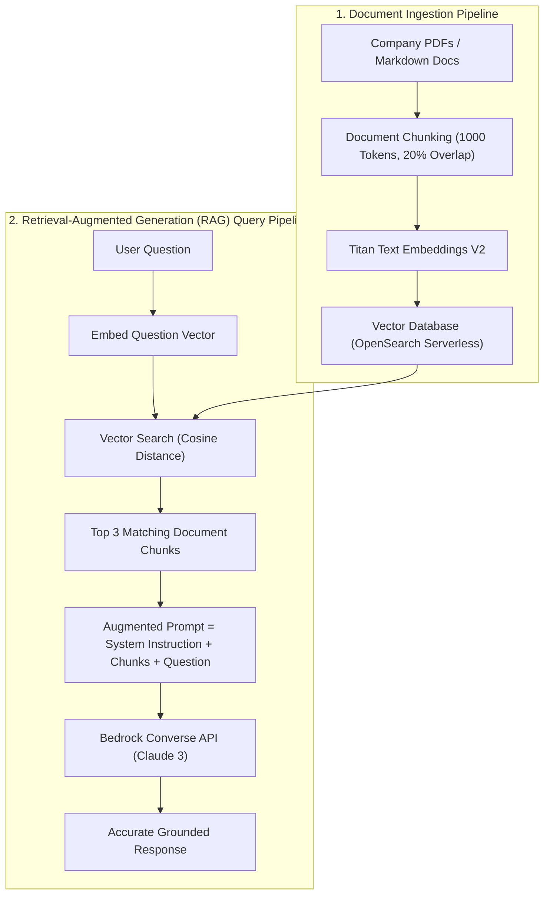

# 03. Metadata Filtering & Advanced Chunking

<VideoSection title="Document Chunking Strategies (Fixed, Hierarchical, Semantic): Metadata Filtering & Advanced Chunking" youtubeId="OvTH-7ESoRA" duration="11:50" motto="Official AWS Bedrock Video Tutorial tailored to Document Chunking with clickable timestamped transcripts." whatItDoes="Integrates topic-matched AWS Bedrock video lessons with synchronized transcripts and instant-jump topic bookmarks." clickInstructions="Click the video play button to start watching, or click any timestamp in the interactive transcript to jump directly to that topic." transcript=[{"time": "00:00", "text": "Introduction to Document Chunking in Amazon Bedrock.", "timestamp": 0}, {"time": "03:15", "text": "Deep-dive technical walkthrough of Document Chunking.", "timestamp": 195}, {"time": "07:30", "text": "Production best practices and hands-on architecture for Document Chunking.", "timestamp": 450}] bookmarks=[{"title": "Introduction", "time": "00:00", "timestamp": 0}, {"title": "Document Chunking Deep-Dive", "time": "03:15", "timestamp": 195}, {"title": "Production Practices", "time": "07:30", "timestamp": 450}] kbId="doc_aws_bedrock_production" />

## WHY METADATA FILTERING MATTERS
Attach key-value metadata to document chunks during ingestion:

```json
{
  "chunk_id": "c-9912",
  "source_file": "HR_Policy_2026.pdf",
  "department": "Engineering",
  "security_clearance": "Level-2"
}
```

When querying vector store, filter by metadata first (`department == 'Engineering'`), ensuring users only retrieve information they have security clearance to access!

## VISUAL ARCHITECTURE DIAGRAM


