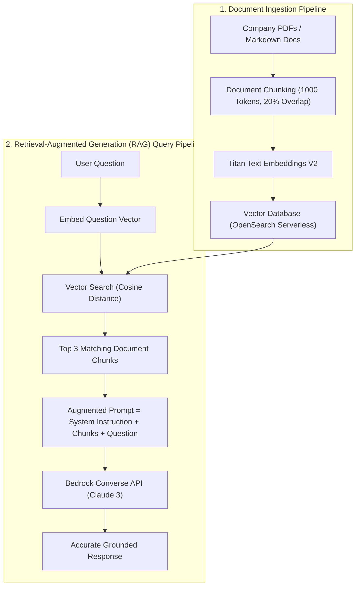

# 04. Tangible Milestone #4: Building a RAG Document Assistant

<VideoSection title="Context Injection & Grounded LLM Response Generation: Tangible Milestone #4: Building a RAG Document Assistant" youtubeId="ZEKiIwWv9nM" duration="10:35" motto="Official AWS Bedrock Video Tutorial tailored to Context Injection with clickable timestamped transcripts." whatItDoes="Integrates topic-matched AWS Bedrock video lessons with synchronized transcripts and instant-jump topic bookmarks." clickInstructions="Click the video play button to start watching, or click any timestamp in the interactive transcript to jump directly to that topic." transcript=[{"time": "00:00", "text": "Introduction to Context Injection in Amazon Bedrock.", "timestamp": 0}, {"time": "03:15", "text": "Deep-dive technical walkthrough of Context Injection.", "timestamp": 195}, {"time": "07:30", "text": "Production best practices and hands-on architecture for Context Injection.", "timestamp": 450}] bookmarks=[{"title": "Introduction", "time": "00:00", "timestamp": 0}, {"title": "Context Injection Deep-Dive", "time": "03:15", "timestamp": 195}, {"title": "Production Practices", "time": "07:30", "timestamp": 450}] kbId="doc_aws_bedrock_production" />

## COMPLETE PYTHON RAG IMPLEMENTATION

```python
import boto3

def rag_query(user_question, retrieved_documents):
    bedrock = boto3.client('bedrock-runtime', region_name='us-east-1')
    
    # 1. Construct prompt with injected context
    context_str = "\n\n".join([f"Document Chunk {i+1}:\n{doc}" for i, doc in enumerate(retrieved_documents)])
    
    system_instruction = (
        "You are a strict Enterprise RAG Assistant. "
        "Answer the user's question ONLY using the provided retrieved context below. "
        "If the answer cannot be found in the context, reply: 'I cannot find the answer in company documentation.'\n\n"
        f"=== RETRIEVED CONTEXT ===\n{context_str}"
    )

    response = bedrock.converse(
        modelId='us.anthropic.claude-3-5-sonnet-20241022-v2:0',
        system=[{'text': system_instruction}],
        messages=[{'role': 'user', 'content': [{'text': user_question}]}],
        inferenceConfig={'temperature': 0.0}
    )

    return response['output']['message']['content'][0]['text']
```

## VISUAL ARCHITECTURE DIAGRAM


