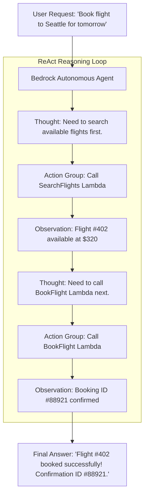

# 01. What is an Autonomous AI Agent?

<VideoSection title="Amazon Bedrock Agents: Executing Multistep Business Tasks: What is an Autonomous AI Agent?" youtubeId="jU0cndZziO0" duration="12:58" motto="Official AWS Bedrock Video Tutorial tailored to AI Agents Fundamentals with clickable timestamped transcripts." whatItDoes="Integrates topic-matched AWS Bedrock video lessons with synchronized transcripts and instant-jump topic bookmarks." clickInstructions="Click the video play button to start watching, or click any timestamp in the interactive transcript to jump directly to that topic." transcript=[{"time": "00:00", "text": "Introduction to AI Agents Fundamentals in Amazon Bedrock.", "timestamp": 0}, {"time": "03:15", "text": "Deep-dive technical walkthrough of AI Agents Fundamentals.", "timestamp": 195}, {"time": "07:30", "text": "Production best practices and hands-on architecture for AI Agents Fundamentals.", "timestamp": 450}] bookmarks=[{"title": "Introduction", "time": "00:00", "timestamp": 0}, {"title": "AI Agents Fundamentals Deep-Dive", "time": "03:15", "timestamp": 195}, {"title": "Production Practices", "time": "07:30", "timestamp": 450}] kbId="doc_aws_bedrock_production" />

## LLM VS AI AGENT

- **Normal LLM**: Answers questions using static pre-trained knowledge or prompt text. (Passively answers).
- **Autonomous AI Agent**: Can understand complex tasks, break them into logical steps, choose tools, call live external APIs (AWS Lambda, database, email), receive API execution results, and orchestrate multi-step business logic autonomously!

```
User Prompt ──► Agent Orchestrator ──► Select Tool ──► Call AWS Lambda API ──► Process Result ──► Final Answer
```

## EDUCATIONAL ORCHESTRATION TRACE SIMULATOR
Explore how Amazon Bedrock Agents orchestrate tools step-by-step in the interactive simulator below:

```widget:AgentSimulator
{
  "agentName": "BedrockCustomerSupportAgent",
  "agentId": "AGT-BEDROCK-PROD-99",
  "foundationModel": "anthropic.claude-3-5-sonnet-20241022-v2:0",
  "actionGroups": [
    {
      "actionGroupName": "OrderFulfillmentAPI",
      "lambdaArn": "arn:aws:lambda:us-east-1:123456789012:function:BedrockOrderTool",
      "apiSchema": "s3://bedrock-agent-schemas/order_api.json"
    }
  ],
  "reasoningTrace": [
    "1. Understand Task: Fetch status for Order #88192",
    "2. Select Tool: OrderFulfillmentAPI -> getOrderStatus(orderId=88192)",
    "3. Call Tool: Invoking AWS Lambda Function",
    "4. Tool Result: { status: 'SHIPPED', tracking: '1Z99999999999' }",
    "5. Response: Order #88192 has shipped via UPS tracking 1Z99999999999."
  ]
}
```

## VISUAL ARCHITECTURE DIAGRAM


