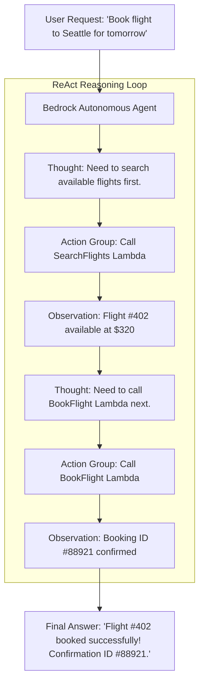

# 02. The Educational Agent Orchestration Trace

<VideoSection title="ReAct Reasoning Loop: Thought-Action-Observation Pattern: The Educational Agent Orchestration Trace" youtubeId="S73thl0AyFU" duration="11:30" motto="Official AWS Bedrock Video Tutorial tailored to ReAct Reasoning Loop with clickable timestamped transcripts." whatItDoes="Integrates topic-matched AWS Bedrock video lessons with synchronized transcripts and instant-jump topic bookmarks." clickInstructions="Click the video play button to start watching, or click any timestamp in the interactive transcript to jump directly to that topic." transcript=[{"time": "00:00", "text": "Introduction to ReAct Reasoning Loop in Amazon Bedrock.", "timestamp": 0}, {"time": "03:15", "text": "Deep-dive technical walkthrough of ReAct Reasoning Loop.", "timestamp": 195}, {"time": "07:30", "text": "Production best practices and hands-on architecture for ReAct Reasoning Loop.", "timestamp": 450}] bookmarks=[{"title": "Introduction", "time": "00:00", "timestamp": 0}, {"title": "ReAct Reasoning Loop Deep-Dive", "time": "03:15", "timestamp": 195}, {"title": "Production Practices", "time": "07:30", "timestamp": 450}] kbId="doc_aws_bedrock_production" />

## THE 5-STEP ORCHESTRATION TRACE PATTERN

```
1. Understand Task ──► Parse user intent & extract parameters
2. Select Tool     ──► Match required action against Action Group schemas
3. Call Tool       ──► Invoke AWS Lambda function with JSON parameters
4. Tool Result     ──► Receive HTTP response payload from Lambda
5. Response        ──► Synthesize result into final user response
```

> [!IMPORTANT]
> Bedrock Agents execute this orchestration trace securely inside isolated containers without exposing internal system details!

## VISUAL ARCHITECTURE DIAGRAM


