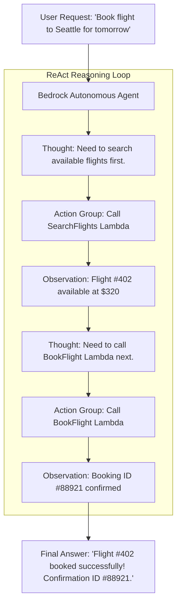

# 03. Action Groups, OpenAPI Schema & Lambda Tools

<VideoSection title="Action Groups: Defining OpenAPI Schemas & AWS Lambda Tools: Action Groups, OpenAPI Schema & Lambda Tools" youtubeId="qVyvmzFxF_o" duration="14:15" motto="Official AWS Bedrock Video Tutorial tailored to Action Groups & Lambda with clickable timestamped transcripts." whatItDoes="Integrates topic-matched AWS Bedrock video lessons with synchronized transcripts and instant-jump topic bookmarks." clickInstructions="Click the video play button to start watching, or click any timestamp in the interactive transcript to jump directly to that topic." transcript=[{"time": "00:00", "text": "Introduction to Action Groups & Lambda in Amazon Bedrock.", "timestamp": 0}, {"time": "03:15", "text": "Deep-dive technical walkthrough of Action Groups & Lambda.", "timestamp": 195}, {"time": "07:30", "text": "Production best practices and hands-on architecture for Action Groups & Lambda.", "timestamp": 450}] bookmarks=[{"title": "Introduction", "time": "00:00", "timestamp": 0}, {"title": "Action Groups & Lambda Deep-Dive", "time": "03:15", "timestamp": 195}, {"title": "Production Practices", "time": "07:30", "timestamp": 450}] kbId="doc_aws_bedrock_production" />

## WHAT IS AN ACTION GROUP?
An **Action Group** defines what external tools an agent can call. It consists of:
1. **OpenAPI Schema (JSON/YAML)**: Defines API endpoints, parameter types, and descriptions.
2. **AWS Lambda Function**: Executes the business logic (e.g. querying SQL, sending emails).

```yaml
# OpenAPI Schema snippet
paths:
  /check-order:
    post:
      summary: Get shipment status for an order ID
      parameters:
        - name: order_id
          in: query
          required: true
          schema:
            type: string
```

## VISUAL ARCHITECTURE DIAGRAM


