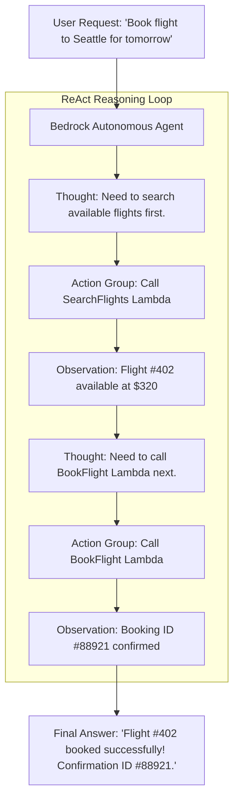

# 04. Tangible Milestone #5: Invoking Bedrock Agents via SDK

<VideoSection title="Authoring Amazon Bedrock Agents with Powertools for AWS: Tangible Milestone #5: Invoking Bedrock Agents via SDK" youtubeId="lIId8IDP6TU" duration="17:20" motto="Official AWS Bedrock Video Tutorial tailored to Agent Invocation & Powertools with clickable timestamped transcripts." whatItDoes="Integrates topic-matched AWS Bedrock video lessons with synchronized transcripts and instant-jump topic bookmarks." clickInstructions="Click the video play button to start watching, or click any timestamp in the interactive transcript to jump directly to that topic." transcript=[{"time": "00:00", "text": "Introduction to Agent Invocation & Powertools in Amazon Bedrock.", "timestamp": 0}, {"time": "03:15", "text": "Deep-dive technical walkthrough of Agent Invocation & Powertools.", "timestamp": 195}, {"time": "07:30", "text": "Production best practices and hands-on architecture for Agent Invocation & Powertools.", "timestamp": 450}] bookmarks=[{"title": "Introduction", "time": "00:00", "timestamp": 0}, {"title": "Agent Invocation & Powertools Deep-Dive", "time": "03:15", "timestamp": 195}, {"title": "Production Practices", "time": "07:30", "timestamp": 450}] kbId="doc_aws_bedrock_production" />

## INVOKING BEDROCK AGENTS VIA BOTO3

```python
import boto3
import uuid

def invoke_bedrock_agent(user_prompt):
    agent_runtime = boto3.client('bedrock-agent-runtime', region_name='us-east-1')
    
    agent_id = 'AGENT99182'
    agent_alias_id = 'TSTALIASID'
    session_id = str(uuid.uuid4())

    response = agent_runtime.invoke_agent(
        agentId=agent_id,
        agentAliasId=agent_alias_id,
        sessionId=session_id,
        inputText=user_prompt
    )

    full_output = ""
    for event in response.get('completion'):
        if 'chunk' in event:
            chunk_text = event['chunk']['bytes'].decode('utf-8')
            full_output += chunk_text
            print(chunk_text, end='', flush=True)

    return full_output
```

## VISUAL ARCHITECTURE DIAGRAM


