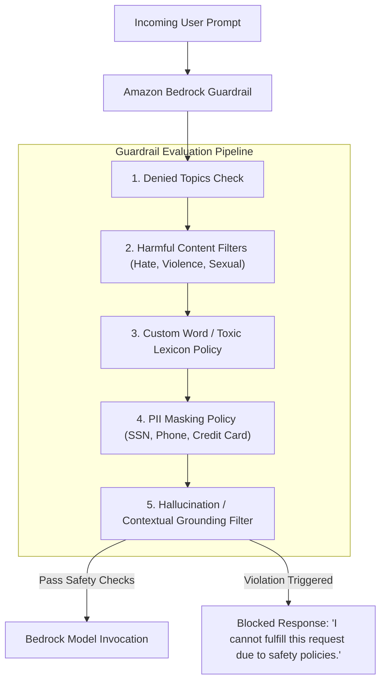

# 01. Why AI Safety & Content Moderation Matter

<VideoSection title="Amazon Bedrock Guardrails: Securing Open-Weight Models: Why AI Safety & Content Moderation Matter" youtubeId="typL6MOLpf0" duration="06:47" motto="Official AWS Bedrock Video Tutorial tailored to AI Safety & Moderation with clickable timestamped transcripts." whatItDoes="Integrates topic-matched AWS Bedrock video lessons with synchronized transcripts and instant-jump topic bookmarks." clickInstructions="Click the video play button to start watching, or click any timestamp in the interactive transcript to jump directly to that topic." transcript=[{"time": "00:00", "text": "Introduction to AI Safety & Moderation in Amazon Bedrock.", "timestamp": 0}, {"time": "03:15", "text": "Deep-dive technical walkthrough of AI Safety & Moderation.", "timestamp": 195}, {"time": "07:30", "text": "Production best practices and hands-on architecture for AI Safety & Moderation.", "timestamp": 450}] bookmarks=[{"title": "Introduction", "time": "00:00", "timestamp": 0}, {"title": "AI Safety & Moderation Deep-Dive", "time": "03:15", "timestamp": 195}, {"title": "Production Practices", "time": "07:30", "timestamp": 450}] kbId="doc_aws_bedrock_production" />

## WHY ENTERPRISES REQUIRE AI GUARDRAILS
Deploying generative AI without safety guardrails exposes organizations to critical risks:
- Leaking PII (Social Security Numbers, Credit Cards, Medical Data).
- Producing toxic, hate, or self-harm content.
- Responding to prohibited or out-of-scope business topics.
- Falling victim to prompt injection and jailbreak attacks.

```
User Input ──► Bedrock Guardrail Inspection ──► Allowed? ──► Foundation Model
                                                   │
                                            Denied └──► Block Message
```

## INTERACTIVE GUARDRAIL SCENARIO CHALLENGE
Evaluate safety scenarios and decide ALLOW, BLOCK, or MODIFY in the widget below:

```widget:GuardrailSimulator
{
  "guardrailConfig": {
    "guardrailId": "gr-bedrock-prod-sec-01",
    "guardrailArn": "arn:aws:bedrock:us-east-1:123456789012:guardrail/gr-bedrock-prod-sec-01",
    "version": "1.0",
    "piiEntitiesConfig": [
      { "type": "EMAIL", "action": "ANONYMIZE" },
      { "type": "CREDIT_DEBIT_CARD", "action": "BLOCK" },
      { "type": "US_SOCIAL_SECURITY_NUMBER", "action": "BLOCK" }
    ],
    "contentPolicyConfig": {
      "filters": [
        { "type": "VIOLENCE", "inputStrength": "HIGH", "outputStrength": "HIGH" },
        { "type": "PROMPT_ATTACK", "inputStrength": "HIGH", "outputStrength": "HIGH" }
      ]
    },
    "contextualGroundingPolicyConfig": {
      "filters": [
        { "type": "GROUNDING", "threshold": 0.85 },
        { "type": "RELEVANCE", "threshold": 0.80 }
      ]
    }
  }
}
```

## VISUAL ARCHITECTURE DIAGRAM


