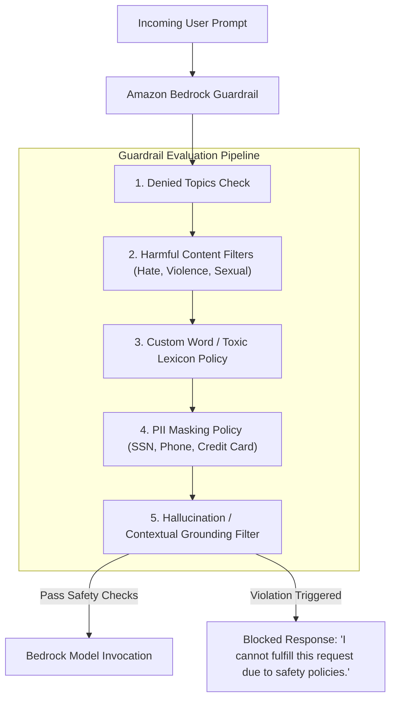

# 02. PII Masking & Sensitive Data Filters

<VideoSection title="Protect your DeepSeek Model Deployments with Guardrails: PII Masking & Sensitive Data Filters" youtubeId="t2_Q2BRzeEE" duration="09:16" motto="Official AWS Bedrock Video Tutorial tailored to PII Masking & Harmful Content with clickable timestamped transcripts." whatItDoes="Integrates topic-matched AWS Bedrock video lessons with synchronized transcripts and instant-jump topic bookmarks." clickInstructions="Click the video play button to start watching, or click any timestamp in the interactive transcript to jump directly to that topic." transcript=[{"time": "00:00", "text": "Introduction to PII Masking & Harmful Content in Amazon Bedrock.", "timestamp": 0}, {"time": "03:15", "text": "Deep-dive technical walkthrough of PII Masking & Harmful Content.", "timestamp": 195}, {"time": "07:30", "text": "Production best practices and hands-on architecture for PII Masking & Harmful Content.", "timestamp": 450}] bookmarks=[{"title": "Introduction", "time": "00:00", "timestamp": 0}, {"title": "PII Masking & Harmful Content Deep-Dive", "time": "03:15", "timestamp": 195}, {"title": "Production Practices", "time": "07:30", "timestamp": 450}] kbId="doc_aws_bedrock_production" />

## AUTOMATED PII REDACTION TYPES
Bedrock Guardrails can automatically mask or block 10+ types of Personally Identifiable Information (PII):
- Social Security Numbers (`SSN`)
- Credit / Debit Card Numbers
- Email Addresses & Phone Numbers
- Bank Account / Routing Numbers
- AWS Secret Credentials

```
Original Input: "My phone is 555-0199 and SSN is 000-12-3456."
Redacted Result: "My phone is [PHONE_REDACTED] and SSN is [SSN_REDACTED]."
```

## VISUAL ARCHITECTURE DIAGRAM


