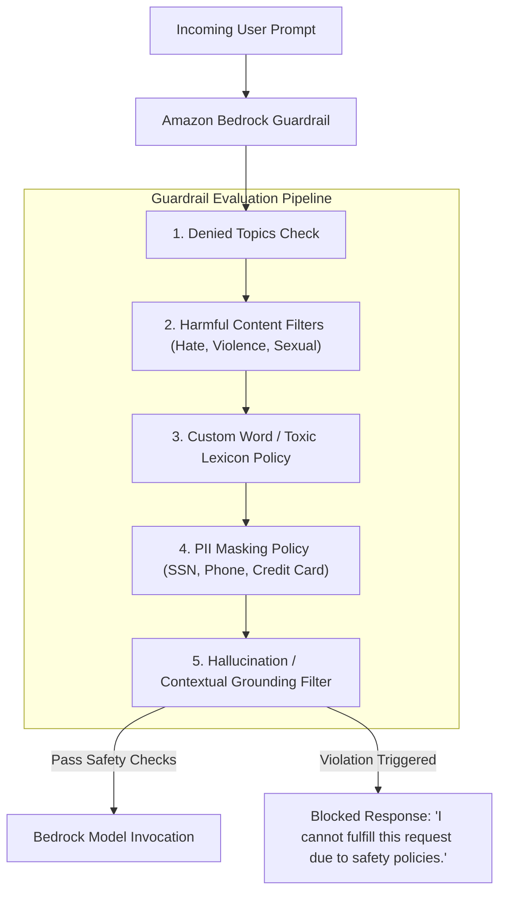

# 03. Denied Topics & Contextual Grounding

<VideoSection title="NEW DEMO: Amazon Bedrock Guardrails & Jailbreak Defense: Denied Topics & Contextual Grounding" youtubeId="OvTH-7ESoRA" duration="09:34" motto="Official AWS Bedrock Video Tutorial tailored to Denied Topics & Jailbreaks with clickable timestamped transcripts." whatItDoes="Integrates topic-matched AWS Bedrock video lessons with synchronized transcripts and instant-jump topic bookmarks." clickInstructions="Click the video play button to start watching, or click any timestamp in the interactive transcript to jump directly to that topic." transcript=[{"time": "00:00", "text": "Introduction to Denied Topics & Jailbreaks in Amazon Bedrock.", "timestamp": 0}, {"time": "03:15", "text": "Deep-dive technical walkthrough of Denied Topics & Jailbreaks.", "timestamp": 195}, {"time": "07:30", "text": "Production best practices and hands-on architecture for Denied Topics & Jailbreaks.", "timestamp": 450}] bookmarks=[{"title": "Introduction", "time": "00:00", "timestamp": 0}, {"title": "Denied Topics & Jailbreaks Deep-Dive", "time": "03:15", "timestamp": 195}, {"title": "Production Practices", "time": "07:30", "timestamp": 450}] kbId="doc_aws_bedrock_production" />

## DENIED TOPIC FILTERS
Define natural language descriptions of forbidden business topics. For example:
- *"Investment Advice or Financial Predictions"*
- *"Medical Diagnosis or Prescription Recommendations"*

If a user prompt touches a Denied Topic, Bedrock intercepts the request and returns a customizable fallback response:
> *"I am an automated assistant and cannot provide financial advice."*

## VISUAL ARCHITECTURE DIAGRAM

