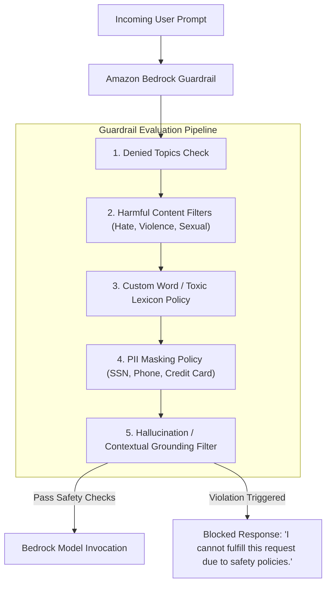

# 04. Attaching Guardrails to Converse API

<VideoSection title="Amazon Bedrock Guardrails to Safeguard Generative AI Apps: Attaching Guardrails to Converse API" youtubeId="ZEKiIwWv9nM" duration="08:50" motto="Official AWS Bedrock Video Tutorial tailored to Guardrails Configuration with clickable timestamped transcripts." whatItDoes="Integrates topic-matched AWS Bedrock video lessons with synchronized transcripts and instant-jump topic bookmarks." clickInstructions="Click the video play button to start watching, or click any timestamp in the interactive transcript to jump directly to that topic." transcript=[{"time": "00:00", "text": "Introduction to Guardrails Configuration in Amazon Bedrock.", "timestamp": 0}, {"time": "03:15", "text": "Deep-dive technical walkthrough of Guardrails Configuration.", "timestamp": 195}, {"time": "07:30", "text": "Production best practices and hands-on architecture for Guardrails Configuration.", "timestamp": 450}] bookmarks=[{"title": "Introduction", "time": "00:00", "timestamp": 0}, {"title": "Guardrails Configuration Deep-Dive", "time": "03:15", "timestamp": 195}, {"title": "Production Practices", "time": "07:30", "timestamp": 450}] kbId="doc_aws_bedrock_production" />

## BOTO3 CONVERSE API WITH GUARDRAIL CONFIGURATION

```python
import boto3

bedrock = boto3.client('bedrock-runtime', region_name='us-east-1')

response = bedrock.converse(
    modelId='us.anthropic.claude-3-5-sonnet-20241022-v2:0',
    messages=[
        {'role': 'user', 'content': [{'text': 'Here is my SSN: 000-12-3456'}]}
    ],
    guardrailConfig={
        'guardrailIdentifier': 'guardrail-id-12345',
        'guardrailVersion': '1',
        'trace': 'enabled'
    }
)

# Check if guardrail blocked or modified action
if response.get('stopReason') == 'guardrail_intervened':
    print("[GUARDRAIL ACTION]: Intervened and modified payload.")
```

## VISUAL ARCHITECTURE DIAGRAM


