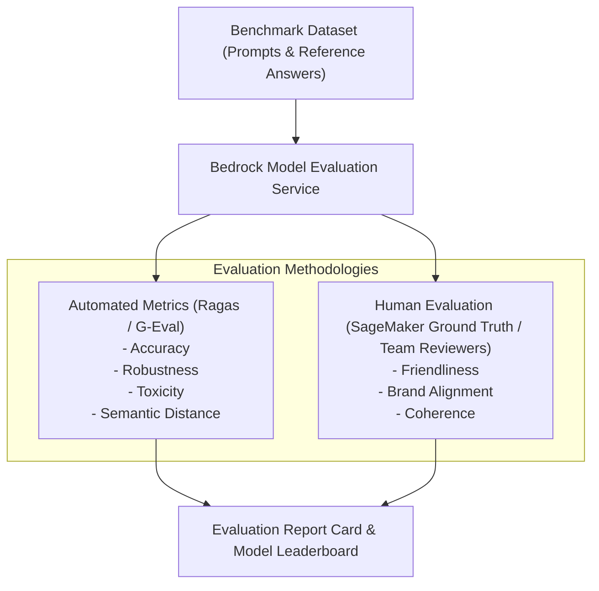

# 01. Why Generative AI Testing is Different

<VideoSection title="Model Evaluation in Amazon Bedrock to Compare & Choose Models: Why Generative AI Testing is Different" youtubeId="Q_2L7_1kP" duration="01:33" motto="Official AWS Bedrock Video Tutorial tailored to Why AI Testing is Different with clickable timestamped transcripts." whatItDoes="Integrates topic-matched AWS Bedrock video lessons with synchronized transcripts and instant-jump topic bookmarks." clickInstructions="Click the video play button to start watching, or click any timestamp in the interactive transcript to jump directly to that topic." transcript=[{"time": "00:00", "text": "Introduction to Why AI Testing is Different in Amazon Bedrock.", "timestamp": 0}, {"time": "03:15", "text": "Deep-dive technical walkthrough of Why AI Testing is Different.", "timestamp": 195}, {"time": "07:30", "text": "Production best practices and hands-on architecture for Why AI Testing is Different.", "timestamp": 450}] bookmarks=[{"title": "Introduction", "time": "00:00", "timestamp": 0}, {"title": "Why AI Testing is Different Deep-Dive", "time": "03:15", "timestamp": 195}, {"title": "Production Practices", "time": "07:30", "timestamp": 450}] kbId="doc_aws_bedrock_production" />

## TRADITIONAL SOFTWARE VS AI APPLICATION TESTING
- **Traditional Software**: Deterministic output (`assert add(2, 2) == 4`).
- **Generative AI**: Non-deterministic natural language outputs requiring metric-based evaluation.

```
Test Dataset (100 Prompts + Golden Truth Answers) ──► Invoke Models ──► Calculate Accuracy / Groundedness Metrics
```

## VISUAL ARCHITECTURE DIAGRAM


