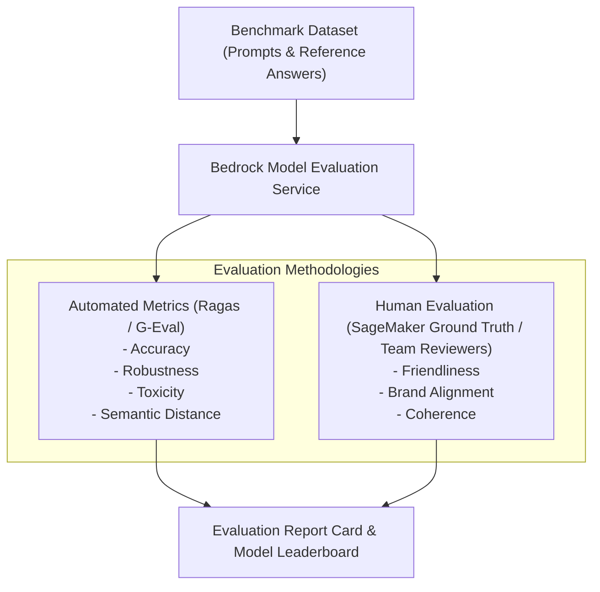

# 02. Accuracy, Relevance & Groundedness Metrics

<VideoSection title="Evaluating Accuracy, Relevance, Groundedness & Toxicity: Accuracy, Relevance & Groundedness Metrics" youtubeId="HeW-D6KpDwY" duration="10:45" motto="Official AWS Bedrock Video Tutorial tailored to Evaluation Metrics with clickable timestamped transcripts." whatItDoes="Integrates topic-matched AWS Bedrock video lessons with synchronized transcripts and instant-jump topic bookmarks." clickInstructions="Click the video play button to start watching, or click any timestamp in the interactive transcript to jump directly to that topic." transcript=[{"time": "00:00", "text": "Introduction to Evaluation Metrics in Amazon Bedrock.", "timestamp": 0}, {"time": "03:15", "text": "Deep-dive technical walkthrough of Evaluation Metrics.", "timestamp": 195}, {"time": "07:30", "text": "Production best practices and hands-on architecture for Evaluation Metrics.", "timestamp": 450}] bookmarks=[{"title": "Introduction", "time": "00:00", "timestamp": 0}, {"title": "Evaluation Metrics Deep-Dive", "time": "03:15", "timestamp": 195}, {"title": "Production Practices", "time": "07:30", "timestamp": 450}] kbId="doc_aws_bedrock_production" />

## THE 3 CORE RAG EVALUATION METRICS
1. **Faithfulness / Groundedness**: Is the answer derived *only* from the retrieved context (no hallucinations)?
2. **Answer Relevance**: Does the answer directly address the user's prompt?
3. **Context Recall & Precision**: Did the vector store retrieve the correct document chunks?

```
Retrieved Context ──► Groundedness Check (0.0 to 1.0) ──► User Prompt ──► Answer Relevance Check
```

## VISUAL ARCHITECTURE DIAGRAM


