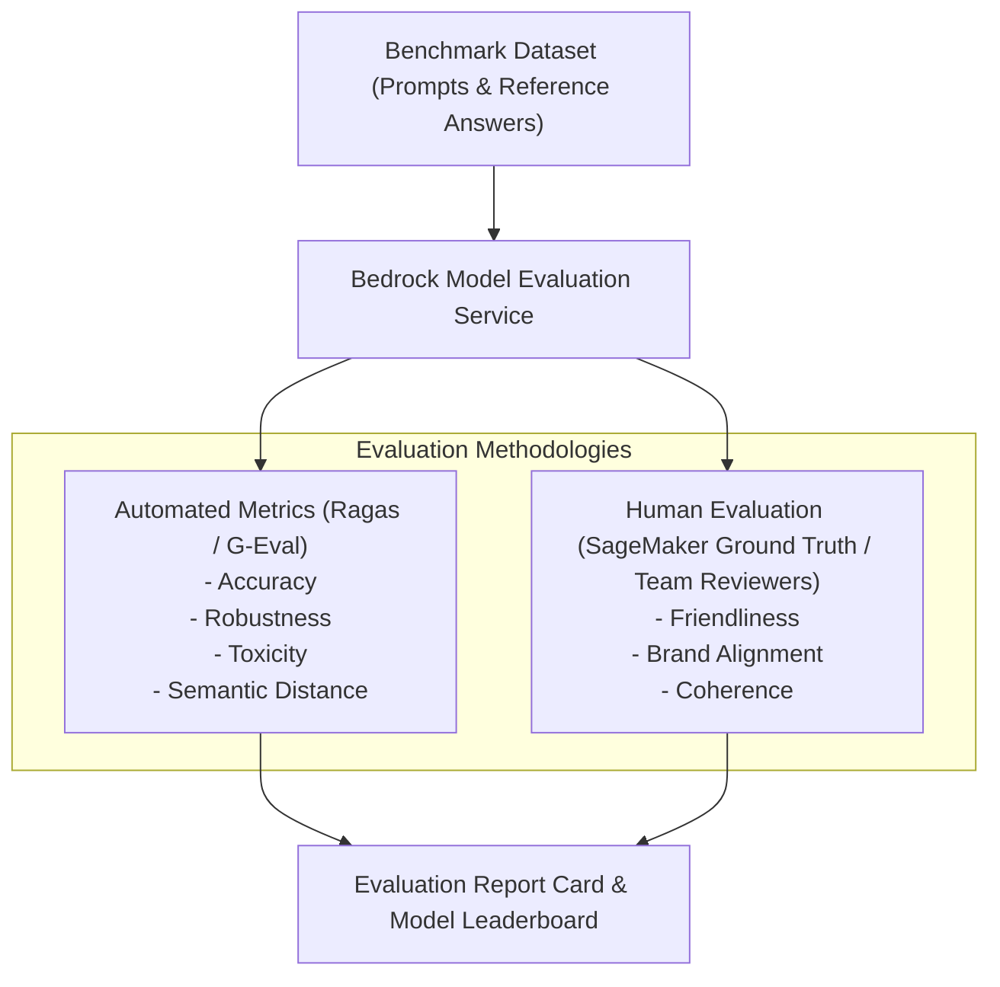

# 03. Human vs Automated Model Evaluation

<VideoSection title="Automated Ragas Metrics vs SageMaker Ground Truth Human Eval: Human vs Automated Model Evaluation" youtubeId="bAwmZVJeO5s" duration="12:10" motto="Official AWS Bedrock Video Tutorial tailored to Human vs Automated Evaluation with clickable timestamped transcripts." whatItDoes="Integrates topic-matched AWS Bedrock video lessons with synchronized transcripts and instant-jump topic bookmarks." clickInstructions="Click the video play button to start watching, or click any timestamp in the interactive transcript to jump directly to that topic." transcript=[{"time": "00:00", "text": "Introduction to Human vs Automated Evaluation in Amazon Bedrock.", "timestamp": 0}, {"time": "03:15", "text": "Deep-dive technical walkthrough of Human vs Automated Evaluation.", "timestamp": 195}, {"time": "07:30", "text": "Production best practices and hands-on architecture for Human vs Automated Evaluation.", "timestamp": 450}] bookmarks=[{"title": "Introduction", "time": "00:00", "timestamp": 0}, {"title": "Human vs Automated Evaluation Deep-Dive", "time": "03:15", "timestamp": 195}, {"title": "Production Practices", "time": "07:30", "timestamp": 450}] kbId="doc_aws_bedrock_production" />

## AMAZON BEDROCK MODEL EVALUATION JOBS
Amazon Bedrock supports two evaluation job types:
1. **Automated Evaluation**: Evaluates models on built-in datasets (e.g. ROUGE, BLEU, BERTScore metrics) for correctness, toxicity, and speed.
2. **Human Evaluation**: Routes prompts to internal team reviewers or AWS Ground Truth human annotators for subjective quality scoring.

## VISUAL ARCHITECTURE DIAGRAM

