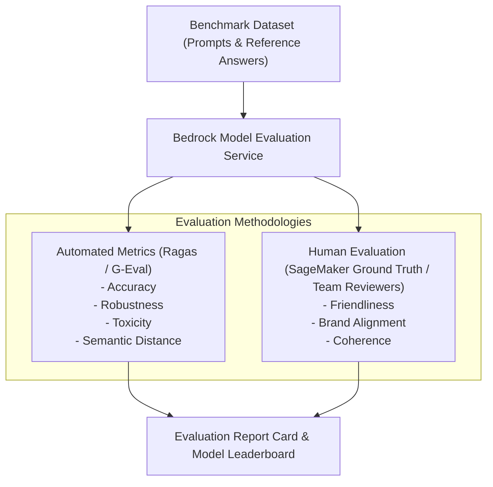

# 04. Side-by-Side Model Comparison Evaluation

<VideoSection title="Model Evaluation Console Playgrounds & Benchmark Reports: Side-by-Side Model Comparison Evaluation" youtubeId="078tYSD7K8E" duration="09:40" motto="Official AWS Bedrock Video Tutorial tailored to Model Evaluation Console with clickable timestamped transcripts." whatItDoes="Integrates topic-matched AWS Bedrock video lessons with synchronized transcripts and instant-jump topic bookmarks." clickInstructions="Click the video play button to start watching, or click any timestamp in the interactive transcript to jump directly to that topic." transcript=[{"time": "00:00", "text": "Introduction to Model Evaluation Console in Amazon Bedrock.", "timestamp": 0}, {"time": "03:15", "text": "Deep-dive technical walkthrough of Model Evaluation Console.", "timestamp": 195}, {"time": "07:30", "text": "Production best practices and hands-on architecture for Model Evaluation Console.", "timestamp": 450}] bookmarks=[{"title": "Introduction", "time": "00:00", "timestamp": 0}, {"title": "Model Evaluation Console Deep-Dive", "time": "03:15", "timestamp": 195}, {"title": "Production Practices", "time": "07:30", "timestamp": 450}] kbId="doc_aws_bedrock_production" />

## COMPARING MODEL A VS MODEL B
Before picking a model for production, compare side-by-side responses on a benchmark test dataset:

```python
# Side-by-side invocation comparison template
models_to_test = [
    'us.anthropic.claude-3-5-sonnet-20241022-v2:0',
    'us.meta.llama3-1-70b-instruct-v1:0'
]
prompt = "Draft a terms of service clause for data privacy."
```

## VISUAL ARCHITECTURE DIAGRAM


