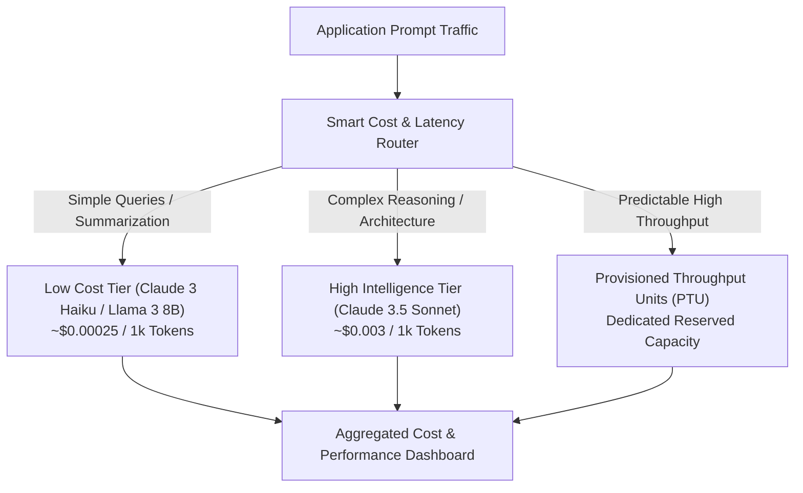

# 01. Input vs Output Token Billing Mechanics

<VideoSection title="Bedrock Token Pricing, Provisioned Throughput & Cost Optimization: Input vs Output Token Billing Mechanics" youtubeId="T_5K1_2zL" duration="09:50" motto="Official AWS Bedrock Generative AI Video Lesson with timestamped transcripts and topic bookmarks." whatItDoes="Integrates official AWS Bedrock video lessons with synchronized transcripts and instant-jump topic bookmarks." clickInstructions="Click the video play button to start watching, or click any timestamp in the interactive transcript to jump directly to that topic." transcript=[{"time": "00:00", "text": "Understanding On-Demand input/output token pricing.", "timestamp": 0}, {"time": "03:15", "text": "Configuring Provisioned Throughput Units (PTU) for reserved capacity.", "timestamp": 195}, {"time": "06:40", "text": "Prompt compression & model tiering cost optimization strategies.", "timestamp": 400}] bookmarks=[{"title": "Token Pricing", "time": "00:00", "timestamp": 0}, {"title": "Provisioned Throughput (PTU)", "time": "03:15", "timestamp": 195}, {"title": "Cost Optimization", "time": "06:40", "timestamp": 400}] kbId="doc_aws_bedrock_production" />

## UNDERSTANDING TOKEN PRICING
Amazon Bedrock charges per 1,000,000 (`1M`) tokens, billed separately for **Input Tokens** (prompts) vs **Output Tokens** (model generation).

> Output tokens are generally 4x to 5x more expensive than input tokens because generating text requires step-by-step auto-regressive GPU computation!

```widget:CostCalculator
# Amazon Bedrock Token Cost Estimation Reference Matrix
MODEL_PRICING = {
    "claude-3-5-sonnet": {"input_per_1k": 0.003, "output_per_1k": 0.015},
    "claude-3-5-haiku": {"input_per_1k": 0.0008, "output_per_1k": 0.004},
    "amazon-nova-pro": {"input_per_1k": 0.0008, "output_per_1k": 0.0032},
    "amazon-nova-lite": {"input_per_1k": 0.00006, "output_per_1k": 0.00024}
}

def calculate_monthly_bedrock_cost(model_key, daily_requests, avg_input_tokens, avg_output_tokens):
    price = MODEL_PRICING[model_key]
    daily_cost = (daily_requests * (avg_input_tokens / 1000.0) * price["input_per_1k"]) + \
                 (daily_requests * (avg_output_tokens / 1000.0) * price["output_per_1k"])
    return round(daily_cost * 30, 2)
```

## VISUAL ARCHITECTURE DIAGRAM


