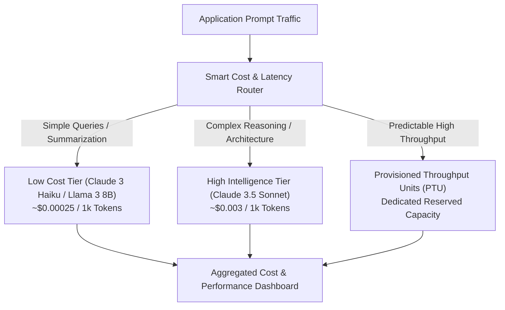

# 03. Provisioned Throughput & Batch Inference

<VideoSection title="Bedrock Token Pricing, Provisioned Throughput & Cost Optimization: Provisioned Throughput & Batch Inference" youtubeId="T_5K1_2zL" duration="09:50" motto="Official AWS Bedrock Generative AI Video Lesson with timestamped transcripts and topic bookmarks." whatItDoes="Integrates official AWS Bedrock video lessons with synchronized transcripts and instant-jump topic bookmarks." clickInstructions="Click the video play button to start watching, or click any timestamp in the interactive transcript to jump directly to that topic." transcript=[{"time": "00:00", "text": "Understanding On-Demand input/output token pricing.", "timestamp": 0}, {"time": "03:15", "text": "Configuring Provisioned Throughput Units (PTU) for reserved capacity.", "timestamp": 195}, {"time": "06:40", "text": "Prompt compression & model tiering cost optimization strategies.", "timestamp": 400}] bookmarks=[{"title": "Token Pricing", "time": "00:00", "timestamp": 0}, {"title": "Provisioned Throughput (PTU)", "time": "03:15", "timestamp": 195}, {"title": "Cost Optimization", "time": "06:40", "timestamp": 400}] kbId="doc_aws_bedrock_production" />

## WHEN TO USE PROVISIONED THROUGHPUT
- **On-Demand (Standard)**: Pay per token. Great for variable or unpredictable traffic.
- **Provisioned Throughput**: Purchase dedicated Model Units (MU) guaranteeing consistent high TPS (Transactions Per Second) without rate limits or throttling exceptions.

## BATCH INFERENCE
For non-realtime offline workloads (e.g. processing 100,000 customer feedback emails overnight), use **Batch Inference** to get 50% cost savings compared to on-demand pricing!

## VISUAL ARCHITECTURE DIAGRAM

