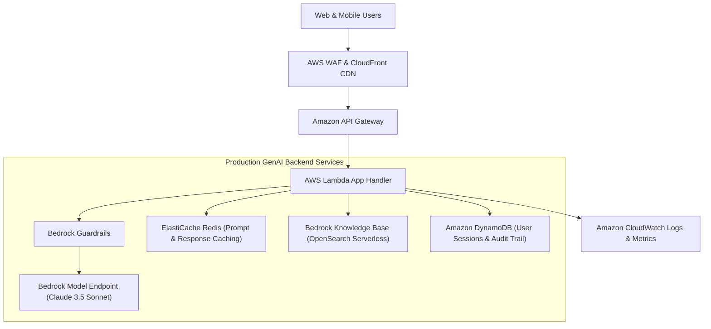

# 01. Moving From Demo Prototype to Production

<VideoSection title="Transitioning GenAI Applications from Prototype to Production: Moving From Demo Prototype to Production" youtubeId="HeW-D6KpDwY" duration="13:20" motto="Official AWS Bedrock Video Tutorial tailored to Demo to Production with clickable timestamped transcripts." whatItDoes="Integrates topic-matched AWS Bedrock video lessons with synchronized transcripts and instant-jump topic bookmarks." clickInstructions="Click the video play button to start watching, or click any timestamp in the interactive transcript to jump directly to that topic." transcript=[{"time": "00:00", "text": "Introduction to Demo to Production in Amazon Bedrock.", "timestamp": 0}, {"time": "03:15", "text": "Deep-dive technical walkthrough of Demo to Production.", "timestamp": 195}, {"time": "07:30", "text": "Production best practices and hands-on architecture for Demo to Production.", "timestamp": 450}] bookmarks=[{"title": "Introduction", "time": "00:00", "timestamp": 0}, {"title": "Demo to Production Deep-Dive", "time": "03:15", "timestamp": 195}, {"title": "Production Practices", "time": "07:30", "timestamp": 450}] kbId="doc_aws_bedrock_production" />

## THE PROTOTYPE VS PRODUCTION GAP

```
┌─────────────────────────────────────────┐     ┌─────────────────────────────────────────┐
│ PROTOTYPE DEMO                          │     │ PRODUCTION ENTERPRISE APP               │
├─────────────────────────────────────────┤     ├─────────────────────────────────────────┤
│ • Hardcoded prompts in single script    │     │ • Multi-tier microservices architecture  │
│ • No error handling or retries          │ ──► │ • Automatic retries & exponential backoff│
│ • No IAM security or guardrails         │     │ • Bedrock Guardrails + PII Redaction    │
│ • Unlimited token spending risk         │     │ • Budget alarms & CloudWatch metrics    │
└─────────────────────────────────────────┘     └─────────────────────────────────────────┘
```

## VISUAL ARCHITECTURE DIAGRAM


