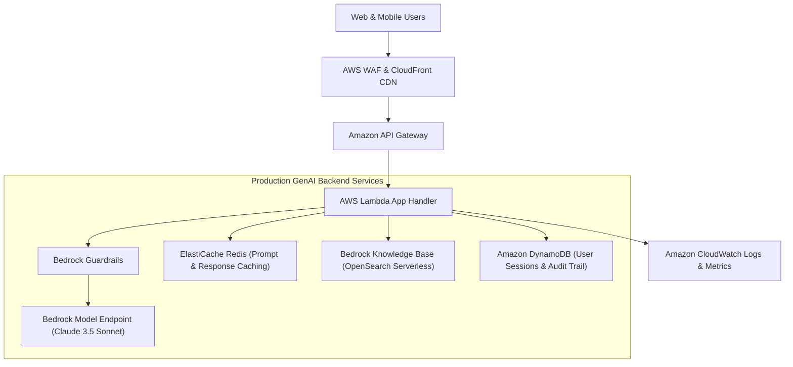

# 02. RAG & Agent Production Architecture Patterns

<VideoSection title="Production RAG & Autonomous Agent System Topology: RAG & Agent Production Architecture Patterns" youtubeId="bAwmZVJeO5s" duration="14:45" motto="Official AWS Bedrock Video Tutorial tailored to Production RAG Architectures with clickable timestamped transcripts." whatItDoes="Integrates topic-matched AWS Bedrock video lessons with synchronized transcripts and instant-jump topic bookmarks." clickInstructions="Click the video play button to start watching, or click any timestamp in the interactive transcript to jump directly to that topic." transcript=[{"time": "00:00", "text": "Introduction to Production RAG Architectures in Amazon Bedrock.", "timestamp": 0}, {"time": "03:15", "text": "Deep-dive technical walkthrough of Production RAG Architectures.", "timestamp": 195}, {"time": "07:30", "text": "Production best practices and hands-on architecture for Production RAG Architectures.", "timestamp": 450}] bookmarks=[{"title": "Introduction", "time": "00:00", "timestamp": 0}, {"title": "Production RAG Architectures Deep-Dive", "time": "03:15", "timestamp": 195}, {"title": "Production Practices", "time": "07:30", "timestamp": 450}] kbId="doc_aws_bedrock_production" />

## LEVEL 1: BASIC AI TEXT APP
```
Client (React) ──► API Gateway ──► Lambda / ECS ──► Bedrock Runtime ──► Claude 3.5 Sonnet
```

## LEVEL 2: ENTERPRISE RAG ARCHITECTURE
```
Client ──► API Gateway ──► Backend ──► Knowledge Base (RetrieveAndGenerate) ──► OpenSearch Vector Store
                                                   │
                                                   └──► Bedrock Guardrail Filter
```

## LEVEL 3: AUTONOMOUS AGENT ARCHITECTURE
```
Client ──► Backend ──► Bedrock Agent ──► Action Group (OpenAPI) ──► Lambda ──► DynamoDB / External APIs
```

## VISUAL ARCHITECTURE DIAGRAM


