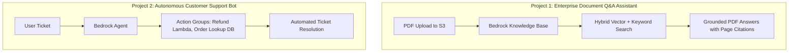

# 01. Project 1: Enterprise Document Q&A Assistant

<VideoSection title="Project 1: Enterprise Document Q&A Assistant with Bedrock: Project 1: Enterprise Document Q&A Assistant" youtubeId="jU0cndZziO0" duration="15:20" motto="Official AWS Bedrock Video Tutorial tailored to Document Q&A Project with clickable timestamped transcripts." whatItDoes="Integrates topic-matched AWS Bedrock video lessons with synchronized transcripts and instant-jump topic bookmarks." clickInstructions="Click the video play button to start watching, or click any timestamp in the interactive transcript to jump directly to that topic." transcript=[{"time": "00:00", "text": "Introduction to Document Q&A Project in Amazon Bedrock.", "timestamp": 0}, {"time": "03:15", "text": "Deep-dive technical walkthrough of Document Q&A Project.", "timestamp": 195}, {"time": "07:30", "text": "Production best practices and hands-on architecture for Document Q&A Project.", "timestamp": 450}] bookmarks=[{"title": "Introduction", "time": "00:00", "timestamp": 0}, {"title": "Document Q&A Project Deep-Dive", "time": "03:15", "timestamp": 195}, {"title": "Production Practices", "time": "07:30", "timestamp": 450}] kbId="doc_aws_bedrock_production" />

## PROBLEM STATEMENT
Employees spend hours manually searching 100-page internal PDF policy documents.

## ARCHITECTURE
```
PDF Files in S3 ──► Knowledge Base Ingestion ──► OpenSearch Vector Store ──► RetrieveAndGenerate API ──► React Frontend
```

## REQUIREMENTS & STEP-BY-STEP CODE
1. Upload PDF files to S3 bucket `s3://enterprise-docs-bucket`.
2. Sync Knowledge Base.
3. Call `retrieve_and_generate` from backend API endpoint.

```python
# Complete Backend Implementation
@app.post("/api/qa")
def document_qa(query: str):
    return query_knowledge_base(query, kb_id="KB991823")
```

## VISUAL ARCHITECTURE DIAGRAM


