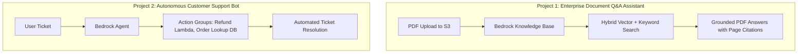

# 02. Project 2: Multi-Source RAG Knowledge Assistant

<VideoSection title="Project 2: RAG Knowledge Assistant with OpenSearch Serverless: Project 2: Multi-Source RAG Knowledge Assistant" youtubeId="S73thl0AyFU" duration="16:40" motto="Official AWS Bedrock Video Tutorial tailored to RAG Knowledge Assistant Project with clickable timestamped transcripts." whatItDoes="Integrates topic-matched AWS Bedrock video lessons with synchronized transcripts and instant-jump topic bookmarks." clickInstructions="Click the video play button to start watching, or click any timestamp in the interactive transcript to jump directly to that topic." transcript=[{"time": "00:00", "text": "Introduction to RAG Knowledge Assistant Project in Amazon Bedrock.", "timestamp": 0}, {"time": "03:15", "text": "Deep-dive technical walkthrough of RAG Knowledge Assistant Project.", "timestamp": 195}, {"time": "07:30", "text": "Production best practices and hands-on architecture for RAG Knowledge Assistant Project.", "timestamp": 450}] bookmarks=[{"title": "Introduction", "time": "00:00", "timestamp": 0}, {"title": "RAG Knowledge Assistant Project Deep-Dive", "time": "03:15", "timestamp": 195}, {"title": "Production Practices", "time": "07:30", "timestamp": 450}] kbId="doc_aws_bedrock_production" />

## PROBLEM STATEMENT
Customer support agents need live access to product manuals, troubleshooting guides, and real-time warranty databases.

## ARCHITECTURE
- **S3 Data Source**: Product Manuals & Troubleshooting PDFs.
- **Bedrock Guardrail**: Redact PII and block competitor references.
- **Model**: `us.anthropic.claude-3-5-sonnet-20241022-v2:0`

## VISUAL ARCHITECTURE DIAGRAM

