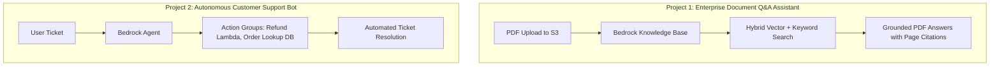

# 03. Project 3: Autonomous Customer Support Agent

<VideoSection title="Project 3: Autonomous Customer Support Bot with Lambda Tools: Project 3: Autonomous Customer Support Agent" youtubeId="qVyvmzFxF_o" duration="18:15" motto="Official AWS Bedrock Video Tutorial tailored to Customer Support Agent Project with clickable timestamped transcripts." whatItDoes="Integrates topic-matched AWS Bedrock video lessons with synchronized transcripts and instant-jump topic bookmarks." clickInstructions="Click the video play button to start watching, or click any timestamp in the interactive transcript to jump directly to that topic." transcript=[{"time": "00:00", "text": "Introduction to Customer Support Agent Project in Amazon Bedrock.", "timestamp": 0}, {"time": "03:15", "text": "Deep-dive technical walkthrough of Customer Support Agent Project.", "timestamp": 195}, {"time": "07:30", "text": "Production best practices and hands-on architecture for Customer Support Agent Project.", "timestamp": 450}] bookmarks=[{"title": "Introduction", "time": "00:00", "timestamp": 0}, {"title": "Customer Support Agent Project Deep-Dive", "time": "03:15", "timestamp": 195}, {"title": "Production Practices", "time": "07:30", "timestamp": 450}] kbId="doc_aws_bedrock_production" />

## PROBLEM STATEMENT
Automate order status inquiries, refund processing, and account inquiries.

## ACTION GROUPS & LAMBDA TOOLS
1. `GetOrderStatus(order_id)` -> Queries DynamoDB table.
2. `InitiateRefund(order_id, reason)` -> Calls Stripe / Payment API.

```python
# Lambda Handler Tool
def lambda_handler(event, context):
    action_group = event['actionGroup']
    function = event['function']
    
    if function == 'GetOrderStatus':
        order_id = event['parameters'][0]['value']
        return {"status": "SHIPPED", "tracking": "FX-99128"}
```

## VISUAL ARCHITECTURE DIAGRAM


