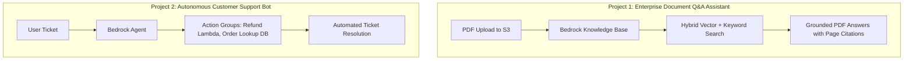

# 04. Project 4: Enterprise Research Assistant

<VideoSection title="Project 4: Enterprise Multi-Document AI Research Assistant: Project 4: Enterprise Research Assistant" youtubeId="lIId8IDP6TU" duration="17:30" motto="Official AWS Bedrock Video Tutorial tailored to Enterprise Research Assistant Project with clickable timestamped transcripts." whatItDoes="Integrates topic-matched AWS Bedrock video lessons with synchronized transcripts and instant-jump topic bookmarks." clickInstructions="Click the video play button to start watching, or click any timestamp in the interactive transcript to jump directly to that topic." transcript=[{"time": "00:00", "text": "Introduction to Enterprise Research Assistant Project in Amazon Bedrock.", "timestamp": 0}, {"time": "03:15", "text": "Deep-dive technical walkthrough of Enterprise Research Assistant Project.", "timestamp": 195}, {"time": "07:30", "text": "Production best practices and hands-on architecture for Enterprise Research Assistant Project.", "timestamp": 450}] bookmarks=[{"title": "Introduction", "time": "00:00", "timestamp": 0}, {"title": "Enterprise Research Assistant Project Deep-Dive", "time": "03:15", "timestamp": 195}, {"title": "Production Practices", "time": "07:30", "timestamp": 450}] kbId="doc_aws_bedrock_production" />

## PROBLEM STATEMENT
Research analysts need to synthesize 50 market research PDFs into structured executive briefings with citations.

## PIPELINE ARCHITECTURE
```
Document Upload ──► KB Ingestion ──► Hybrid Search (Keyword + Vector) ──► Claude 3.5 Sonnet ──► Markdown Briefing + Citations
```

## VISUAL ARCHITECTURE DIAGRAM


