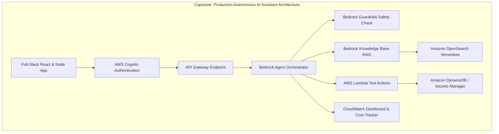

# 01. Capstone Overview & 14 Mission Milestones

<VideoSection title="Capstone Overview: Building a Production AI Assistant: Capstone Overview & 14 Mission Milestones" youtubeId="t2_Q2BRzeEE" duration="12:10" motto="Official AWS Bedrock Video Tutorial tailored to Capstone Overview & Missions with clickable timestamped transcripts." whatItDoes="Integrates topic-matched AWS Bedrock video lessons with synchronized transcripts and instant-jump topic bookmarks." clickInstructions="Click the video play button to start watching, or click any timestamp in the interactive transcript to jump directly to that topic." transcript=[{"time": "00:00", "text": "Introduction to Capstone Overview & Missions in Amazon Bedrock.", "timestamp": 0}, {"time": "03:15", "text": "Deep-dive technical walkthrough of Capstone Overview & Missions.", "timestamp": 195}, {"time": "07:30", "text": "Production best practices and hands-on architecture for Capstone Overview & Missions.", "timestamp": 450}] bookmarks=[{"title": "Introduction", "time": "00:00", "timestamp": 0}, {"title": "Capstone Overview & Missions Deep-Dive", "time": "03:15", "timestamp": 195}, {"title": "Production Practices", "time": "07:30", "timestamp": 450}] kbId="doc_aws_bedrock_production" />

## CAPSTONE GOAL
Design, build, evaluate, and optimize a production-ready **Enterprise AI Assistant using Amazon Bedrock**.

```
                       Production Enterprise AI Assistant
                                       │
     ┌─────────────────────────────────┼─────────────────────────────────┐
     ▼                                 ▼                                 ▼
RAG Knowledge Base              Autonomous Agent               Bedrock Guardrails
(OpenSearch Vector Store)     (Action Groups + Lambda)          (PII Masking & Safety)
```

## THE 14 CAPSTONE MISSIONS
- **Mission 1**: Requirements & Architecture Blueprint
- **Mission 2**: Model Selection & Parameter Configuration
- **Mission 3**: Prompt Management & System Instructions
- **Mission 4**: FastAPI Backend Foundation
- **Mission 5**: Multi-Turn Chat & DynamoDB Memory
- **Mission 6**: S3 Document Ingestion
- **Mission 7**: Bedrock Knowledge Base Setup
- **Mission 8**: RetrieveAndGenerate Integration
- **Mission 9**: Bedrock Guardrail Configuration
- **Mission 10**: OpenAPI Action Group & Lambda Tool Integration
- **Mission 11**: IAM Security Policy Hardening
- **Mission 12**: Automated Metric Evaluation Benchmark
- **Mission 13**: Cost Optimization & Token Budgeting
- **Mission 14**: Final Production Architecture Review

## VISUAL ARCHITECTURE DIAGRAM


