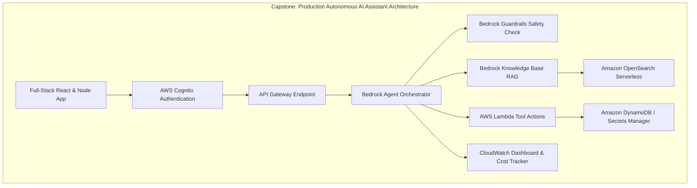

# 02. Capstone Missions 1 to 4: Foundations & Backend

<VideoSection title="Capstone Missions 1 to 4: Foundations & Boto3 Setup: Capstone Missions 1 to 4: Foundations & Backend" youtubeId="OvTH-7ESoRA" duration="14:50" motto="Official AWS Bedrock Video Tutorial tailored to Capstone Missions 1 to 4 with clickable timestamped transcripts." whatItDoes="Integrates topic-matched AWS Bedrock video lessons with synchronized transcripts and instant-jump topic bookmarks." clickInstructions="Click the video play button to start watching, or click any timestamp in the interactive transcript to jump directly to that topic." transcript=[{"time": "00:00", "text": "Introduction to Capstone Missions 1 to 4 in Amazon Bedrock.", "timestamp": 0}, {"time": "03:15", "text": "Deep-dive technical walkthrough of Capstone Missions 1 to 4.", "timestamp": 195}, {"time": "07:30", "text": "Production best practices and hands-on architecture for Capstone Missions 1 to 4.", "timestamp": 450}] bookmarks=[{"title": "Introduction", "time": "00:00", "timestamp": 0}, {"title": "Capstone Missions 1 to 4 Deep-Dive", "time": "03:15", "timestamp": 195}, {"title": "Production Practices", "time": "07:30", "timestamp": 450}] kbId="doc_aws_bedrock_production" />

## MISSION 1: ARCHITECTURE BLUEPRINT
Draw and configure multi-tier architecture diagram: React Frontend → API Gateway → FastAPI → Bedrock Runtime.

## MISSION 2: MODEL SELECTION
Configure `us.anthropic.claude-3-5-sonnet-20241022-v2:0` for reasoning & `us.anthropic.claude-3-haiku-20240307-v1:0` for fast chat.

## MISSION 3: PROMPT MANAGEMENT
Create system prompt template with explicit role, instructions, constraints, and JSON response formatting.

## MISSION 4: FASTAPI BACKEND
Build secure FastAPI server with CORS, health check `/ping`, and Bedrock SDK client initialization.

## VISUAL ARCHITECTURE DIAGRAM

