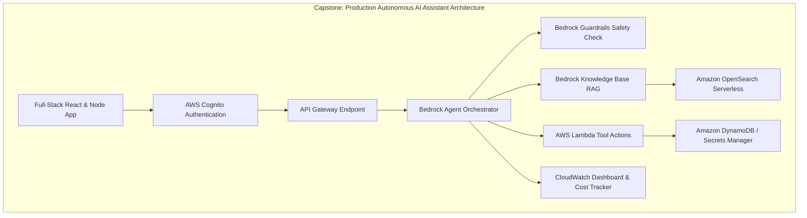

# 03. Capstone Missions 5 to 8: RAG & Safety Guardrails

<VideoSection title="Capstone Missions 5 to 8: RAG Knowledge Bases & Guardrails: Capstone Missions 5 to 8: RAG & Safety Guardrails" youtubeId="ZEKiIwWv9nM" duration="16:25" motto="Official AWS Bedrock Video Tutorial tailored to Capstone Missions 5 to 8 with clickable timestamped transcripts." whatItDoes="Integrates topic-matched AWS Bedrock video lessons with synchronized transcripts and instant-jump topic bookmarks." clickInstructions="Click the video play button to start watching, or click any timestamp in the interactive transcript to jump directly to that topic." transcript=[{"time": "00:00", "text": "Introduction to Capstone Missions 5 to 8 in Amazon Bedrock.", "timestamp": 0}, {"time": "03:15", "text": "Deep-dive technical walkthrough of Capstone Missions 5 to 8.", "timestamp": 195}, {"time": "07:30", "text": "Production best practices and hands-on architecture for Capstone Missions 5 to 8.", "timestamp": 450}] bookmarks=[{"title": "Introduction", "time": "00:00", "timestamp": 0}, {"title": "Capstone Missions 5 to 8 Deep-Dive", "time": "03:15", "timestamp": 195}, {"title": "Production Practices", "time": "07:30", "timestamp": 450}] kbId="doc_aws_bedrock_production" />

## MISSION 5: MULTI-TURN CHAT
Integrate session state history storage in DynamoDB with automatic context pruning.

## MISSION 6: DOCUMENT INGESTION
Upload enterprise PDFs to S3 bucket and run automated ingestion sync jobs.

## MISSION 7: KNOWLEDGE BASE INTEGRATION
Connect Knowledge Base to OpenSearch Serverless vector store and invoke `retrieve_and_generate`.

## MISSION 8: GUARDRAILS ATTACHMENT
Attach Bedrock Guardrail policy to redact PII (SSNs, Credit Cards) and enforce denied topic rules.

## VISUAL ARCHITECTURE DIAGRAM

