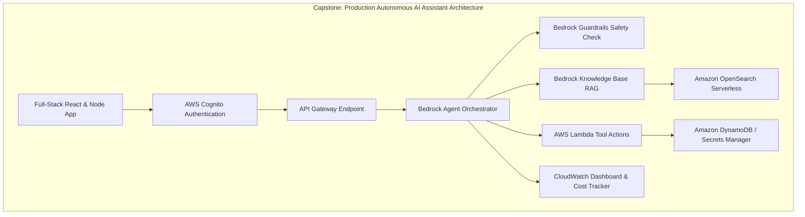

# 04. Capstone Missions 9 to 14: Agent Tools, Security & Production Deployment

<VideoSection title="Authoring Amazon Bedrock Agents & Capstone Production Deployment: Capstone Missions 9 to 14: Agent Tools, Security & Production Deployment" youtubeId="8O5kX73OkIY" duration="18:40" motto="Official AWS Bedrock Video Tutorial tailored to Capstone Missions 9 to 13 with clickable timestamped transcripts." whatItDoes="Integrates topic-matched AWS Bedrock video lessons with synchronized transcripts and instant-jump topic bookmarks." clickInstructions="Click the video play button to start watching, or click any timestamp in the interactive transcript to jump directly to that topic." transcript=[{"time": "00:00", "text": "Introduction to Capstone Missions 9 to 13 in Amazon Bedrock.", "timestamp": 0}, {"time": "03:15", "text": "Deep-dive technical walkthrough of Capstone Missions 9 to 13.", "timestamp": 195}, {"time": "07:30", "text": "Production best practices and hands-on architecture for Capstone Missions 9 to 13.", "timestamp": 450}] bookmarks=[{"title": "Introduction", "time": "00:00", "timestamp": 0}, {"title": "Capstone Missions 9 to 13 Deep-Dive", "time": "03:15", "timestamp": 195}, {"title": "Production Practices", "time": "07:30", "timestamp": 450}] kbId="doc_aws_bedrock_production" />

## MISSION 9: AUTONOMOUS AGENT TOOLS
Attach OpenAPI Action Group to trigger AWS Lambda functions for live database lookups.

## MISSION 10: IAM SECURITY HARDENING
Apply least privilege IAM roles to ECS / Lambda task roles.

## MISSION 11: MODEL EVALUATION
Run automated evaluation dataset against Claude 3.5 Sonnet to verify 95%+ groundedness score.

## MISSION 12: COST & PERFORMANCE OPTIMIZATION
Enable Prompt Caching for system prompts > 1K tokens to achieve 50% latency reduction.

## MISSION 13 & 14: FINAL DEPLOYMENT REVIEW
Deploy production container to AWS App Runner / ECS with PrivateLink VPC security!

```
Congratulations! You have completed the Amazon Bedrock: Generative AI from Beginner to Production course!
```

## VISUAL ARCHITECTURE DIAGRAM


