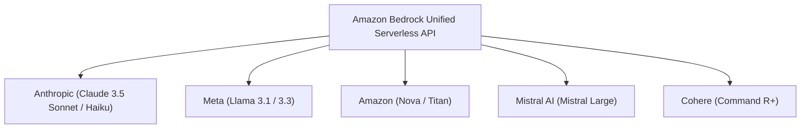

# AWS Bedrock Course — Chapter 1

# 🚀 Introduction to Amazon Bedrock: Your First Step into Generative AI

## 🎬 About This Course — The Source Video

This course is built as **interactive, chapter-by-chapter notes** for the **Amazon Bedrock AgentCore Deep dive series** from **AWS Show & Tell** (AWS Events on YouTube). Each chapter takes one video from the series and turns it into a guided learning experience — with architecture diagrams, real code, console walkthroughs, and knowledge checks.

The video below is the opener of the series: a complete, end-to-end walkthrough of building your first production-ready AI agent with Amazon Bedrock AgentCore. Watch it first if you want the big picture — the chapters that follow break every piece of it down step by step.

<VideoSection youtubeId="wzIQDPFQx30" title="Building your first production-ready AI agent with Amazon Bedrock AgentCore | AWS Show & Tell" />

### 🗺️ The Story in One Picture — From a Simple AI Agent to a Production-Ready AI Employee

This is the exact journey the opener video — and this course — follows. Each numbered step maps to a chapter:

<HotspotImage
  src="/bedrock-deepti/screenshots/c1_story_journey.jpg"
  alt="Story: from a simple AI agent to a production-ready AI employee — the 10-step AgentCore journey"
  caption="Interactive map — click a numbered step (or Tab + Enter) to jump to the section that covers it."
  hotspots={[
    { x: 0.5,  y: 12, w: 24, h: 29, label: "Step 1: Customers need support",                  tip: "① Customers need support",        to: "1-6-what-can-you-build-with-amazon-bedrock" },
    { x: 25,   y: 12, w: 24, h: 29, label: "Step 2: Create a local agent with Strands",       tip: "② Local Strands agent",           to: "/courses/bedrock-to-production/core-chapters/Chapter_02_Bedrock_AgentCore_Production_Ready_Agents#2-6-the-starting-point-a-plain-local-strands-agent" },
    { x: 49.5, y: 12, w: 24, h: 29, label: "Step 3: Deploy with AgentCore Runtime",           tip: "③ Deploy → AgentCore Runtime",    to: "/courses/bedrock-to-production/core-chapters/Chapter_04_AgentCore_Runtime_Prototype_to_Production#4-9-configure-launch-invoke" },
    { x: 74,   y: 12, w: 25.5, h: 29, label: "Step 4: Connect tools with AgentCore Gateway",  tip: "④ Gateway connects tools",        to: "/courses/bedrock-to-production/core-chapters/Chapter_05_AgentCore_Gateway_Connecting_Agents_to_Tools#5-4-what-is-amazon-bedrock-agentcore-gateway" },
    { x: 0.5,  y: 43, w: 24, h: 29, label: "Step 5: Tool execution — Lambda and DynamoDB",    tip: "⑤ Lambda → DynamoDB",             to: "/courses/bedrock-to-production/core-chapters/Chapter_05_AgentCore_Gateway_Connecting_Agents_to_Tools#5-9-lambda-target-turning-lambda-into-mcp" },
    { x: 25,   y: 43, w: 24, h: 29, label: "Step 6: Add a tool without changing agent code",  tip: "⑥ New tool, no redeploy",         to: "/courses/bedrock-to-production/core-chapters/Chapter_02_Bedrock_AgentCore_Production_Ready_Agents#2-13-gateway-live-update-tools-without-redeploying" },
    { x: 49.5, y: 43, w: 24, h: 29, label: "Step 7: Give the agent a memory",                 tip: "⑦ AgentCore Memory",              to: "/courses/bedrock-to-production/core-chapters/Chapter_02_Bedrock_AgentCore_Production_Ready_Agents#2-14-memory-wiring-the-hook" },
    { x: 74,   y: 43, w: 25.5, h: 29, label: "Step 8: Secure access with Identity and OAuth", tip: "⑧ Identity / OAuth",              to: "/courses/bedrock-to-production/core-chapters/Chapter_06_AgentCore_Identity_Secure_Agent_Workflows#6-2-the-identity-triangle-inbound-agent-outbound" },
    { x: 0.5,  y: 74, w: 48, h: 24, label: "Step 9: Monitor everything with CloudWatch",      tip: "⑨ Observability",                 to: "/courses/bedrock-to-production/core-chapters/Chapter_04_AgentCore_Runtime_Prototype_to_Production#4-15-observability-tracing" },
    { x: 50,   y: 74, w: 49.5, h: 24, label: "Step 10: Production-ready AI agent architecture", tip: "⑩ Production-ready architecture", to: "1-8-core-bedrock-concepts-architecture" },
  ]}
/>

**What to notice** — the journey in order:

1. **The problem** — customers need support; questions pile up.
2. **A local agent** — Strands + a Knowledge Base answers warranty/guideline questions on your laptop.
3. **Deploy to the cloud** — `agentcore configure` / `agentcore launch` puts the agent on **AgentCore Runtime** (Ch 4).
4. **Connect tools** — **AgentCore Gateway** becomes the single bridge to `check_warranty`, `get_customer_profile`, … (Ch 5).
5. **Tool execution** — Gateway → **Lambda** → **DynamoDB**; the agent calls tools without knowing the plumbing.
6. **New tools, zero agent changes** — add a tool to the gateway, the agent can use it immediately.
7. **Memory** — **AgentCore Memory** remembers across sessions ("Your favorite device is Gaming Console Pro").
8. **Secure access** — **AgentCore Identity** brokers OAuth to Google Calendar and other third-party services (Ch 6).
9. **Observe everything** — **CloudWatch GenAI dashboard**: sessions, traces, token usage, errors, latency, full trace view.
10. **Production-ready AI employee** — scalable, secure, remembers users, uses external tools, fully monitored.

Keep this map in mind — every chapter deep-dives one of these steps.

---

## Chapter Goal

By the end of this chapter, the learner will be able to:

- Understand **Generative AI** in simple, intuitive terms.
- Explain what **Amazon Bedrock** is and why enterprises use it.
- Differentiate between Amazon Bedrock and self-hosted or standard provider API solutions.
- Understand the core concept of **Foundation Models (FMs)**.
- Identify the primary components of the Amazon Bedrock ecosystem.
- Conceptualize and design their very first Amazon Bedrock use case.

---

## 1.1 🤔 What is Generative AI?

Today, artificial intelligence is no longer restricted to analyzing data or predicting numbers.

AI can now **create brand-new content** dynamically.

### For Example:

👤 **User**: *"Write a professional email informing the team about tomorrow's server maintenance."*

🤖 **AI**:

> ✉️ *"Dear Team,\n\nPlease be advised that scheduled server maintenance will take place tomorrow at 02:00 UTC..."*

This capability is known as **Generative AI** (GenAI).

### Simple Definition

> [!NOTE]
> **Generative AI** is a branch of Artificial Intelligence capable of creating new, original content based on natural language instructions (prompts) provided by a user.

This generated content includes:

- 📝 **Text**: Emails, essays, stories, documentation
- 🖼️ **Images**: Concept art, product designs, diagrams
- 💻 **Code**: Python, JavaScript, SQL, Terraform scripts
- 🎵 **Audio & Speech**: Music, voiceovers, podcast edits
- 📄 **Summaries**: Condensing 100-page PDFs into key takeaways
- 💬 **Conversations**: Interactive, multi-turn AI chatbots

### Real-World Paradigm Shift

Imagine a company handling thousands of customer service requests daily:

#### Traditional System (Rule-Based / Database Search)
```
Customer Question ──► Database Search ──► Match Exact Keyword ──► Return Hardcoded Answer
```

#### Generative AI System (Understanding & Generation)
```
Customer Question ──► AI Understands Intent & Context ──► AI Synthesizes Response ──► Natural Personalized Answer
```

> [!TIP]
> 💡 **Think About It**: If you want to build a smart customer support chatbot that answers queries naturally, do you need to spend millions of dollars training an AI model from scratch?
> 
> **No.** And that is precisely where **Amazon Bedrock** comes into play.

---

## 1.2 ☁️ What is Amazon Bedrock?

> [!IMPORTANT]
> **Amazon Bedrock** is a fully managed AWS service that enables developers to build and scale Generative AI applications using industry-leading **Foundation Models (FMs)** via simple, unified APIs.

In simple terms: Bedrock lets you harness state-of-the-art AI models to build powerful applications without ever having to train an AI model or manage underlying GPU infrastructure yourself.

### Building GenAI Applications: With vs. Without Bedrock

#### Traditional Approach (Without Amazon Bedrock)
```
Collect Data ──► Clean Dataset ──► Train Model ──► Manage GPUs ──► Deploy Cluster ──► Scale Infra ──► Build App
```
*(Extremely expensive, slow, complex, and requires specialized ML engineering teams)*

#### Modern Approach (With Amazon Bedrock)
```
Select Foundation Model ──► Send Prompt / Request via API ──► Receive AI Response ──► Build Application
```
*(Fast, cost-effective, enterprise-ready, serverless, and accessible to any developer)*

### 🎯 Key Architectural Takeaway

> **Amazon Bedrock = Managed Access to Foundation Models + AWS Security Infrastructure + Unified APIs**

---

## 1.3 🧠 What is a Foundation Model (FM)?

To understand Bedrock, you must understand **Foundation Models (FMs)**.

> [!NOTE]
> A **Foundation Model (FM)** is a massive AI model pre-trained on vast amounts of multimodal data, capable of performing a wide spectrum of tasks out of the box.

A single Foundation Model can:
- Answer complex domain-specific questions
- Draft high-quality text and documentation
- Summarize multi-page documents
- Generate and debug code across multiple programming languages
- Translate content between human languages

### Easy Analogy 🍕

Imagine you are managing a world-class restaurant kitchen:

- **Chef A**: World-class Specialist in Code Generation
- **Chef B**: World-class Specialist in Text Synthesis & Creative Writing
- **Chef C**: World-class Specialist in Image Generation & Design
- **Chef D**: World-class Specialist in Analytical Reasoning

You don't need to spend years raising and training each chef from scratch. Instead, you simply evaluate your menu requirements and select the right chef for the exact job.

In Amazon Bedrock, you choose from an array of pre-trained "master chefs" (Foundation Models) tailored to your specific application requirements.

---

## 1.4 🏢 Why Does Bedrock Provide Multiple Models?

A common question among developers starting with AI is:

> *"If an AI model is already available, why do we need multiple different models?"*

Because **no single model is optimal for every single workload**. Different models excel at different parameters:

- Deep analytical reasoning
- Code generation & debugging
- Ultra-fast execution speed & low latency
- Cost efficiency for micro-tasks
- Multimodal understanding (Text + Images + Documents)

### Multi-Provider Catalog

Amazon Bedrock provides managed, serverless API access to leading models from world-renowned AI providers:

- 🟢 **Amazon**: Nova Micro, Nova Lite, Nova Pro, Titan Text, Titan Image, Titan Embeddings
- 🔴 **Anthropic**: Claude 3.5 Sonnet, Claude 3.5 Haiku, Claude 3 Opus
- 🔵 **Meta**: Llama 3.1 (8B, 70B, 405B), Llama 3.2, Llama 3.3
- 🟡 **Mistral AI**: Mistral Large, Mistral Small, Pixtral
- 🟣 **Cohere**: Command R, Command R+, Cohere Embed
- ⚪ **AI21 Labs**: Jamba 1.5 Large, Jamba 1.5 Mini



### 🎯 Key Course Takeaway

> [!TIP]
> With Amazon Bedrock, you are never locked into a single provider's proprietary ecosystem. You can seamlessly switch or route requests between models based on performance, cost, and latency demands.

---

## 1.5 🔌 How Does Bedrock Work?

Let's look at the basic conceptual architecture:

```
                  YOUR CLIENT APPLICATION
                            │
                            ▼
               Amazon Bedrock Runtime API
                            │
        ┌───────────────────┼───────────────────┐
        ▼                   ▼                   ▼
   Model A             Model B             Model C
(Claude 3.5 Sonnet)  (Llama 3.1 70B)    (Nova Pro)
        │                   │                   │
        └───────────────────┼───────────────────┘
                            ▼
                       AI Response
                            │
                            ▼
                  YOUR CLIENT APPLICATION
```

### Concrete Example — "AI Resume Reviewer"

Imagine you are building an **AI Resume Reviewer** web application:

1. User uploads candidate resume (PDF / Text).
2. Application sends prompt + resume content to **Amazon Bedrock**.
3. Amazon Bedrock routes the request securely to the chosen **Foundation Model**.
4. The Foundation Model analyzes skills, formats, and experience.
5. Bedrock returns structured feedback & improvement suggestions to your app.
6. The app displays formatted review suggestions to the user.

---

## 1.6 💻 What Can You Build with Amazon Bedrock?

Amazon Bedrock powers a vast array of production Generative AI applications:

### Example 1 — Autonomous Customer Support Bot
```
Customer Query: "Where is my refund for Order #8821?"
    │
    ▼
Support Application ──► Amazon Bedrock (Claude 3.5 Haiku) ──► Action Execution ──► Instant Answer
```

### Example 2 — Instant Document Summarizer
```
100-Page Legal / Medical PDF Document ──► Amazon Bedrock ──► Concise 5-Bullet Point Executive Summary
```

### Example 3 — Intelligent Coding Assistant
```
Developer Prompt: "Generate a FastAPI REST endpoint with JWT auth" ──► Bedrock ──► Production-Ready Code
```

### Example 4 — Enterprise Knowledge Base Assistant (RAG)
```
Internal Company Documents ──► Bedrock Knowledge Bases ──► Employee Question ──► Verified Answer + Citations
```

---

## 1.7 🆚 Bedrock vs. Building Your Own AI Model

Understanding this comparison is critical for enterprise decision-making:

| Metric / Dimension | Traditional Custom AI Approach | Amazon Bedrock Approach |
| :--- | :--- | :--- |
| **Model Training** | Months of expensive pre-training required | Pre-trained models available immediately |
| **Infrastructure Management** | Provisioning and managing complex GPU clusters | 100% Serverless managed by AWS |
| **Hardware Costs** | Massive up-front capital expenditure (CapEx) | Pay-per-token / Pay-as-you-go (OpEx) |
| **Model Selection** | Restricted to hosted model architecture | Choice of leading models across providers |
| **Required Expertise** | Deep Learning & Machine Learning PhDs | Standard Web, Mobile & Backend Developers |
| **Time to Market** | 6 to 18 Months | Hours to Days |

> [!NOTE]
> *Does this mean ML expertise is never needed?*
> No. Building advanced, enterprise-grade applications requires mastering key GenAI engineering patterns: **Prompt Engineering**, **RAG (Retrieval-Augmented Generation)**, **Vector Embeddings**, **Guardrails**, **Model Evaluation**, and **Security**. This course covers all of these step-by-step.

---

## 1.8 🧩 Core Bedrock Concepts Architecture

Here is the high-level roadmap of Amazon Bedrock capabilities covered in this course:

```
Amazon Bedrock Enterprise Ecosystem
│
├── 🧠 Foundation Models (FMs)
├── ⚡ Model Inference (Converse API & Streaming)
├── 📝 Prompt Engineering & Management
├── 📚 Knowledge Bases (Vector Stores & Retrieval)
├── 🔍 RAG (Retrieval-Augmented Generation)
├── 🤖 Autonomous Agents & Action Groups
├── 🛡️ Guardrails & AI Safety Policies
├── 🎨 Model Customization & Fine-Tuning
├── 📊 Model Evaluation & Benchmarking
└── 🔐 Production Deployment (IAM, Security, Performance & Monitoring)
```

In this initial chapter, we focus on the big picture. In the upcoming chapters, we will get hands-on with every single concept.

---

## 1.9 🛠️ Your First Bedrock Use Case Design Challenge

Let's transition from theory to real-world application design.

### The Challenge

You are tasked with building an **Internal HR FAQ Assistant** for a company with 5,000 employees and 500 policy documents.

An employee asks: *"What is our remote work stipend policy?"*

```
Employee Question ──► AI HR Application ──► Amazon Bedrock ──► Policy Retrieval ──► Grounded AI Response
```

### Your Design Questions to Consider

1. **Q1**: Do we need to train a new AI model from scratch for this company?
2. **Q2**: What type of Foundation Model characteristics do we need (e.g., speed, accuracy, reasoning)?
3. **Q3**: How can we connect 500 enterprise policy documents so the AI response is accurate and verified without hallucinating?

*(We will answer and implement these exact solutions as we build through the course!)*

---

## 🎯 Chapter 1 — Quick Quiz

### Question 1
**What is the primary purpose of Amazon Bedrock?**
- A. Hosting static web pages
- B. Building Generative AI applications using managed Foundation Models via APIs
- C. Managing relational SQL database clusters
- D. Domain Name System (DNS) routing

> **✅ Correct Answer: B**
> *Explanation: Amazon Bedrock is a fully managed AWS service that provides access to leading foundation models through APIs to build GenAI applications.*

---

### Question 2
**What is a Foundation Model (FM)?**
- A. An AWS VPC networking subnet rule
- B. A large, pre-trained AI model capable of performing a wide variety of tasks like text generation, coding, and reasoning
- C. A hardware rack inside an AWS Data Center
- D. A Docker container deployment script

> **✅ Correct Answer: B**
> *Explanation: Foundation Models are general-purpose pre-trained models that serve as the fundamental building block for generative AI applications.*

---

### Question 3
**What is a major enterprise advantage of using Amazon Bedrock?**
- A. Developers must train every AI model from scratch before using it
- B. Developers can access top foundation models serverlessly without managing GPU infrastructure
- C. It only works for static web applications
- D. It replaces all existing AWS infrastructure services

> **✅ Correct Answer: B**
> *Explanation: Bedrock abstracts away server and GPU infrastructure management, offering unified serverless access with enterprise privacy and IAM security.*

---

## 🏆 Chapter 1 Summary

In this chapter, we learned:

1. **Generative AI**: Technology capable of generating new text, images, code, audio, and structured content based on user prompts.
2. **Foundation Model (FM)**: A large pre-trained AI model capable of executing multiple tasks out of the box.
3. **Amazon Bedrock**: A serverless AWS service enabling developers to access and orchestrate leading Foundation Models securely using unified APIs.
4. **The Golden Rule**: You do NOT start by building an AI model from scratch. You start by building an **AI APPLICATION**.

---

## 🎬 Where This Course Goes Next

You now know *what* Bedrock is. The rest of this course is about *what you build on top of it* — AI agents that can call tools, access data, and act in the real world. Press play below to watch an agent come alive: an LLM alone can only talk, but connect it to **tools** and it becomes an **agentic system**.

<AgentFlowStoryteller title="From Agent to Strands" />
