# AWS Bedrock Course — Chapter 2

*From laptop prototype to production in one chapter — built from the AWS Show & Tell episode "Building your first production-ready AI agent with Amazon Bedrock AgentCore" with Mark Roy (Agentic AI Tech Lead) and Ishan "EK" Kaushik (Solutions Architect).*

# 🤖 Amazon Bedrock AgentCore — Building & Deploying Production-Ready AI Agents

## 🎯 Learning Objectives

By the end of this chapter you will be able to:

- Explain the **prototype-to-production gap** and why it kills agent projects
- Name every **AgentCore building block**: Runtime, Gateway, Memory, Identity, Observability, Browser, Code Interpreter
- Wrap a local **Strands agent** for **AgentCore Runtime** with the `BedrockAgentCoreApp` SDK
- Run **`agentcore configure` → `launch` → `invoke`** — locally first, then to the cloud
- Expose existing **Lambda functions** as **MCP tools** through **AgentCore Gateway**
- Wire **short-term and long-term Memory** into an agent with Strands **hooks** and **Actor ID**
- Use **Identity** to broker OAuth access to third-party services (Google Calendar)
- Read agent behavior end-to-end in the **CloudWatch GenAI Observability** dashboard

---

## 2.1 Why Getting Agents to Production Is So Hard

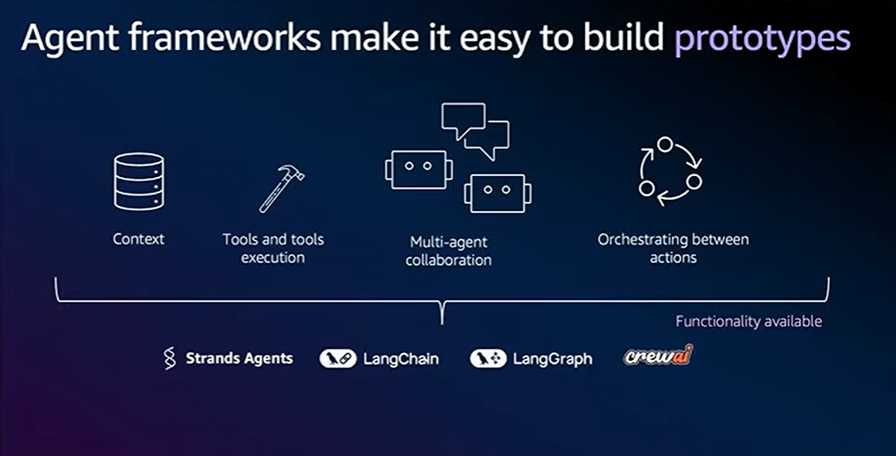

2025 is being called the **year of agents** — everyone wants to build and deploy them. The hosts frame the episode around one question: *how do you deploy, secure, maintain and observe agents once the demo is over?*

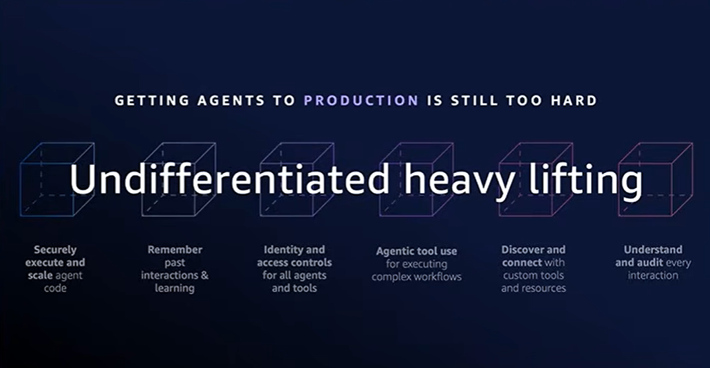
**What to notice** — agent frameworks (LangGraph, CrewAI, Strands, LangChain…) genuinely make it easy to build a PoC on your laptop. Download the framework, write a few lines, impress the C-suite. Prototyping is a *solved* problem — production is not.

But a laptop demo produces **zero business value**. Mark lists what every team actually has to solve before an agent can go live:

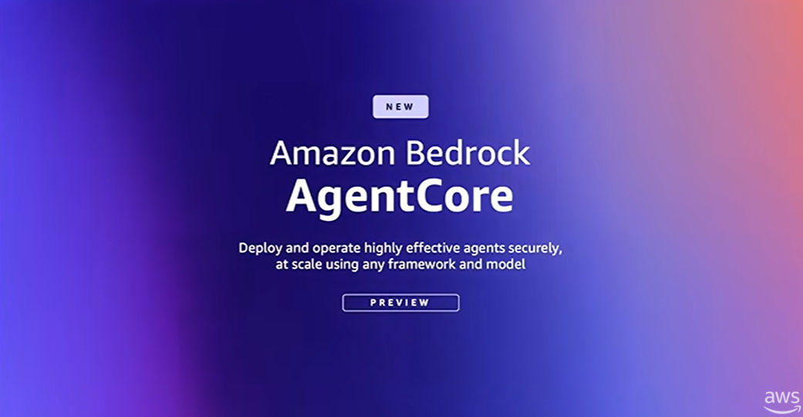
**What to notice** — six boxes, none of them your business logic: **Security** (who can invoke the agent? what can it reach?), **Scalability** (one user → thousands of concurrent sessions), **Interoperability** (agents↔tools↔other agents), **Large payloads** (documents, images, long histories), **Long-running agents** (hours, not seconds), and **Observability** ("what is my agent actually doing?").

> [!IMPORTANT]
> **The Production Gap**: if you don't get your agents into production, you've produced no business value — only exciting demos. Businesses are betting on agents as *mission-critical workloads*; you cannot trust an agent you can't secure, audit or observe.

---

## 2.2 What Is Amazon Bedrock AgentCore?

> [!NOTE]
> **Amazon Bedrock AgentCore** is a set of composable building blocks for **deploying and operating agents at scale, securely** — with **any framework and any model**.

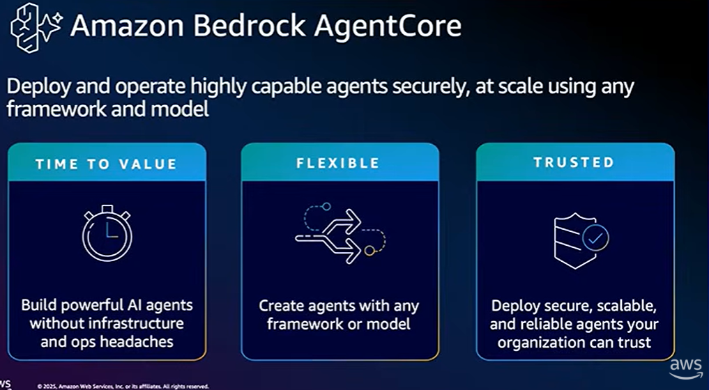
**What to notice** — three headline benefits straight from the episode:

- ⏱️ **Time to Value** — the goal isn't time-to-*prototype*, it's time-to-*production* (real business value)
- 🔄 **Flexible** — any framework, any model, plus protocol flexibility: **MCP** and **A2A**
- 🛡️ **Trusted** — secure, scalable, reliable agents an organization can actually bet on

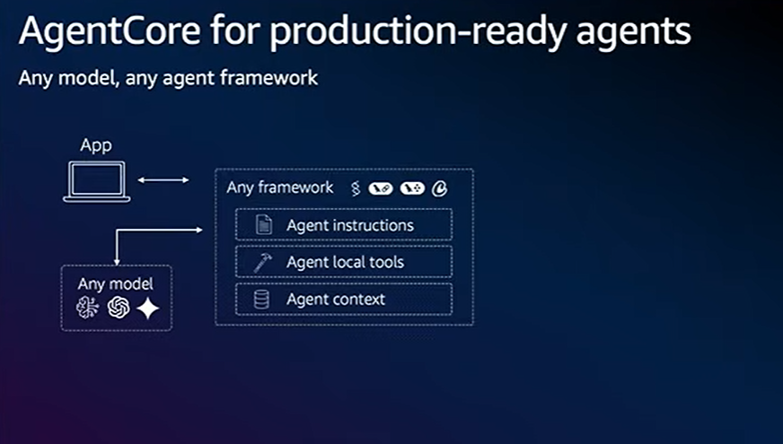
**What to notice** — your agent is just code: **instructions + local tools + context**, powered by a model. AgentCore hosts it without forcing a proprietary rewrite — Strands today, LangGraph or CrewAI tomorrow; Bedrock models, SageMaker, OpenAI, Gemini or your own open-source models.

> [!NOTE]
> **Demo framework**: mostly **Strands** (AWS's open-source agent SDK — production-ready multi-agent systems in a few lines of code) — but everything shown works identically with LangGraph, CrewAI or LangChain. The hosts repeat this constantly: *any framework, any model*.

### The building blocks, one diagram

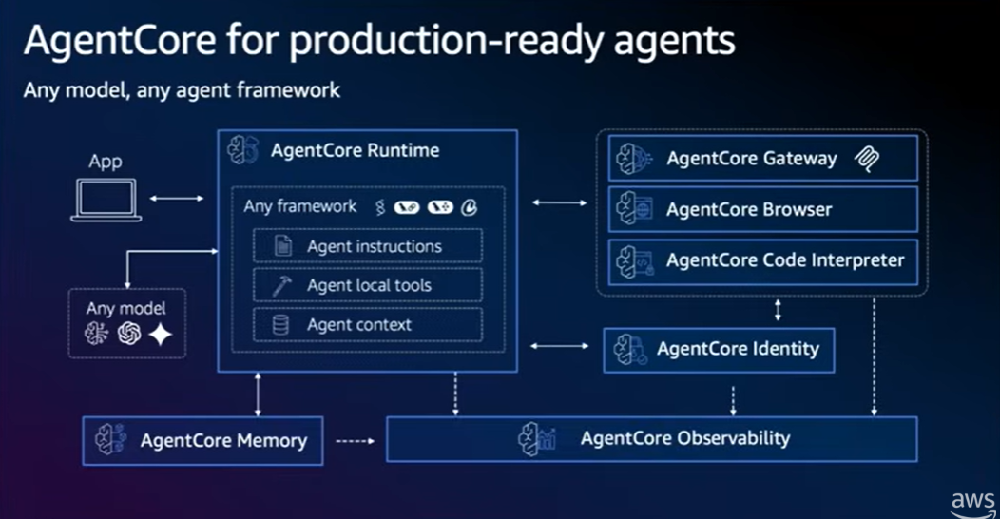
**What to notice** — AgentCore is **composable**. At the top, **Runtime** hosts the agent beside managed tools — **Gateway**, **Browser**, **Code Interpreter**. Underneath, the trust layer: **Identity**, **Memory**, **Observability**.

| Building Block | What it does |
| :--- | :--- |
| ⚙️ **Runtime** | Secure, scalable hosting for agents — and even tools or MCP servers |
| 🌐 **Gateway** | Exposes your **existing APIs** as **MCP** so they plug into any agent framework |
| 🔐 **Identity** | End-to-end authN/authZ: user→agent, agent→agent, agent→first/third-party tools |
| 🧠 **Memory** | Conversation memory **plus** managed long-term memory — preferences, facts, summaries |
| 📊 **Observability** | The end-to-end picture: sessions, traces, tokens, errors, latency |
| 🌍 **Browser** | Managed, secure browser automation — legacy systems, manual processes |
| 💻 **Code Interpreter** | Secure sandbox for agent-generated code |

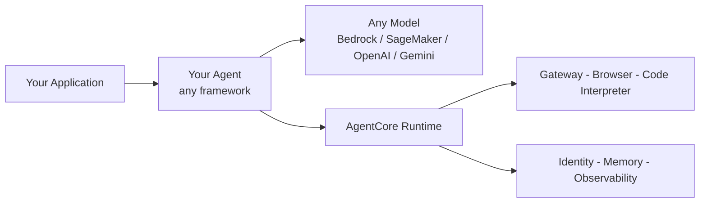
```mermaid
flowchart LR
    App["Your Application"] --> Agent["Your Agent<br/>any framework"]
    Agent --> Model["Any Model<br/>Bedrock / SageMaker / OpenAI / Gemini"]
    Agent --> RT["AgentCore Runtime"]
    RT --> Tools["Gateway - Browser - Code Interpreter"]
    RT --> Core["Identity - Memory - Observability"]
```

---

## 2.3 The Build — A Production Customer Support Assistant

The episode proves all of this with one real build: **a customer support assistant** wired into real enterprise resources.

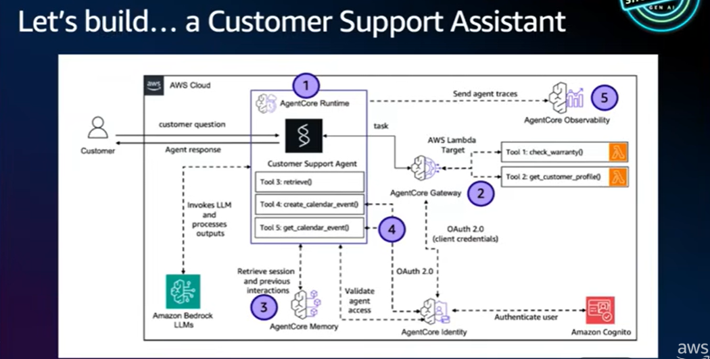
**What to notice** — the numbered flow:

1. **Customer question** hits the **AgentCore Runtime** endpoint, authenticated via **Amazon Cognito**
2. The agent calls **Gateway tools** — `check_warranty` and `get_customer_profile` — backed by **Lambda → DynamoDB**
3. **AgentCore Memory** retrieves session history and past interactions for that user
4. **AgentCore Identity** validates access and brokers **OAuth 2.0** for third-party services
5. Everything emits **agent traces** to **AgentCore Observability**

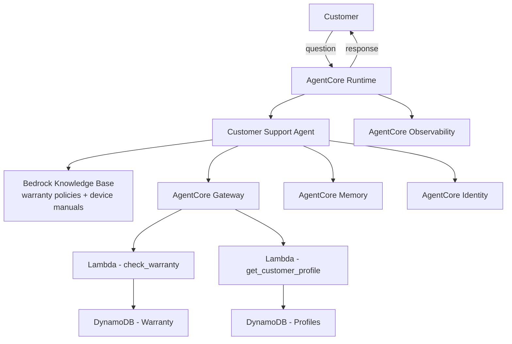
```mermaid
flowchart TD
    Customer["Customer"] -->|question| Runtime["AgentCore Runtime"]
    Runtime -->|response| Customer
    Runtime --> Agent["Customer Support Agent"]
    Agent --> KB["Bedrock Knowledge Base<br/>warranty policies + device manuals"]
    Agent --> GW["AgentCore Gateway"]
    GW --> L1["Lambda - check_warranty"]
    GW --> L2["Lambda - get_customer_profile"]
    L1 --> DB1["DynamoDB - Warranty"]
    L2 --> DB2["DynamoDB - Profiles"]
    Agent --> MEM["AgentCore Memory"]
    Agent --> IDP["AgentCore Identity"]
    Runtime --> OBS["AgentCore Observability"]
```

The rest of this chapter follows the demo exactly — same order, same code, same console.

---

## 2.4 The Toolbox — Samples Repo, SDK and Starter Kit

Before touching code, EK shows where everything lives — three open-source resources:

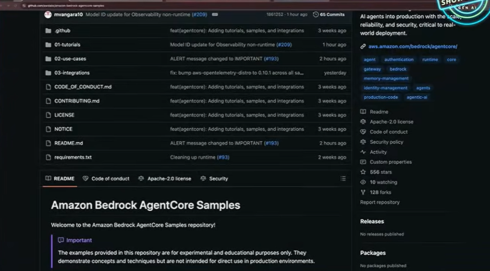
**What to notice** — the `awslabs/amazon-bedrock-agentcore-samples` repo. `tutorials/` walks each building block step by step; `use-cases/` contains real-world implementations — including this exact **customer support assistant**.

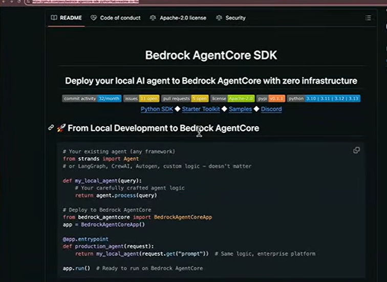
**What to notice** — the SDK is **open source** (you can contribute). Its job in one line: *deploy local agents to production on AgentCore in a few lines of code.*

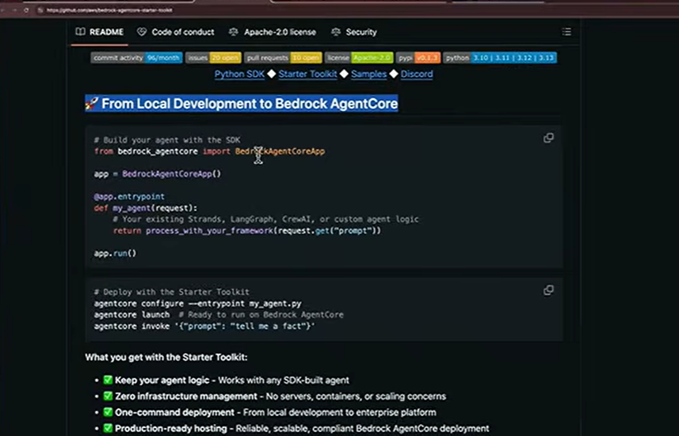
**What to notice** — the **starter toolkit** wraps the SDK in `agentcore` CLI commands: `configure`, `launch`, `invoke`. One neat feature: **deploy locally first** for debugging — before touching the cloud.

| Resource | Purpose |
| :--- | :--- |
| 🧩 `amazon-bedrock-agentcore-samples` | Tutorials + complete use cases (incl. this assistant) |
| ⚙️ `bedrock-agentcore` SDK | `BedrockAgentCoreApp` + auth/memory decorators, open source |
| 🚀 `bedrock-agentcore-starter-toolkit` | `agentcore` CLI — configure / launch / invoke |

---

## 2.5 From Local Development to Bedrock AgentCore

The SDK contract in one slide:

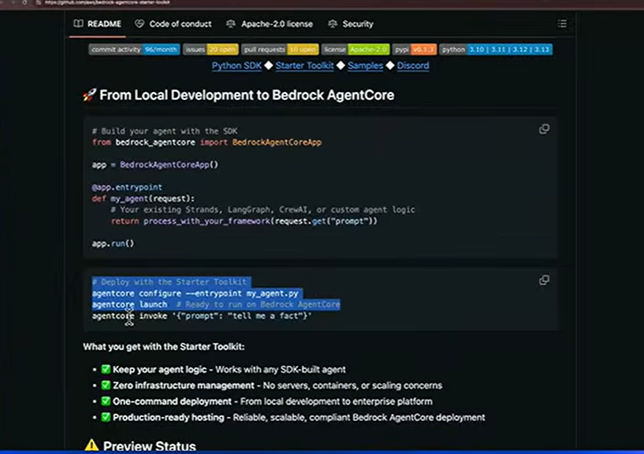
**What to notice** — left side: your agent wrapped in `BedrockAgentCoreApp` with an `@app.entrypoint` invoke function. Right side: the four CLI verbs — `configure`, `launch -l` (local), `launch` (cloud), `invoke`. Underneath: *agent-agnostic, session isolation, secure-by-default, any framework*.

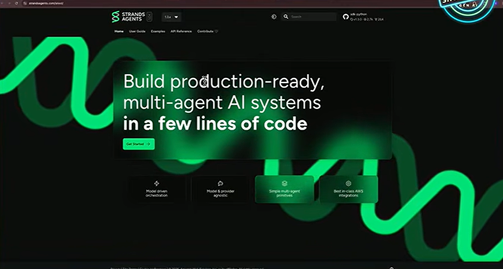
**What to notice** — the whole production path is literally four commands. Everything behind them — containerization, CodeBuild, ECR, endpoints — is the SDK's job, not yours.

---

## 2.6 The Starting Point — A Plain Local Strands Agent

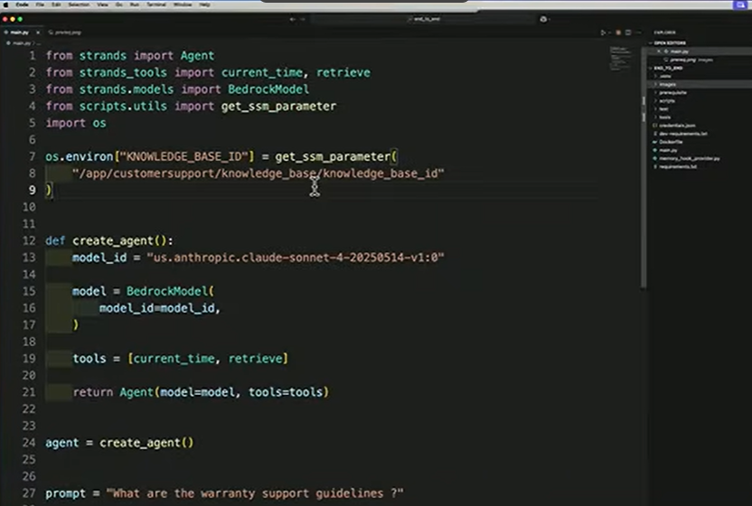
**What to notice** — the demo framework is **Strands**: build production-ready multi-agent AI systems in a few lines of code. (The earlier playlist episode goes deep on Strands itself.)

The complete local agent — `Agent` + `BedrockModel` (Claude Sonnet), two local tools — `current_time` and `retrieve` (which pulls from a **Bedrock Knowledge Base** via the `KNOWLEDGE_BASE_ID` env var), and the warranty question. ~20 lines total:

<GitHubExplorer repo="awslabs/amazon-bedrock-agentcore-samples" ref="main" expanded="true" title="main.py — the plain local agent (life before AgentCore)" files={[
  { "path": "main.py", "src": "/bedrock-deepti/code/main_local.py", "label": "main.py", "highlights": [[6, 10], [21, 21]], "note": "Recreated from the demo — KNOWLEDGE_BASE_ID comes from SSM, retrieve() queries the Bedrock Knowledge Base." }
]} />

Run it locally and the warranty answer streams back — the agent chose `retrieve`, hit the Knowledge Base, and grounded every claim:

```terminal
$ python main.py
I'll search for information about warranty support guidelines.

Warranty Support Guidelines (from knowledge base):
- Standard warranty: 12 months from date of purchase
- Premium tier: 24 months + accidental damage coverage
- Claims require proof of purchase and device serial number
… streamed response continues …
```

*Great demo — still a laptop PoC. "You've officially impressed the C-suite. How do you get to production?"*

---

## 2.7 The Migration — Wrapping for AgentCore Runtime

Here's the entire diff that turns the laptop agent into a production deployment — three additions only: `app = BedrockAgentCoreApp()`, one `@app.entrypoint` async function receiving **`payload`** (the user input — prompts, images, files) and **`context`** (which exposes `session_id` and later `actor_id`), and `app.run()`:

<GitHubExplorer repo="awslabs/amazon-bedrock-agentcore-samples" ref="main" expanded="true" title="main.py — the migration, every line added" files={[
  { "path": "main.py", "src": "/bedrock-deepti/code/main_runtime.py", "label": "main.py", "highlights": [[7, 7], [22, 22], [33, 33]], "note": "app + @app.entrypoint + app.run() — that's the whole migration. Recreated from the demo." }
]} />

> [!NOTE]
> **The whole migration is**: wrap the app, define one entry point, stream the response. Any framework drops into the same shape — LangGraph or CrewAI instead of Strands.

---

## 2.8 Test Locally Before Deploying

Configure once (`agentcore configure` — entrypoint, execution role, ECR repo, requirements file, and auth: the demo picks **Cognito** over IAM), then the SDK's neatest trick — **launch locally first**:

```terminal
$ agentcore launch -l
Launching Bedrock AgentCore (local mode)
Build and run container locally — requires Docker/Finch/Podman
Perfect for development and testing.
✅ Container started — agent listening on http://localhost:8080

$ agentcore invoke --local '{"prompt": "What are the warranty support guidelines?"}'
Standard warranty: 12 months from date of purchase. Premium tier:
24 months + accidental damage…
```

The agent boots on `localhost:8080` — same entry point, same payload handling, same streaming path the cloud will use. The warranty question streams the same KB-grounded answer.

> [!TIP]
> **Why local-first matters**: you exercise the *same* entry point, payload handling and streaming path that production uses — so "works on my machine" actually means something here.

---

## 2.9 Launch — The Deploy Pipeline Behind Two Verbs

With local testing done, one command goes to the cloud:

```terminal
$ agentcore launch
Launching Bedrock AgentCore (codebuild mode — recommended)
✅ ECR repository ready:      customersupportdemo
✅ Execution role validated:  arn:aws:iam::…:role/AgentCoreRuntimeRole
✅ CodeBuild project created: bedrock-agentcore-customersupportdemo
Uploading source → s3://bedrock-agentcore-codebuild-…/source.zip

Phase: QUEUED        (queued for 4s)
Phase: PROVISIONING  (build host allocated)
Phase: PRE_BUILD     (ecr login, buildspec)
Phase: BUILD         (docker build → docker push to ECR)
Phase: POST_BUILD    (image scan, cleanup)
```

QUEUED → PROVISIONING → PRE_BUILD → BUILD → POST_BUILD: CodeBuild builds the Docker image and pushes it to ECR — the undifferentiated heavy lifting happening *for* you.

### What Runtime gives you, meanwhile

While it builds, Mark zooms out on what Runtime actually is:

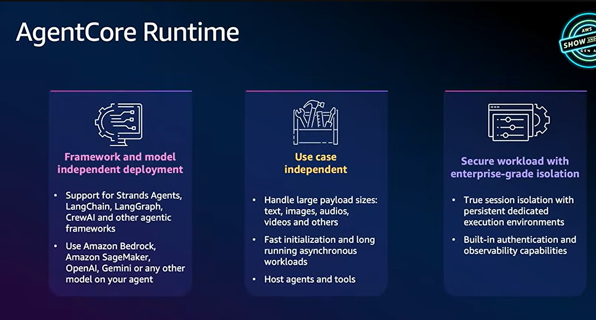
**What to notice** —

- 🧩 **Framework & model independent deployment** — Strands, LangChain, LangGraph, CrewAI; Bedrock, SageMaker, OpenAI, Gemini
- 📦 **Use-case independent** — payloads up to **100 MB** (text, images, audio, video), fast cold starts, **long-running async workloads up to 8 hours** — and ways to go even longer. You can even host tools or MCP servers, not just agents
- 🔒 **Enterprise-grade isolation** — persistent dedicated execution environments, built-in auth and observability

> [!IMPORTANT]
> **Session isolation** is the security headline: each session runs completely independently — no leftover information in memory or filesystem can leak from one customer's session into another's. As agents get more *agency* to act autonomously, this guarantee matters enormously.

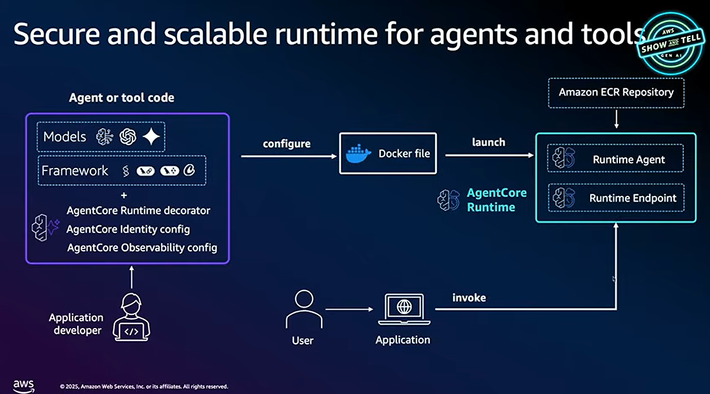
**What to notice** — the full picture of what just happened: your agent + `configure` → **Dockerfile** → `launch` → Docker image → **ECR** → **Runtime Agent** running as a process → a **Runtime Endpoint**. Now `invoke` calls hit a scalable cloud endpoint.

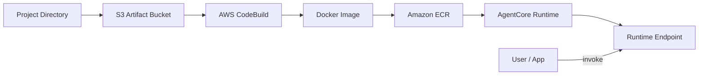
```mermaid
flowchart LR
    Proj["Project Directory"] --> S3["S3 Artifact Bucket"]
    S3 --> CB["AWS CodeBuild"]
    CB --> Img["Docker Image"]
    Img --> ECR["Amazon ECR"]
    ECR --> RT["AgentCore Runtime"]
    RT --> EP["Runtime Endpoint"]
    User["User / App"] -->|invoke| EP
```

```terminal
✅ CodeBuild Deployment Complete
Agent Name:   customersupportdemo
Agent ARN:    arn:aws:bedrock-agentcore:us-east-1:<acct>:runtime/customersupportdemo-XXXX
ECR URI:      <acct>.dkr.ecr.us-east-1.amazonaws.com/customersupportdemo:latest

Next steps:
  agentcore status
  agentcore invoke '{"prompt": "hi"}'

Agent logs:
  aws logs tail /aws/bedrock-agentcore/runtimes/customersupportdemo-XXXX \
      --log-stream-name-prefix "<date>/runtime-logs" --follow
  aws logs tail /aws/bedrock-agentcore/runtimes/customersupportdemo-XXXX \
      --log-stream-name-prefix "<date>/runtime-logs" --since 1h
```

**What to notice** — Agent ARN, ECR image URI, `agentcore status`/`invoke` hints, and the CloudWatch log-tail commands for debugging live invocations.

> [!TIP]
> **Only two commands to remember**: `agentcore configure` and `agentcore launch`. All backend resources — S3 artifacts, CodeBuild, ECR, endpoints — are handled by the SDK.

---

## 2.10 Invoking the Deployed Agent

The CLI is for debugging; production calls the endpoint over HTTPS — exactly what a frontend UI would do. The demo's `test_agent.py`:

The invoke URL is built from the **agent ARN**, and every request carries an `Authorization: Bearer <token>` header (the Cognito JWT) plus a **session ID** header — remember session isolation. `stream=True` + SSE parsing (`data:` lines) means tokens stream back chunk by chunk — wire the same loop into a chat UI:

<GitHubExplorer repo="awslabs/amazon-bedrock-agentcore-samples" ref="main" expanded="true" title="test_agent.py — the production invoke client" files={[
  { "path": "test/test_agent.py", "src": "/bedrock-deepti/code/test_agent.py", "label": "test_agent.py", "highlights": [[9, 11], [13, 17], [24, 26]], "note": "ARN-escaped invoke URL + Bearer JWT + runtime session-id header + SSE stream parsing. Recreated from the demo." }
]} />

Running it kicks off the **OAuth flow** — the script fetches the Cognito discovery URL, spins up a local callback server on `:8080`, and opens the browser:

```terminal
$ python test/test_agent.py customersupportdemo
Fetching Cognito discovery URL…
Starting auth flow — local callback server listening on localhost:8080
Opening browser to sign in…
```

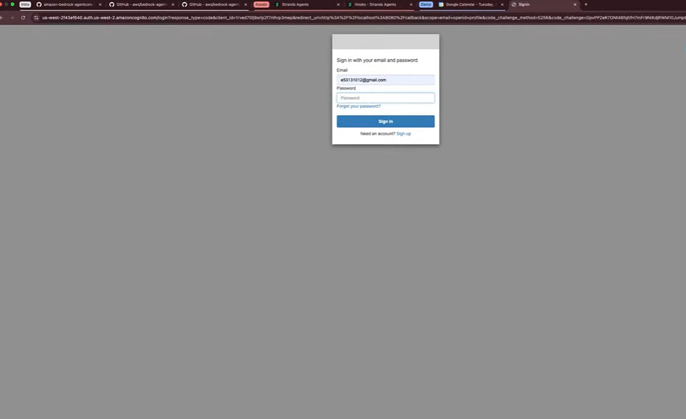
**What to notice** — the Cognito hosted-UI login page. The demo uses a throwaway user; the access token comes back and gets **cached locally**, so subsequent runs skip the browser entirely.

```terminal
Access token acquired and saved.

Connected → customersupportdemo (session: a1b2c3d4-…)

You: hi
Agent: Hello! I'm your Customer Support Agent. I can help with warranty
       questions, device profiles, and more. How can I help you today?

You: What are the warranty support guidelines?
Agent: *invokes retrieve() → Knowledge Base: warranty policies + device manuals*
       Standard warranty: 12 months from date of purchase. Premium tier:
       24 months + accidental damage. Claims require proof of purchase…
```

An interactive session against the deployed agent — the **cloud** endpoint now, not localhost: same code, same KB retrieval, served from **AgentCore Runtime in AWS**, session-isolated and multi-user capable.

> [!NOTE]
> "You've moved well beyond the laptop — deployed in the cloud, multiple users hitting it concurrently, secure and scalable. All the joys and wonders of AgentCore." And it's **two commands**, not a week of infrastructure work.

---

## 2.11 Wiring Gateway — Lambda Functions Become MCP Tools

Agents are only useful with tools. The demo already has two **Lambda functions** reading DynamoDB (a Warranty table, a Customer Profile table). Time to expose them to the agent.

New imports: `MCPClient` + `streamablehttp_client` (any MCP client can connect to a gateway URL), `requires_access_token`, and `get_ssm_parameter` — the gateway URL is fetched from SSM rather than hardcoded. Once the agent gains tools, a **more descriptive system prompt** matters — tell the agent it can query the KB *and* call warranty/customer-profile tools (good prompting = better tool selection). And `requires_access_token` handles the M2M OAuth flow with the Cognito provider, **injecting** the access token you'll pass to the MCP client:

<GitHubExplorer repo="awslabs/amazon-bedrock-agentcore-samples" ref="main" expanded="true" title="main.py — the gateway-wired agent, top half" files={[
  { "path": "main.py", "src": "/bedrock-deepti/code/main_gateway.py", "label": "main.py", "highlights": [[5, 6], [17, 18], [33, 35]], "note": "MCPClient + requires_access_token imports, richer system prompt, M2M token decorator. Recreated from the demo." }
]} />

### Creating the gateway

The target config for a Lambda target: `mcp.lambda.lambdaArn` plus a **`toolSchema`** (name, description, parameters — it's what tells the agent *what the tool does and what it takes*). The `customJWTAuthorizer` auth config (managed by the **Identity** block): `allowedClients` + `discoveryUrl` of the Cognito IdP — MCP is easy to use, but you want to use it **securely**. Then `create_gateway(protocolType="MCP", authorizerType="CUSTOM_JWT")`, `create_gateway_target` with `GATEWAY_IAM_ROLE` outbound creds, and the gateway URL + ID written back to SSM — the parameter the agent reads at startup:

<GitHubExplorer repo="awslabs/amazon-bedrock-agentcore-samples" ref="main" expanded="true" title="Gateway setup — Lambda target config, JWT auth, create + persist" files={[
  { "path": "setup_gateway.py", "src": "/bedrock-deepti/code/gateway_setup_demo.py", "label": "setup_gateway.py", "highlights": [[10, 30], [33, 38], [40, 47]], "note": "toolSchema defines what the agent sees; CUSTOM_JWT + GATEWAY_IAM_ROLE = secure both directions. Recreated from the demo." }
]} />

> [!TIP]
> The **starter toolkit** can do most of this in a line or two — the demo deliberately shows the full SDK path so you see every option available.

### Plugging the gateway into the agent

The `MCPClient` connects to the gateway URL over **streamable HTTP** with the bearer token — `list_tools_sync()` returns the gateway tools, standardized. The full assembled app: `BedrockAgentCoreApp()`, `@requires_access_token` fetching the gateway token, `create_agent(access_token)`, and `@app.entrypoint` passing `session_id` through — then `agentcore launch` again to push the gateway-wired version:

<GitHubExplorer repo="awslabs/amazon-bedrock-agentcore-samples" ref="main" expanded="true" title="main.py — MCPClient to gateway + entrypoint (bottom half)" files={[
  { "path": "main.py", "src": "/bedrock-deepti/code/main_gateway_agent.py", "label": "main.py", "highlights": [[11, 18], [20, 20], [25, 25]], "note": "list_tools_sync() merges gateway tools with local tools; the bearer token flows through create_agent. Recreated from the demo." }
]} />

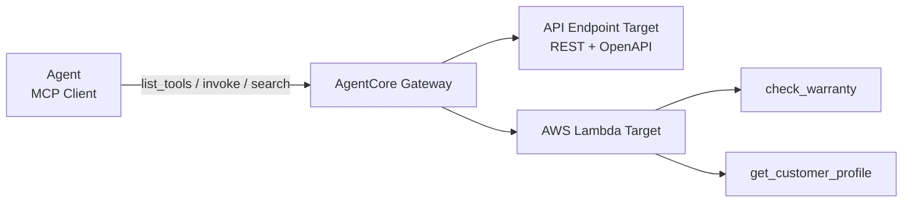
```mermaid
flowchart LR
    Agent["Agent<br/>MCP Client"] -->|"list_tools / invoke / search"| GW["AgentCore Gateway"]
    GW --> APIT["API Endpoint Target<br/>REST + OpenAPI"]
    GW --> LT["AWS Lambda Target"]
    LT --> T1["check_warranty"]
    LT --> T2["get_customer_profile"]
```

---

## 2.12 The Pillars Recap — Gateway, Memory, Identity

While the build runs, Mark zooms out on the three blocks you're wiring — what each does and why it's a *pillar*, not a feature.

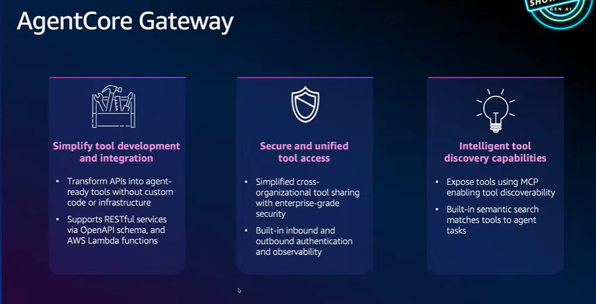
**What to notice** — 🧰 **Simplify tool development** (transform existing APIs into agent-ready tools, no custom code — REST via OpenAPI, or Lambda), 🔐 **Secure & unified access** (cross-org tool sharing, inbound+outbound auth), 🔍 **Intelligent discovery** (tools over MCP + semantic search).

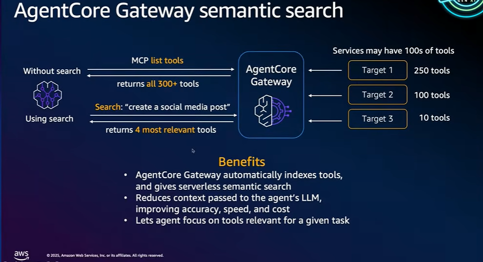
**What to notice** — the freebie: without search, a big gateway returns *hundreds* of tools — expensive, slow, accuracy-killing. Built-in semantic search narrows *"create a social media post"* to just the relevant few. And to a chat question: **yes — an API Gateway + Lambda microservice can absolutely become a gateway target**; REST services expose as MCP tools too.

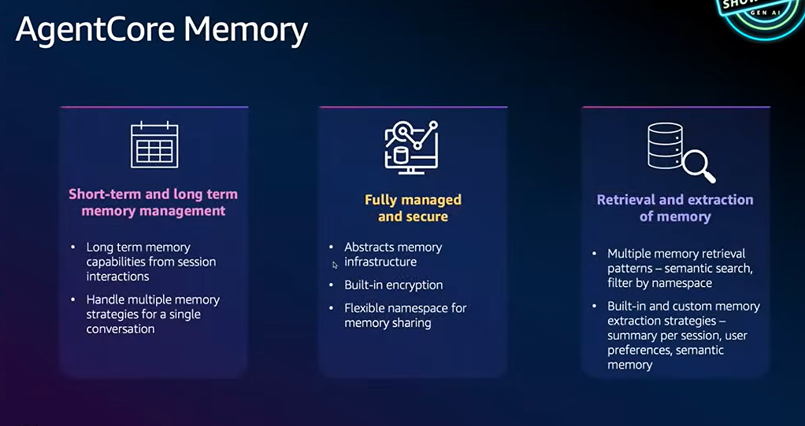
**What to notice** — 🧠 **Short-term + long-term memory management** (session events now, extracted knowledge later), 🔒 **Fully managed & secure**, 🔎 **Retrieval & extraction** (semantic search, keyword, namespace, raw event listing).

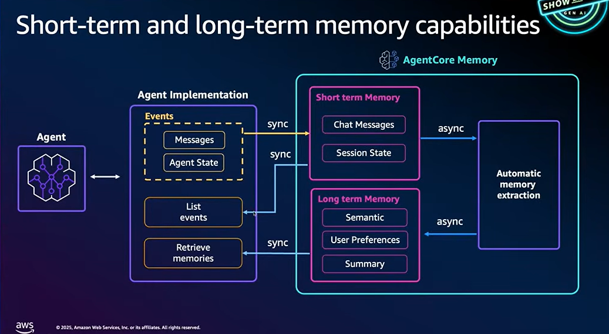
**What to notice** — agent events are posted **synchronously** to short-term memory (chat messages + session state); in the background, **asynchronous extraction** produces the long-term store: semantic memories, user preferences, conversation summaries. The agent reads it back via semantic search — same trick as gateway search.

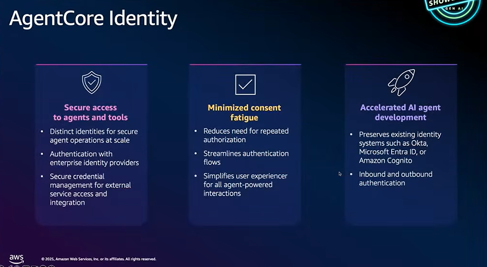
**What to notice** — 🔐 **Secure access** (agent→AWS resources and third-party services), 🤝 **Minimized consent fatigue** (token management handled for you), ⚡ **Accelerated development** — works with Cognito today, Okta/Entra ID and other IdPs too.

---

## 2.13 Gateway Live — Update Tools Without Redeploying

The agent code, fully assembled:

The finished `main.py` — imports for `requires_access_token` + `streamablehttp_client`, the `KNOWLEDGE_BASE_ID` env var, the SSM-fetched gateway URL, and the app/entrypoint structure. Same agent — now gateway-connected:

<GitHubExplorer repo="awslabs/amazon-bedrock-agentcore-samples" ref="main" expanded="true" title="main.py — the complete gateway-wired application" files={[
  { "path": "main.py", "src": "/bedrock-deepti/code/main_gateway.py", "label": "main.py — top", "highlights": [[17, 18], [33, 35]], "note": "Config + prompt + token acquisition. Recreated from the demo." },
  { "path": "main.py", "src": "/bedrock-deepti/code/main_gateway_agent.py", "label": "main.py — agent + app", "highlights": [[11, 20], [25, 35]], "note": "MCPClient → gateway → tools merged into the agent; entrypoint streams. Recreated from the demo." }
]} />

Two answers in one session — the first proves Gateway works, the second is an honest miss:

```terminal
You: What is my warranty status?
Agent: *calls check_warranty → Lambda → DynamoDB warranty table*
       Your device warranty expired 254 days ago.

You: get customer profile
Agent: I'm sorry, I don't have access to a customer profile tool.
```

Then the killer moment — EK **updated the existing gateway target** to add `get_customer_profile`, re-asked with *the same deployed agent*, and got the full profile back:

```terminal
You: get customer profile
Agent: *calls get_customer_profile → Lambda → DynamoDB*
       Customer CUST001 — John Smith, Premium tier.
       Devices: Gaming Console Pro, SmartWatch X2.
       Premium support entitlements active.
```

**New tool, zero agent code changes, zero redeploy.**

> [!IMPORTANT]
> **Loose coupling is the enterprise story**: before Gateway, tools lived inside agent code — adding one meant editing and redeploying the agent. Now tools live in a shared gateway that dozens of teams can maintain and reuse independently. Same idea as API management, now for agents.

---

## 2.14 Memory — Wiring the Hook

Tools + runtime make an agent useful; **memory makes it powerful**. EK pre-created an AgentCore memory and shows the wiring:

The import block gains the memory client and a custom **`memory_hook_provider`** — hooks are a **Strands** concept: extension points on agent events where you attach behavior. `on_agent_initialized` calls `get_last_k_turns` (k=5) for this **actor + session** and injects preferences/facts into `system_prompt` — the agent never starts cold; `on_message_added` persists every message to short-term memory (long-term extraction runs asynchronously). And this is where **`actor_id`** appears — `payload["actor_id"]` + `context.session_id` build the `MemoryHook`; long-term memories are **namespaced per actor**, so your preferences never bleed into another user's:

<GitHubExplorer repo="awslabs/amazon-bedrock-agentcore-samples" ref="main" expanded="true" title="Memory wiring — the hook provider + the entrypoint" files={[
  { "path": "memory_hook_provider.py", "src": "/bedrock-deepti/code/memory_hook_provider.py", "label": "memory_hook_provider.py", "highlights": [[22, 35], [37, 46]], "note": "on_agent_initialized injects past context into the system prompt; on_message_added writes every message to STM." },
  { "path": "main.py", "src": "/bedrock-deepti/code/main_memory.py", "label": "main.py — memory version", "highlights": [[31, 38], [40, 44]], "note": "actor_id from payload + session_id from context → MemoryHook → hooks=[memory_hook]. Recreated from the demo." }
]} />

Then the same command redeploys the memory-enabled version through the same CodeBuild pipeline:

```terminal
$ agentcore launch
✅ CodeBuild Deployment Complete
Agent ARN: arn:aws:bedrock-agentcore:us-east-1:<acct>:runtime/customersupportdemo-XXXX
```

> [!NOTE]
> **Not a Strands user?** LangGraph and CrewAI expose equivalent hooks/middleware — same idea: on agent start, inject memories; on each message, save events. Memory is framework-agnostic.

---

## 2.15 Identity — Reaching Third-Party Services

Internal tools aren't enough — great agents also reach **Google Drive/Calendar/Gmail, Salesforce, Jira**. Identity brokers that access **securely, with user consent**. The demo couldn't fit the full Google run but shows the exact code:

Two files make it happen. `google_credentials_provider.py` uses `boto3.client("bedrock-agentcore-control")` — credential providers are an **Identity**-managed resource — to create an OAuth2 provider with `credentialProviderVendor="GoogleOauth2"` and your Google **client ID + secret** (one-time setup; Identity holds the secrets), and stores the provider name in SSM. `tools/google.py` uses the same `@requires_access_token` decorator — this time with `auth_flow="USER_FEDERATION"` and `force_authentication=True` — so the token returned is *this user's* Google credential; then it's standard `Credentials` + `build("calendar", "v3")` client code:

<GitHubExplorer repo="awslabs/amazon-bedrock-agentcore-samples" ref="main" expanded="true" title="Identity — the Google credential provider + calendar tools" files={[
  { "path": "google_credentials_provider.py", "src": "/bedrock-deepti/code/google_credentials_provider.py", "label": "google_credentials_provider.py", "highlights": [[7, 7], [26, 37]], "note": "create_oauth2_credential_provider holds YOUR Google app secrets; provider name persists to SSM." },
  { "path": "tools/google.py", "src": "/bedrock-deepti/code/tools_google.py", "label": "tools/google.py", "highlights": [[10, 10], [23, 30], [35, 36]], "note": "USER_FEDERATION + on_auth_url: consent URL surfaces to the user, per-user token flows into the Google client. Recreated from the demo." }
]} />

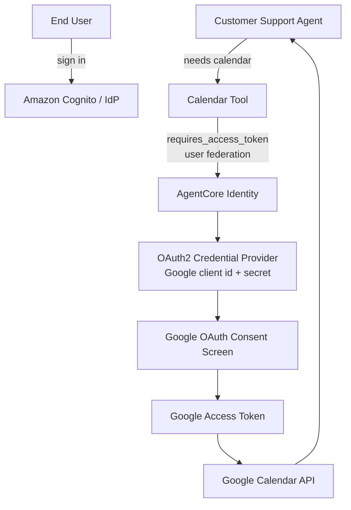
```mermaid
flowchart TD
    User["End User"] -->|sign in| Cognito["Amazon Cognito / IdP"]
    Agent["Customer Support Agent"] -->|needs calendar| Tool["Calendar Tool"]
    Tool -->|"requires_access_token<br/>user federation"| IDP["AgentCore Identity"]
    IDP --> Cred["OAuth2 Credential Provider<br/>Google client id + secret"]
    Cred --> Consent["Google OAuth Consent Screen"]
    Consent --> Token["Google Access Token"]
    Token --> GCal["Google Calendar API"]
    GCal --> Agent
```

> [!IMPORTANT]
> **Consent is explicit**: the end user sees the Google authorization URL and approves the exact scopes. If *you* run the agent it sees *your* calendar; the customer sees theirs. Agents need third-party data to be truly useful — Identity makes that access secure and per-user.

---

## 2.16 Launch + The Long-Term Memory Proof

The memory + gateway + identity version launches successfully:

```terminal
$ agentcore launch
✅ CodeBuild Deployment Complete (arm64)
Agent Name: customersupportdemo
Agent ARN:  arn:aws:bedrock-agentcore:us-east-1:<acct>:runtime/customersupportdemo-XXXX
ECR URI:    <acct>.dkr.ecr.us-east-1.amazonaws.com/customersupportdemo:latest

Next steps: agentcore status / agentcore invoke '{"prompt": "hi"}'
Agent logs: /aws/bedrock-agentcore/runtimes/customersupportdemo-XXXX
```

Then the payoff — a **brand-new session ID**. Earlier, in a different session, the user taught the agent *"my favorite device is Gaming Console Pro"*:

```terminal
You: What is my favorite device?
Agent: Your favorite device is the Gaming Console Pro.
```

The `on_agent_initialized` hook pulled the preference from **long-term memory** — a few lines of hook code → a hyper-personalized agent that remembers across sessions.

> [!TIP]
> **The UX win**: nobody wants to re-explain their problem to a chatbot every session. And EK's note — before AgentCore Memory existed, "we had to do a lot of coding to keep track of all these moving parts." Now it's a managed service.

---

## 2.17 Identity in Action — Google Calendar, Live

The full third-party flow, running in a Streamlit front end against the deployed agent:

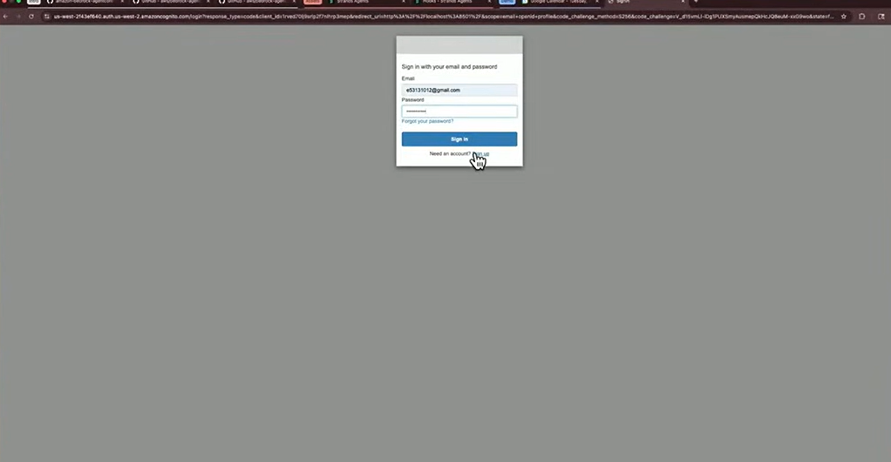
**What to notice** — same Cognito hosted-UI sign-in as before — now gating the Streamlit app.

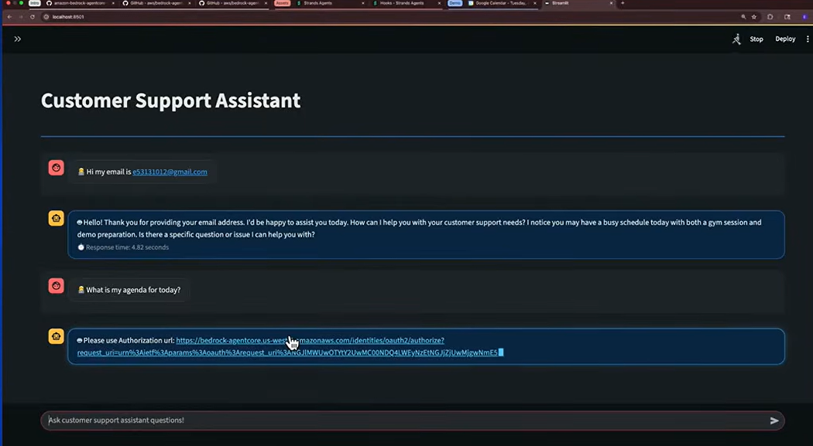
**What to notice** — *"Hi, my email is…"* → instant greeting (~4.8s). Then *"What is my agenda for today?"* → the agent surfaces an **authorization URL** — it's invoking the calendar tool, which needs the user's Google consent.

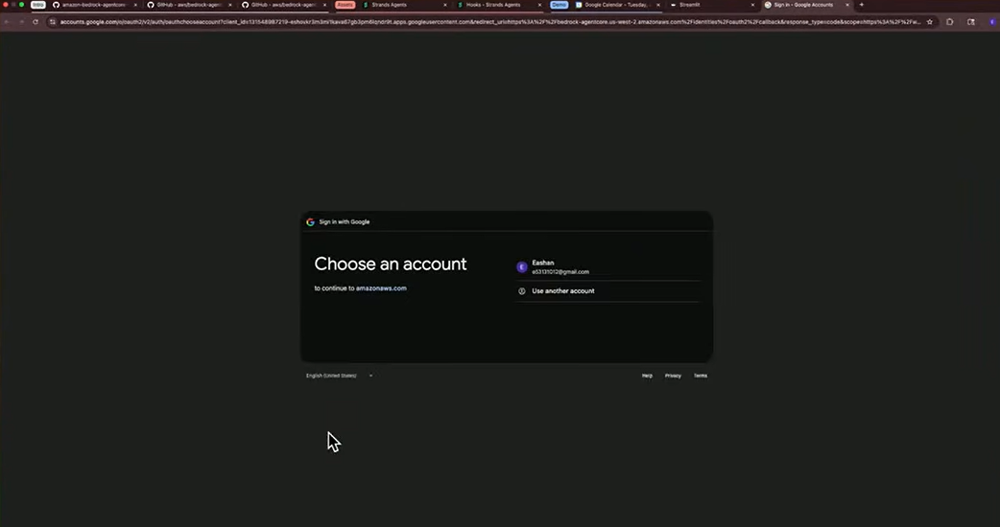
**What to notice** — the standard Google OAuth account picker. In production you'd redirect the user straight to this URL; the demo shows it explicitly so you see the consent step.

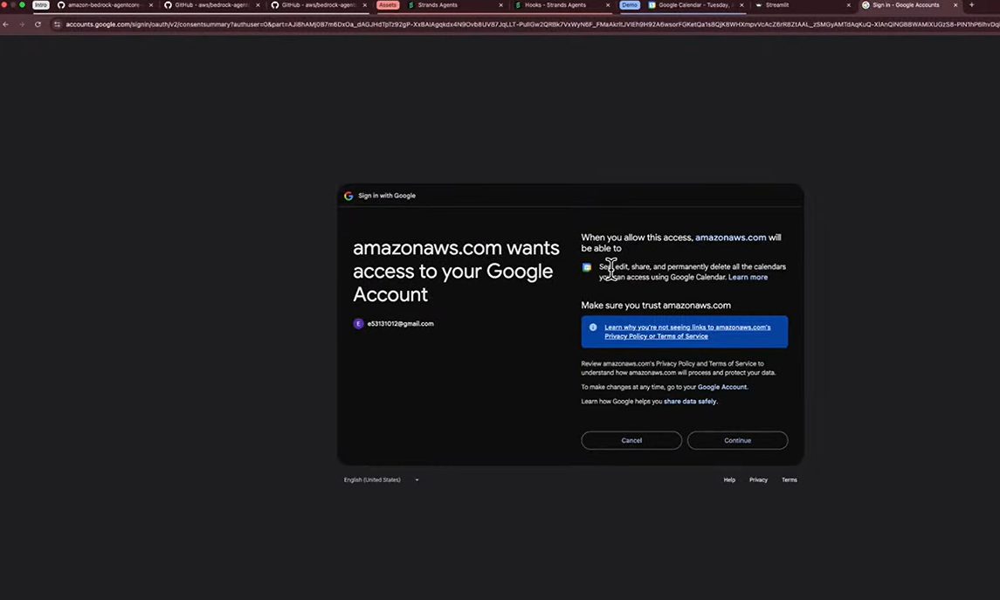
**What to notice** — the consent page lists exactly what the agent is asking for (see/edit/share calendars). Transparent, revocable, per-user — that's the point.

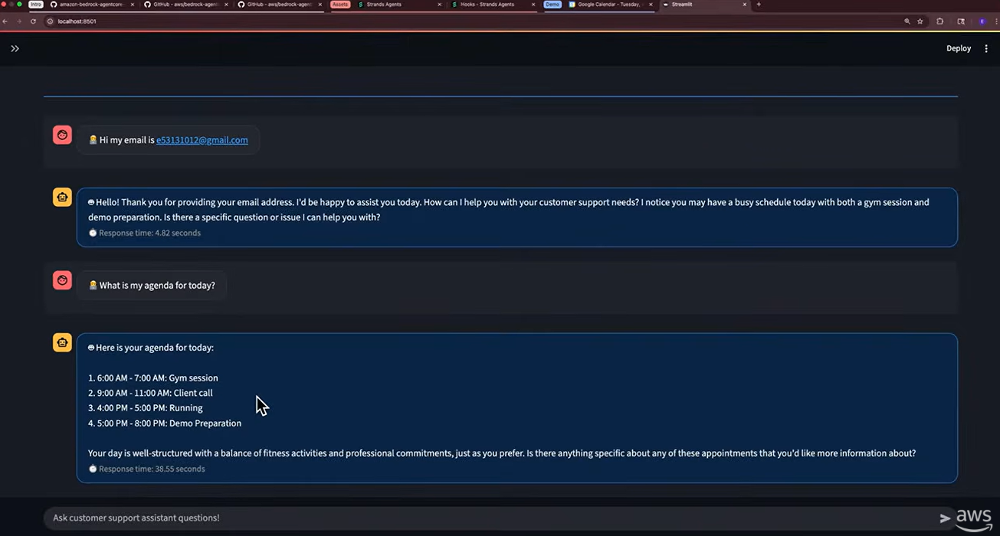
**What to notice** — authorization successful → the agent reads the live calendar: **Gym 6–7, Client call 9–11, Running 4–5, Demo prep 5–8**. The agent answered with real third-party data via an Identity-brokered token.

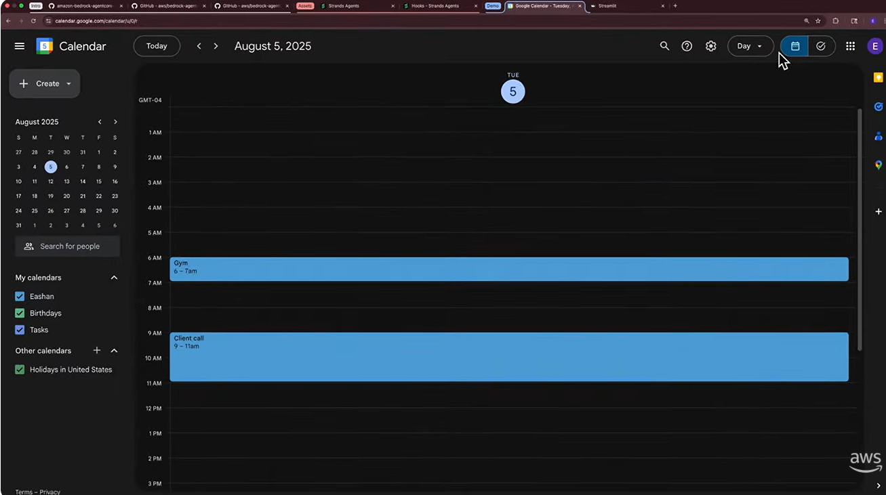
**What to notice** — *"I'm not cheating here"* — the actual Google Calendar shows the same Gym and Client call entries the agent returned.

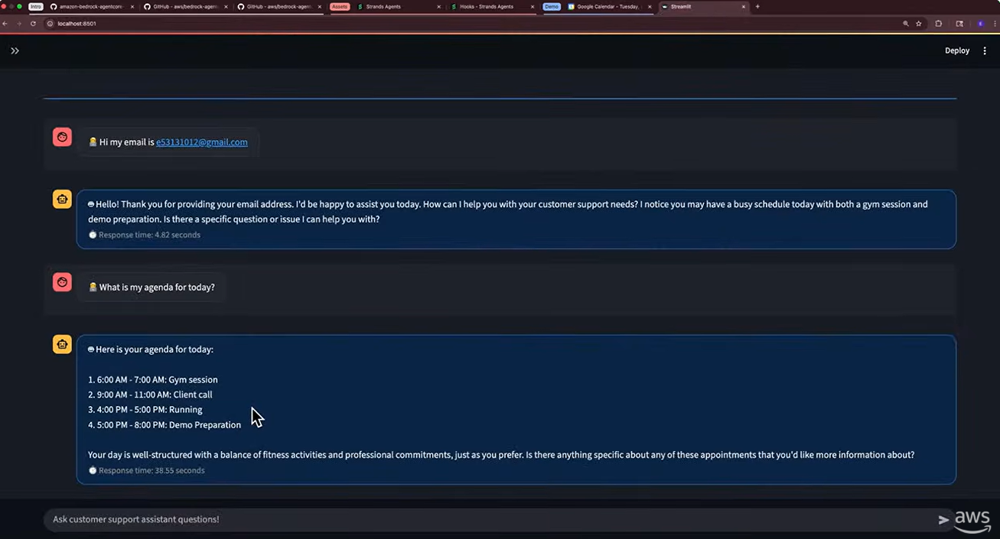
**What to notice** — the full agenda once more in Streamlit. Total added code: one credential provider + one decorated tool. That's the Identity pillar paying off.

---

## 2.18 Observability — "What Is My Agent Actually Doing?"

The #1 pre-AgentCore complaint: agents were black boxes. The fix is live today — the **GenAI Observability dashboard in CloudWatch**, under *Bedrock AgentCore*:

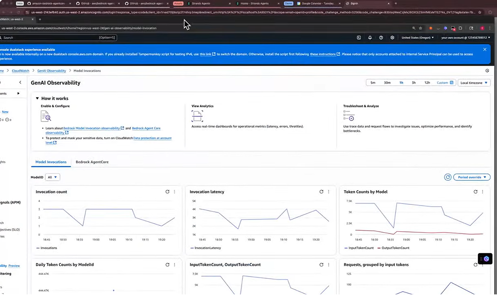
**What to notice** — CloudWatch → GenAI Observability → **Bedrock AgentCore** tab: *Enable & Configure*, *View Analytics*, *Troubleshoot & Analyze* — plus the Agents/Sessions/Traces views.

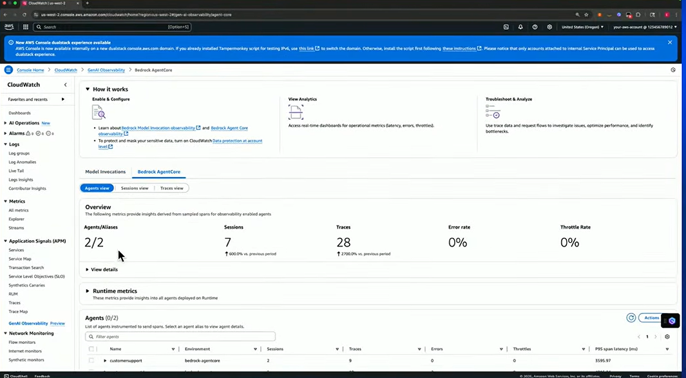
**What to notice** — the fleet overview: **2/2 agents**, **7 sessions**, **28 traces**, **0% error rate**, **0% throttle** — plus a runtime-metrics section per agent.

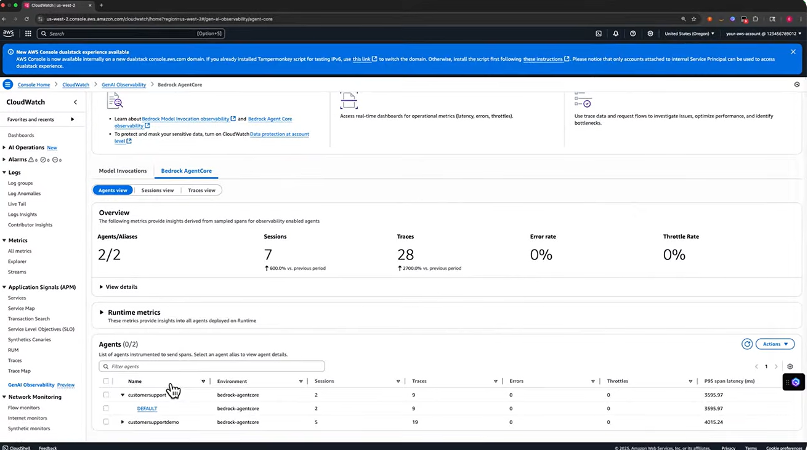
**What to notice** — each agent/alias row: sessions, traces, errors, throttles, P95 span latency. `customersupportdemo` — the agent from this chapter — shows **5 sessions / 19 traces**.

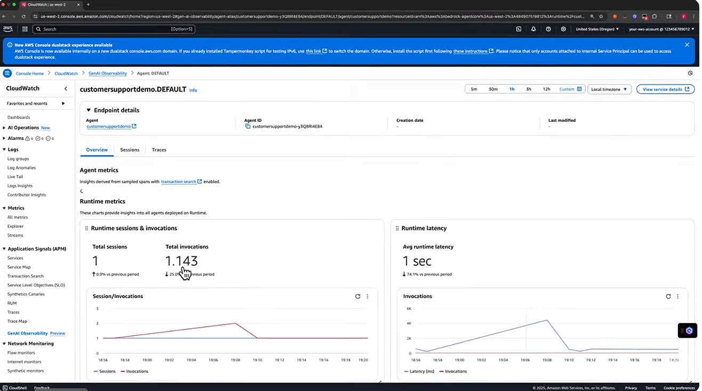
**What to notice** — drilling into `customersupportdemo.DEFAULT`: runtime sessions & invocations over time, **avg runtime latency ~1s** — the operational numbers you'd graph for any service.

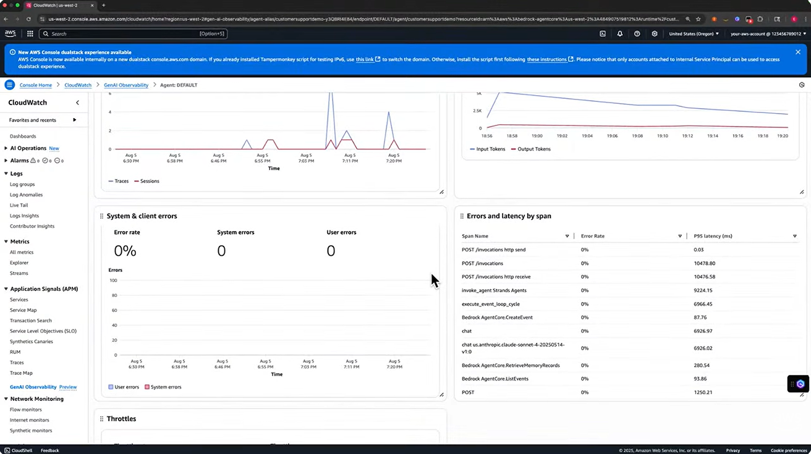
**What to notice** — the span table is the gold: `invoke_agent Strands Agents`, `execute_event_loop_cycle`, `Bedrock AgentCore.CreateEvent` (memory writes!), `chat us.anthropic.claude-sonnet`, `RetrieveMemoryRecords`, `ListEvents` — every internal step with its own error rate and P95 latency.

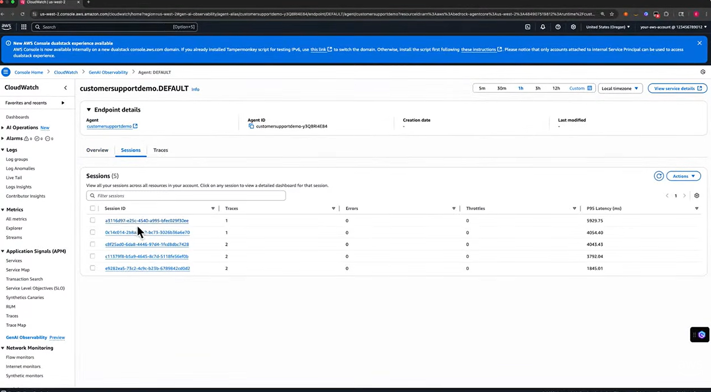
**What to notice** — the Sessions tab lists all 5 session IDs with traces/errors/throttles/P95 — each conversation is its own auditable unit.

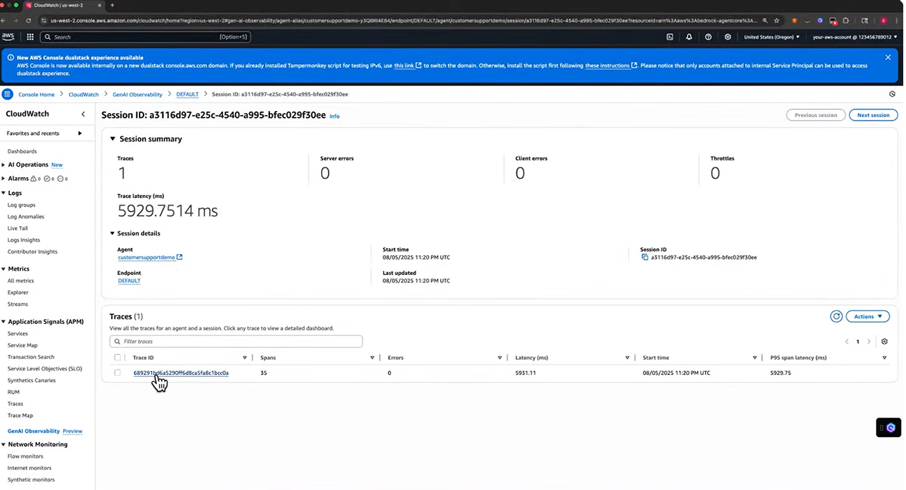
**What to notice** — one session → its trace list. The trace here has **35 spans** at ~5.9s total — every step of that single request.

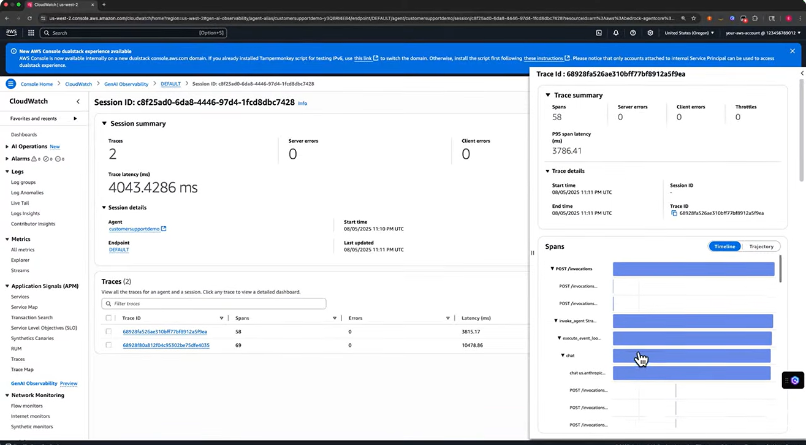
**What to notice** — opening the trace shows the **timeline of spans**: `POST /invocations` → `invoke_agent (Strands)` → `execute_event_loop` → `chat` (the Anthropic model call) → tool calls. This is the trajectory — which path the agent took, which model it called, which tools it used.

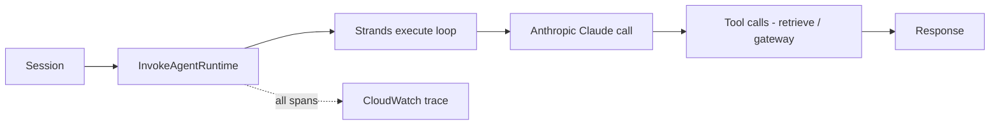
```mermaid
flowchart LR
    S["Session"] --> I["InvokeAgentRuntime"]
    I --> L["Strands execute loop"]
    L --> M["Anthropic Claude call"]
    M --> T["Tool calls - retrieve / gateway"]
    T --> R["Response"]
    I -.->|all spans| CW["CloudWatch trace"]
```

> [!TIP]
> **Trusted agents = observable agents.** Autonomous is fine — as long as it's secure, under control and auditable. This dashboard is exactly what made "trust" real in the episode.

---

## 2.19 The Complete Picture

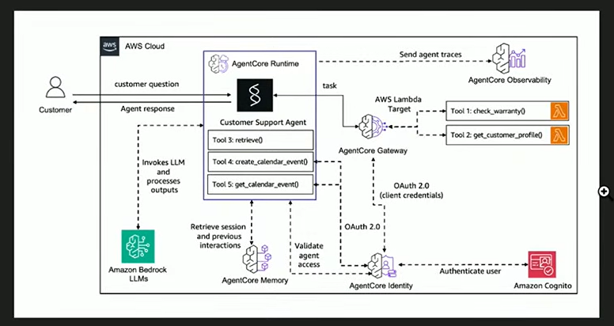
**What to notice** — the whole system, one slide: customer → Cognito-authenticated **Runtime** → the agent with its local tools (`retrieve`, calendar tools) → **Gateway** to the Lambda targets → **Memory** for session + long-term context → **Identity** validating access and brokering OAuth → **Observability** collecting every trace.

| Layer | Service | Role in the demo |
| :--- | :--- | :--- |
| Hosting | **Runtime** | Session-isolated endpoint; configure→launch→invoke |
| Tools (managed) | **Gateway** | Lambda targets → MCP; semantic search; update without redeploy |
| Tools (built-in) | **Browser / Code Interpreter** | Managed tools — not shown live, same pattern |
| Trust | **Identity** | Cognito inbound auth + OAuth brokers (Google) |
| Context | **Memory** | STM events + LTM preferences, namespaced by actor_id |
| Visibility | **Observability** | Sessions, traces, spans, latency in CloudWatch |

> [!NOTE]
> **"Don't try this at home — do what we showed you."** Everything in this chapter — deployment, isolation, OAuth, memory, observability — is a ton of heavy lifting to build yourself. AgentCore hands it to you composable: take the blocks you need. And if you already run Bedrock Agents, the new **import capability** can generate Strands + AgentCore code automatically.

### 💻 Follow Along — Repos from the Episode

- 🧩 **Samples** — [github.com/awslabs/amazon-bedrock-agentcore-samples](https://github.com/awslabs/amazon-bedrock-agentcore-samples) — includes the complete Customer Support Assistant
- ⚙️ **Starter Toolkit** — [github.com/aws/bedrock-agentcore-starter-toolkit](https://github.com/aws/bedrock-agentcore-starter-toolkit) — the `agentcore` CLI
- 📦 **Strands SDK** — [github.com/strands-agents/sdk-python](https://github.com/strands-agents/sdk-python)
- 🔐 **AgentCore SDK** — open source; `BedrockAgentCoreApp`, `requires_access_token`, memory hooks

---

## 🧠 Knowledge Check

<Quiz question="What makes AgentCore Runtime production-grade vs running an agent on your laptop?" options={["It rewrites your agent for a proprietary framework","Session-isolated execution environments, fast cold starts, 100MB payloads, and runs up to 8 hours — with any framework/model","It only supports Strands agents","It removes the need for any IAM configuration"]} answerIndex={1} explanation="Runtime hosts agents in dedicated per-session environments — no information leaks between users — and supports any framework, any model, large payloads and long-running work." />

<Quiz question="After agentcore configure + launch, what is the correct production invoke path?" options={["agentcore invoke --local","SSH into the runtime and run the agent manually","POST to the runtime endpoint with a Cognito Bearer token + session ID header","Create an API Gateway in front of the runtime"]} answerIndex={2} explanation="The deployed agent is invoked over HTTPS with the Cognito JWT and a session-ID header — that's what a frontend UI uses. The CLI exists for debugging." />

<Quiz question="In the demo, get_customer_profile was added to the gateway target and the agent used it immediately. Why did that work without redeploying?" options={["The agent polls for new tools every minute","Gateway is loosely coupled — tools live in the gateway, not the agent; updating the target changes what the gateway exposes via MCP","The agent was restarted automatically","Lambda hot-reloaded the function"]} answerIndex={1} explanation="Tools live behind the gateway's MCP endpoint, not inside agent code. Add/update a target and any MCP-connected agent sees the new tool set — teams ship tools independently of agent releases." />

<Quiz question="Why does long-term memory need an actor_id rather than just a session_id?" options={["actor_id encrypts the memory store","Sessions are per-conversation; memories are namespaced per user so preferences/facts persist across all of a user's sessions","actor_id is required by MCP","It only matters for multi-agent systems"]} answerIndex={1} explanation="Sessions come and go; the actor is the person. LTM keyed by actor means 'favorite device' learned in session 1 is available in session 57 — and never leaks to another user." />

<Quiz question="How does the calendar tool get the user's Google credentials?" options={["The user pastes their Google password into the chat","requires_access_token with USER_FEDERATION — Identity brokers OAuth2 consent and injects the user's Google token","The agent uses a shared service-account token for all users","Cognito directly issues Google tokens"]} answerIndex={1} explanation="The OAuth2 credential provider (Google client id+secret) + USER_FEDERATION flow produces a per-user token after explicit consent. Each user grants access to their own calendar." />

<Quiz question="The GenAI Observability dashboard showed 19 traces for the demo agent. What does opening one trace reveal?" options={["The agent's source code","The agent's trajectory — invocations → Strands loop → model calls → tool calls, with per-span latency and errors","Only token counts","The CloudFormation template that deployed it"]} answerIndex={1} explanation="Traces decompose into spans — POST /invocations, invoke_agent, execute_event_loop_cycle, chat (model call), memory events — showing exactly which path each request took." />

---

## 🔧 Common Issues You Might Hit

### Agent can't see a new tool
The tool was added to the Gateway target but the agent still says "I don't have access". Confirm the MCP client connection is established before `list_tools_sync()`, and that the bearer token is still valid — expired tokens silently return empty tool lists.

### Authentication failed when invoking
The runtime was configured with Cognito authorization — invoke calls must carry a valid `Authorization: Bearer <jwt>` header plus the session-ID header. Check the discovery URL, client ID and audience from `agentcore configure`.

### Memory returns nothing in a new session
Long-term extraction is **asynchronous** — a brand-new session may precede extraction completing. Also verify `actor_id` matches the earlier session; memories are namespaced per actor, not per session.

### Launch succeeds but the endpoint times out
Tail the runtime's CloudWatch log group (`aws logs tail … --follow`) — `requirements.txt` issues and missing IAM permissions on the execution role are the usual suspects.

---

## 🔬 End-to-End Path — Rebuild the Assistant Yourself

**Objective**: the demo's journey end-to-end — local Strands agent → Runtime → Gateway tools → Memory → Identity → Observability.

**Prerequisites**: AWS account + credentials, starter toolkit installed, a Bedrock Knowledge Base with warranty docs, two Lambda functions (`check_warranty`, `get_customer_profile`) reading DynamoDB, a Cognito user pool.

1. **Local agent** — `main.py` with `current_time` + `retrieve`, `KNOWLEDGE_BASE_ID` env var; ask the warranty question.
2. **AgentCore-ify** — `BedrockAgentCoreApp` + `@app.entrypoint` invoke, stream events back.
3. **Configure & launch** — `agentcore configure` → `agentcore launch -l` (local smoke test) → `agentcore launch` (S3 → CodeBuild → ECR → endpoint).
4. **Invoke** — Cognito token + session ID header, POST to the invocations URL.
5. **Gateway** — create gateway (CUSTOM_JWT auth), add Lambda target + toolSchema, connect via MCPClient, ask *"What is my warranty status?"* Then add `get_customer_profile` to the target — **no redeploy**.
6. **Memory** — wire `MemoryHook` with `actor_id` + `session_id`; teach a preference in session 1, recall it in session 2.
7. **Identity** — Google OAuth2 credential provider + `@requires_access_token` (USER_FEDERATION); run consent once; ask *"What is my agenda?"*
8. **Observe** — CloudWatch → GenAI Observability → Bedrock AgentCore: sessions, traces, spans, latency.

### ✅ Verification Checklist

- Local agent answers warranty questions via the Knowledge Base
- `agentcore launch` completes and the endpoint streams responses
- `check_warranty` and `get_customer_profile` work — the second added **without redeploying**
- A new session recalls the user's favorite device via long-term memory
- Google agenda returned after OAuth consent
- CloudWatch shows sessions, traces and metrics for the agent

---

## 🏆 Chapter 2 Summary

- **The production gap**: prototypes are easy; security, scale, interoperability, payloads, long runs and observability are the hard parts. AgentCore removes that undifferentiated heavy lifting.
- **Runtime**: any framework, any model — session isolation, 100MB payloads, 8-hour runs. Two commands: `configure`, `launch` (with `-l` for local debugging).
- **Gateway**: existing APIs/Lambdas → MCP tools with OAuth and built-in semantic search. Update tools without touching agent code.
- **Memory**: STM events + LTM preferences/facts/summaries, namespaced by Actor ID, retrieved semantically; wired via Strands hooks.
- **Identity**: Cognito inbound auth + OAuth credential providers broker third-party access with explicit per-user consent.
- **Observability**: CloudWatch GenAI dashboard — sessions, traces, spans, tokens, errors, latency. Trusted agents are observable agents.

### Watch the Original Episode

<VideoSection youtubeId="wzIQDPFQx30" title="AWS Show & Tell — Building your first production-ready AI agent with Amazon Bedrock AgentCore" />
