# AWS Bedrock Course — Chapter 3

*Build intelligent AI applications with models, tools, MCP, and multi-agent collaboration using Strands Agents.*

# 🤖 Building Agentic AI Applications with Strands Agents & MCP

## 🎯 Learning Objectives

By the end of this chapter, the learner will be able to:

- Explain **what Strands Agents is** and why a model-first SDK matters
- Describe the **basic architecture of a Strands agent** — model, tools, and agent state
- **Configure an AI model** from Amazon Bedrock or another model provider
- Give an agent abilities with **built-in tools** and **custom tools**
- Connect an agent to **MCP servers** for standardized external tools
- Explain how **agent state** is managed across tool calls, sequentially and in parallel
- Build a **multi-agent application** using the agents-as-tools pattern
- Describe **swarm, network, graph, and workflow** multi-agent patterns
- Assemble a **personal assistant** that coordinates specialized sub-agents
- Connect Strands agents to **AWS services** such as Bedrock Knowledge Bases, Lambda and DynamoDB
- Choose between **deployment options** — Lambda, Fargate, EC2, ECS and beyond
- Use **observability and OpenTelemetry** to see what an agent is doing

---

## 3.1 🤔 What is an Agentic AI Application?

In Chapter 1 we learned that an agent is, at its core, **a piece of code with an LLM inside**. The code orchestrates the work — the model gives it the ability to understand language and reason.

But a model alone can only *think and talk*. To build a real **agentic AI application**, the agent needs three things working together:

- **A model** — the brain. It reads the request, reasons about it, and decides what to do next.
- **Tools** — the hands. Functions the agent can call to *act* on the outside world: read a calendar, run code, search the web, call an API.
- **A loop** — the decision cycle. The agent calls a tool, inspects the result, reasons again, and keeps going until the task is done.

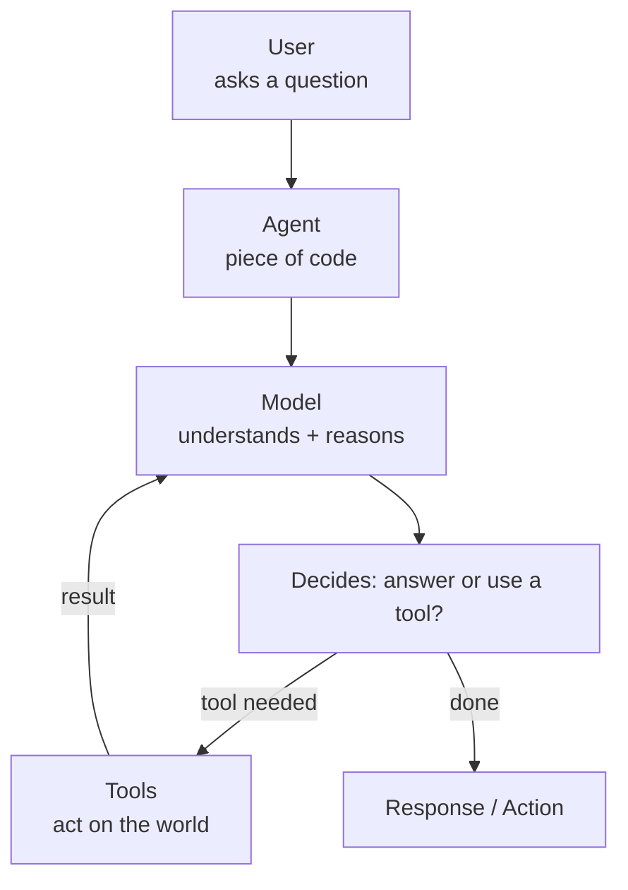
```mermaid
flowchart TD
    User["User<br/>asks a question"] --> Agent["Agent<br/>piece of code"]
    Agent --> Model["Model<br/>understands + reasons"]
    Model --> Decision["Decides: answer or use a tool?"]
    Decision -->|tool needed| Tools["Tools<br/>act on the world"]
    Tools -->|result| Model
    Decision -->|done| Response["Response / Action"]
```

That loop is what separates an *agentic* application from a simple chatbot. A workflow calls tools in a fixed order; an **agent decides for itself** which tool to call, when, and when to stop.

> **Tip**: When you design an agent, you are really answering three questions: *which model does the thinking, which tools can it use, and what instructions guide its behavior?*

---

## 3.2 🧵 What is Strands Agents?

**Strands Agents** is an **open-source SDK** for building AI agents in **just a few lines of code**. It takes a **model-driven approach**: instead of hand-writing orchestration logic and prompt templates, you give the model a role (a system prompt) and a toolbox — and let the model's own reasoning drive the loop.

The name comes from a simple idea: like the twin strands of DNA, an agent is built from **two things — a model and its tools**. Everything else in the SDK exists to connect those two cleanly.

- **Open source** — free to use, inspect and contribute to on GitHub
- **Python** — the SDK is Python-first
- **Model-driven** — leans on modern models that are already fine-tuned for reasoning and tool use, instead of heavy prompt templates
- **Born in production** — originally built to help Amazon's own teams ship agentic products faster, then released publicly

### Where Strands Fits

AWS offers a spectrum of options for building agents — pick the one that matches how much control you want:

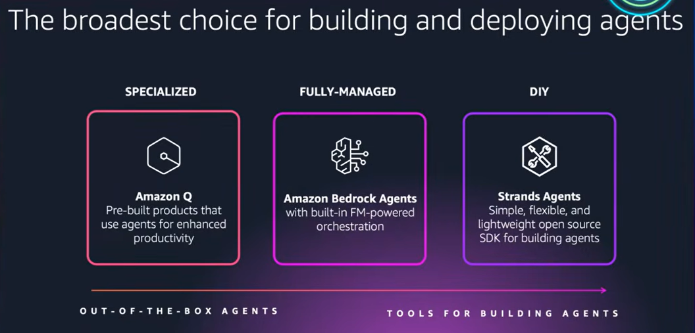
*From fully-managed to fully-flexible: Strands Agents is the DIY, open-source end of the spectrum.*

- **Specialized / pre-built** — products like Amazon Q, where agents are already built into the product for you
- **Fully managed** — Amazon Bedrock Agents: managed hosting and an opinionated setup, agents run in the cloud
- **DIY / open source** — **Strands Agents**: a lightweight SDK that runs locally out of the box and deploys anywhere you choose

> **Note**: Strands Agents and Bedrock Agents are **complementary**, not competitors. If you want a fully-managed, opinionated experience, use Bedrock Agents. If you want open-source flexibility — change any function, choose your own deployment — use Strands.

### What the SDK Gives You

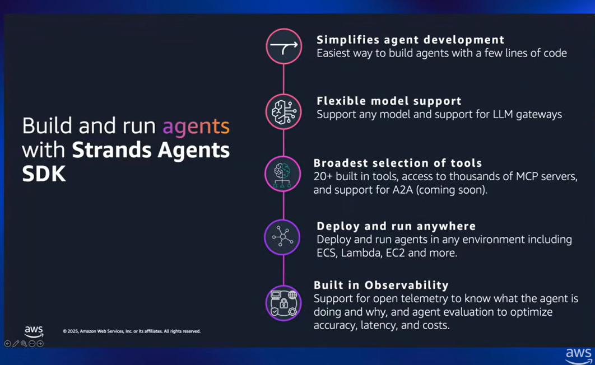
*The five pillars of Strands Agents.*

1. **Simplifies agent development** — a working agent in a few lines of code
2. **Flexible model support** — virtually any model, plus support for LLM gateways
3. **Broadest selection of tools** — 20+ built-in tools, plus access to thousands of MCP servers
4. **Deploy and run anywhere** — ECS, Lambda, EC2, on-premises, or outside AWS entirely
5. **Built-in observability** — OpenTelemetry support to see what the agent is doing and why

### Proven in Production

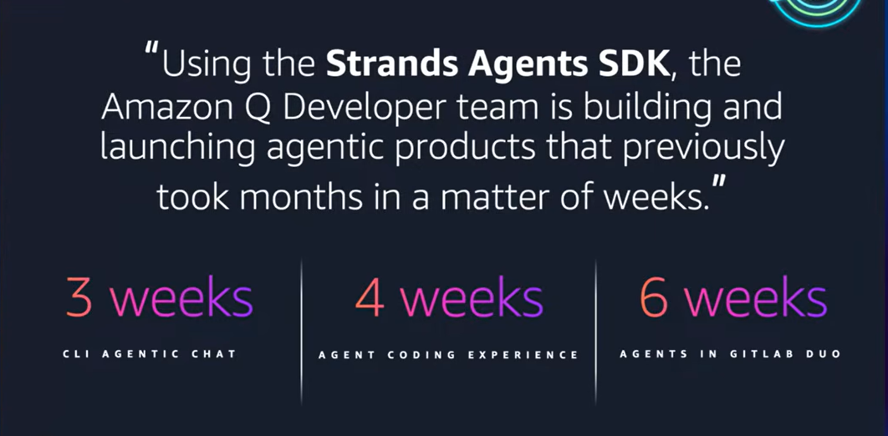
*Teams that adopt a model-driven SDK ship agentic features dramatically faster.*

Teams using Strands Agents have shipped agentic products that previously took **months** in a matter of **weeks** — a CLI agentic chat in about 3 weeks, an agentic coding experience in about 4 weeks, and agents inside a large DevOps platform in about 6 weeks. The speed comes from one thing: **the model does the orchestration, so you write far less plumbing.**

### Strands Agent Architecture

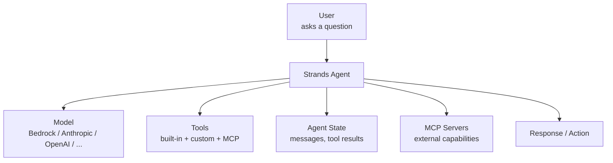
```mermaid
flowchart TD
    User["User<br/>asks a question"] --> Agent["Strands Agent"]
    Agent --> Model["Model<br/>Bedrock / Anthropic / OpenAI / ..."]
    Agent --> Tools["Tools<br/>built-in + custom + MCP"]
    Agent --> State["Agent State<br/>messages, tool results"]
    Agent --> MCP["MCP Servers<br/>external capabilities"]
    Agent --> Response["Response / Action"]
```

---

## 3.3 🧠 Model Choice — Any Model, Any Provider

A Strands agent is **not locked to one model provider**. There is no single model that rules them all — real applications make trade-offs between capability, cost, latency and tool-use behavior, so the SDK lets you plug in whatever fits.

- **Amazon Bedrock** — the default choice; easy to configure and scales nicely
- **Anthropic** — connect to Claude models directly
- **OpenAI** — GPT-family models
- **Meta / Llama** — open-weight models
- **Ollama / LiteLLM** — run fully local models or go through a gateway
- **Custom provider** — write your own connector when nothing built-in fits

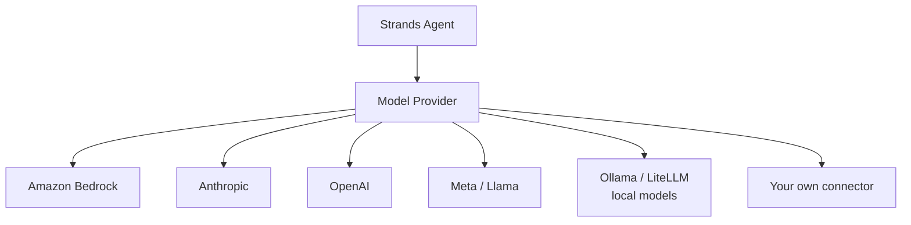
```mermaid
flowchart TD
    Agent["Strands Agent"] --> Model["Model Provider"]
    Model --> Bedrock["Amazon Bedrock"]
    Model --> Anthropic["Anthropic"]
    Model --> OpenAI["OpenAI"]
    Model --> Meta["Meta / Llama"]
    Model --> Ollama["Ollama / LiteLLM<br/>local models"]
    Model --> Custom["Your own connector"]
```

Why model choice matters:

- **Capability** — reasoning depth, tool-use reliability, context window
- **Cost** — smaller models are cheaper for simple tool-calling loops
- **Latency** — interactive assistants need fast responses
- **Tool-use behavior** — some models are specifically fine-tuned for agentic workloads
- **Data requirements** — self-hosted or local models keep data in your own environment

> **Tip**: The demo agent in this chapter runs on **Claude Sonnet 4 via Amazon Bedrock**, but the same code works with any provider — swap the model object, keep the rest.

---

## 3.4 🚀 Build Your First Strands Agent

Here is the entire "hello world" of agent development — a working agent in **three lines of Python**:

```bash
pip install strands-agents strands-agents-tools
```

```python
# agent.py
from strands import Agent

agent = Agent()
agent("Tell me about agentic AI")
```

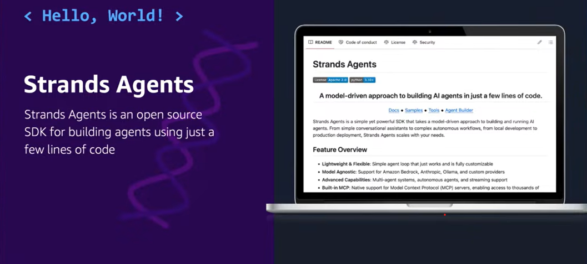
*The Strands Agents open-source SDK — an agent in a few lines of code.*

What just happened:

1. **Install** — `strands-agents` is the SDK; `strands-agents-tools` adds the built-in tool library
2. **Import `Agent`** — the core class every Strands application is built around
3. **Instantiate** — `Agent()` with no arguments uses sensible defaults (an Amazon Bedrock model)
4. **Call it** — `agent("...")` invokes the agent with your prompt and returns the response

That default agent can already reason — but it has no tools yet. Real applications pass three things to the constructor:

```python
from strands import Agent
from strands.models import BedrockModel

model = BedrockModel(model_id="us.anthropic.claude-sonnet-4-20250514-v1:0")

agent = Agent(
    model=model,                            # which model does the thinking
    system_prompt="You are a helpful calendar assistant.",
    tools=[current_time],                   # which tools it can use
)

response = agent("What appointments do I have today?")
```

- **`model`** — the reasoning engine (any supported provider)
- **`system_prompt`** — the agent's role and behavioral guidance
- **`tools`** — the list of capabilities it may call

> **Note**: Modern models are good enough at orchestration that you rarely need complex control logic. Strands deliberately leans into that — the model decides what to do; you decide what it *may* do.

---

## 3.5 🛠️ Tools — Giving Agents the Ability to Act

A model by itself produces text. **Tools turn reasoning into action.** When a tool is available, the model doesn't just answer — it decides a tool is needed, calls it, reads the result, and continues reasoning with real data.

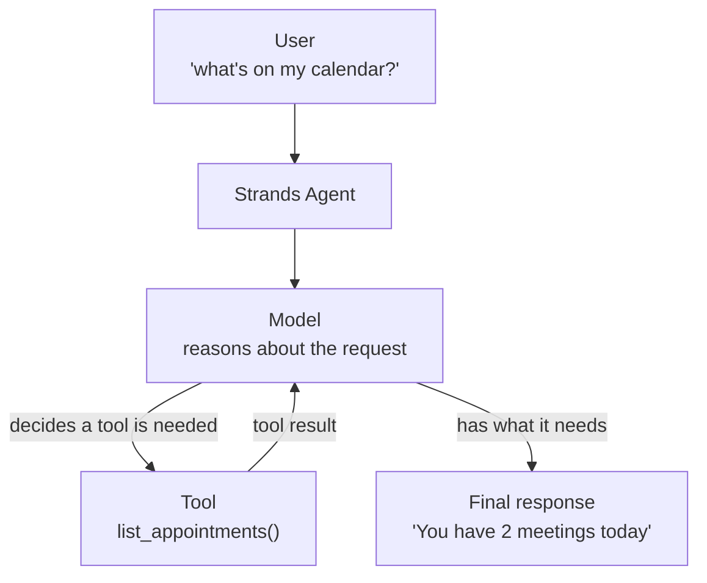
```mermaid
flowchart TD
    User["User<br/>'what's on my calendar?'"] --> Agent["Strands Agent"]
    Agent --> Model["Model<br/>reasons about the request"]
    Model -->|"decides a tool is needed"| Tool["Tool<br/>list_appointments()"]
    Tool -->|"tool result"| Model
    Model -->|"has what it needs"| Response["Final response<br/>'You have 2 meetings today'"]
```

The cycle in action:

1. The user asks: *"What appointments do I have today?"*
2. The model reasons: *I don't know the answer — but I have a `list_appointments` tool.*
3. The agent calls the tool; the tool queries a database and returns real data.
4. The model reads the result and writes a natural-language answer.

If the task needs more than one capability, the loop repeats — **the agent can chain tools until it decides the job is done.**

> **Tip**: Give the agent a focused toolset. The model chooses between the tools you provide — a small, well-named toolbox produces more reliable behavior than a giant one.

---

## 3.6 📦 Built-in Tools — 20+ Capabilities Out of the Box

Strands ships a companion package (`strands-agents-tools`) with **20+ ready-made tools**. You can assemble a capable agent without writing a single tool yourself — the code assistant later in this chapter is built *entirely* from built-in tools.

| Tool | What it lets the agent do |
|---|---|
| `current_time` | Know today's date and the current time — essential for scheduling agents |
| `python_repl` | Run Python code — either code you give it or code it generates itself |
| `shell` | Execute shell commands — formatters, linters, unit tests, file discovery |
| `editor` | Read, write and modify files |
| `journal` | Keep a work log — assign itself tasks, record progress, resume later |
| `calculator` | Do accurate math instead of estimating |
| `retrieve` | Query an **Amazon Bedrock Knowledge Base** |
| `use_aws` | Call **any AWS service** that has a boto3 client — DynamoDB, Lambda and more |
| `http_request` | Call external APIs |
| Plus more | image generation, memory, workflows, browser control, … |

Two of these deserve special attention:

- **`retrieve`** — turns a Bedrock Knowledge Base into a tool, so the agent can answer from *your* documents instead of model memory
- **`use_aws`** — one tool that opens essentially the whole AWS API surface to the agent

> **Warning**: Tools like `shell` and `python_repl` execute real commands and real code. Powerful for development agents — but review what they can reach before deploying them broadly.

---

## 3.7 🔧 Custom Tools — Teach the Agent Something New

Built-in tools cover general abilities, but every real application has **domain-specific actions** — *create an appointment*, *check a warranty*, *look up an order*. Strands makes custom tools trivially easy: **any Python function becomes a tool with one decorator**.

```python
# calendar_tools.py
from strands import tool
import sqlite3

@tool
def create_appointment(title: str, date: str, time: str, location: str) -> str:
    """
    Create a new calendar appointment.

    Args:
        title: What the appointment is for
        date: The appointment date (YYYY-MM-DD)
        time: The appointment time (e.g. "5:00 PM")
        location: Where the appointment happens
    """
    db = sqlite3.connect("calendar.db")
    db.execute(
        "INSERT INTO appointments (title, date, time, location) VALUES (?, ?, ?, ?)",
        (title, date, time, location),
    )
    db.commit()
    return f"Appointment '{title}' scheduled for {date} at {time}."
```

How it works — three things do the heavy lifting:

1. **`@tool`** — the decorator registers the function as an agent tool. That's genuinely all it takes.
2. **The signature** — typed parameters (`title: str`, `date: str`, …) become the tool's input schema; the model generates the arguments from conversation context.
3. **The docstring** — becomes the tool's *description*. This is what the model reads when deciding whether to call it, so write it clearly.

Because the arguments come from the model's reasoning, a request like *"schedule a meetup next week"* is enough for it to fill in a sensible `date`, `time` and `location` on its own — verified against the `current_time` tool so "next week" lands on the right day.

Why custom tools scale well:

- **Modular** — each tool lives in its own file; add `delete_appointment` without touching the others
- **Reusable** — the same tool file plugs into any agent or application
- **Composable** — you can even wrap tools written for other frameworks and use them with Strands
- **Testable** — it's a normal Python function; unit-test it like any other code

---

## 3.8 🔬 Practical Lab — Create Your First Custom Agent Tool

Hands-on: build and wire a custom tool from scratch.

### Step 1 — Set up the project

Create a virtual environment and install the SDK:

```bash
python -m venv .venv && source .venv/bin/activate
pip install strands-agents strands-agents-tools
```

Configure your model credentials (for Bedrock, the usual `aws configure` or environment variables).

### Step 2 — Write the tool

Create `my_tools.py` with a `@tool`-decorated function — a simple `get_weather(city)` that returns a canned string is fine for a first pass. Give it a clear docstring.

### Step 3 — Wire it into an agent

Create an agent that lists your tool alongside a built-in one:

```python
from strands import Agent
from strands_tools import current_time
from my_tools import get_weather

agent = Agent(
    system_prompt="You are a helpful travel assistant.",
    tools=[current_time, get_weather],
)

agent("What time is it, and what's the weather in Seattle?")
```

### Step 4 — Run and observe

```bash
python agent.py
```

Observe the agent reasoning: it should call `current_time` *and* your `get_weather` tool, then combine both results into one answer.

### Hints

- **Tool not called?** Check the docstring — the model reads it to decide when the tool applies.
- **Type errors?** The model fills arguments from context; keep parameter types simple (`str`, `int`, `bool`).
- **Nothing happens?** Make sure the tool is actually in the `tools=[...]` list passed to `Agent`.

---

## 3.9 🌐 MCP — Model Context Protocol

Custom tools run inside your agent's process. But what about tools that live **elsewhere** — a search engine, a third-party service, a shared company toolbox?

**MCP (Model Context Protocol)** is a **standard "plug-in" way for agents to discover and call tools**. Instead of packaging every tool yourself, you point your agent at an MCP server and get its whole toolbox in one standard way.

- **MCP server** — a process (local or remote) that exposes tools
- **MCP client** — the piece inside your agent that talks to servers
- **Tool discovery** — the agent asks the server *"what tools do you have?"* and uses the answer directly
- **Transports** — stdio for local processes, streamable HTTP and server-sent events for remote servers

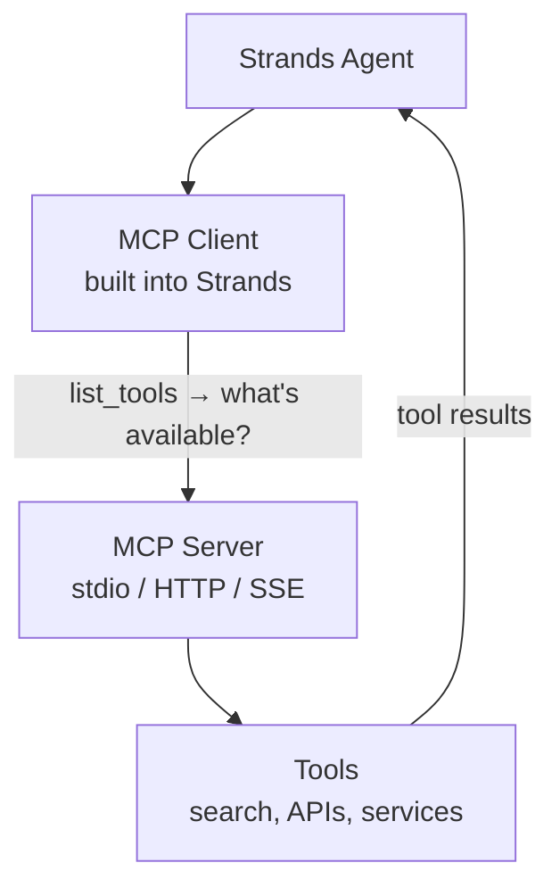
```mermaid
flowchart TD
    Agent["Strands Agent"] --> Client["MCP Client<br/>built into Strands"]
    Client -->|"list_tools → what's available?"| Server["MCP Server<br/>stdio / HTTP / SSE"]
    Server --> Tools["Tools<br/>search, APIs, services"]
    Tools -->|"tool results"| Agent
```

Why it matters:

- **Standardization** — any MCP server works with any MCP-aware agent; no bespoke glue code
- **Decoupling** — the server can add or change tools without touching your agent code; the agent just re-discovers them
- **Ecosystem** — thousands of MCP servers already exist (web search, databases, SaaS integrations)

---

## 3.10 🔌 Wiring Up an MCP Server

Connecting a Strands agent to an MCP server is three steps: **create a client, list its tools, hand them to the agent**.

```python
from strands import Agent
from strands.models import BedrockModel
from strands.tools.mcp import MCPClient
from mcp import stdio_client, StdioServerParameters

# 1. An MCP client for a local server process (stdio transport)
perplexity_mcp = MCPClient(lambda: stdio_client(
    StdioServerParameters(
        command="docker",
        args=["run", "-i", "--rm", "-e", "PERPLEXITY_API_KEY",
              "mcp/perplexity-ask"],
    )
))

# 2. Inside the client context, discover the server's tools
with perplexity_mcp:
    tools = perplexity_mcp.list_tools_sync()

    # 3. Hand the discovered tools to the agent — exactly like local tools
    agent = Agent(
        model=BedrockModel(model_id="us.anthropic.claude-sonnet-4-20250514-v1:0"),
        system_prompt="You are a research assistant with web search.",
        tools=tools,
    )

    agent("Do a quick search: what is the Strands Agents SDK?")
```

The pattern at work:

1. **`MCPClient`** — wraps the connection. This example launches a local MCP server as a subprocess over **stdio**; remote servers use streamable HTTP or SSE the same way.
2. **`list_tools_sync()`** — asks the server for its tool catalog. The tools arrive as standard tool specs.
3. **`tools=tools`** — MCP tools drop straight into the agent's toolbox; the model calls them exactly like built-in or custom tools.

> **Note**: The agent code doesn't know — or care — which tools the server exposes. Swap the Perplexity server for a different web-search MCP server (Tavily, for example) and the agent picks up the new tools with zero code changes.

---

## 3.11 🔁 Agent State & the Tool Loop

Under the hood, a model call is **stateless**: context in, reasoning out. Strands adds **state management on top** — the agent tracks the conversation, which tools were called, and what each one returned, so the model can reason across many steps.

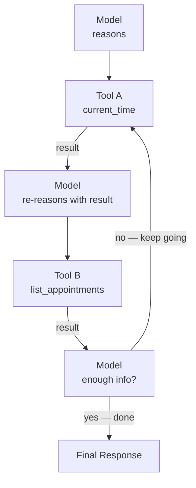
```mermaid
flowchart TD
    Model["Model<br/>reasons"] --> ToolA["Tool A<br/>current_time"]
    ToolA -->|result| Model2["Model<br/>re-reasons with result"]
    Model2 --> ToolB["Tool B<br/>list_appointments"]
    ToolB -->|result| Model3["Model<br/>enough info?"]
    Model3 -->|"yes — done"| Response["Final Response"]
    Model3 -->|"no — keep going"| ToolA
```

What the loop enables:

- **Sequential calls** — call tool A, read the result, then call tool B (e.g. get the current time, *then* list "today's" appointments)
- **Parallel calls** — when tools are independent, the model can request several in one reasoning step
- **Self-termination** — the agent stops looping when it decides the task is complete
- **Visible reasoning** — you can inspect which tools were called and why, which feeds directly into observability later

> **Tip**: This is the "model-first" philosophy in action — older agent frameworks needed elaborate prompt templates and hand-built orchestration to force this loop. Modern models handle it natively; Strands just manages the state.

---

## 3.12 🤝 Multi-Agent Patterns — Swarms, Graphs & Agents-as-Tools

One agent is useful; **specialized agents working together** are powerful. Instead of one overloaded mega-agent, you give each agent a focused job — and let them collaborate.

Strands supports several multi-agent patterns:

- **Agents as tools** — wrap an agent so another agent can *call it like a tool*. The classic **supervisor** pattern: a main agent delegates to specialists.
- **Swarms** — a team of agents that self-organize around a task, with less central control
- **Networks of agents** — peer agents that hand work to each other
- **Graphs** — explicit nodes and edges when you want tight control over who talks to whom
- **Workflows** — code-defined steps for processes that must run in a precise order

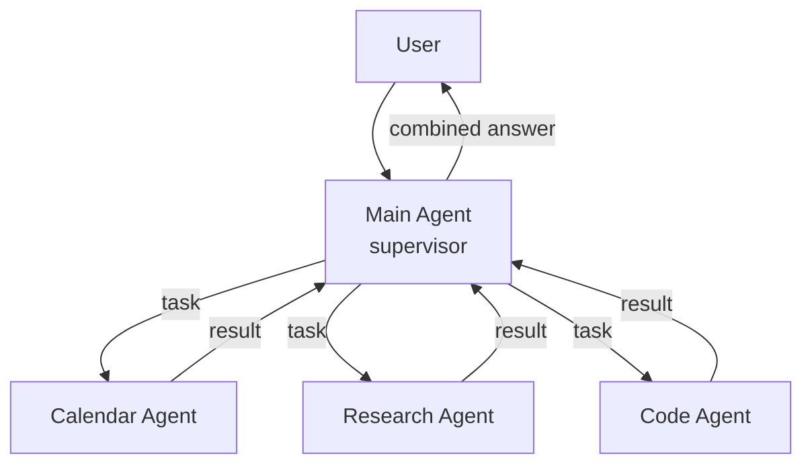
```mermaid
flowchart TD
    User["User"] --> Main["Main Agent<br/>supervisor"]
    Main -->|"task"| Calendar["Calendar Agent"]
    Main -->|"task"| Research["Research Agent"]
    Main -->|"task"| Code["Code Agent"]
    Calendar -->|"result"| Main
    Research -->|"result"| Main
    Code -->|"result"| Main
    Main -->|"combined answer"| User
```

How agents-as-tools works: each sub-agent is exposed through a normal `@tool`-decorated function — so to the supervisor, "ask the calendar agent" is just another tool call. The supervisor model decides *which specialist* to invoke based on the user's request, then composes the results.

> **Note**: If the model can reliably pick the right specialist, the supervisor pattern keeps each agent's prompt and toolbox small — and small, focused agents behave better than one agent that tries to do everything.

---

## 3.13 🧑‍💼 Putting It Together — The Personal Assistant

Time to put every concept together. The chapter project is a **personal assistant** — a supervisor agent that delegates to **three specialized sub-agents**:

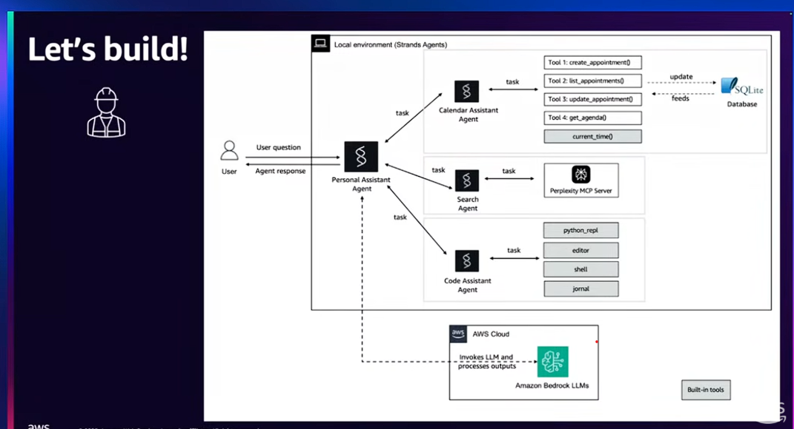
*The complete application: a Personal Assistant agent coordinating three specialized agents.*

- **Calendar Assistant** — manages appointments using custom tools (`create_appointment`, `list_appointments`, `update_appointment`, `get_agenda`) plus the built-in `current_time` tool, backed by a local database
- **Search Agent** — answers research questions through an **MCP web-search server**
- **Code Assistant** — writes, runs and debugs code using only built-in tools (`python_repl`, `editor`, `shell`, `journal`)

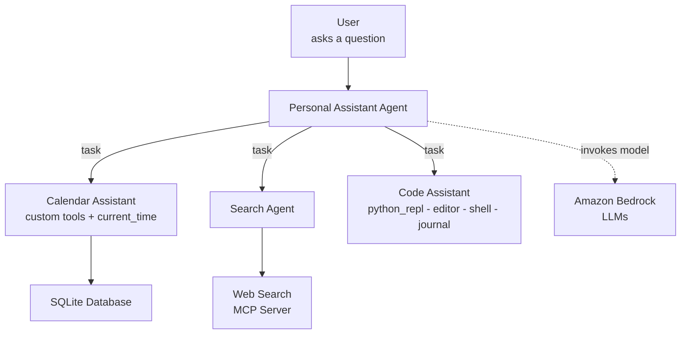
```mermaid
flowchart TD
    User["User<br/>asks a question"] --> PA["Personal Assistant Agent"]
    PA -->|"task"| Cal["Calendar Assistant<br/>custom tools + current_time"]
    PA -->|"task"| Search["Search Agent"]
    PA -->|"task"| Code["Code Assistant<br/>python_repl - editor - shell - journal"]
    Cal --> DB["SQLite Database"]
    Search --> MCPS["Web Search<br/>MCP Server"]
    PA -.->|"invokes model"| Bedrock["Amazon Bedrock<br/>LLMs"]
```

The interaction flow: the user asks the personal assistant something → its model decides which specialist fits → the specialist runs its own tool loop → the result flows back up to the supervisor → the supervisor writes the final answer. A single question can even fan out to *two* specialists — *"what's on my calendar today, and what's happening in Manhattan?"* pulls from both the calendar agent and the search agent.

### The Sample, End to End — strands-agents/samples

This exact project ships in the official samples repo — the walkthrough below follows it from GitHub page to a running multi-agent CLI. Full source: [`strands-agents/samples` → `python/04-industry-use-cases/productivity/personal-assistant`](https://github.com/strands-agents/samples/tree/main/python/04-industry-use-cases/productivity/personal-assistant) · companion repo: [`strands-agents/harness-sdk`](https://github.com/strands-agents/harness-sdk)

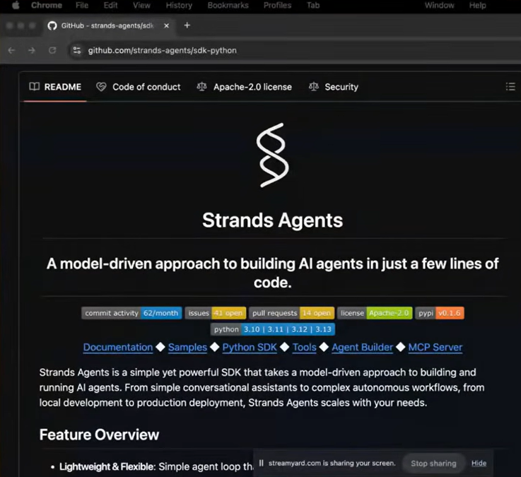
**What to notice** — the `strands-agents/sdk-python` repo README: *"A model-driven approach to building AI agents in just a few lines of code"* — Documentation, Samples, Python SDK, Tools, Agent Builder, MCP Server are the key links.

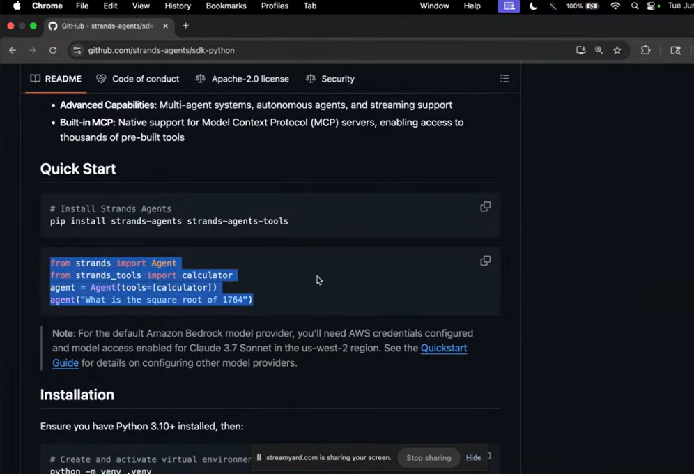
**What to notice** — the entire getting-started surface: `pip install strands-agents strands-agents-tools`, then `Agent(tools=[calculator])` — the same calculator one-liner the chapter opened with.

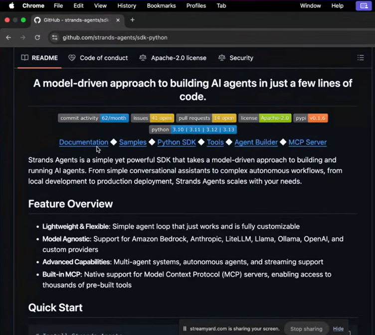
**What to notice** — the SDK's feature checklist: lightweight agent loop, model-agnostic providers (Bedrock, Anthropic, LiteLLM, Ollama, OpenAI), multi-agent + streaming support, and native MCP client support — everything this chapter used.

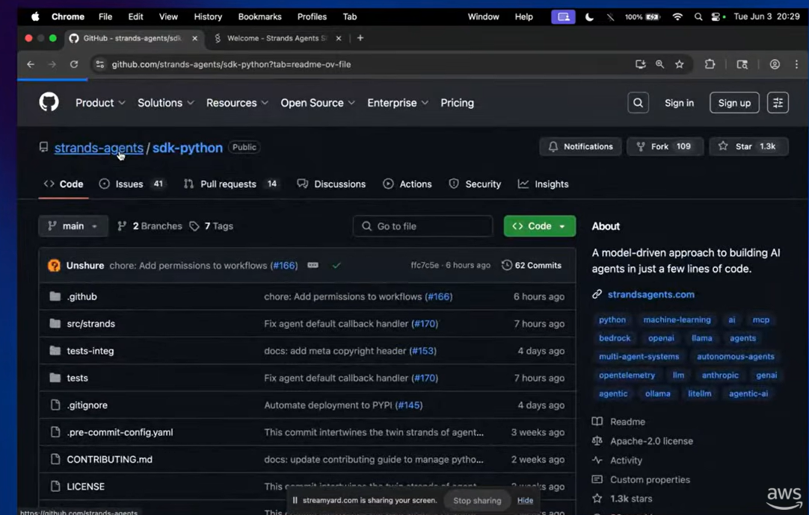
**What to notice** — the repo itself: `src/strands`, `tests`, `docs` — a small, readable codebase you can actually study end to end.

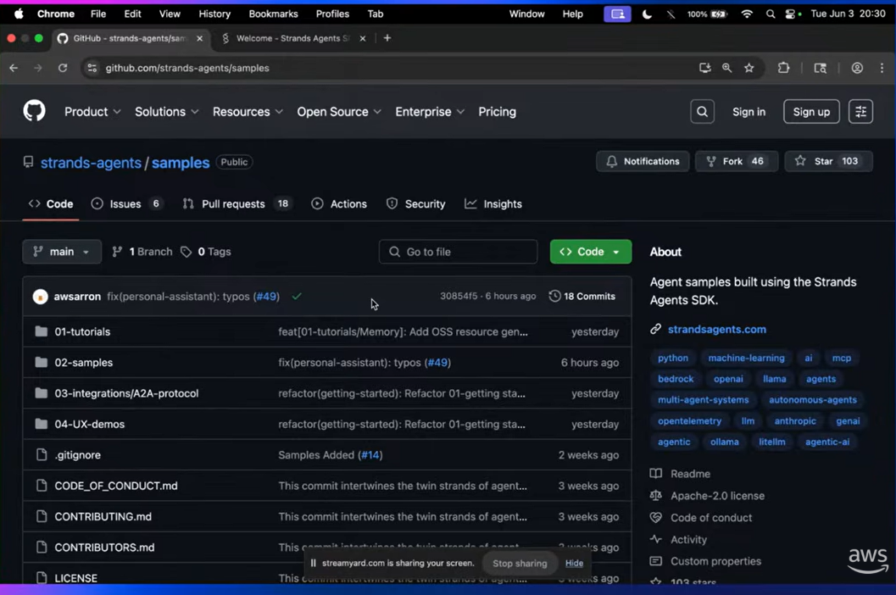
**What to notice** — the companion `samples` repo: `01-tutorials`, `02-samples`, `03-integrations`, `04-UX-demos`. Our project lives at **`02-samples/05-personal-assistant`**.

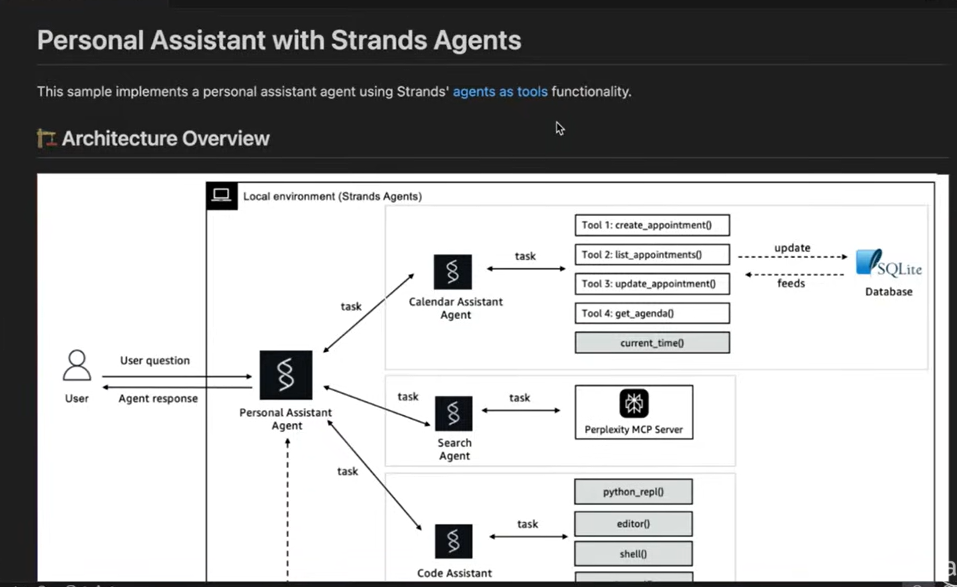
**What to notice** — the README's own architecture diagram: User → **Personal Assistant Agent** → three specialists. Calendar Assistant owns 4 custom tools + `current_time` and reads/writes a **SQLite database**; Search Agent calls a **Perplexity MCP server**; Code Assistant gets `python_repl`, `editor`, `shell`, `journal`.

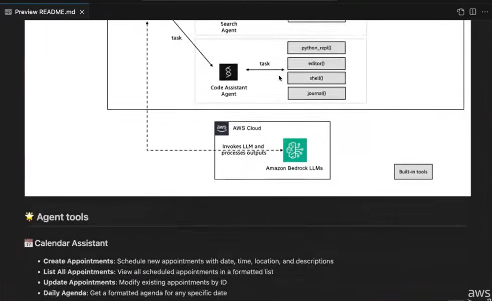
**What to notice** — the bottom half of the diagram: every agent invokes **Amazon Bedrock LLMs** in AWS Cloud, and the tools panel makes the distinction explicit — *custom* tools are just functions; *built-in* tools come from `strands-agents-tools`.

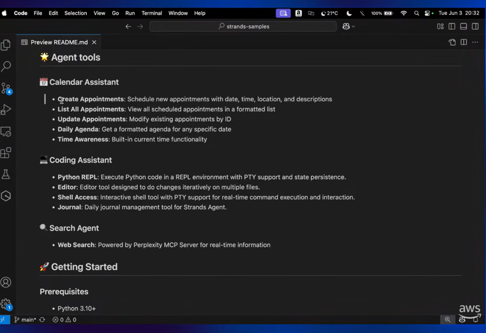
**What to notice** — the README breaks down each specialist's toolkit: Calendar (create/list/update appointments, daily agenda), Coding (Python REPL, Editor, Shell, Journal), Search (Perplexity-powered web search via MCP).

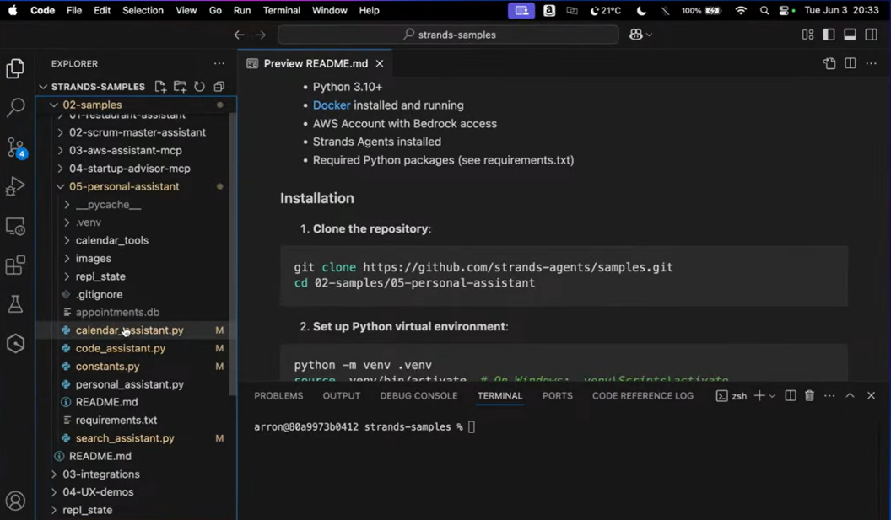
**What to notice** — the folder is small and complete: `personal_assistant.py` (supervisor), `calendar_assistant.py`, `search_assistant.py`, `code_assistant.py`, `calendar_tools/` (the custom tool package), `constants.py`, `appointments.db`, `requirements.txt`. A multi-agent system in ~6 files.

### Setup

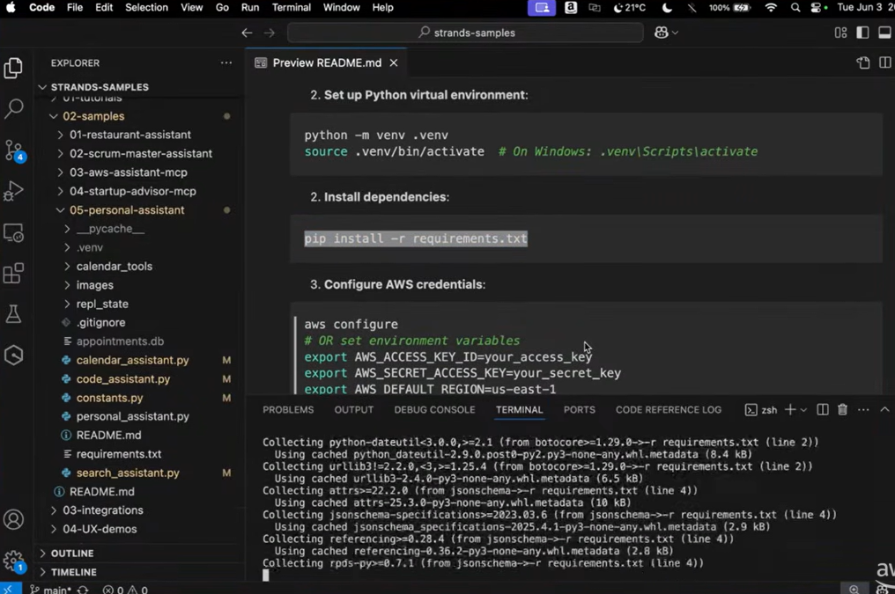
**What to notice** — three setup steps: clone the repo, `python -m venv .venv` + activate, then configure AWS credentials (`aws configure` or `AWS_ACCESS_KEY_ID`/`AWS_SECRET_ACCESS_KEY`/`AWS_DEFAULT_REGION` env vars) — the agents call Bedrock, so credentials are required.

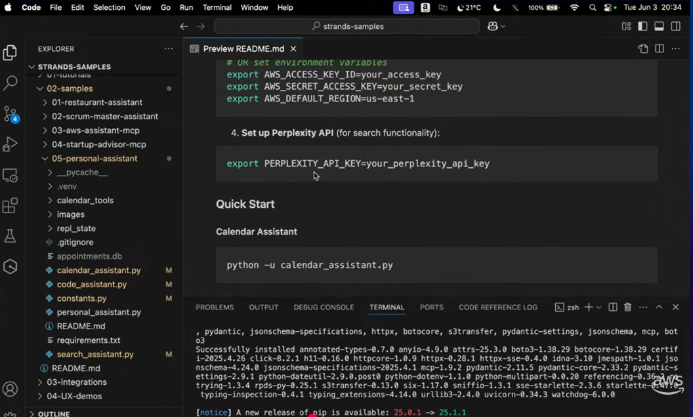
**What to notice** — one extra env var for the search agent: `PERPLEXITY_API_KEY` (the MCP server reads it). Quick start is a single command: `python -u calendar_assistant.py`.

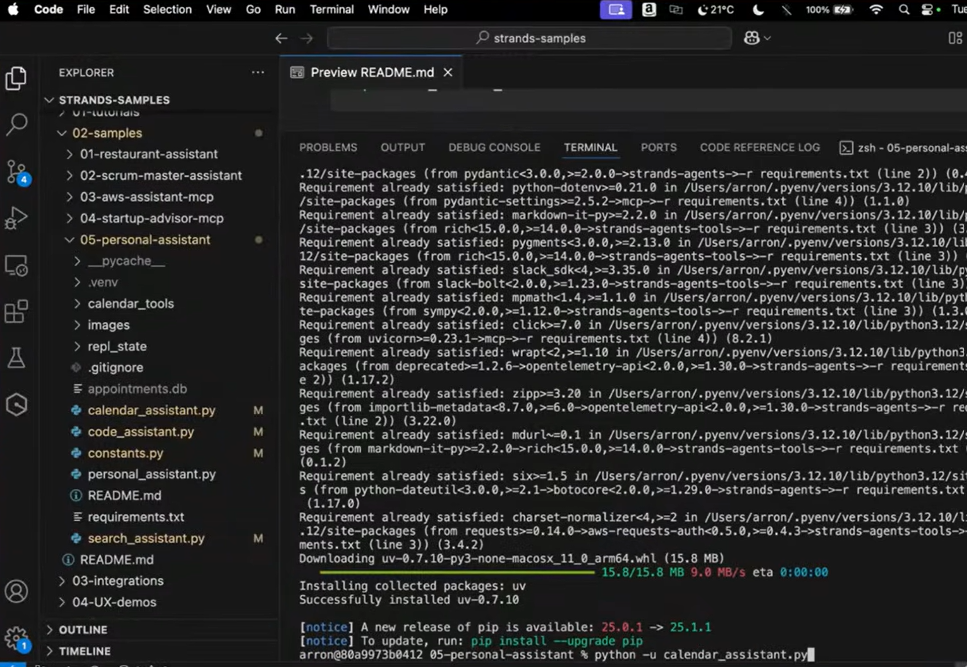
**What to notice** — `pip install -r requirements.txt` pulling `strands-agents`, `strands-agents-tools`, `mcp`, `python-dotenv` and friends.

### The Specialists, Live

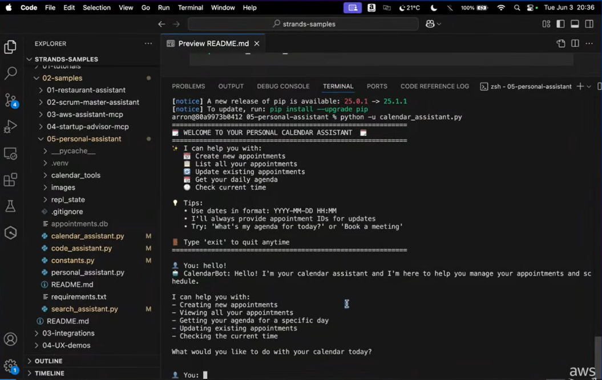
**What to notice** — `python -u calendar_assistant.py` boots an interactive CLI: welcome banner, capability list (create/list/update appointments, daily agenda, current time), tips (date formats, appointment IDs) and a `You:` prompt — a real REPL, not a one-shot call.

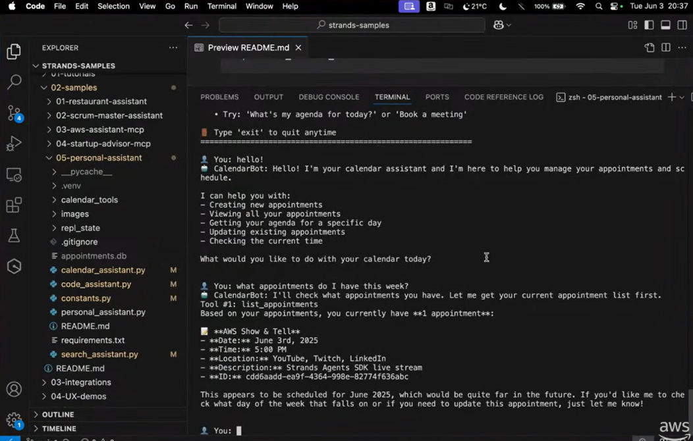
**What to notice** — *"What's my agenda for today?"* → the agent calls `current_time` to resolve "today", then `get_agenda` against SQLite and returns the formatted schedule. Tool composition, decided by the model, not by code you wrote.

`calendar_assistant` itself is a **`@tool`-decorated function** whose body creates an inner `Agent` and calls it — the *agents-as-tools* pattern: to the supervisor, this whole specialist looks like one callable tool. `STRANDS_TOOL_CONSOLE_MODE = "enabled"` produces the rich tool-call logging you saw in the terminal, and `trace_attributes={"session.id": SESSION_ID}` (from `constants.py`) tags every run for observability. The `__main__` block is a real REPL — banner, tips, `while True: input("You: ")`, graceful `exit`/`KeyboardInterrupt` handling:

<GitHubExplorer repo="strands-agents/samples" ref="main" expanded="true" title="calendar_assistant.py — a specialist agent wrapped as a @tool" files={[
  { "path": "python/04-industry-use-cases/productivity/personal-assistant/calendar_assistant.py", "label": "calendar_assistant.py", "highlights": [[1, 15], [18, 40], [55, 80]], "note": "@tool wrapper → inner Agent with custom + built-in tools → interactive __main__ loop." },
  { "path": "python/04-industry-use-cases/productivity/personal-assistant/constants.py", "label": "constants.py", "highlights": [], "note": "Shared constants — SESSION_ID, model IDs — imported by every agent file." }
]} />

This agent's tools come from an **external MCP server over stdio**: `MCPClient(lambda: stdio_client(StdioServerParameters(command=…, args=[…])))` launches the Perplexity server as a subprocess with `PERPLEXITY_API_KEY` in `env`, `list_tools_sync()` discovers what it exposes, and those tools go straight into `Agent(tools=tools)` — same API whether tools are local, built-in, or remote:

<GitHubExplorer repo="strands-agents/samples" ref="main" expanded="true" title="search_assistant.py — an agent whose tools live in an MCP server" files={[
  { "path": "python/04-industry-use-cases/productivity/personal-assistant/search_assistant.py", "label": "search_assistant.py", "highlights": [[1, 20], [30, 55], [60, 90]], "note": "stdio_client + StdioServerParameters → MCPClient → list_tools_sync() → Agent(tools=…)." }
]} />

The third specialist needs zero custom tool code: `from strands_tools import python_repl, editor, shell, journal` — its `system_prompt` casts it as *"a software expert and coder — write, debug, test, and iterate on software"*, then it's the same `@tool`-wrapper + interactive CLI pattern:

<GitHubExplorer repo="strands-agents/samples" ref="main" expanded="true" title="code_assistant.py — built-in tools only, no custom code" files={[
  { "path": "python/04-industry-use-cases/productivity/personal-assistant/code_assistant.py", "label": "code_assistant.py", "highlights": [[1, 15], [20, 45], [60, 85]], "note": "python_repl + editor + shell + journal straight from strands_tools — the tool list IS the implementation." }
]} />

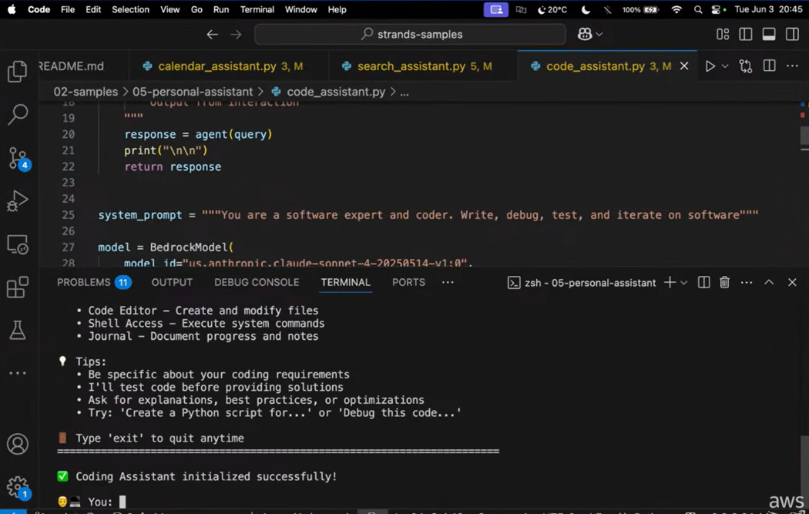
**What to notice** — the code assistant's CLI menu: Python REPL for running code, Code Editor for files, Shell Access for commands, Journal for notes — plus tips on being specific about requirements.

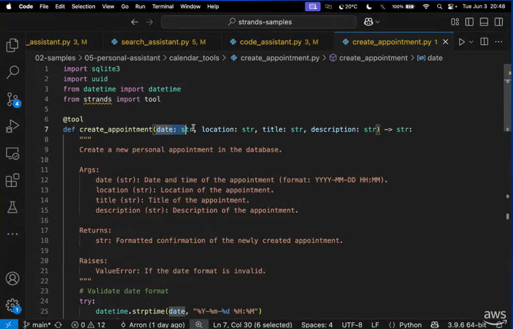
**What to notice** — `calendar_tools/` is a normal Python package: one file per tool (`create_appointment.py`, `list_appointments.py`, `update_appointment.py`, `get_agenda.py`, `delete_appointment.py`) — importing the package gives you the tool functions.

Each tool file is a `@tool` function with a docstring-driven contract — `create_appointment.py` parses the date, inserts into SQLite, and returns a confirmation the agent reads back:

<GitHubExplorer repo="strands-agents/samples" ref="main" expanded="true" title="calendar_tools/create_appointment.py — a custom tool, the whole file" files={[
  { "path": "python/04-industry-use-cases/productivity/personal-assistant/calendar_tools/create_appointment.py", "label": "create_appointment.py", "highlights": [[1, 10], [15, 40]], "note": "The docstring Args/Returns IS the tool schema the model reads — write it like an API contract." }
]} />

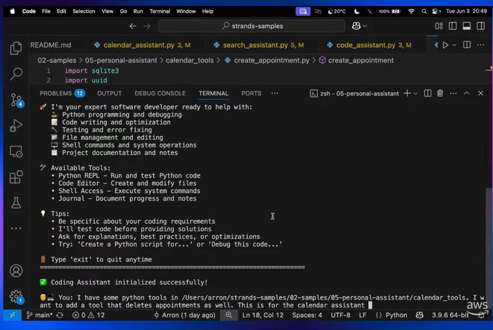
**What to notice** — the tool inventory printed at startup; the tips even suggest *"Create a Python script that…"* — prompt-engineering guidance shipped inside the CLI.

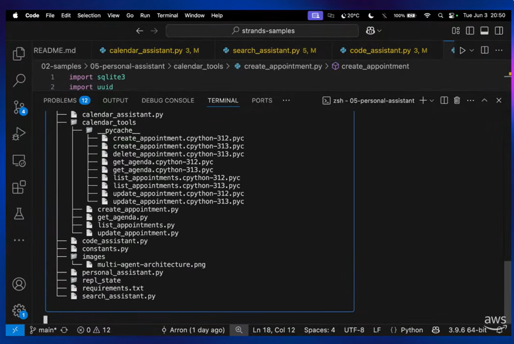
**What to notice** — mid-demo the code assistant runs `ls`/`tree` on `calendar_tools/` through its **shell tool** — the file tree you saw in the explorer, discovered by the agent itself.

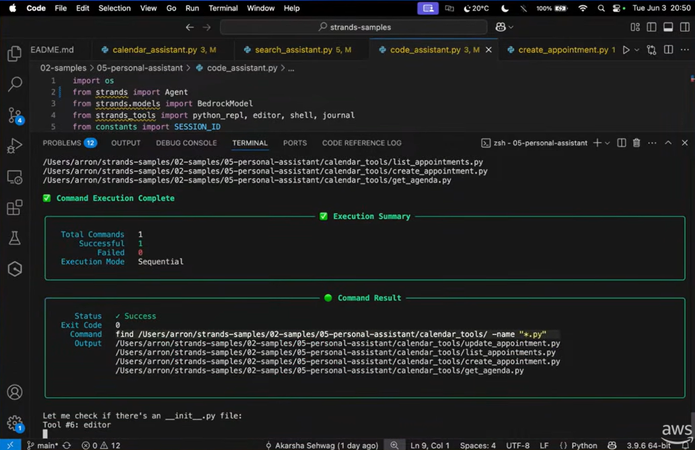
**What to notice** — `STRANDS_TOOL_CONSOLE_MODE` output: a shell command completes with an execution summary (commands run, succeeded/failed, duration) and the result streams back into the conversation — full visibility into every tool call.

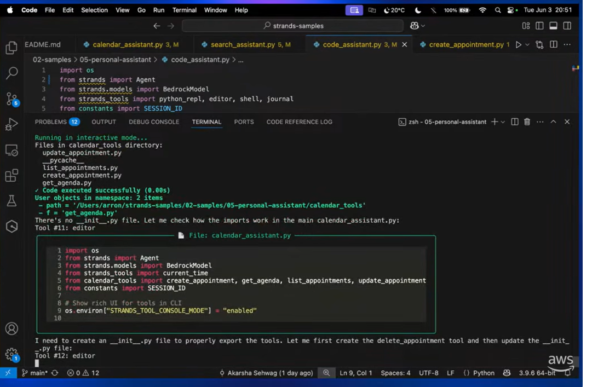
**What to notice** — the interesting failure: the agent inspects the package, notices `__init__.py` is missing for proper imports, and reasons *"I need to create an `__init__.py`…"* then reaches for the **editor tool** — the agent debugging and fixing its own codebase.

### The Supervisor — Agents as Tools

The payoff file: `personal_assistant_agent = Agent(model, system_prompt="You are a personal assistant. Use the agents and tools at your disposal to assist the user", tools=[calendar_assistant, search_assistant, code_assistant, …])`. Three entire agents, three entries in a `tools` list — that's the whole orchestration:

<GitHubExplorer repo="strands-agents/samples" ref="main" expanded="true" title="personal_assistant.py — the supervisor, orchestrating 3 agents" files={[
  { "path": "python/04-industry-use-cases/productivity/personal-assistant/personal_assistant.py", "label": "personal_assistant.py", "highlights": [[1, 20], [25, 50], [60, 90]], "note": "tools=[calendar_assistant, search_assistant, code_assistant] — agents as tools, the entire pattern in one list." }
]} />

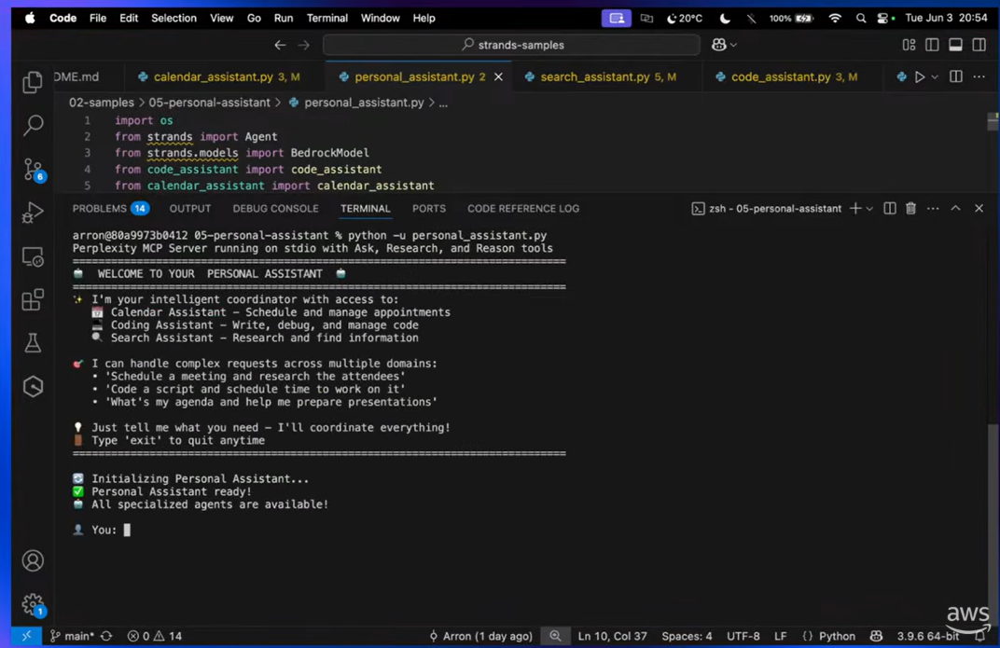
**What to notice** — `python -u personal_assistant.py` initializes all three specialists in sequence (Calendar → Search → Code) and reports *"All specialized agents are available!"* before the prompt.

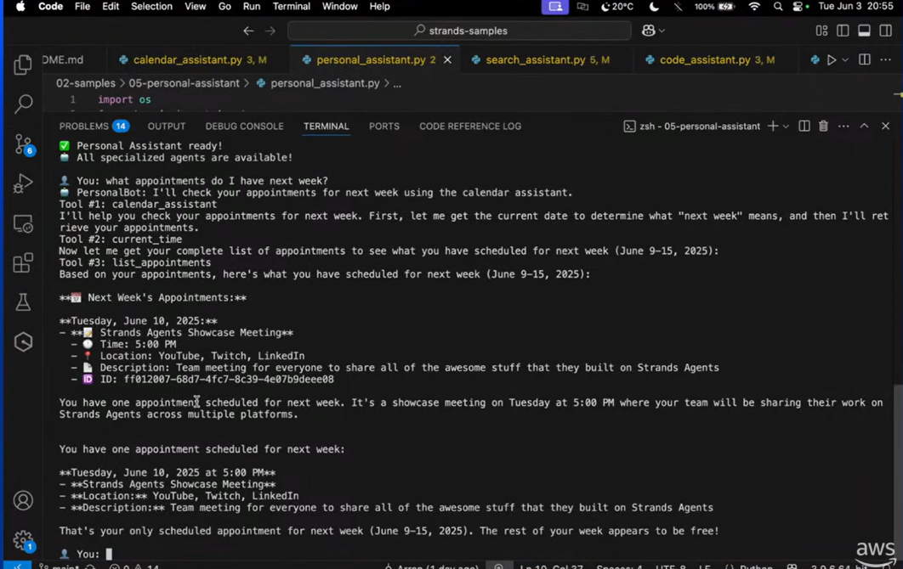
**What to notice** — *"Hi, what appointments do I have next week?"* → the supervisor calls the **calendar assistant** (which itself calls `current_time` + `list_appointments`), then summarizes: *"Wednesday, June 18, 2025 at 5:00 PM — Strands Agents Showcase Meeting… that's your only scheduled appointment."* One question → supervisor → specialist → tools → answer — the full agents-as-tools loop working end to end.

---

## 3.14 📅 The Calendar Assistant — A Specialist in Action

The calendar assistant is the pattern in miniature: **custom tools + one built-in tool + a focused system prompt**.

```python
from strands import Agent, tool
from strands.models import BedrockModel
from strands_tools import current_time
import calendar_tools  # create_appointment, list_appointments,
                        # update_appointment, get_agenda

@tool
def calendar_assistant(query: str) -> str:
    """Manage the user's calendar — list, create and update appointments."""
    agent = Agent(
        model=BedrockModel(model_id="us.anthropic.claude-sonnet-4-20250514-v1:0"),
        system_prompt="You are a calendar assistant. Help the user manage appointments.",
        tools=[
            current_time,
            calendar_tools.create_appointment,
            calendar_tools.list_appointments,
            calendar_tools.update_appointment,
            calendar_tools.get_agenda,
        ],
    )
    return str(agent(query))
```

Notice the design decisions:

- **`current_time` first** — an appointment agent that doesn't know what "today" or "next week" means is useless. The built-in tool grounds every relative date.
- **Four small custom tools** — each does one CRUD operation against a local database
- **`@tool` on the assistant function** — this one line is what turns the whole sub-agent into something the supervisor can call. The docstring tells the supervisor *when* to delegate here.

Ask it *"what do I have today?"* and it calls `current_time` → `list_appointments` → answers with real data. Ask it to *"book a sync next Thursday at 5pm"* and it resolves the date first, then calls `create_appointment`.

---

## 3.15 🔎 The Web Research Agent — MCP in Action

The search agent shows the MCP payoff end to end: **one agent + one MCP client + zero custom tool code** = live web search.

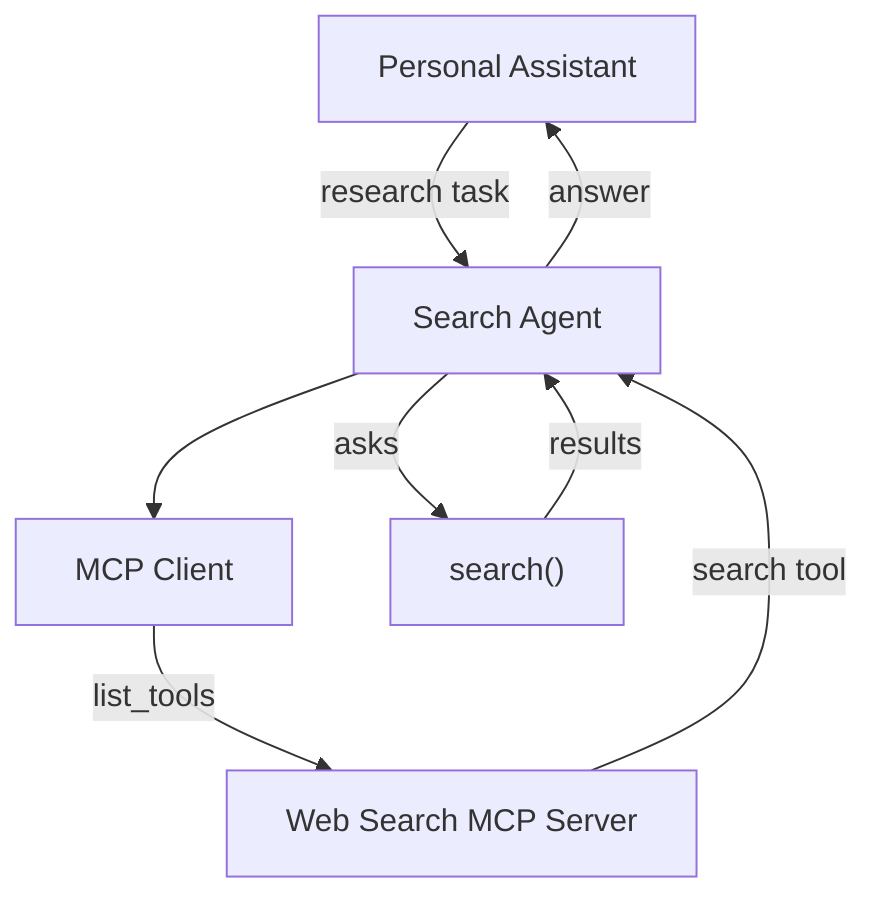
```mermaid
flowchart TD
    PA["Personal Assistant"] -->|"research task"| SA["Search Agent"]
    SA --> MCPC["MCP Client"]
    MCPC -->|"list_tools"| MCPS["Web Search MCP Server"]
    MCPS -->|"search tool"| SA
    SA -->|"asks"| Tool["search()"]
    Tool -->|"results"| SA
    SA -->|"answer"| PA
```

1. The search agent starts an MCP client pointed at a web-search server (running as a local process over stdio)
2. `list_tools_sync()` discovers whatever search tools that server exposes
3. Those tools go straight into the agent's `tools=[...]` list
4. When the supervisor delegates a research question, the agent calls the search tool and summarizes the results

> **Tip**: MCP servers are swappable. Point the same agent at a different search provider's MCP server and it gets new capabilities with no code changes — that's the standardization win.

---

## 3.16 💻 Meet the Coding Assistant — Zero Custom Tools

The most surprising agent in the project: a **full coding assistant built entirely from built-in tools**. No custom tool code at all — just four off-the-shelf capabilities and a good system prompt.

```python
from strands import Agent, tool
from strands.models import BedrockModel
from strands_tools import python_repl, editor, shell, journal

@tool
def code_assistant(query: str) -> str:
    """Write, execute and debug code; manage files and development tasks."""
    agent = Agent(
        model=BedrockModel(model_id="us.anthropic.claude-sonnet-4-20250514-v1:0"),
        system_prompt="You are a senior software engineer. "
                      "Write code, run it, and iterate until it works.",
        tools=[python_repl, editor, shell, journal],
    )
    return str(agent(query))
```

Why these four tools make a real developer agent:

- **`python_repl`** — run Python snippets to test ideas instantly
- **`editor`** — read and modify real files in the project
- **`shell`** — run `find`, formatters, linters, unit tests — the agent checks its own work
- **`journal`** — plan multi-step work and track progress (next section)

The magic is the **feedback loop**: the agent writes code → runs it with `python_repl` or `shell` → reads the failure → fixes the code → re-runs. Give it a task like *"these calendar tools need a `delete_appointment` function"* and it will explore the codebase, read the existing tool files, match their style, write the new tool, and even improve the package structure along the way.

---

## 3.17 📓 The Journal Tool — An Agent's Work Log

The `journal` tool deserves its own look — it gives an agent a **work log**, the way a developer keeps notes on a project.

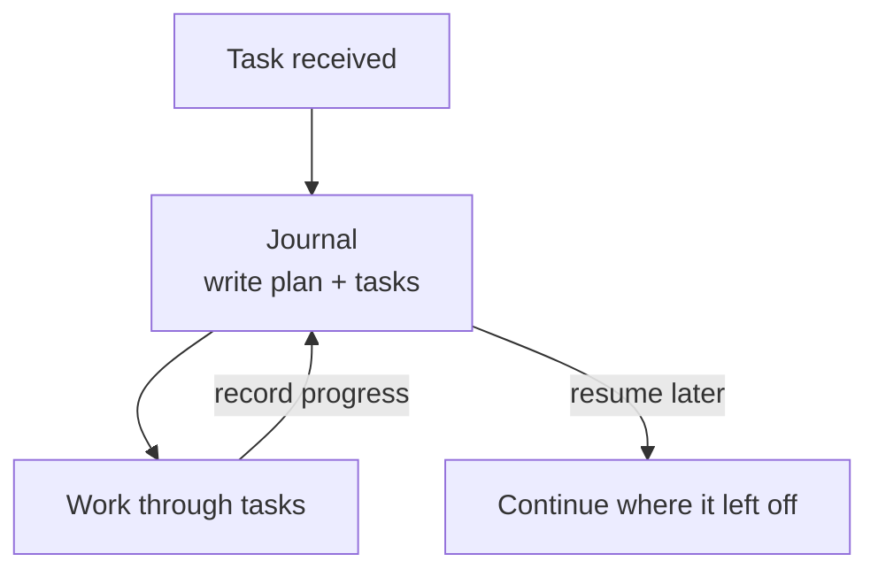
```mermaid
flowchart TD
    Task["Task received"] --> Journal["Journal<br/>write plan + tasks"]
    Journal --> Work["Work through tasks"]
    Work -->|"record progress"| Journal
    Journal -->|"resume later"| Resume["Continue where it left off"]
```

What it enables:

- **Self-assigned tasks** — the agent breaks a big job into a to-do list it writes itself
- **Progress tracking** — each step gets recorded as it completes
- **Resumption** — come back tomorrow and the agent picks up where it left off
- **Iteration support** — long, multi-step work survives across many loop cycles

For a code assistant doing real project work — read files, plan changes, implement, test — the journal is what turns "answer a question" into "complete a project."

---

## 3.18 ☁️ Connecting Agents to AWS Services

Strands agents aren't siloed — tools reach into AWS services directly.

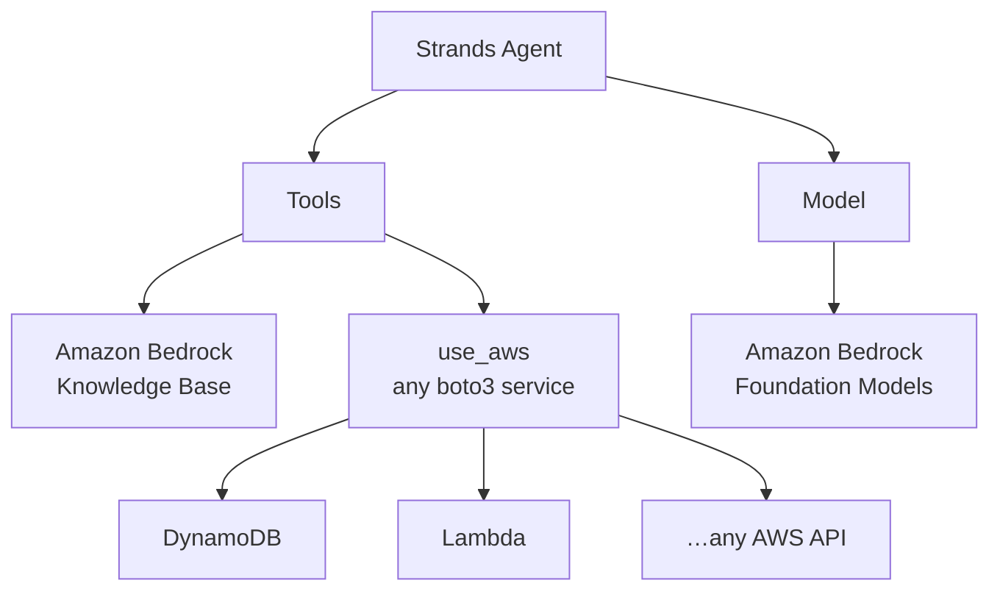
```mermaid
flowchart TD
    Agent["Strands Agent"] --> M["Model"]
    Agent --> T["Tools"]
    T --> KB["Amazon Bedrock<br/>Knowledge Base"]
    T --> UseAWS["use_aws<br/>any boto3 service"]
    UseAWS --> DDB["DynamoDB"]
    UseAWS --> Lambda["Lambda"]
    UseAWS --> Other["…any AWS API"]
    M --> Bedrock["Amazon Bedrock<br/>Foundation Models"]
```

- **`retrieve`** — query a **Bedrock Knowledge Base** so the agent answers from your documents
- **`use_aws`** — call **any AWS service with a boto3 client**: read a DynamoDB table, invoke a Lambda function, manage S3 objects
- **Bedrock models** — the model itself typically runs on Bedrock, so inference and tools live in the same ecosystem
- **Bedrock Guardrails** — can sit in front of (or behind) model calls for safety controls
- **Custom tools** — when `use_aws` is too generic, write a focused `@tool` for your DynamoDB table or Lambda integration

---

## 3.19 🚀 Deployment Options — Run Anywhere

A Strands agent is **just a Python application** — deploy it like any other software, wherever makes sense:

| Environment | When it fits |
|---|---|
| **AWS Lambda** | Event-driven, request/response agents; pay per invocation |
| **AWS Fargate / ECS** | Long-running or streaming agents in containers |
| **Amazon EC2** | Full control over the host environment |
| **Local / on-premises** | Development, prototyping, or self-hosted model stacks |
| **Outside AWS** | Pair with a non-Bedrock provider (Ollama, LiteLLM) and run anywhere |

Because the SDK is model-agnostic and infrastructure-agnostic, the same agent code runs on your laptop, in a Lambda function, or inside a container fleet — the deployment choice is independent of the agent design.

---

## 3.20 📊 Observability — See What Your Agent Is Doing

Agents make *decisions* — and when behavior is unexpected, "it just answered wrong" isn't debuggable without visibility. Most real-world agent challenges come down to observability: **what is the agent doing, and why?**

Strands has observability built in:

- **Native tracing** — see which tools were called, in what order, with what arguments and results
- **Trace attributes** — attach metadata (`trace_attributes=...` on the agent) to label and filter runs
- **OpenTelemetry** — emit standard OTel traces, so agent behavior plugs into the observability stack you already use — Langfuse, Arize, Datadog, or anything OTel-compatible
- **Evaluation** — measure accuracy, latency and cost to keep improving the agent

> **Tip**: Turn tracing on from day one. Reading the tool-call sequence is the fastest way to learn how your agent actually reasons — and to catch it making odd choices early.

---

## 3.21 💻 Chapter 03 Git Repository — Get the Code

Everything in the lab below comes from the open-source **Strands Agents** repositories — clone them first so you can follow along:

- 🧩 **Samples** — [github.com/strands-agents/samples](https://github.com/strands-agents/samples) — includes the complete **personal assistant** application this lab builds step by step
- 📦 **SDK** — [github.com/strands-agents/sdk-python](https://github.com/strands-agents/sdk-python) — the Strands Agents SDK source
- 🛠️ **Tools** — [github.com/strands-agents/tools](https://github.com/strands-agents/tools) — the library of 20+ pre-built tools used by the code assistant

---

## 3.22 🔬 Practical Lab — Build Your Personal AI Assistant

The capstone: assemble the full three-agent personal assistant.

**Objective** — a supervisor agent that delegates calendar, search and coding tasks to three specialists.

**Prerequisites** — Python 3.10+, `pip install strands-agents strands-agents-tools mcp`, AWS credentials configured for Bedrock, and an API key for your chosen search MCP server.

### Step 1 — Create the project structure

```bash
mkdir personal_assistant && cd personal_assistant
python -m venv .venv && source .venv/bin/activate
pip install strands-agents strands-agents-tools mcp
export PERPLEXITY_API_KEY=<your-key>   # or your chosen search provider
```

### Step 2 — Build the calendar assistant

Write `calendar_tools.py` with four `@tool` functions (`create_appointment`, `list_appointments`, `update_appointment`, `get_agenda`) backed by SQLite, then a `@tool`-decorated `calendar_assistant()` function — the pattern from section 3.14.

### Step 3 — Build the search agent

Create `search_assistant()` with an `MCPClient` for your web-search server; call `list_tools_sync()` inside the client context and pass the tools to the agent — the pattern from 3.10/3.15.

### Step 4 — Build the code assistant

Create `code_assistant()` with `tools=[python_repl, editor, shell, journal]` — the pattern from 3.16.

### Step 5 — Wire the supervisor

```python
from strands import Agent
from strands.models import BedrockModel
from calendar_assistant import calendar_assistant
from search_assistant import search_assistant
from code_assistant import code_assistant

agent = Agent(
    model=BedrockModel(model_id="us.anthropic.claude-sonnet-4-20250514-v1:0"),
    system_prompt="You are a personal assistant. Delegate calendar, "
                  "research and coding tasks to your specialist tools.",
    tools=[calendar_assistant, search_assistant, code_assistant],
)

agent("What's on my calendar today, and find me a good playlist for focus work?")
```

### Step 6 — Verify the delegation

Run it and inspect the trace: the supervisor should call `calendar_assistant` (which calls `current_time` + `list_appointments`) *and* `search_assistant` (which calls the MCP search tool), then merge both into one answer.

**Final checklist** — ✅ each sub-agent works standalone first · ✅ every specialist is wrapped with `@tool` · ✅ MCP tools discovered inside the client context · ✅ supervisor sees delegation in its trace

### Step 7 — Common issues & fixes

- **`ModuleNotFoundError`** — you're probably in the wrong virtualenv; re-activate `.venv`
- **MCP tools empty** — `list_tools_sync()` must run *inside* the `with mcp_client:` block
- **Supervisor never delegates** — sharpen each tool's docstring; that's the supervisor's routing signal

---

## 3.23 🧠 Knowledge Check

Q1: What is Strands Agents?
- A) A fully managed AWS agent hosting service
- B) An open-source, model-driven Python SDK for building AI agents in a few lines of code (Correct)
- C) A prompt-template library for chatbots
- D) A vector database for agent memory

**Explanation**: Strands is an open-source SDK that relies on the model's own reasoning and tool-use capabilities — a model-first approach instead of heavy orchestration templates.

Q2: Why do agents need tools?
- A) To make responses longer
- B) Tools let the agent take actions in the outside world — the model alone can only reason (Correct)
- C) Tools are required to load a model
- D) Tools replace the need for a system prompt

**Explanation**: A model produces reasoning and text; tools are how the agent acts — reading calendars, running code, calling APIs.

Q3: What does the `@tool` decorator do?
- A) It deploys the function to Lambda
- B) It turns any Python function into a tool the agent can call — signature becomes the schema, docstring becomes the description (Correct)
- C) It encrypts the tool's code
- D) It makes the function run faster

**Explanation**: One decorator registers the function; the model reads the docstring to decide when to use it and generates the arguments from context.

Q4: What is MCP used for?
- A) A faster model inference protocol
- B) A standard protocol for agents to discover and call tools exposed by MCP servers (Correct)
- C) A model compression format
- D) An AWS authentication standard

**Explanation**: MCP standardizes tool access — the client asks the server `list_tools`, gets the catalog, and those tools drop straight into the agent.

Q5: What's the difference between a built-in tool and a custom tool?
- A) Built-in tools are faster
- B) Built-ins ship ready-made with the SDK; custom tools are your own `@tool` functions for domain-specific actions (Correct)
- C) Custom tools can't take arguments
- D) There is no difference

**Explanation**: The SDK ships 20+ built-ins (current_time, python_repl, editor, shell, journal, retrieve, use_aws, …); anything domain-specific you write yourself with `@tool`.

Q6: Can a Strands agent call more than one tool for a single task?
- A) No — one tool per request
- B) Yes — the loop supports sequential tool calls, and independent calls can run in parallel (Correct)
- C) Only if you write custom orchestration code
- D) Only two tools maximum

**Explanation**: Strands manages agent state across cycles — the model calls a tool, inspects the result, and continues until done, sequentially or in parallel.

Q7: What is the agents-as-tools pattern?
- A) Packaging tools as agents for resale
- B) Wrapping a specialized agent behind a @tool function so a supervisor agent can delegate to it (Correct)
- C) Converting tools into models
- D) A debugging mode for tools

**Explanation**: Each specialist agent is exposed as a tool; the supervisor's model picks which specialist to call and composes the results.

Q8: What does the `journal` built-in tool provide?
- A) Encrypted logging for compliance
- B) A work log — the agent assigns itself tasks, records progress, and resumes later (Correct)
- C) A changelog of SDK versions
- D) A prompt template store

**Explanation**: Journal is the agent's project notebook — plan, track, and resume multi-step work across loop cycles.

Q9: Which AWS service does the `retrieve` built-in tool connect to?
- A) Amazon S3
- B) Amazon Bedrock Knowledge Bases (Correct)
- C) Amazon RDS
- D) AWS CloudFormation

**Explanation**: `retrieve` queries a Bedrock Knowledge Base; `use_aws` covers the wider boto3 surface (DynamoDB, Lambda, …).

Q10: Which is NOT a supported way to deploy a Strands agent?
- A) AWS Lambda
- B) AWS Fargate / ECS
- C) It must run inside AWS — outside deployment is impossible (Correct)
- D) Amazon EC2

**Explanation**: A Strands agent is a normal Python app — Lambda, Fargate, EC2, ECS, local, or entirely outside AWS all work.

Q11: What does Strands use for observability?
- A) A proprietary logging format only
- B) Native tracing plus OpenTelemetry, so traces flow into platforms like Langfuse, Arize or Datadog (Correct)
- C) Console print statements only
- D) Observability is not supported

**Explanation**: Built-in tracing shows which tools the agent called and why; OpenTelemetry export connects to standard observability platforms.

Q12: Why is model-provider flexibility useful?
- A) It makes the code run faster
- B) Different applications trade off capability, cost, latency and tool-use behavior — so you pick the right model (Correct)
- C) It is required for MCP support
- D) It removes the need for tools

**Explanation**: Strands works with Bedrock, Anthropic, OpenAI, Meta, local models via Ollama/LiteLLM, or a custom connector — same agent code, swap the model.

---

## 3.24 🔧 Troubleshooting & Common Pitfalls

### Agent ignores a tool I gave it

The model chooses tools by their **docstring/description**. If a tool is never called, rewrite the docstring to say clearly *what* it does and *when* to use it. Also confirm it's actually in the `tools=[...]` list.

### MCP server returns no tools

`list_tools_sync()` must be called **inside** the client's context (`with mcp_client:`). Outside the context the connection isn't open, so discovery silently returns nothing.

### `current_time` hallucinations

If the agent guesses dates instead of calling `current_time`, check that the built-in is imported from `strands_tools` and listed in `tools`. Without it, relative requests like "next week" produce invented dates.

### Supervisor routes to the wrong specialist

Each sub-agent's `@tool` docstring is the supervisor's routing signal. "Manage calendar appointments" routes calendar tasks; vague docstrings produce vague routing. Make each specialist's purpose explicit.

### Tool executes with wrong arguments

The model fills parameters from conversation context. Keep signatures simple and typed (`str`, `int`, `bool`), and describe each argument in the docstring's `Args:` section.

---

## 3.25 📚 Where to Go Next

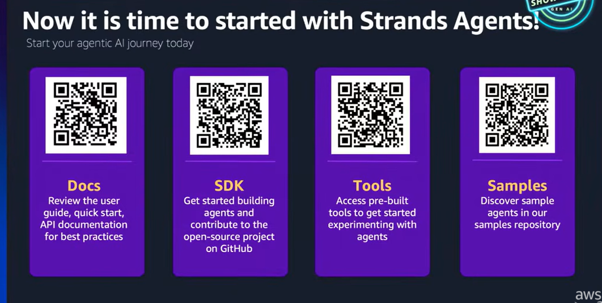
*Four places to keep building: the docs, the SDK repository, the tools library and the samples.*

- **Docs** — the user guide, quick start and API reference for best practices
- **SDK** — the open-source repository; file issues, open pull requests, contribute
- **Tools** — the `strands-agents-tools` library with 20+ pre-built tools to experiment with
- **Samples** — complete sample agents (including a personal assistant like this chapter's) to clone and extend

> **Tip**: The fastest way to level up is to take this chapter's personal assistant and add a fourth specialist — a notes agent, an email agent, or a fourth tool of your own.

---

## 🏆 Chapter Summary

In this chapter, we built a complete agentic AI application from the ground up:

- **Strands Agents** — an open-source, model-driven SDK: an agent is code + model + tools, in a few lines of Python
- **Models** — provider-flexible: Bedrock, Anthropic, OpenAI, Meta, local models, or a custom connector
- **Tools** — built-ins for common abilities, `@tool` for anything domain-specific
- **MCP** — standardized discovery and calling of external tool servers, local or remote
- **Agent state** — managed across the tool loop, sequential or parallel, until the model decides it's done
- **Multi-agent** — agents-as-tools gives you the supervisor pattern; swarms, graphs, networks and workflows cover the rest
- **AWS integration** — `retrieve` for Knowledge Bases, `use_aws` for everything boto3
- **Deployment** — Lambda, Fargate, EC2, ECS, local, or anywhere Python runs
- **Observability** — native tracing + OpenTelemetry, so you always know what your agent is doing and why

The arc of the whole course comes together here: **Chapter 1** taught what GenAI and Bedrock are, **Chapter 2** taught how AgentCore runs agents in production, and **this chapter** showed how the agents themselves get built — model-driven, tool-powered, and ready for anything.

### Watch the Original Tutorial

<VideoSection youtubeId="aijS9fWB854" title="Build your first Agentic AI app step-by-step with Strands Agents & MCP" />
