# AWS Bedrock Course — Chapter 4

*Learn how to take an AI agent from a local proof of concept to a secure, scalable, production-ready application using Amazon Bedrock AgentCore Runtime — based on the AWS Show & Tell episode "Amazon Bedrock AgentCore Deep dive series: Runtime" featuring Anil Nadimi (Senior Solutions Architect) and Shreas Subramanyan (Principal Data Scientist, AgentCore).*

# 🚀 Amazon Bedrock AgentCore Runtime — From Prototype to Production

## 🎯 Learning Objectives

By the end of this chapter, the learner will be able to:

- Explain **why taking an agent from a proof of concept to production is hard** — security, scale, isolation, state, and observability
- Describe the **layers of a real multi-agent architecture** — frontend, supervisor, sub-agents, tools and data
- Explain what **Amazon Bedrock AgentCore Runtime** is and what "fully managed, serverless agent hosting" means
- Take an existing agent — **any framework, any model** — and deploy it with minimal changes ("lift and shift")
- Explain **true session isolation** — how each session maps to its own microVM
- Describe the **runtime session lifecycle** — suspend, resume, timeout, and the 8-hour maximum
- Use the **AgentCore CLI** workflow: `configure → launch → invoke`
- Understand how the CLI **containerizes your agent** — generated Dockerfile, CodeBuild, ECR
- Build **streaming**, **synchronous**, and **asynchronous long-running** agents on Runtime
- Host an **MCP server** on AgentCore Runtime and test it with MCP Inspector
- Read **GenAI Observability traces** in CloudWatch to see what your agent did
- Explain the **Runtime API contract** — `/ping` and `/invocations` — for custom containers

---

## 4.1 🤔 Why Getting Agents Into Production Is Hard

2025 has been called **the year of agents** — and building a *proof of concept* has never been easier. Ask a coding assistant for a PoC agent and it's done in thirty seconds. The hard part is everything that comes after:

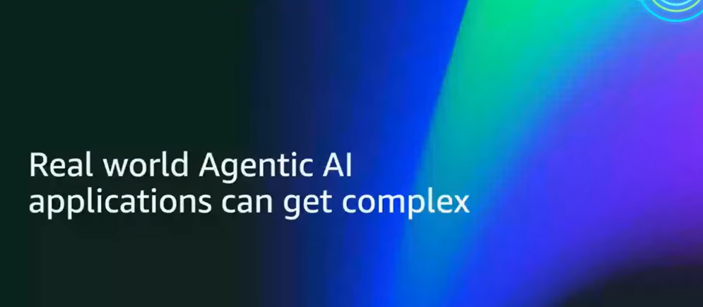
*The honest truth the episode opens with: real-world agentic applications are complex.*

A PoC answers one question on your laptop. A **production** agent has to answer tens of thousands of customers — securely, reliably, and observably. That gap is filled with problems every team has to solve on its own:

- **Security** — customers can't share access to the same backend; "security is job number one — if it could be job zero, we'd make it job zero"
- **Scalability** — if the app goes viral, does the compute scale to meet demand?
- **Authentication** — how does the *user* authenticate to the agent, and how does the *agent* authenticate to downstream tools?
- **Hosting & compute** — where do the agents run? EC2? EKS? Lambda? Who manages the instances?
- **Session & state management** — a user comes back days later; the agent should remember the conversation
- **Tool & API management** — often an entire team just maintains the bottom layer of tools and APIs
- **Observability** — when the agent misbehaves, can you trace *why*?

AWS has a name for rebuilding all of this from scratch for every project: **undifferentiated heavy lifting**.

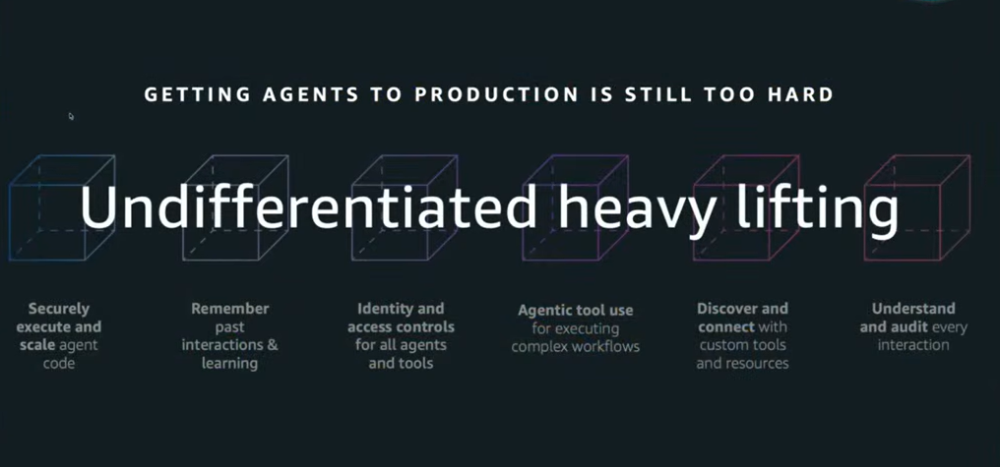
*Every customer ends up solving the same problems — hosting, isolation, auth, scale — none of which makes their agent smarter.*

> **Note**: The agent's *intelligence* is your framework, model and tools. Everything around it — compute, isolation, sessions, auth, observability — is plumbing. This chapter is about the managed service that removes that plumbing: **AgentCore Runtime**.

---

## 4.2 🏗️ Real-World Multi-Agent Architecture

To make the problem concrete, the episode uses an example we've all experienced: a **customer support agent** — the kind that either surprises you by solving your issue, or annoys you by taking too long.

Here's what a real one looks like as a logical architecture:

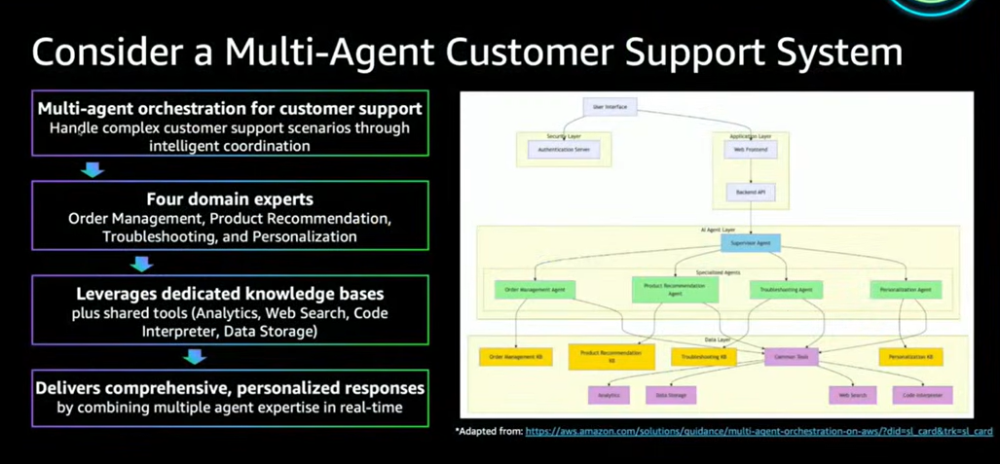
*The logical architecture: data flows top-down — UI → supervisor → sub-agents → tools.*

Reading it layer by layer:

1. **User interface** — the application frontend where the customer is chatting
2. **Supervisor agent** (blue) — coordinates back-and-forth with the user and creates tasks for sub-agents
3. **Sub-agents** — specialists: one for troubleshooting, one with access to customer-specific information via a database, and so on
4. **Tools & APIs** — the bottom layer that multiple agents share

That took thirty seconds to describe. Now imagine actually *building* it on AWS:

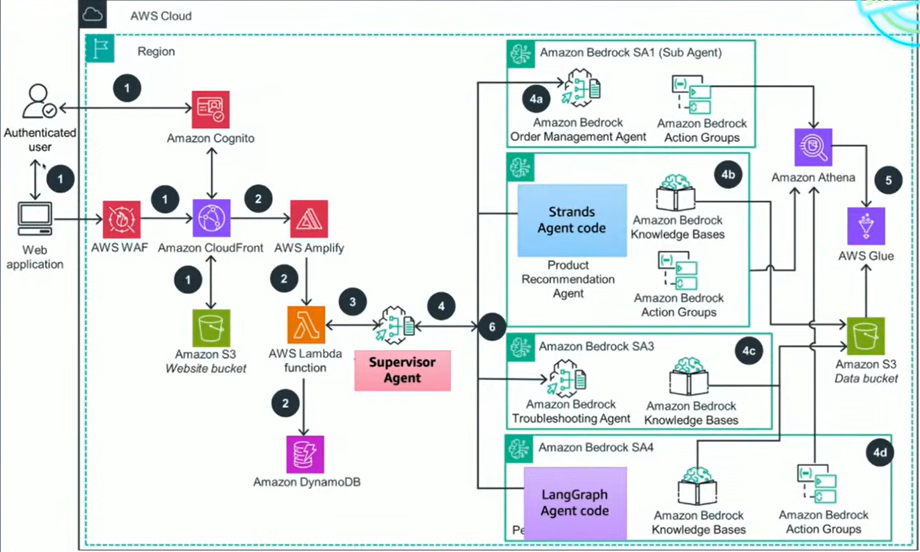
*Every icon exists for a reason — this is what "just build it on AWS" actually means.*

- **Amazon Cognito** authenticates users
- **AWS WAF** protects the frontend from DDoS and malicious traffic
- **CloudFront + Amplify + S3** serve the UI
- **Lambda functions** route requests to the supervisor agent
- **Each sub-agent** needs its own hosting — instances, pods, scaling
- **Knowledge bases, DynamoDB, Athena, Glue** hold the data the agents work on

And the callouts on the annotated version of that same diagram are the punchline — each orange note is *another thing your team has to build and operate*:

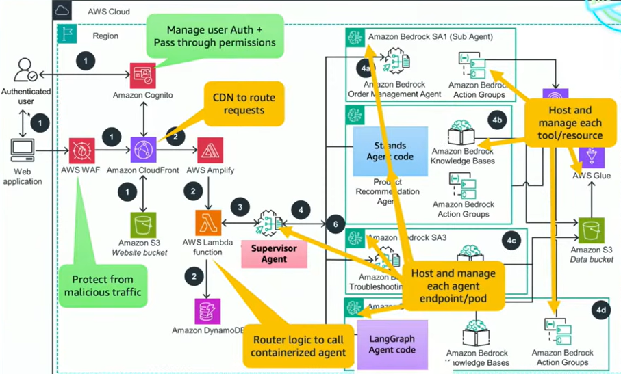
*Manage user auth · serve the frontend · protect from malicious traffic · route to the agent · host each agent endpoint · host each tool/resource.*

Six pieces of infrastructure standing between your working PoC and your first real customer. None of them make the agent better — they're all undifferentiated heavy lifting.

> **Tip**: When you see an architecture diagram this dense, ask *"which of these boxes is my actual product?"* The answer is usually just the agents and their tools. Everything else is a candidate for a managed service.

---

## 4.3 🚀 What is Amazon Bedrock AgentCore Runtime?

**Amazon Bedrock AgentCore Runtime** is a **fully managed, serverless runtime** for securely deploying and running AI agents in production. You give it your agent code; it gives you a secure, scalable, isolated endpoint.

The same customer-support architecture, re-drawn with AgentCore services:

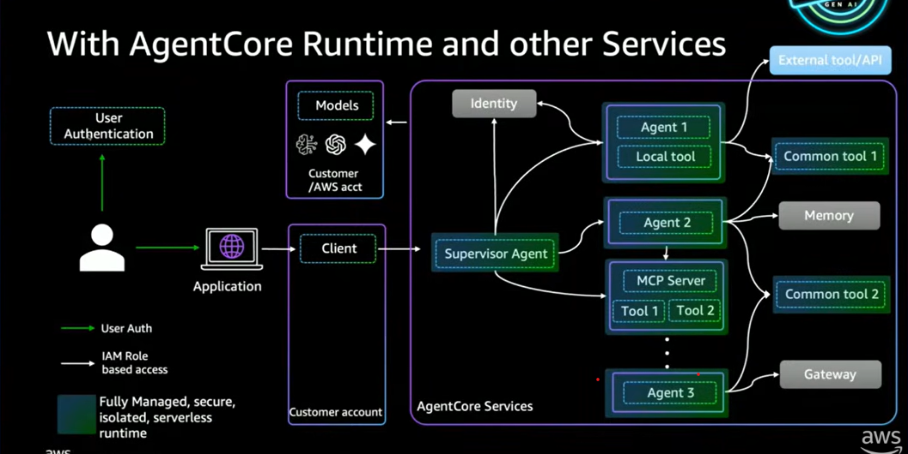
*Same application — but the green boxes (AgentCore services) absorb the heavy lifting. Today's focus is Runtime; Identity, Memory and Gateway get their own deep dives.*

The headline characteristics from the episode — the "main takeaway" slide:

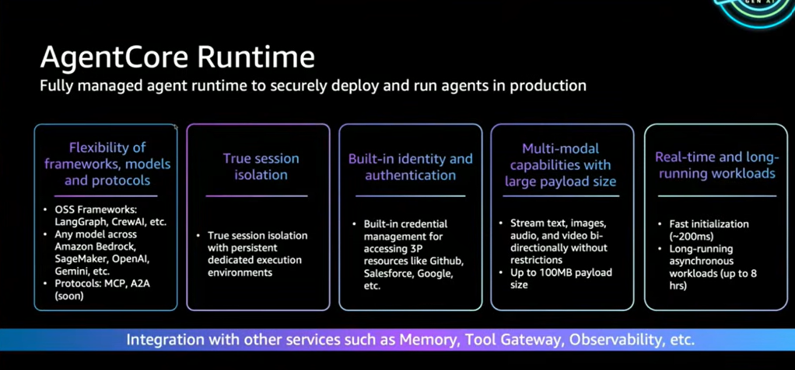
*The five things to hold on to about Runtime.*

1. **Flexibility** — any open-source framework (LangGraph, CrewAI, Strands, …), any model, protocols like MCP and A2A
2. **True session isolation** — each session runs in its own microVM (next section)
3. **Built-in identity** — works with identity providers to control who can reach the agent
4. **Multi-modal** — payloads up to **100 MB**: text, but also Excel files, images of receipts, and more
5. **Real-time + long-running** — streaming interactive agents *and* async jobs that run up to **8 hours**

And you can host **three different shapes of workload**:

- **An entire agent** — your Strands/LangGraph/CrewAI application
- **An individual tool** — a single capability exposed as an endpoint
- **An MCP server** — a shared toolbox other agents connect to

The AWS console reflects the same picture — Runtime is one service in a family designed to work together:

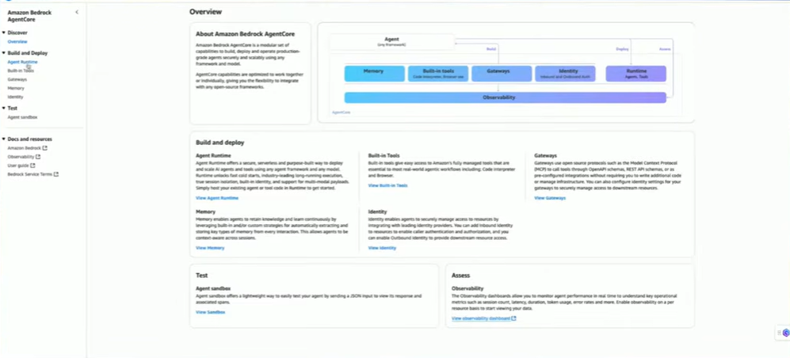
*The AgentCore console: Build & deploy (Runtime, Tools, Gateway), configure (Memory, Identity), test (Sandbox), assess (Observability).*

> **Note**: Runtime is **fully managed and serverless** — nothing runs until a request arrives, containers come up on demand, and you pay only for active CPU/memory while your code executes. All the demos in this chapter are text, but the same endpoints accept multi-modal payloads.

---

## 4.4 🧩 Any Framework, Any Model — Lift & Shift

The episode's key phrase is **lift and shift**: your starting point is *whatever you already have*.

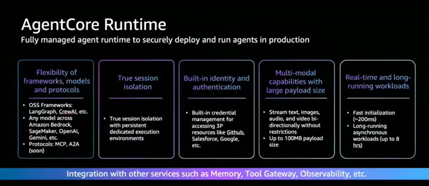
*The detailed pillar list — note the top-left box: frameworks, models and protocols are all your choice.*

Frameworks are the **orchestration layer** — they define how the agent connects to LLMs, calls tools, and runs the agent loop. Normally `pip install` a framework, connect it to any model, and you have a working agent locally. Lift and shift means:

- **Don't change your framework** — LangChain, LangGraph, CrewAI, Strands all host the same way
- **Don't change your model** — Bedrock, Anthropic, OpenAI — the runtime doesn't care which LLM your code calls
- **Don't rewrite your architecture** — a few lines of Runtime SDK code wrap your existing entry point

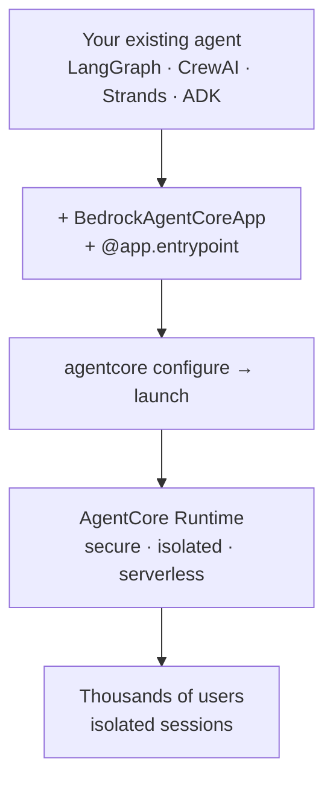
```mermaid
flowchart TD
    Agent["Your existing agent<br/>LangGraph · CrewAI · Strands · ADK"] --> Wrap["+ BedrockAgentCoreApp<br/>+ @app.entrypoint"]
    Wrap --> CLI["agentcore configure → launch"]
    CLI --> Runtime["AgentCore Runtime<br/>secure · isolated · serverless"]
    Runtime --> Users["Thousands of users<br/>isolated sessions"]
```

> **Tip**: The mental model is "*serverless container hosting, purpose-built for agents*". If your code already runs as a Python process, the delta to production is measured in lines, not weeks.

---

## 4.5 🔐 True Session Isolation

This is the differentiating feature the episode spends the most time on — and it answers a real question: *"how does AgentCore prevent data leakage between different agent sessions in multi-tenant environments?"*

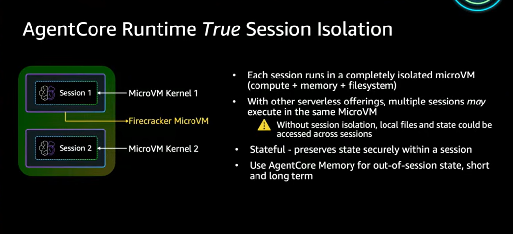
*Session 1 and Session 2 run in physically different MicroVM kernels — a hard security boundary, not just a logical one.*

How it works:

1. Every invocation carries a **session ID** — a unique identifier (at least ~33 characters; it doesn't have to be a UUID)
2. That session ID maps **one-to-one** to a dedicated **microVM** — built on **Firecracker**, the same technology behind AWS Lambda isolation
3. Compute, memory **and the local filesystem** inside that microVM belong to that session only
4. A different session ID — even one character different — points at an **entirely different microVM** with no access to the first session's agent object, conversation history, or files

The episode demonstrated this live with a Streamlit chat UI connected to a deployed agent:

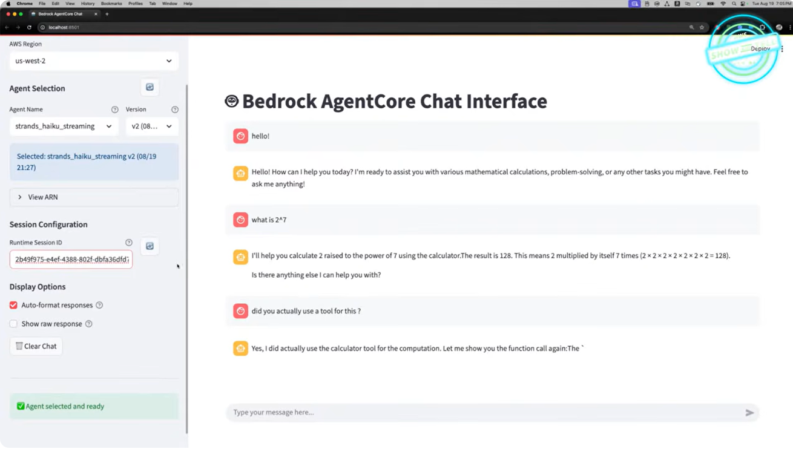
*The demo UI exposes the session ID — change it, and you're talking to a different microVM with zero shared context.*

In the demo, the same UI was pointed at a **new session ID** and asked *"summarize the conversation so far"* — the agent replied *"I don't see any conversation history"*, because its microVM had none. Same agent, same endpoint, completely isolated context.

Why this matters even for *non-sensitive* use cases: if Anil and Shreas talk to the same support agent, their conversation histories should never mix — and if the agent writes a file inside session 1's microVM, there is no way for session 2 to read it.

> **Warning**: **Session state ≠ long-term memory.** In-memory objects and files inside the microVM persist while the session is alive (up to 8 hours). To persist knowledge *across* sessions — conversation summaries, user preferences — use **AgentCore Memory**, which stores events and adds long-term summarization. That's a different service with its own deep dive.

> **Note**: In the demo the UI swaps session IDs freely to prove isolation. In production you'd pair this with **AgentCore Identity** — authenticate *who* the user is, then load only the session that belongs to them.

---

## 4.6 ⏱️ Runtime Session Lifecycle & Limits

Sessions aren't permanent — they have a defined lifecycle designed for consumption-based pricing. This slide is the one to remember:

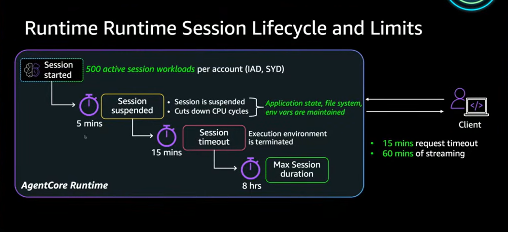
*The full lifecycle: active → suspended → timed out, plus the client-side and service limits.*

Reading the timeline:

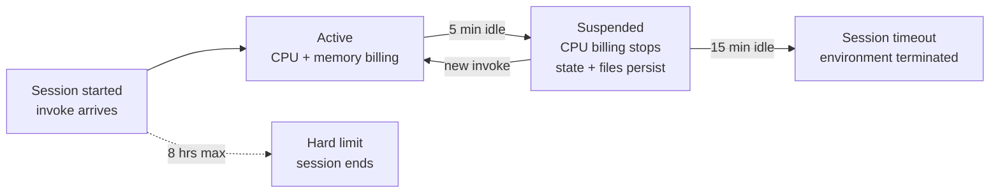
```mermaid
flowchart LR
    A["Session started<br/>invoke arrives"] --> B["Active<br/>CPU + memory billing"]
    B -->|"5 min idle"| C["Suspended<br/>CPU billing stops<br/>state + files persist"]
    C -->|"new invoke"| B
    C -->|"15 min idle"| D["Session timeout<br/>environment terminated"]
    A -.->|"8 hrs max"| E["Hard limit<br/>session ends"]
```

| Limit | Value | What it means |
|---|---|---|
| **Request timeout** | 15 min | Max for a synchronous request/response |
| **Streaming timeout** | 60 min | Yielded events/heartbeats can stream for an hour |
| **Idle → suspend** | 5 min | CPU billing stops; in-memory state and files are preserved |
| **Idle → timeout** | 15 min | The session environment is terminated |
| **Max session duration** | 8 hrs | The absolute ceiling for one session |
| **Active sessions** | ~500 (preview) | Concurrent sessions; adjustable — contact AWS for real use cases |

The pricing insight from the episode: you pay only for **active CPU and memory inside the runtime**. If a 10-minute interaction spends 5 minutes waiting on an LLM call and 3 minutes on a tool call, you're billed for roughly the 2 minutes your code actually executed — true consumption-based pricing.

> **Tip**: Suspension is why local state survives a coffee break but not forever. Design accordingly: keep working state in the session, move durable knowledge to AgentCore Memory.

---

## 4.7 💻 Build Your First AgentCore Runtime Agent

Time for the hands-on flow. The demo starts from the **AgentCore starter toolkit** — a CLI installed into your environment that owns the three main steps:

```bash
# Inside a virtual environment with the starter toolkit installed
agentcore --help
```

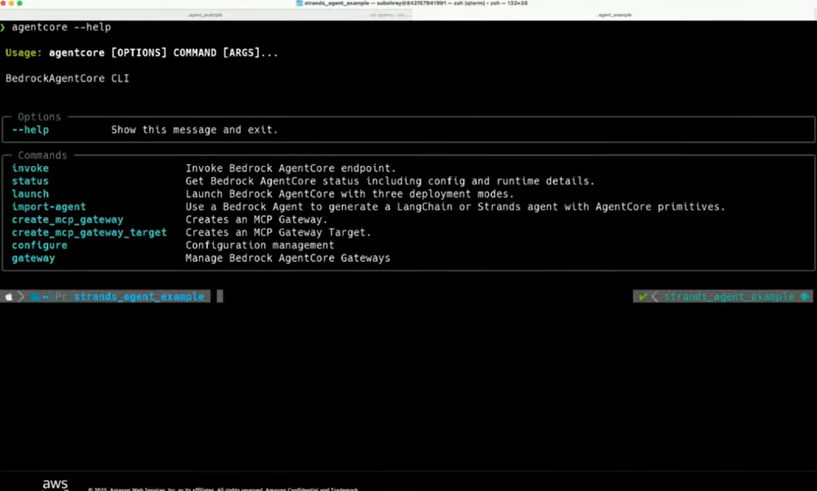
*The CLI surface: `configure`, `launch`, `invoke`, `status` — plus helpers for gateways and importing agents.*

The three commands that matter for this chapter:

- **`agentcore configure`** — point at your agent entrypoint; set name, execution role, ECR, auth
- **`agentcore launch`** — build the container (via CodeBuild or locally) and deploy the endpoint
- **`agentcore invoke`** — send a JSON payload to the running agent

The demo agent is deliberately simple — a **Strands agent with a single `calculator` tool** (which works by generating and running Python code for math). The only new code is the Runtime wrapper:

```python
# strands_agents_streaming.py — the pieces you add are tiny
from bedrock_agentcore.runtime import BedrockAgentCoreApp
from strands import Agent
from strands_tools import calculator

app = BedrockAgentCoreApp()

agent = Agent(
    system_prompt="You're a helpful assistant.",
    tools=[calculator],
)

@app.entrypoint
async def agent_invocation(payload, context):
    user_msg = payload.get("prompt", "No prompt found in input.")
    stream = agent.stream_async(user_msg)
    async for event in stream:
        if "data" in event:
            yield event["data"]

if __name__ == "__main__":
    app.run()
```

What each piece does:

- **`BedrockAgentCoreApp()`** — creates the server that Runtime will host
- **`@app.entrypoint`** — marks the function Runtime calls for each invocation; it can be a plain `def` or `async def`
- **`payload` / `context`** — `payload` is your JSON input (`{"prompt": "..."}` — the `prompt` key is *your* contract, not a Runtime requirement); `context` carries request metadata
- **`yield`** — because the function streams, each yielded chunk is sent back to the caller in real time
- **`app.run()`** — serves the app locally at development time

> **Tip**: That's the entire "port" — existing agent logic untouched, wrapped in an entrypoint. Transcript quote: *"if you're writing more than four lines of code outside AgentCore, something's wrong."*

---

## 4.8 🐳 Containerization — How Runtime Packages Your Agent

`agentcore configure` doesn't just save settings — it **generates a Dockerfile for you**. The produced file is in the explorer at the end of this section (Dockerfile tab) — *generated automatically — a standard Python slim image with two additions worth noticing*:

```dockerfile
# Generated by agentcore configure (abridged)
FROM public.ecr.aws/docker/library/python:3.12-slim
WORKDIR /app

COPY requirements.txt requirements.txt
RUN pip install -r requirements.txt
RUN pip install aws-opentelemetry-distro>=0.10.0

ENV AWS_REGION=us-west-2
ENV AWS_DEFAULT_REGION=us-west-2

RUN useradd -m -u 1000 bedrock_agentcore
USER bedrock_agentcore

EXPOSE 8080 8000
COPY . .
```

*`CMD ["opentelemetry-instrument", "python", "-m", "strands_agents_streaming"]` — observability is wired in from the start (the highlighted last line in the Dockerfile tab).*

Two details that matter:

1. **`opentelemetry-instrument`** — the container launches your agent *through* the OpenTelemetry agent, so every invoke, model call and tool call emits traces to **GenAI Observability in CloudWatch** with zero extra code
2. **Non-root user** (`bedrock_agentcore`) and a slim base — sane production defaults you didn't have to write

`agentcore launch` then orchestrates the build through **AWS CodeBuild** by default — the console shows the project it created and each build run:

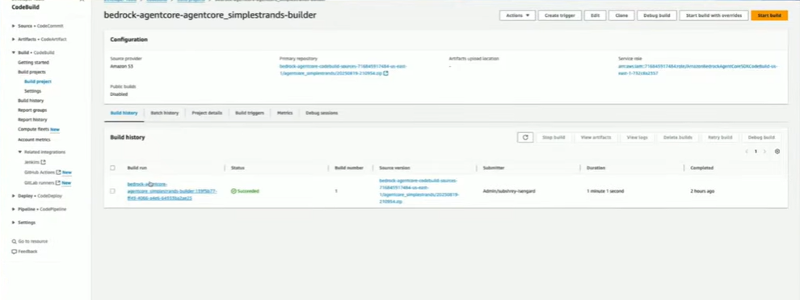
*Behind `agentcore launch`: a CodeBuild project zips your source, builds the ARM64 image, and pushes it to ECR.*

The pipeline the CLI orchestrates: **source → zip → S3 → CodeBuild → container image → ECR → agent endpoint (ARN)**. You *can* do all of it manually — write your own Dockerfile, push through your own CI/CD, associate the image to an endpoint — but the CLI collapses it into one command.

<GitHubExplorer repo="awslabs/agentcore-samples" ref="main" expanded="true" title="What gets packaged — agent, MCP server, and the generated Dockerfile" files={[
  { "path": "01-features/02-host-your-agent/01-runtime/01-hosting-agents/01-http-protocol/01-strands-bedrock/agent.py", "label": "Agent", "highlights": [[12, 20]], "note": "The HTTP agent being containerized — BedrockAgentCoreApp + @app.entrypoint." },
  { "path": "01-features/02-host-your-agent/01-runtime/02-hosting-tools/01-mcp-server-basics/mcp_server.py", "label": "MCP Server", "highlights": [[34, 45]], "note": "Same packaging path — Runtime doesn't care it's MCP, not HTTP." },
  { "path": "Dockerfile", "src": "/bedrock-deepti/code/Dockerfile.agentcore", "label": "Dockerfile", "highlights": [[12, 12], [22, 23], [32, 32]], "note": "Generated by agentcore configure — otel distro, non-root bedrock_agentcore user, CMD under opentelemetry-instrument." }
]} />

---

## 4.9 🔧 Configure → Launch → Invoke

The whole deployment workflow in three commands. Each step below is the actual terminal from the demo.

### Step 1 — `agentcore configure`

```bash
agentcore configure -e strands_agents_streaming.py --name awsntagent
```

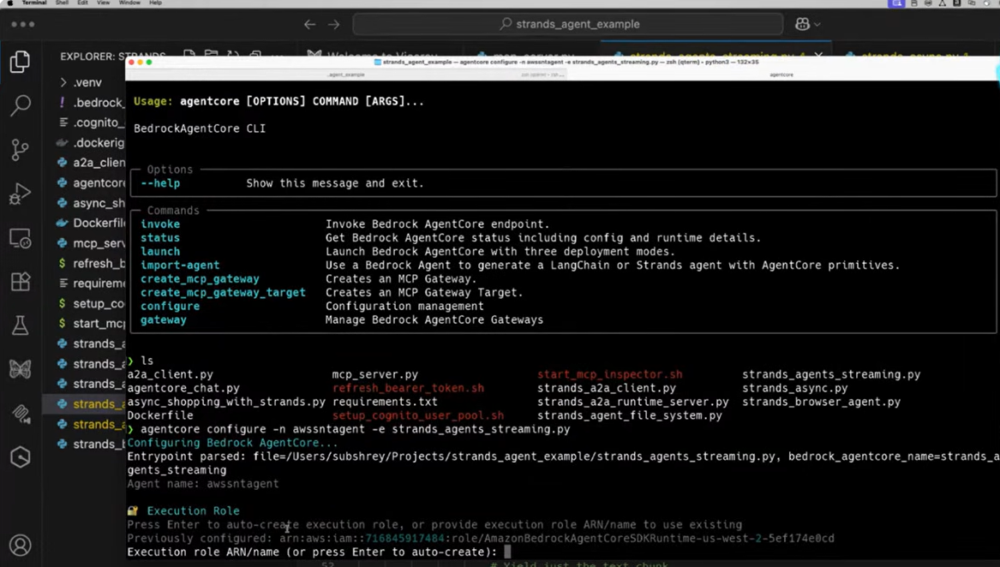
*The first prompt: the **execution role** — the IAM permissions boundary around your agent.*

The **execution role** defines what the deployed agent is allowed to touch — which AWS services it can call from inside its container. Hit enter and the CLI **auto-creates** it.

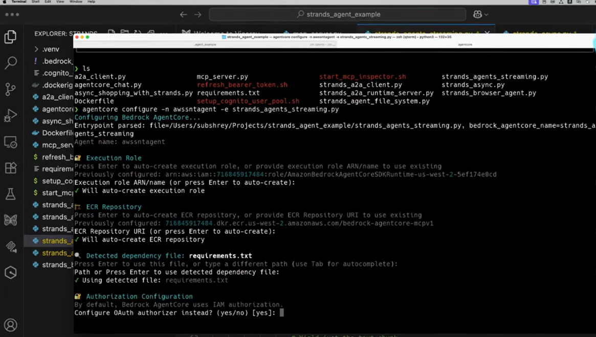
*Sensible defaults, interactively confirmed.*

The CLI also:

- **Auto-creates an ECR repository** for the container image
- **Detects `requirements.txt`** and offers to use it for the image build
- Asks about **authorization** — IAM (default) or OAuth with any identity provider, for controlling who may invoke the agent

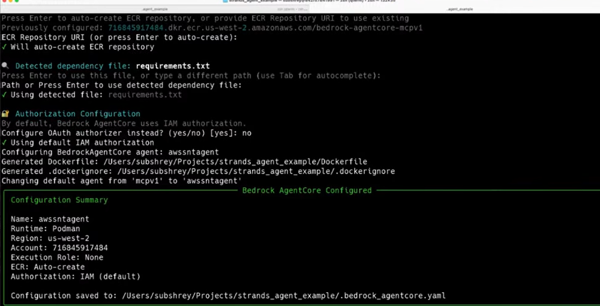
*Done: a `.bedrock_agentcore.yaml` config file plus a generated Dockerfile. Podman/Docker/Finch are all supported for local runs.*

### Step 2 — `agentcore launch`

```bash
agentcore launch            # build in the cloud via CodeBuild (default)
agentcore launch --local    # or run the container locally for dev testing
```

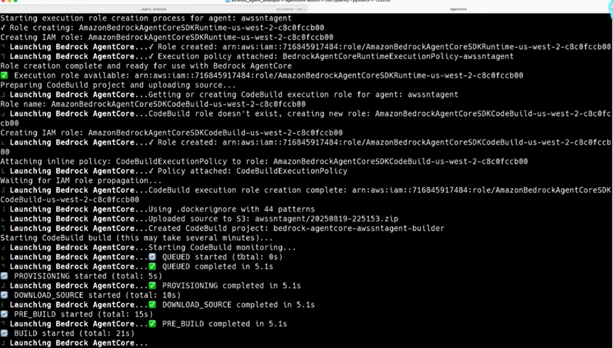
*Launch in action: source → S3 → CodeBuild phases QUEUED → PROVISIONING → BUILD.*

### Step 3 — `agentcore invoke`

```bash
agentcore invoke '{"prompt": "hello"}'
```

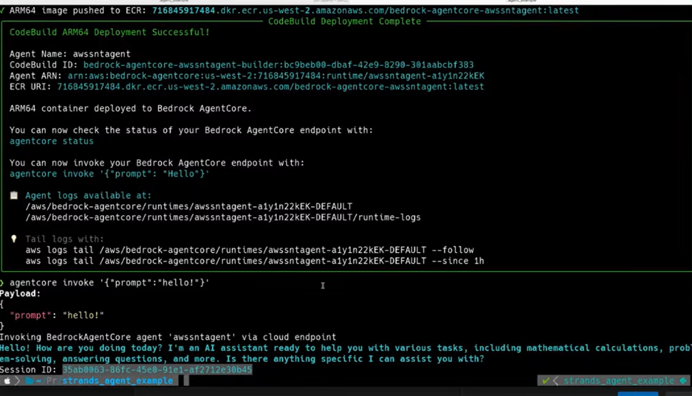
*The response streams back — note the **Session ID** printed at the end: that's the pointer to your microVM.*

The response came back quickly even though it was a **cold start** — no containers were running; one had to come up, install nothing (the image already has Strands), call Claude Haiku, and stream the answer. Subsequent invokes on the same session are faster still.

> **Tip**: That `Session ID` in the output is your handle to the isolated microVM from §4.5 — reuse it to continue a conversation with full state; change one character and you get a brand-new environment.

---

## 4.10 🧪 Local Development & Testing

`agentcore launch --local` runs the same container **on your machine** instead of deploying to AWS — and the episode calls this out as *super important*:

> *"Imagine you had a small syntax error in your file, hosted it, waited a couple of minutes, invoked… and it crashes. Test locally first."*

| | **Local (`--local`)** | **Cloud (default)** |
|---|---|---|
| Where the container runs | Your Docker/Podman/Finch | AgentCore Runtime (serverless) |
| Build | Local image build | CodeBuild → ECR |
| Iteration speed | Seconds | Minutes |
| Catches | Syntax errors, import issues, logic bugs | Real endpoint behavior, auth, scale |
| Cost | Free | Consumption-based |

The recommended loop: **develop → `launch --local` → invoke against localhost → fix → `launch` to the cloud → invoke the real endpoint**. And because launching to the real endpoint is also fast, the episode notes you can finally *test in a real environment* without a big ceremony — local for iteration, cloud for truth.

---

## 4.11 📡 Streaming Agents

The first demo agent already showed it: the entrypoint can **yield** chunks instead of returning once.

<GitHubExplorer repo="awslabs/agentcore-samples" ref="main" expanded="true" title="Streaming agent — the whole file" files={[
  { "path": "strands_agents_streaming.py", "src": "/bedrock-deepti/code/strands_agents_streaming.py", "label": "Streaming Agent", "highlights": [[18, 19], [28, 34]], "note": "Deepti's local demo file (not committed to the repo). async def + yield turns the entrypoint into a stream producer — everything else is the same Runtime contract." }
]} />

*The whole streaming agent — `async def` + `yield` turns the function into a stream producer.*

How it works:

```python
@app.entrypoint
async def agent_invocation(payload, context):
    user_msg = payload.get("prompt", "No prompt found in input.")
    stream = agent.stream_async(user_msg)   # Strands async stream
    async for event in stream:
        if "data" in event:
            yield event["data"]             # each yield → a chunk to the client
```

- **`async def` entrypoint** — Runtime accepts sync *or* async functions; async unlocks streaming
- **`agent.stream_async()`** — the Strands agent emits events as the model generates
- **`yield`** — each yielded value becomes a chunk in the HTTP response stream, so the user sees tokens appear live
- Streaming responses can run for up to **60 minutes** — useful for long generations, heartbeats and progress events

The demo invoked it with `{"prompt": "hello"}` and the greeting streamed back token-by-token — cold start included.

---

## 4.12 ⚡ Async & Long-Running Jobs

The second major capability: agents that **keep working after they've responded**.

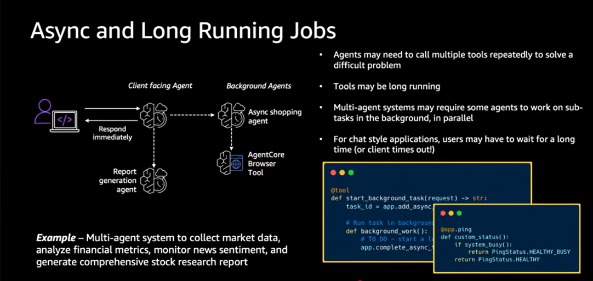
*The pattern: fast client-facing agent + slow background tasks, all inside one Runtime session.*

The motivating example: a **shopping research agent**. Real shopping takes 10–25 minutes — you don't want the user staring at a spinner. Instead:

```python
# strands_async.py — key Runtime APIs (simplified)
from bedrock_agentcore.runtime import BedrockAgentCoreApp, PingStatus

app = BedrockAgentCoreApp()

# Inside a tool: kick off a background task → returns a task_id
task_id = app.add_async_task(background_work, seconds)

# When the work finishes, mark it complete
app.complete_async_task(task_id)

# The /ping health check reports HEALTHY_BUSY while tasks run —
# telling the service "don't kill me, I'm still working"
@app.ping
def ping():
    return PingStatus.HEALTHY_BUSY
```

In the demo the agent had two tools — `start_background_task(seconds)` and `get_background_tasks()` — and the session went like this:

1. *"Start a background task for 100 seconds"* → agent calls the tool → task starts → **immediate response** ("task started")
2. *"Start another one for 200 seconds"* → a second task runs concurrently — the backend container is multi-threaded
3. *"What tasks are still running?"* → agent reports both, with elapsed times — all inside the **same session ID**

Real-world fits from the episode:

- **Travel agent** — one background task searches weather, another hotel deals, another flights
- **Shopping assistant** — 20-minute deep product research while the user keeps chatting
- **Data analysis** — crunch a large dataset, report back when done

Behind the scenes `add_async_task` makes the `/ping` health check report `HEALTHY_BUSY` — the service knows the container is still working and won't reap it. Tasks can run up to the **8-hour session maximum**.

> **Note**: *"If you have really crazy but interesting use cases beyond 8 hours, reach out to your AWS team."*

---

## 4.13 🌐 MCP Servers on AgentCore Runtime

The third shape of workload: don't host an agent at all — host a **toolbox**.

**MCP (Model Context Protocol)** is an open standard (started by Anthropic) for exposing tools to agents in a uniform way. Instead of every team duplicating the same capabilities, one team publishes an **MCP server** and every agent — any framework, all of which now have first-class MCP client support — can discover and call its tools.

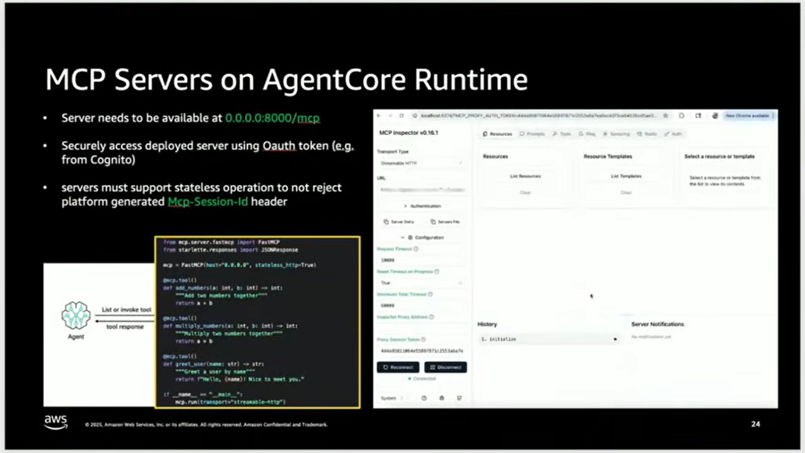
*The hosting contract: serve on `0.0.0.0:8000/mcp`, streamable HTTP, OAuth-protected.*

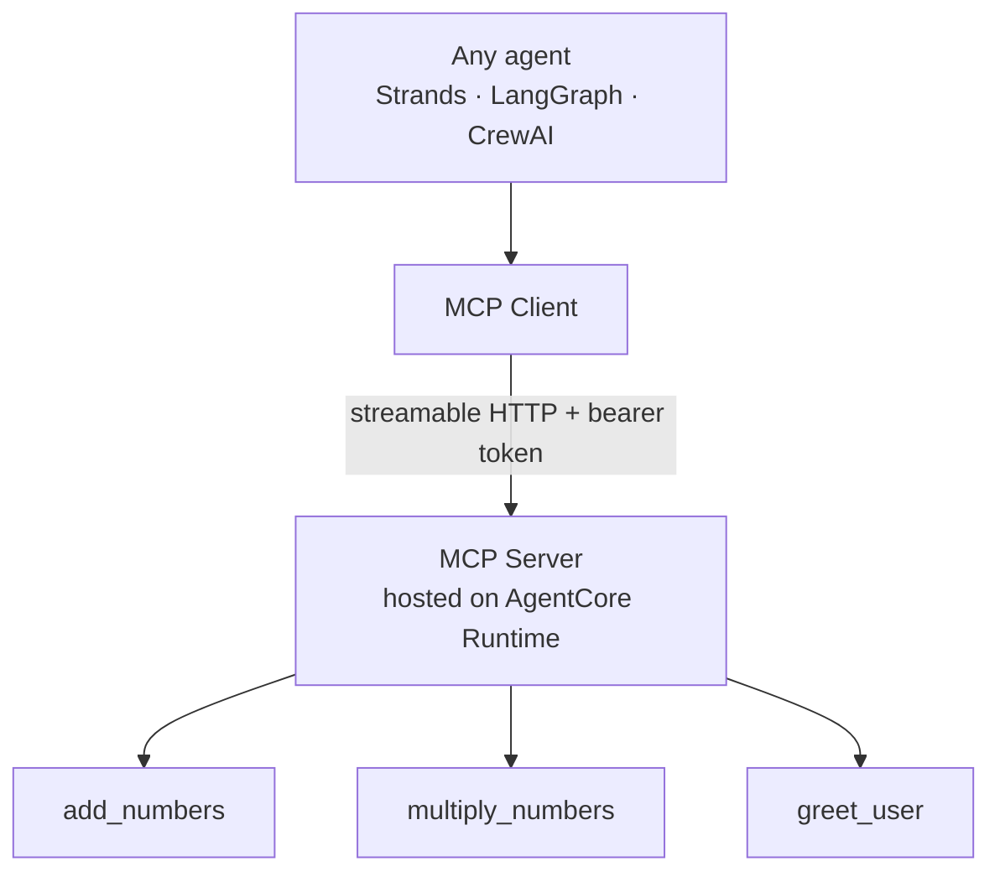
```mermaid
flowchart TD
    Agent["Any agent<br/>Strands · LangGraph · CrewAI"] --> Client["MCP Client"]
    Client -->|"streamable HTTP + bearer token"| Server["MCP Server<br/>hosted on AgentCore Runtime"]
    Server --> T1["add_numbers"]
    Server --> T2["multiply_numbers"]
    Server --> T3["greet_user"]
```

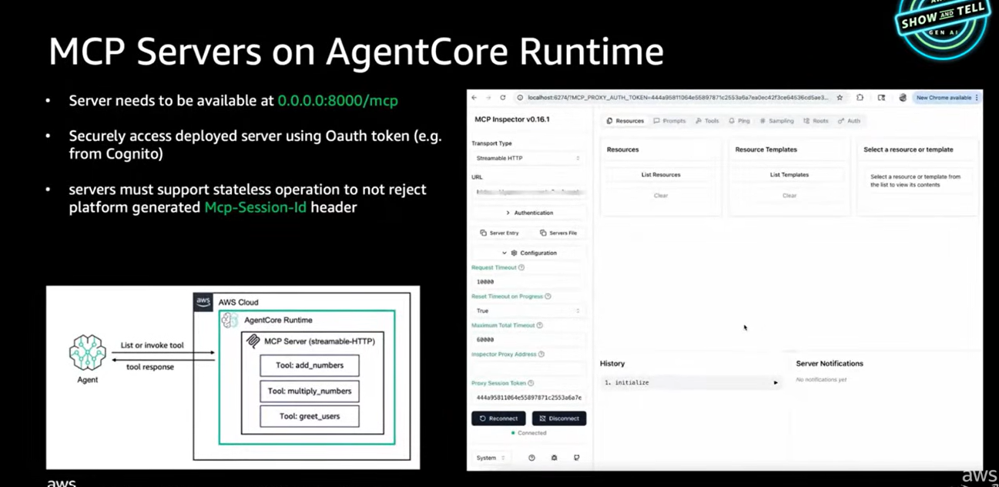
*Why it matters: teams share capabilities through MCP instead of copying tool code.*

The demo server is **the entire file** — nothing hidden. *The complete MCP server: FastMCP + three `@mcp.tool()` functions + `mcp.run(transport="streamable-http")` — also in the walkthrough explorer at the end of this section:*

```python
# mcp_server.py — the whole thing
from mcp.server.fastmcp import FastMCP

mcp = FastMCP(host="0.0.0.0", stateless_http=True)

@mcp.tool()
def add_numbers(a: int, b: int) -> int:
    """Add two numbers together"""
    return a + b

@mcp.tool()
def multiply_numbers(a: int, b: int) -> int:
    """Multiply two numbers together"""
    return a * b

@mcp.tool()
def greet_user(name: str) -> str:
    """Greet a user by name"""
    return f"Hello, {name}! Nice to meet you."

if __name__ == "__main__":
    mcp.run(transport="streamable-http")
```

Deployment is the **same three commands** — `configure`, `launch`, invoke — with **zero code changes** to the MCP server. Works with FastMCP, the MCP SDK, or TypeScript MCP servers alike. The difference: instead of invoking an agent, clients get *authenticated access to tools*.

> **Note**: The Runtime handles it serverlessly — *"nothing is running now; it only starts when accessed."* In production the topology is often an agent container on Runtime calling **another** Runtime container hosting the MCP server.

<GitHubExplorer repo="awslabs/agentcore-samples" ref="main" expanded="true" title="MCP server on Runtime — full walkthrough" files={[
  { "path": "01-features/02-host-your-agent/01-runtime/02-hosting-tools/01-mcp-server-basics/mcp_server.py", "label": "MCP Server", "highlights": [[34, 45]], "note": "The whole file — FastMCP + @mcp.tool() + mcp.run('streamable-http'). The Dockerfile isn't in the repo: agentcore configure generates it (see §4.8)." },
  { "path": "01-features/02-host-your-agent/01-runtime/02-hosting-tools/01-mcp-server-basics/deploy.py", "label": "Deploy", "note": "Same deploy path as agents — Runtime doesn't care it's MCP." },
  { "path": "01-features/02-host-your-agent/01-runtime/02-hosting-tools/01-mcp-server-basics/invoke.py", "label": "Invoke", "note": "Authenticated streamable-HTTP client — the Inspector does the same handshake." },
  { "path": "Dockerfile", "src": "/bedrock-deepti/code/Dockerfile.agentcore", "label": "Dockerfile", "highlights": [[12, 12], [22, 23], [32, 32]], "note": "Generated by agentcore configure — not shipped in the repo. Same file packages the MCP server." },
  { "path": "01-features/02-host-your-agent/01-runtime/02-hosting-tools/01-mcp-server-basics/requirements.txt", "label": "Deps" },
  { "path": "01-features/02-host-your-agent/01-runtime/02-hosting-tools/01-mcp-server-basics/README.md", "label": "Docs" }
]} />

---

## 4.14 🧪 MCP Inspector Demo

**MCP Inspector** is the standard test client for MCP servers — and it works against a serverless MCP server on Runtime exactly like a local one.

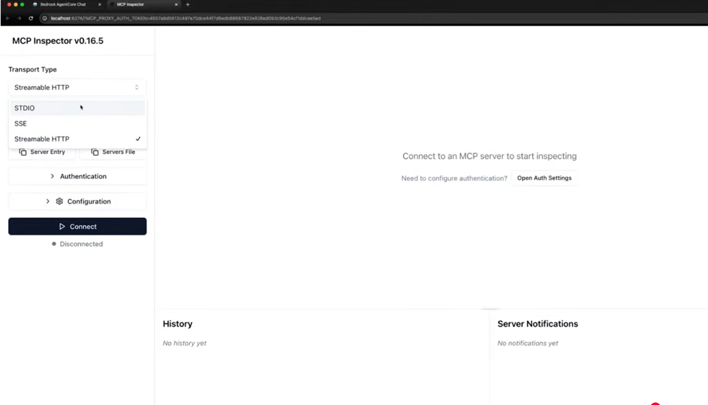
*Transport selection: **Streamable HTTP** is now the standard for remote MCP servers; **stdio** is the common choice for local ones (e.g. a coding agent inside VS Code).*

Connecting to the deployed server takes two things — the endpoint URL (the long `bedrock-agentcore` ARN-based URL) and auth:

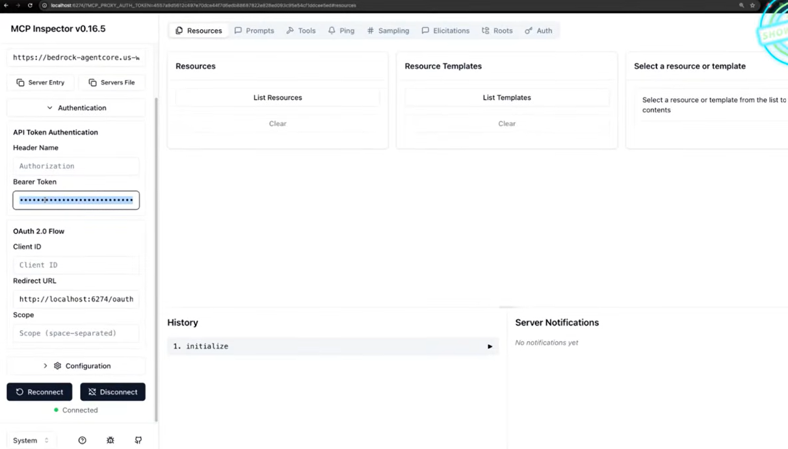
*The Bearer token is the authorization for the serverless endpoint — the demo used a 60-minute token; use much shorter in practice.*

> **Warning**: An MCP endpoint URL pasted in a chat is usable by anyone who has it — that's exactly why the bearer token (or OAuth) matters. Never treat the URL itself as the secret.

Once connected, **List Tools** shows the server's catalog — `add_numbers`, `multiply_numbers`, `greet_user` — each with its input schema and output schema:

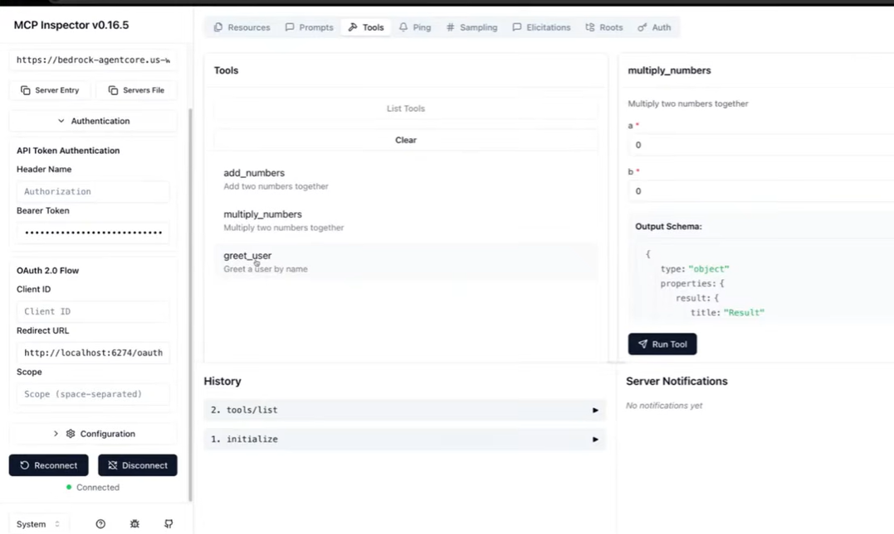
*`tools/list` over the wire: typed inputs (`a`, `b`) and a declared output schema — discovery is the protocol.*

And running `greet_user` proves it end-to-end:

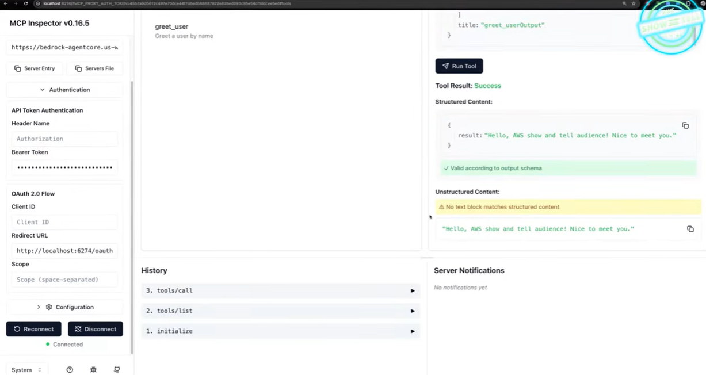
*`tools/call` → structured content → schema-validated. That response came off a cold start, and it was still quick.*

The History panel tells the protocol story: `initialize` → `tools/list` → `tools/call` — standard MCP, just over authenticated streamable HTTP to a serverless backend.

---

## 4.15 📊 Observability & Tracing

Remember the `opentelemetry-instrument` line in the generated Dockerfile? This is where it pays off. Inside the agent's console page, **"View observability"** jumps to a CloudWatch tab called **GenAI Observability**:

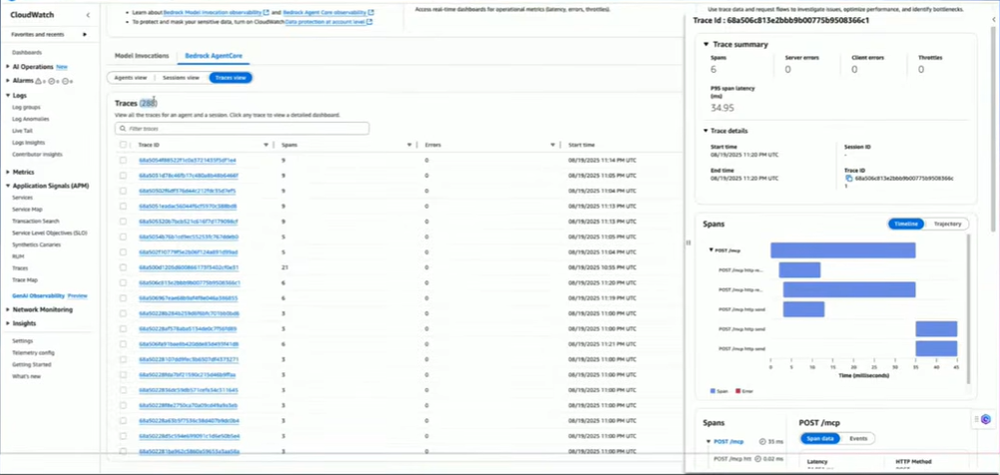
*Agents view → Sessions view → Traces view. 288 traces, zero instrumentation code written.*

What you get for free:

- **Agent view** — every agent hosted on Runtime (the streaming agent, the async one, the MCP server — even agents on other frameworks like ADK)
- **Sessions view** — all session IDs that ran
- **Traces view** — every invocation as a trace composed of **spans**

A typical agent trace reads like a story: **invoke arrives → agent calls the LLM → LLM returns a tool decision → tool executes → another LLM call → response**. When a tool errors, the span shows exactly where — *"here's my invoke, it became this instruction, then called a tool, and the tool errored out"* is a question traces answer visually instead of through log archaeology.

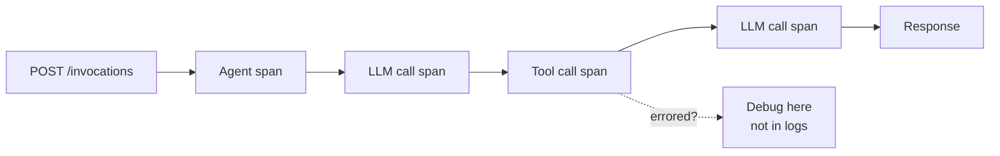
```mermaid
flowchart LR
    I["POST /invocations"] --> A["Agent span"]
    A --> L["LLM call span"]
    L --> T["Tool call span"]
    T --> L2["LLM call span"]
    L2 --> R["Response"]
    T -.->|"errored?"| DBG["Debug here<br/>not in logs"]
```

> **Tip**: It works "out of the bat" — no OTel setup, no telemetry code. As long as the agent runs on Runtime, telemetry flows into GenAI Observability. A dedicated observability deep dive is planned in the series.

---

## 4.16 🔄 Runtime Versions & Endpoints

The console's **Agent Runtime** page lists everything deployed:

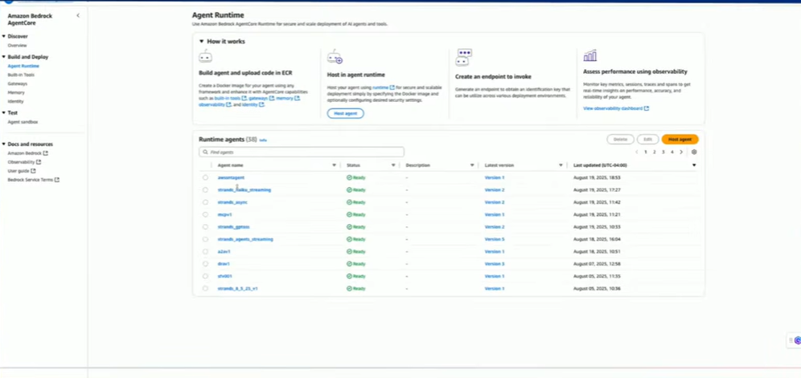
*All the demo agents, Ready — note the Version column.*

Open one and you get the operational view:

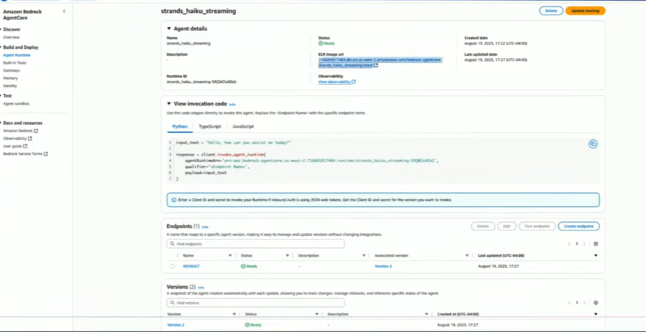
*One agent's detail page — everything needed to operate and invoke it.*

Three things to notice:

1. **ECR image URL** — the deployed container lives in the auto-created registry
2. **View invocation code** — ready-made boto3 snippets (`client.invoke_agent_runtime(...)`) in Python, TypeScript and JavaScript — the Streamlit demo UI was calling exactly this API behind the scenes
3. **Endpoints & Versions** — every `agentcore launch` creates a new **version**; the **DEFAULT endpoint** always tracks the latest. Ship a change, launch again → version 3 → DEFAULT points at it. Named endpoints let you pin integrations to a specific version.

> **Note**: Everything the CLI does is also available through **boto3** — `invoke_agent_runtime` and friends — for teams who prefer API-driven pipelines.

---

## 4.17 🧱 AgentCore Runtime API Contract

What if you don't want the SDK's "magic" — the `BedrockAgentCoreApp` wrapper? The episode's answer: **follow the contract and bring any container**.

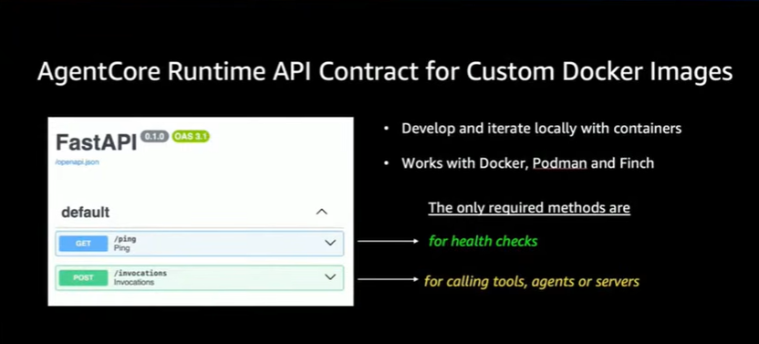
*The entire contract: two endpoints.*

| Endpoint | Purpose |
|---|---|
| **`GET /ping`** | Health check — report healthy, busy (long-running work), or unhealthy |
| **`POST /invocations`** | The main business logic — call an agent, a tool, whatever you want |

- Build your own server (the slide shows a FastAPI example exposing exactly these two routes)
- Iterate locally with Docker, Podman or Finch
- Deploy to Runtime the same way — `/invocations` is where *your* code runs

This means the lift-and-shift promise extends to **arbitrary containers**: as long as the contract is honored, Runtime will host it — though agents, tools and MCP servers are what it's *most* suited for, thanks to session isolation, identity and observability.

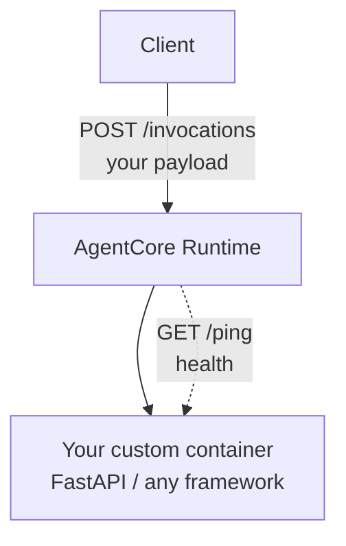
```mermaid
flowchart TD
    Client["Client"] -->|"POST /invocations<br/>your payload"| Runtime["AgentCore Runtime"]
    Runtime --> Container["Your custom container<br/>FastAPI / any framework"]
    Runtime -.->|"GET /ping<br/>health"| Container
```

---

## 4.18 🧠 When Should You Use AgentCore Runtime?

Pulling it together — Runtime is the right fit when your workload looks like:

| Use case | Why Runtime fits |
|---|---|
| **Production agents** | Fully managed, serverless, scales to tens of thousands of users |
| **Multi-user applications** | True session isolation — per-session microVM, no shared state |
| **Secure / sensitive workloads** | Hard isolation boundary + IAM/OAuth auth + built-in identity |
| **Streaming agents** | Async entrypoints yield chunks; 60-minute streams |
| **Long-running jobs** | Background tasks with `add_async_task`; sessions up to 8 hours |
| **MCP servers** | Zero-code-change hosting; authenticated streamable HTTP |
| **Framework-based agents** | LangGraph, CrewAI, Strands, ADK — no rewrite |
| **Custom containers** | `/ping` + `/invocations` contract → host almost anything |
| **Multi-modal payloads** | Up to 100 MB — Excel files, receipt images, documents |

And it compounds with the other AgentCore services: **Memory** for out-of-session persistence, **Identity** for per-user auth, **Gateway** for governed tool access, **Observability** for the traces you just saw.

> **Tip**: The episode's closing challenge — *"if you're hiring a big team or writing more than four lines of code outside AgentCore, something's wrong."* Start with the samples, deploy your first agent, and go the managed way.

---

## 4.19 💻 Chapter 04 Git Repository — Get the Code

Everything in this chapter has working samples in the official AWS AgentCore repository — clone it and follow along:

- 🚀 **Runtime samples** — [awslabs/agentcore-samples → 01-features/02-host-your-agent/01-runtime](https://github.com/awslabs/agentcore-samples/tree/main/01-features/02-host-your-agent/01-runtime) — hosting agents, tools and MCP servers on Runtime
- 🧵 **Strands + Bedrock agent** — [01-hosting-agents/01-http-protocol/01-strands-bedrock](https://github.com/awslabs/agentcore-samples/tree/main/01-features/02-host-your-agent/01-runtime/01-hosting-agents/01-http-protocol/01-strands-bedrock) — the same pattern as this chapter's demo
- 🌐 **MCP server hosting** — [02-hosting-tools/01-mcp-server-basics](https://github.com/awslabs/agentcore-samples/tree/main/01-features/02-host-your-agent/01-runtime/02-hosting-tools/01-mcp-server-basics) — deploy a FastMCP server to Runtime
- 📦 **Repository root** — [github.com/awslabs/agentcore-samples](https://github.com/awslabs/agentcore-samples) — Memory, Gateway, Identity, Observability and use-case samples too

<GitHubExplorer repo="awslabs/agentcore-samples" ref="main" expanded="true" title="Host a Strands agent on Runtime — full walkthrough" files={[
  { "path": "01-features/02-host-your-agent/01-runtime/01-hosting-agents/01-http-protocol/01-strands-bedrock/agent.py", "label": "Agent", "highlights": [[12, 20]], "note": "BedrockAgentCoreApp + @app.entrypoint is the entire Runtime contract." },
  { "path": "01-features/02-host-your-agent/01-runtime/01-hosting-agents/01-http-protocol/01-strands-bedrock/deploy.py", "label": "Deploy", "note": "Programmatic deploy — same result as the agentcore CLI." },
  { "path": "01-features/02-host-your-agent/01-runtime/01-hosting-agents/01-http-protocol/01-strands-bedrock/invoke.py", "label": "Invoke", "note": "boto3 invoke_agent_runtime — the production invocation path." },
  { "path": "01-features/02-host-your-agent/01-runtime/01-hosting-agents/01-http-protocol/01-strands-bedrock/requirements.txt", "label": "Deps" }
]} />

---

## 4.20 🔬 Practical Lab — Deploy a Strands Agent to AgentCore Runtime

Hands-on: take a working Strands agent through the full configure → launch → invoke pipeline.

**Objective** — deploy a calculator-enabled Strands agent to AgentCore Runtime, invoke it, then prove session isolation with a second session.

**Prerequisites** — Python 3.10+, AWS credentials configured, a container runtime (Docker/Podman/Finch), and `pip install bedrock-agentcore-starter-toolkit strands-agents strands-agents-tools`.

### Step 1 — Set up the environment

```bash
python -m venv .venv && source .venv/bin/activate
pip install bedrock-agentcore-starter-toolkit strands-agents strands-agents-tools
agentcore --help   # confirm the CLI is installed
```

### Step 2 — Write the agent

Create `strands_agents_streaming.py` using the code from §4.7 — `BedrockAgentCoreApp`, a Strands `Agent` with the `calculator` tool, and an `@app.entrypoint` async function that streams events. Add a `requirements.txt` listing the strands packages.

### Step 3 — Configure

```bash
agentcore configure -e strands_agents_streaming.py --name my_first_agent
```

Accept the prompts: auto-create the **execution role**, auto-create the **ECR repository**, use the detected `requirements.txt`, keep IAM authorization. Inspect what was generated — `Dockerfile`, `.dockerignore`, `.bedrock_agentcore.yaml`.

### Step 4 — Test locally first

```bash
agentcore launch --local
agentcore invoke '{"prompt": "what is 2 to the power of 7?"}'
```

Verify the streamed response before touching the cloud.

### Step 5 — Deploy

```bash
agentcore launch
agentcore status
```

Watch the CodeBuild phases run; when it finishes you get an **agent ARN** and ECR URI.

### Step 6 — Invoke and capture the session

```bash
agentcore invoke '{"prompt": "hello"}'
```

Copy the **Session ID** from the output. Invoke again with a follow-up like *"did you use a tool?"* on the same session — the agent should remember context.

### Step 7 — Prove session isolation

Change one character of the session ID (or let the CLI mint a new one) and ask *"summarize the conversation so far."* Expected: **"I don't see any conversation history"** — you're on a different microVM.

### Step 8 — Observe

AWS Console → Bedrock AgentCore → your agent → **View observability**. In CloudWatch GenAI Observability, open Traces and find your invoke — you should see the agent span with the LLM call and the `calculator` tool call inside it.

### Hints

- **Build fails?** Check `requirements.txt` — the CLI uses it verbatim for the image
- **Invoke errors?** `agentcore status` shows deployment state; CodeBuild console shows the build log
- **Session seems to share state?** Confirm you actually changed the session ID — same ID = same microVM = full history

---

## 4.21 🧠 Knowledge Check

Q1: What problem does AgentCore Runtime primarily solve?
- A) It trains better foundation models
- B) It provides fully managed, serverless hosting for agents — handling security, isolation, scaling and deployment (Correct)
- C) It replaces agent frameworks like Strands and LangGraph
- D) It is a vector database for agent memory

**Explanation**: Runtime is the hosting layer — it takes your existing agent (any framework, any model) and runs it securely at production scale, removing the undifferentiated heavy lifting.

Q2: How does AgentCore Runtime isolate sessions?
- A) Each session gets a separate database row
- B) Each session ID maps to its own microVM with dedicated compute, memory and filesystem (Correct)
- C) Sessions are separated by API keys
- D) All sessions share one container but different threads

**Explanation**: Session isolation is built on Firecracker microVMs — a hard boundary. A different session ID means a different microVM with no access to the other's state, objects or files.

Q3: What is the role of Amazon ECR in the deployment flow?
- A) It runs the agent's LLM inference
- B) It stores the container image the CLI builds via CodeBuild, which Runtime then deploys (Correct)
- C) It authenticates end users
- D) It stores session state

**Explanation**: `agentcore launch` builds your code into a container image, pushes it to ECR, and associates that image with your agent endpoint (ARN).

Q4: What's the difference between `agentcore launch` and `agentcore launch --local`?
- A) `--local` skips the Dockerfile
- B) `--local` runs the container on your machine for fast dev iteration; the default builds via CodeBuild and deploys to the cloud (Correct)
- C) `--local` is for MCP servers only
- D) They are identical

**Explanation**: Local launch hosts the same container locally — critical for catching syntax/runtime errors in seconds instead of waiting for a cloud deploy.

Q5: In the streaming example, what makes the response arrive token-by-token?
- A) The CLI polls the endpoint repeatedly
- B) The @app.entrypoint function is async and yields each stream event as it arrives (Correct)
- C) The model generates faster
- D) CloudWatch streams the logs

**Explanation**: An `async def` entrypoint that `yield`s events turns the function into a stream producer — each yield becomes a chunk in the response stream (up to 60 minutes).

Q6: Why use `app.add_async_task` for long-running work?
- A) It makes the code run faster
- B) It registers a background task so the agent can respond immediately while work continues — and /ping reports HEALTHY_BUSY so the session isn't reaped (Correct)
- C) It's required for streaming
- D) It reduces ECR storage costs

**Explanation**: Background tasks let a 20-minute research job run while the user keeps chatting in the same session — the agent can report task IDs and status on subsequent invokes.

Q7: What transport did the demo use to connect MCP Inspector to the hosted MCP server?
- A) stdio
- B) Streamable HTTP (Correct)
- C) gRPC
- D) WebSockets

**Explanation**: Streamable HTTP is the standard for remote MCP servers; stdio is typical for local servers (e.g., a coding agent inside your IDE). The connection was authorized with a bearer token.

Q8: What does GenAI Observability in CloudWatch show for a Runtime agent?
- A) Only billing data
- B) Traces composed of spans — invoke → LLM calls → tool calls → response, plus agent and session views (Correct)
- C) Only the agent's stdout logs
- D) The Docker build history

**Explanation**: The generated Dockerfile runs your agent under `opentelemetry-instrument`, so every invoke produces a trace with spans — letting you see exactly which tool call errored without extra instrumentation.

Q9: What are the only two endpoints required by the Runtime API contract for custom containers?
- A) /health and /run
- B) GET /ping (health) and POST /invocations (business logic) (Correct)
- C) /invoke and /stream
- D) /start and /stop

**Explanation**: Follow that contract and you can host almost anything in Runtime — the SDK's BedrockAgentCoreApp is convenience, not a requirement.

Q10: How long can a Runtime session persist, and what happens at 5 minutes idle?
- A) Sessions last forever; nothing happens at 5 minutes
- B) Max 8 hours; at 5 minutes idle the session suspends — CPU billing stops but state/files persist until the 15-minute timeout (Correct)
- C) Max 15 minutes total
- D) Sessions end after every invoke

**Explanation**: Suspend-at-5-minutes / timeout-at-15-minutes / ceiling-at-8-hours is the consumption model — and for state beyond the session, use AgentCore Memory.

---

## 4.22 🔧 Troubleshooting & Common Pitfalls

### Agent works locally but fails after `agentcore launch`

Test with `agentcore launch --local` first — that runs the identical container path on your machine. Most causes are missing dependencies in `requirements.txt` or code that assumes local files/services unavailable in the microVM.

### Invoked agent says "no conversation history" — but there was one

Check the session ID. One changed character points at a *different microVM* — that's isolation working as designed. Persist knowledge across sessions with AgentCore Memory instead of relying on in-session state.

### Second invoke is slow even though the first worked

If ~15 minutes passed without activity, the session timed out and the environment was terminated — the next invoke is a cold start. Between 5–15 minutes idle the session is suspended (state kept, CPU off); past 15 minutes it's gone.

### MCP Inspector can't connect to my hosted server

Confirm transport is **Streamable HTTP** (not stdio/SSE), the URL is the full runtime MCP endpoint (`…/mcp`), and the **Authorization bearer token** is present and unexpired.

### Background task got killed mid-run

If `/ping` doesn't report `HEALTHY_BUSY`, the service assumes the container is idle. Make sure tasks are started through `app.add_async_task(...)` and completed with `app.complete_async_task(task_id)` — that's what keeps the health signal honest.

### Image build failed in CodeBuild

Open the CodeBuild console — the `bedrock-agentcore-*-builder` project keeps full build logs. The usual suspects: bad `requirements.txt`, missing source files excluded by `.dockerignore`, or platform issues (images build for ARM64).

---

## 🏆 Chapter Summary

The complete journey this chapter walked:

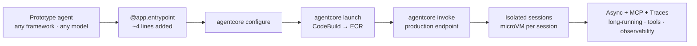
```mermaid
flowchart LR
    A["Prototype agent<br/>any framework · any model"] --> B["@app.entrypoint<br/>~4 lines added"]
    B --> C["agentcore configure"]
    C --> D["agentcore launch<br/>CodeBuild → ECR"]
    D --> E["agentcore invoke<br/>production endpoint"]
    E --> F["Isolated sessions<br/>microVM per session"]
    F --> G["Async + MCP + Traces<br/>long-running · tools · observability"]
```

- **The gap** — PoC → production is undifferentiated heavy lifting: auth, WAF, hosting, sessions, tools, observability
- **The service** — AgentCore Runtime: fully managed, serverless, secure agent hosting
- **The contract** — any framework, any model; agent / tool / MCP server; `/ping` + `/invocations` for custom containers
- **The isolation** — session ID → dedicated Firecracker microVM; files and state never cross sessions
- **The lifecycle** — suspend at 5 min idle, timeout at 15 min, ceiling at 8 hrs; pay only for active CPU/memory
- **The workflow** — `configure → launch → invoke`; `--local` for the dev loop
- **The extras** — streaming entrypoints, async background tasks, MCP server hosting, OTel traces in CloudWatch, versioned endpoints

**Chapter 2** introduced AgentCore as a family; **Chapter 3** built the agents themselves with Strands; **this chapter** took those agents to production — securely, at scale, in three commands.

### Watch the Original Tutorial

<VideoSection youtubeId="wizEw5a4gvM" title="Amazon Bedrock AgentCore Deep dive series: Runtime | AWS Show and Tell" />
