# AWS Bedrock Course — Chapter 5

*Learn how Amazon Bedrock AgentCore Gateway turns your existing APIs, Lambda functions and services into secure, governed MCP tools that any agent can discover and call — based on the AWS Show & Tell episode "Amazon Bedrock AgentCore Deep dive series: Gateway" featuring Dul Patel (Principal Generative AI Architect) and Nick Aldridge (Principal Engineer, MCP & A2A steering committees).*

# 🚪 Amazon Bedrock AgentCore Gateway — Connecting Agents to Tools at Scale

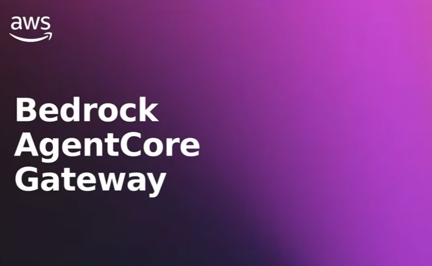

## 🎯 Learning Objectives

By the end of this chapter, the learner will be able to:

- Explain **why agents need tools** and why the **M × N** agent-to-tool problem demands a standard protocol
- Describe what **MCP** standardizes — discovery, invocation, typed schemas — and what it *doesn't* solve for you
- List what makes an **MCP server "production grade"** — hosting, scaling, OAuth, observability, audit, spec-version maintenance
- Explain **AgentCore Gateway** as a fully managed, serverless MCP endpoint in front of your tools
- Describe **Gateway targets** — Lambda, OpenAPI and Smithy — as logical groupings of APIs
- Explain **inbound authorization** (who may call the Gateway) vs **outbound authorization** (how the Gateway calls your APIs)
- Configure a **Cognito inbound authorizer** and outbound **credential providers** (API key, OAuth, IAM role)
- Distinguish the **control plane** (create/configure) from the **data plane** (list tools, invoke tools)
- Explain **semantic tool search** and why it matters once a gateway holds hundreds of tools
- Connect **any MCP-compliant client** — MCP Inspector, a Strands agent, an IDE — to a Gateway

---

## 5.1 🤔 Why Do Agents Need a Gateway?

Step back first: what does a typical agentic application actually look like?

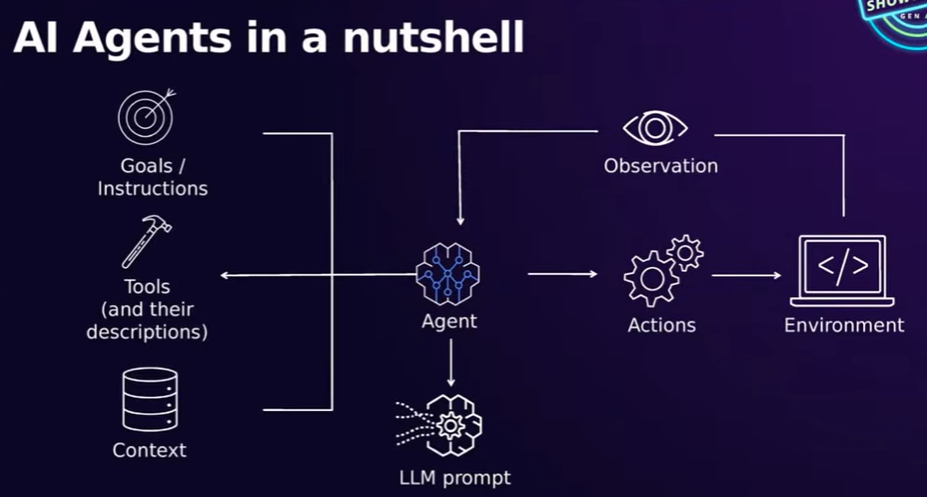
*The agent loop: goals + tools + context → LLM reasoning → actions → observations → repeat.*

The ingredients, straight from the episode:

- **An agentic framework** — LangChain, LangGraph, Strands — the orchestration layer
- **An LLM** — the reasoning brain (Amazon Bedrock hosts plenty of state-of-the-art choices)
- **Tools** — the APIs and business logic the agent uses to orchestrate workflows and answer questions. *"Tools are extremely important for agents to work — it's a power engine."*

So far so simple — one agent, a few tools:

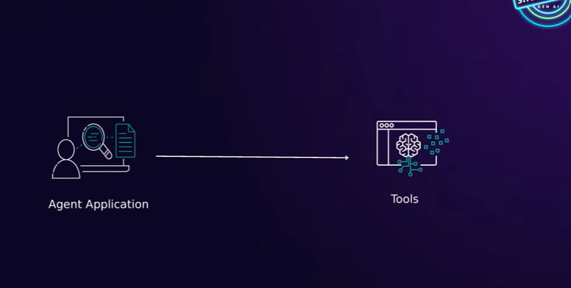
*One agent calling its tools directly — easy.*

Now scale it. Real organizations don't have one agent and three tools — they have **M agents** that each need some subset of **N tools**, and the number of combinations explodes:

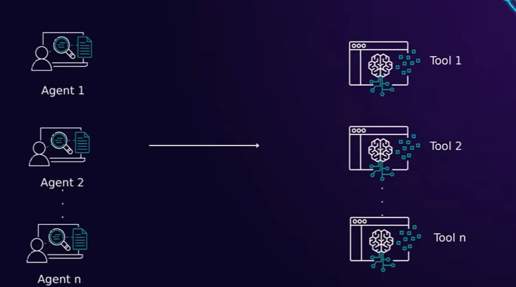
*M × N permutations — and every hand-wired connection is another integration to build, secure and maintain.*

> **Note**: The M × N problem is *why* standard protocols exist. Instead of each agent framework wiring custom integrations to each tool, a shared protocol lets any agent talk to any tool — the same insight that made HTTP universal for services.

---

## 5.2 🔌 MCP and the Agent-to-Tool Problem

**MCP (Model Context Protocol)** is the standard protocol that reduces M × N wiring to M + N: agents speak MCP, tools are exposed as MCP servers, and any client can discover and call any tool in a standard format.

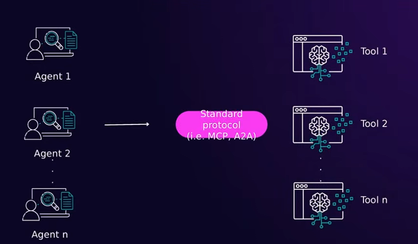
*Insert a standard protocol and the mesh collapses into a hub.*

What MCP gives you:

- **Tool discovery** — `tools/list` returns the catalog with typed input/output schemas
- **Tool invocation** — `tools/call` executes by name with structured arguments
- **Reuse** — someone already built "search the internet", "get the weather", "get the time" — *why not reuse those tools instead of rebuilding them?*

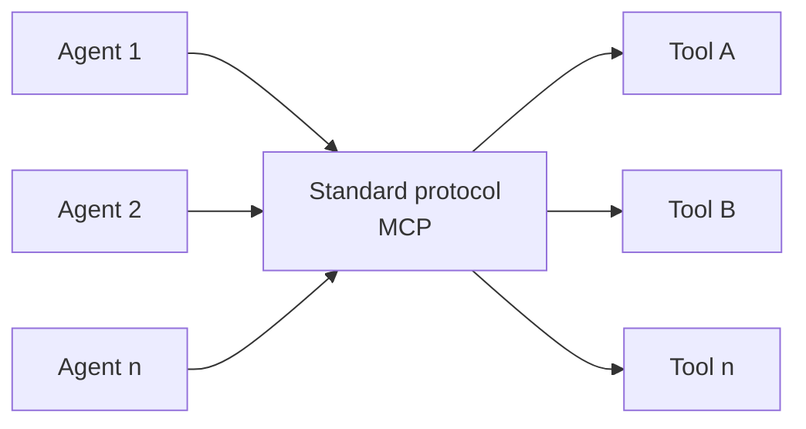
```mermaid
flowchart LR
    A1["Agent 1"] & A2["Agent 2"] & A3["Agent n"] --> P["Standard protocol<br/>MCP"]
    P --> T1["Tool A"] & T2["Tool B"] & T3["Tool n"]
```

Nick's forward-looking take from the episode: *"There will come a near future where we think of MCP like we think of TCP and UDP — no one thinks about it, it just works, because there are great products like Gateway that just do that thing and speak that protocol."*

> **Tip**: MCP standardizes the *interface*. It does not, by itself, give you hosting, scaling, auth, observability or governance. That gap is the next section — and it's the reason Gateway exists.

---

## 5.3 🏭 Why Production MCP Servers Are Hard

*"It takes a village to develop an MCP tool"* — that's the line the episode keeps coming back to. Sure, you can vibe-code a toy MCP server in minutes. But a **production-grade** MCP server is a different beast:

- **The protocol itself** — your server must correctly implement JSON-RPC 2.0 semantics, tool schemas, streaming transports
- **Authentication & authorization** — MCP has an OAuth-based spec for securing incoming calls; someone has to implement it
- **Observability** — you want to see what's coming in and going out of your server
- **Audit trails** — who called which tool, with what arguments, when
- **Spec-version maintenance** — the MCP spec keeps moving; you carry the burden of staying compliant and patching
- **Hosting & scaling** — compute, autoscaling, availability — real infrastructure work
- **Governance** — deciding *who* in the enterprise can access *which* tools

Nick's framing is the AgentCore philosophy in one line: all of that is **undifferentiated heavy lifting** — work every business repeats that makes nobody's agent smarter. The managed service should absorb it so you focus on application-level code.

And the enterprise urgency is real: financial-services customers loved MCP at PoC, then asked *"how do I make this available to my enterprise?"* — and the moment the answer became "stand up an auth service on every MCP server," enthusiasm died. Governance and centralized control are what unblock production.

> **Warning**: *"You can't vibe-code security — your security counterpart will be very frustrated if you try. Secure credential exchange is no joke; it's complicated technology you'd never want to build from scratch per application."*

---

## 5.4 🚪 What Is Amazon Bedrock AgentCore Gateway?

**Amazon Bedrock AgentCore Gateway** is a **fully managed, serverless** service that gives your agents a **single, secure, unified access point** to tools — exposed over standard **MCP**.

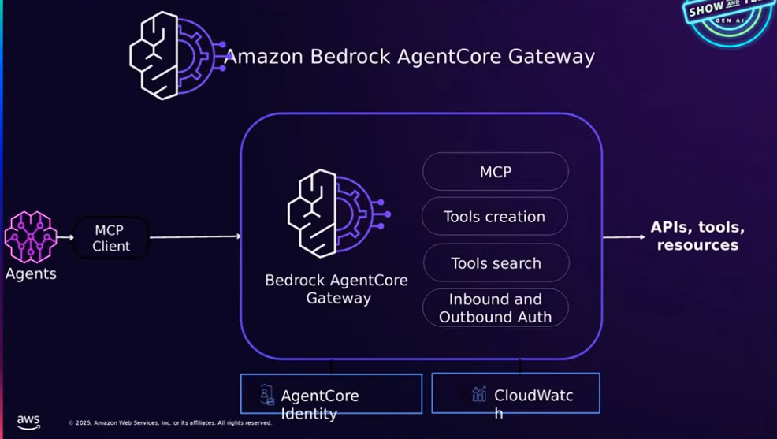
*One endpoint, many tools: Gateway sits between MCP-speaking clients and everything your agents need to call.*

What it does for you:

- **One-click "MCP-ification"** — hand it an OpenAPI spec, a Lambda, or a Smithy model and it becomes MCP tools; *you write zero conversion code*
- **Schema conversion** — incoming MCP JSON-RPC is translated to the target's native schema (OpenAPI, Lambda event, …) by the service
- **Built-in auth** — inbound OAuth validation + outbound credential exchange, both managed
- **Serverless economics** — *"you could have a million gateways and you wouldn't pay per gateway — you pay per request"*
- **Enterprise governance** — a centralized shared service internal teams consume, with control over who reaches which tools

It also slots into the bigger AgentCore picture — Runtime for hosting, Identity for auth, Memory for state, Observability for traces — the same family from Chapter 04:

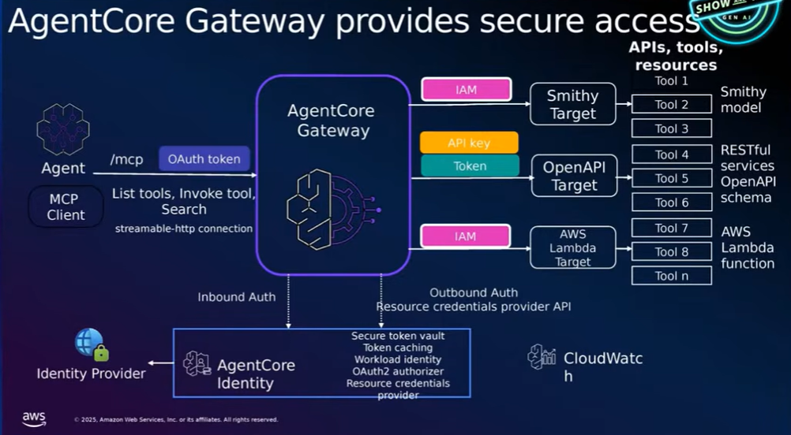
*Gateway is the tool-access pillar of the AgentCore stack.*

And crucially: **it isn't Bedrock-locked**. The Gateway speaks **MCP + OAuth** — any agent, on any framework, on any stack (not even necessarily running on AWS) can connect, with any LLM behind it. *"That's a founding principle of the whole AgentCore ecosystem — decoupled, composable building blocks."*

---

## 5.5 🏗️ AgentCore Gateway Architecture

The architecture in one glance:

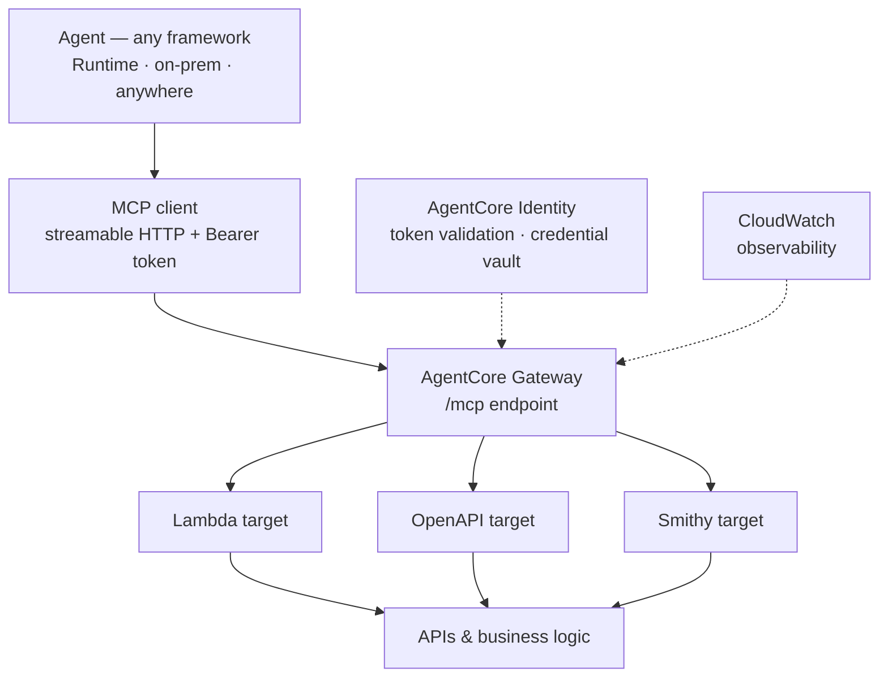
```mermaid
flowchart TD
    Agent["Agent — any framework<br/>Runtime · on-prem · anywhere"] --> MC["MCP client<br/>streamable HTTP + Bearer token"]
    MC --> GW["AgentCore Gateway<br/>/mcp endpoint"]
    GW --> L["Lambda target"]
    GW --> O["OpenAPI target"]
    GW --> S["Smithy target"]
    L & O & S --> APIs["APIs & business logic"]
    ID["AgentCore Identity<br/>token validation · credential vault"] -.-> GW
    CW["CloudWatch<br/>observability"] -.-> GW
```

Reading it:

1. **The agent** lives wherever it lives — on AgentCore Runtime (Chapter 04), on your laptop, anywhere
2. **An MCP client** connects to the Gateway's `/mcp` endpoint over **stateless streamable HTTP** — currently the supported transport for remote MCP tools
3. **The Gateway** validates the caller (inbound), fans out to **targets**, and attaches credentials on the way out (outbound)
4. **AgentCore Identity** does the heavy lifting — validating incoming access tokens against your IdP, and vending outbound credentials per target
5. **CloudWatch** observes the traffic

> **Note** (from the live Q&A): Gateway today supports **remote MCP tools over streamable HTTP — stateless connections**. A2A is not yet supported — the team is hyper-focused on MCP, though AWS is committed to both protocols.

---

## 5.6 🔐 Inbound & Outbound Authorization

This is the section your security team cares about — two different authorization problems, both managed:

**Inbound authorization** — *who may call the Gateway?*

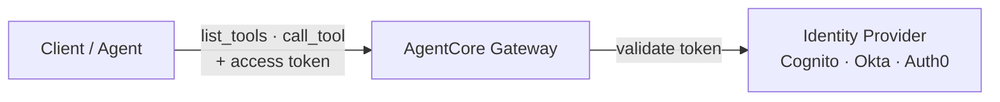
```mermaid
flowchart LR
    C["Client / Agent"] -->|"list_tools · call_tool<br/>+ access token"| GW["AgentCore Gateway"]
    GW -->|"validate token"| IDP["Identity Provider<br/>Cognito · Okta · Auth0"]
```

**Outbound authorization** — *how does the Gateway call your API?*

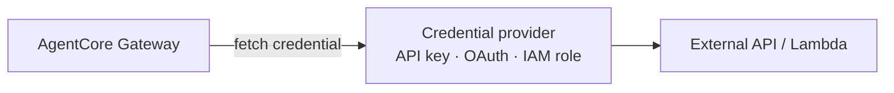
```mermaid
flowchart LR
    GW["AgentCore Gateway"] -->|"fetch credential"| CP["Credential provider<br/>API key · OAuth · IAM role"]
    CP --> API["External API / Lambda"]
```

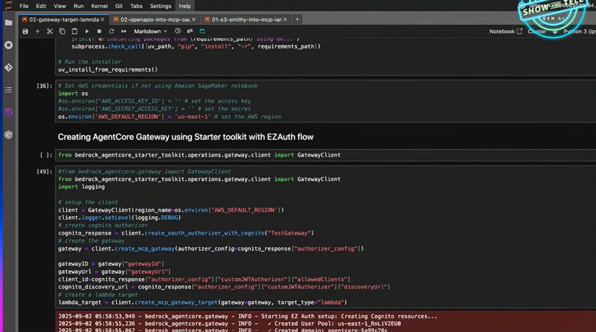
*The complete picture: inbound auth at the MCP endpoint, outbound credentials per target, Identity doing the token work, CloudWatch watching.*

The transcript's detail layer:

- **Inbound** — when a `list tools` or `invoke tool` call arrives, AgentCore Identity validates the **access token** against *any OAuth 2.0/OIDC-compliant IdP* — Cognito, Okta, Auth0, your pick
- **Outbound** — before the Gateway calls your API or Lambda, it resolves the right credential from a **credential provider configured per target** — an API key, an OAuth access token, or an IAM role
- **The Slack example** — your internal auth and the external API's credential are *different things*; the Gateway manages that exchange so only authorized callers' invocations go out with the right Slack API key — including **caching tokens** so you don't get "OAuth fatigue"
- **Why not DIY?** — *"You're not here to build 'let me cache tokens, let me reach out to the authorization server, let me validate my incoming access token.' That takes a lot of code and a lot of maintenance."*

| Direction | Question answered | Mechanism in the demo |
|---|---|---|
| **Inbound** | Is this caller allowed to use the Gateway? | CUSTOM_JWT authorizer — Cognito user pool, allowed client IDs, OIDC discovery URL |
| **Outbound** | What credential does the target's API need? | Credential providers — `API_KEY`, `OAUTH`, `GATEWAY_IAM_ROLE` |

---

## 5.7 👤 AgentCore Identity + Cognito

The demo used **Amazon Cognito** as the inbound identity provider — and the starter toolkit collapses what is normally a pile of work (user pool, domain, app client, IAM roles) into one helper call:

```python
cognito_response = client.create_oauth_authorizer_with_cognito("TestGateway")
```

Behind that one line, a lot happens:

1. A **Cognito user pool** is created — visible immediately in the console
2. A **Cognito domain** is provisioned (the demo even waits on DNS propagation)
3. An **app client** is created — its **client ID** lands in the Gateway's `allowedClients` list
4. An **IAM execution role** is created for the Gateway
5. The pool's **OIDC discovery URL** is handed to the Gateway so it can validate tokens

That discovery URL is real infrastructure — open it and you get the standard OpenID metadata document:

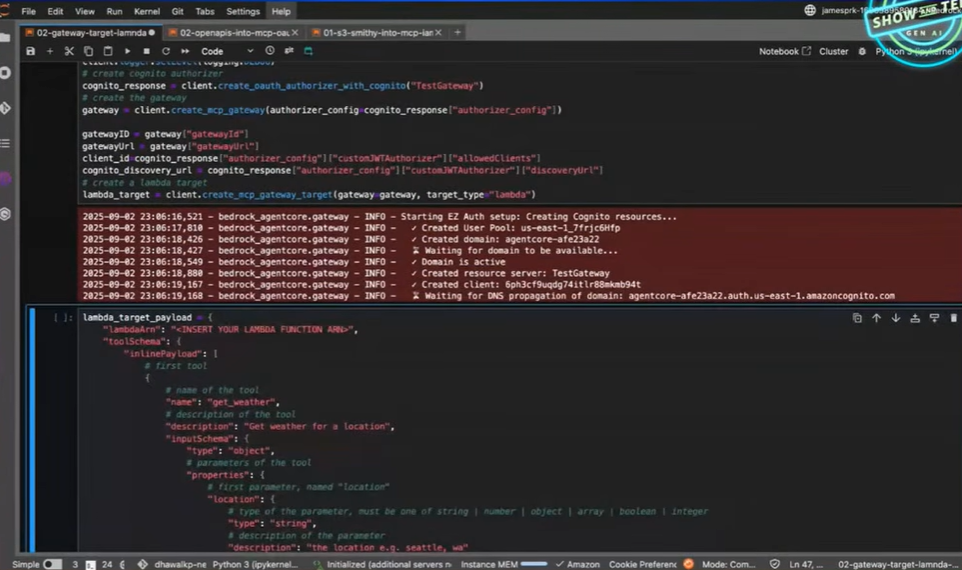
*`.well-known/openid-configuration` — the metadata the Gateway uses to know how to authorize incoming calls: where tokens come from, where the signing keys live.*

At invoke time the flow is: client fetches a JWT from Cognito → sends it as the `Authorization: Bearer` token → Gateway validates it against the discovery document and `allowedClients` → call proceeds.

> **Warning**: In the demo Dul prints a real JWT to paste into MCP Inspector — and immediately caveats: *"Do not share JWT tokens, please. This is just a demo."* A bearer token IS the credential; treat it like a password.

> **Tip**: Not locked to Cognito — any OAuth 2.0/OIDC IdP works. And the AWS Console path is even easier: it can create the Cognito authorizer for you in about three clicks when you're hacking around.

---

## 5.8 🎯 Gateway Targets

A **target** is the unit you attach to a Gateway — *"a logical grouping of the APIs you want to MCP-ify."*

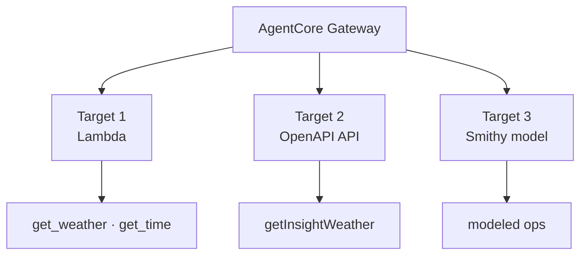
```mermaid
flowchart TD
    GW["AgentCore Gateway"] --> T1["Target 1<br/>Lambda"]
    GW --> T2["Target 2<br/>OpenAPI API"]
    GW --> T3["Target 3<br/>Smithy model"]
    T1 --> A1["get_weather · get_time"]
    T2 --> A2["getInsightWeather"]
    T3 --> A3["modeled ops"]
```

Key rules from the episode:

- A Gateway can contain **multiple targets**; each target may expose **multiple tools**
- **Three target types**: **AWS Lambda**, **OpenAPI** (Swagger spec — inline payload or an S3 URI), and **Smithy** (AWS's interface-definition format, JSON-RPC-style interaction)
- **Zero code** — you supply the spec or ARN; the service does the MCP ↔ native-schema conversion
- **Per-target credentials** — each target carries its own outbound credential configuration
- **Tool naming** — tools surface in MCP as `{TargetName}___{tool_name}` — e.g. `TestGatewayTarget4c4379e5___get_time`, `DemoOpenAPITargetS3NasaMars___getInsightWeather`

And one honest limitation flagged live: **per-tool fine-grained access within a Gateway isn't there yet** — `allowedClients` gates the whole Gateway. Today's pattern for "Trevor gets dev tools, Nick gets data-science tools": **separate Gateways** per audience. Which is cheap, because Gateways are serverless — *"a million gateways, pay per request."*

> **Tip**: Two Gateways can even point at the **same Lambda** with different tool schemas — Gateway 1 exposes tools 1+2, Gateway 2 exposes only tool 1. The Gateway becomes the auth/policy layer; the Lambda doesn't change.

---

## 5.9 ⚡ Lambda Target — Turning Lambda into MCP

The first demo target: **MCP-ify an AWS Lambda function** — no MCP server, no FastMCP, no protocol code at all.

`create_mcp_gateway_target(gateway, target_type="lambda")` with no `lambdaArn` given → the starter toolkit **creates a default test Lambda** for you, exposing `get_weather` and `get_time`. The log shows it land:

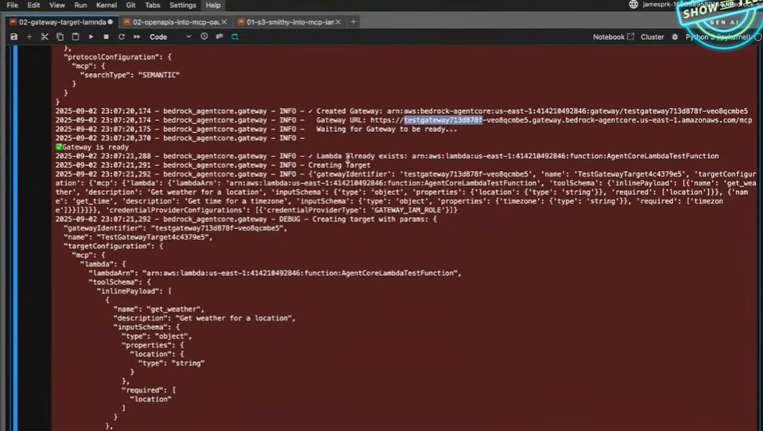
*Target created, IAM-role outbound credential attached, "Target is ready."*

You can watch the actual function in the Lambda console — it's a plain Python function, not an MCP server:

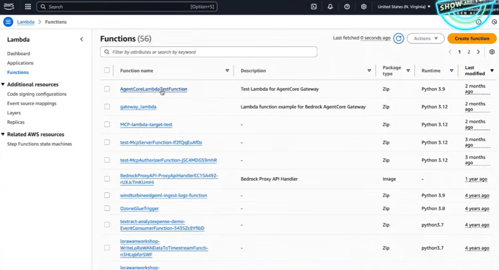
*Just a normal Lambda — the Gateway turns it into MCP tools.*

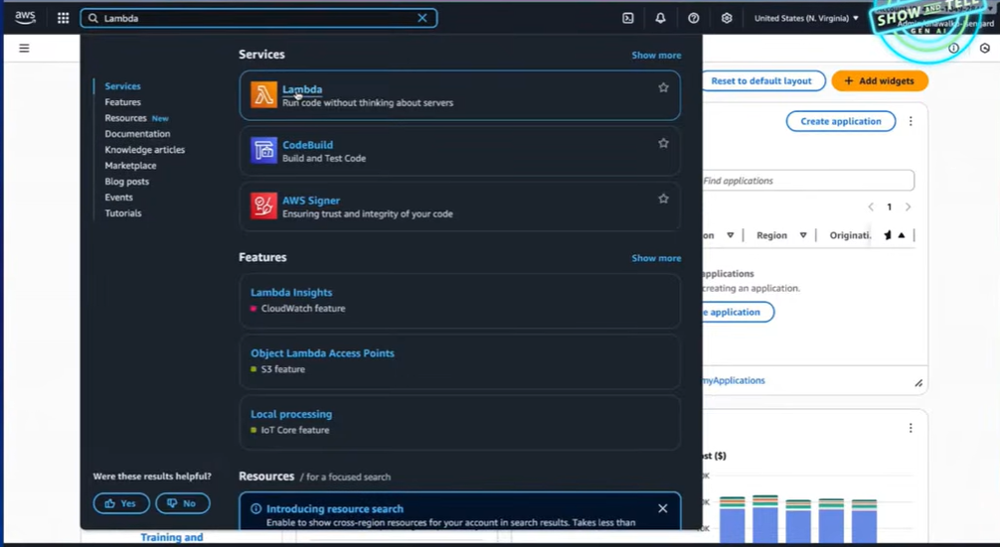
*Finding the function the Gateway is invoking.*

The magic detail: the Lambda learns **which MCP tool was invoked** through `context.client_context` — the Gateway injects `bedrockAgentCoreToolName` (plus gateway/target IDs and session ID) so one function can back many tools:

<GitHubExplorer repo="awslabs/agentcore-samples" ref="main" expanded="true" title="Lambda targets — the function and the tool schema" files={[
  { "path": "lambda_weather_tool.py", "src": "/bedrock-deepti/code/lambda_weather_tool.py", "label": "Default Lambda", "highlights": [[8, 8], [10, 18]], "note": "The toolkit's generated test Lambda — the Gateway passes which tool was invoked via client_context.bedrockAgentCoreToolName; one handler, many tools." },
  { "path": "lambda_function_code.py", "src": "/bedrock-deepti/code/lambda_function_code.py", "label": "Your Lambda", "highlights": [[7, 13], [15, 18]], "note": "Bring-your-own Lambda from the workshop samples (get_order_tool / update_order_tool) — strips the {TargetName}___ prefix to find the tool. Ships in the repo as lambda_function_code.zip." },
  { "path": "gateway_lambda_target.py", "src": "/bedrock-deepti/code/gateway_lambda_target.py", "label": "Target Payload", "highlights": [[5, 7], [10, 36]], "note": "The toolSchema you send — give the ARN + describe each tool's inputSchema; Gateway does the MCP→Lambda schema conversion." }
]} />

*Three pieces: the Lambda code, and the `lambdaArn + toolSchema` payload that MCP-ifies it.*

The two demo flows, side by side:

| | Toolkit default | Bring your own |
|---|---|---|
| Lambda | Created for you (`get_weather`, `get_time`) | Your existing function (`get_order_tool`, `update_order_tool`) |
| What you supply | Nothing | `lambdaArn` + `toolSchema` (inline) |
| MCP plumbing | Zero | Zero |

> **Note** (Trevor's question answered): it's **direct plumbing to Lambda** — no intermediate MCP server materializes. You don't run FastMCP on a container; you "give us the Lambda you want to MCP-ify and the schema, and we do the schema conversion." The same applies to APIs living on Fargate or EKS — describe them with OpenAPI and Gateway fronts them.

---

## 5.10 📄 OpenAPI Target

Got an existing REST API with an OpenAPI/Swagger spec? That's the second target type — *"here's my OpenAPI spec, just MCP-ify it for me."*

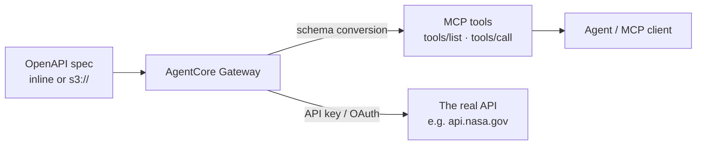
```mermaid
flowchart LR
    S["OpenAPI spec<br/>inline or s3://"] --> GW["AgentCore Gateway"]
    GW -->|"schema conversion"| MCP["MCP tools<br/>tools/list · tools/call"]
    MCP --> A["Agent / MCP client"]
    GW -->|"API key / OAuth"| API["The real API<br/>e.g. api.nasa.gov"]
```

The demo used **NASA's public InSight Mars weather API** — a real OpenAPI-described API that needs an `api_key` query param:

1. **Upload the spec to S3** (or pass it inline) — the target config points at `s3://openapi-gateway/nasa_mars_insights_openapi.json`
2. **Create a credential provider** — `create_api_key_credential_provider` stores the API key **in Secrets Manager** inside the Identity vault
3. **Create the target** with the S3-backed `openApiSchema` + the API-key credential configuration

The outbound credential menu shown in the demo — pick per target type:

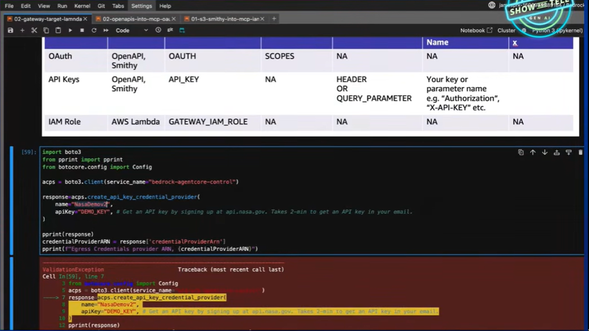
*Outbound credential types by target. Bonus realism: the demo hit a `ValidationException` — provider names must be unique — and recovered by renaming. Show-and-tell debugging, live.*

The complete boto3 path — credential provider, S3 spec config, and target creation — in the explorer:

<GitHubExplorer repo="awslabs/agentcore-samples" ref="main" expanded="true" title="OpenAPI target — NASA Mars API via boto3" files={[
  { "path": "gateway_boto3_openapi.py", "src": "/bedrock-deepti/code/gateway_boto3_openapi.py", "label": "boto3 OpenAPI Target", "highlights": [[17, 20], [29, 37], [43, 56], [58, 65]], "note": "The control-plane calls from the demo — create_api_key_credential_provider (key lands in Secrets Manager) → openApiSchema S3 URI → API_KEY credential config (QUERY_PARAMETER api_key) → create_gateway_target." }
]} />

*MCP goes in, OpenAPI calls come out — you never wrote the schema conversion.*

> **Tip**: The spec can also be **inline** in `targetConfiguration` instead of an S3 URI — handy for small APIs. And the workshop repo ships `nasa_mars_insights_openapi.json` plus Zendesk and Google Calendar specs to try.

---

## 5.11 🧩 Smithy Target

The third target type, mentioned but not demoed end-to-end (time ran out — honestly noted in the episode):

- **Smithy** is AWS's open interface-definition language — the same format AWS services themselves are modeled in
- A **Smithy target** exposes a Smithy-modeled service through the Gateway, with a JSON-RPC-style interaction shape
- It participates in the same machinery: logical target → tool schema → inbound auth → outbound credentials (the credential table lists OAuth and API-key options for Smithy targets too)

The takeaway isn't the format details — it's the *pattern*: **whatever describes your service — Lambda ARN + schema, OpenAPI spec, Smithy model — becomes a uniform set of MCP tools behind one governed endpoint.** New target types slot into the same architecture without changing how agents connect.

> **Note**: One of the demo's open notebook tabs is a Smithy-to-MCP walkthrough (`s3-smithy-into-mcp`) in the same workshop folder — the repo has it if you want to run it yourself.

---

## 5.12 🔄 Control Plane vs Data Plane

A distinction the episode draws explicitly — two different API surfaces, two different clients:

| | **Control Plane** | **Data Plane** |
|---|---|---|
| **What it does** | Create & configure the Gateway | Use the Gateway |
| **Operations** | Create gateway · add target · configure semantic search · configure authorizer | `tools/list` · `tools/call` |
| **Interfaces** | AWS CLI · boto3 · REST API · **Starter Toolkit** · AWS Console | Any MCP-compliant client — Inspector, Strands `MCPClient`, IDEs |
| **Protocol** | AWS APIs (`bedrock-agentcore-control`) | MCP over streamable HTTP |

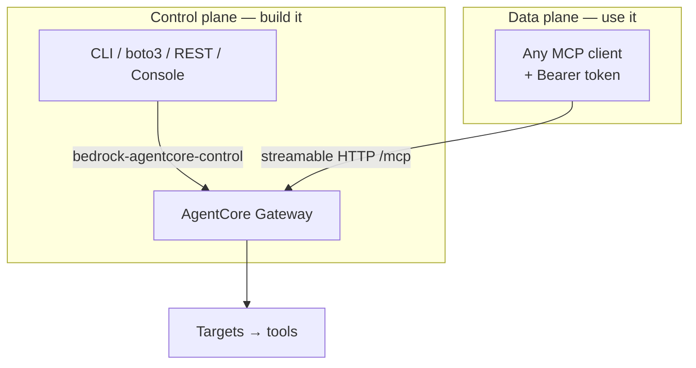
```mermaid
flowchart TD
    subgraph CP["Control plane — build it"]
        CLI["CLI / boto3 / REST / Console"] -->|"bedrock-agentcore-control"| GW
    end
    subgraph DP["Data plane — use it"]
        Client["Any MCP client<br/>+ Bearer token"] -->|"streamable HTTP /mcp"| GW
    end
    GW["AgentCore Gateway"] --> Tools["Targets → tools"]
```

The practical consequence: *"You set it up with the AWS APIs, but once it's set up, all the interactions are just MCP."* Your infrastructure team owns the control plane; every agent developer just needs an MCP client and a token.

And yes — the **AWS Console** is a first-class control plane too: Bedrock AgentCore → Gateways in the sidebar, click-through setup, and it can even create the Cognito authorizer for you:

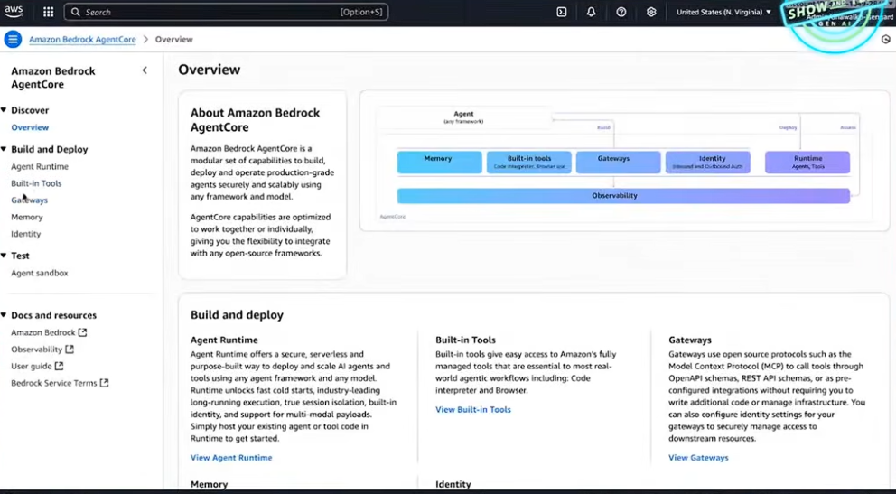
*The console path — great for hacking around; it creates the Cognito authorizer for you.*

---

## 5.13 🛠️ AgentCore Starter Toolkit

You *can* drive the control plane with raw boto3, CLI or REST — but the episode's repeated advice: **"use the Starter Toolkit if you're starting for the first time."** It's a small Python package that wraps the multi-step setup into high-level calls.

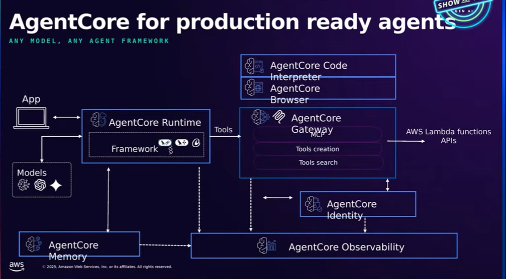
*The toolkit repo — same one Chapter 04 used for `agentcore configure/launch/invoke`.*

The whole create-a-secured-gateway flow — **Cognito authorizer → Gateway → Lambda target** — fits in one screen of code:

<GitHubExplorer repo="awslabs/agentcore-samples" ref="main" expanded="true" title="Starter toolkit — authorizer, gateway and Lambda target" files={[
  { "path": "gateway_starter_toolkit.py", "src": "/bedrock-deepti/code/gateway_starter_toolkit.py", "label": "Toolkit Setup", "highlights": [[12, 13], [18, 19], [24, 28], [35, 39]], "note": "Extracted from the workshop notebooks in the repo (06-workshops/02-AgentCore-gateway). GatewayClient + create_oauth_authorizer_with_cognito + create_mcp_gateway + create_mcp_gateway_target." }
]} />

What the toolkit did behind those calls — visible once you turn logging to DEBUG:


*The honest control-plane request: `protocolType: MCP`, `authorizerType: CUSTOM_JWT`, `allowedClients: [cognito client id]`, `discoveryUrl`, and `searchType: SEMANTIC` — semantic search is on by default here.*

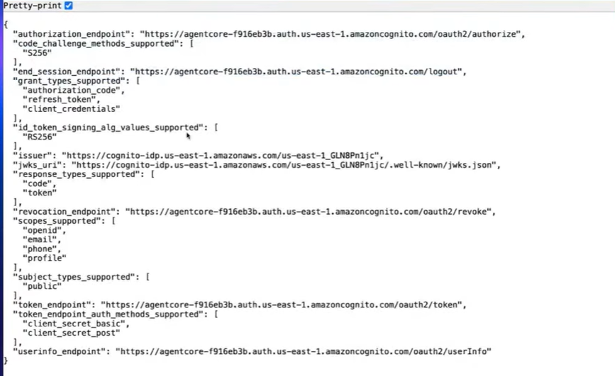
*The response that matters: a **unique Gateway URL** — that's the `/mcp` endpoint every MCP client will call.*

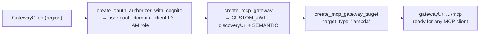
```mermaid
flowchart LR
    A["GatewayClient(region)"] --> B["create_oauth_authorizer_with_cognito<br/>→ user pool · domain · client ID · IAM role"]
    B --> C["create_mcp_gateway<br/>→ CUSTOM_JWT + discoveryUrl + SEMANTIC"]
    C --> D["create_mcp_gateway_target<br/>target_type='lambda'"]
    D --> E["gatewayUrl …/mcp<br/>ready for any MCP client"]
```

> **Note**: Those DEBUG lines are the answer to "what is the toolkit actually doing?" — nothing hidden. It composes the same `bedrock-agentcore-control` calls you could make yourself; it just does the tedious sequencing (roles, pools, DNS waits) for you.

---

## 5.14 🔎 Semantic Tool Search

The feature Nick calls *"a total game-changer"* — and the reason a Gateway can realistically front *hundreds* of tools.

**The problem**: hand an agent 500 tools and you've handed it 500 tool schemas of context — **context bloat**. That leads to hallucinations, degraded performance, and a model that can't reliably pick the right tool. Anthropic's own guidance for prompt-driven MCP management lands around a **~50-server max** — far below what an enterprise wants to expose.

**The answer**: don't list every tool — **search** for the relevant ones.

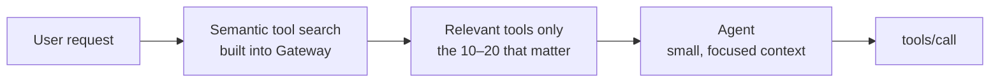
```mermaid
flowchart LR
    U["User request"] --> S["Semantic tool search<br/>built into Gateway"]
    S --> R["Relevant tools only<br/>the 10–20 that matter"]
    R --> A["Agent<br/>small, focused context"]
    A --> I["tools/call"]
```

- The Gateway exposes a built-in search tool — visible in the demo's tool list as **`x_amz_bedrock_agentcore_search`**
- Enabled at creation: `protocolConfiguration.mcp.searchType = "SEMANTIC"` (the starter toolkit's `enable_semantic_search=True`)
- The agent asks the Gateway *"which tools fit this task?"*, gets a handful back, and invokes those

Nick's prediction: *"Eventually nobody will do list-tools — as an organization I'll have so many tools that I'll always want to search for the 10 or 20 most relevant. When I do tasks myself, I never list every application on my computer and browse; I look for the specific thing I need."*

> **Tip**: Mental model — `tools/list` is like `ls` on a directory; semantic search is like Spotlight. You'd never `ls` a 10,000-file directory to find one file. Same for tools at enterprise scale.

---

## 5.15 📚 Tool Discovery at Scale

Zoom out to the enterprise picture that motivated the whole design:

- **Many teams, one platform** — different organizations inside a company each build agentic apps; they shouldn't each rebuild "get weather" or "query inventory"
- **Centralized shared service** — hundreds of tools unified behind the Gateway, offered over MCP
- **Single secure access point** — one OAuth-gated endpoint instead of N ad-hoc MCP servers with N ad-hoc auth schemes
- **Governance** — `allowedClients` per Gateway decides which applications may reach which tool sets; multiple Gateways carve the catalog by audience
- **Discovery that scales** — semantic search keeps agents fast even as the catalog grows from dozens to hundreds of tools

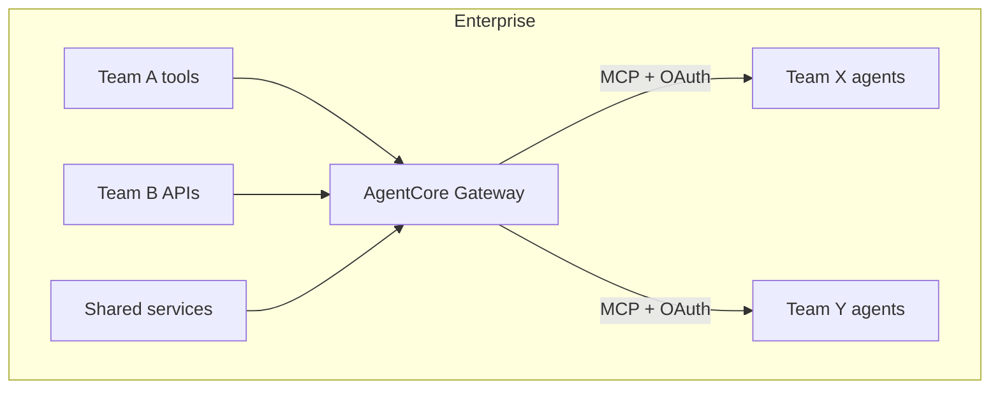
```mermaid
flowchart TD
    subgraph Org["Enterprise"]
        T1["Team A tools"] --> GW["AgentCore Gateway"]
        T2["Team B APIs"] --> GW
        T3["Shared services"] --> GW
        GW -->|"MCP + OAuth"| AG1["Team X agents"]
        GW -->|"MCP + OAuth"| AG2["Team Y agents"]
    end
```

And on the observability side — the chat question about securing MCP traffic landed on an equally important point: *"Maybe equally as important as security is just observability — being able to see what's going right and what's going wrong."* The demo even surfaced the MCP work on distributed tracing standards:

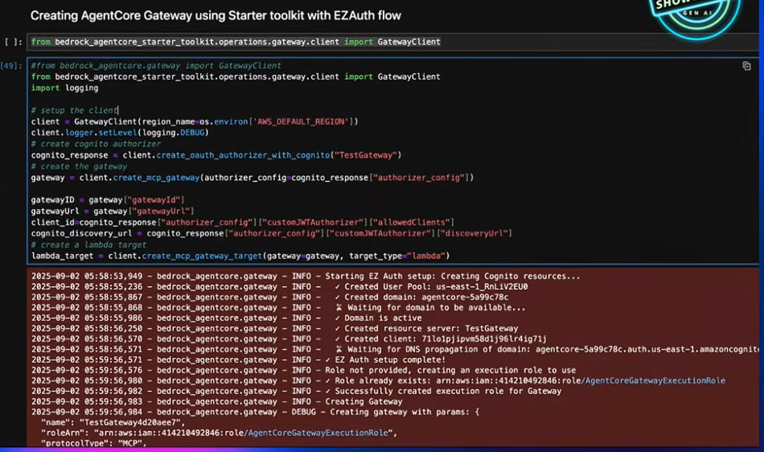
*Observability is protocol-level work too — trace context propagation is how agent → gateway → tool traces will stitch together.*

---

## 5.16 🔍 MCP Inspector

**MCP Inspector** is the open-source test client for MCP — *not an AWS tool*, which is exactly the point: **the Gateway speaks stock MCP, so off-the-shelf tooling just works.**

The demo's connection recipe — two ingredients:

1. **URL** — the Gateway's `…/mcp` endpoint
2. **Authentication** — `Authorization` header with the **Bearer token** (the Cognito JWT)

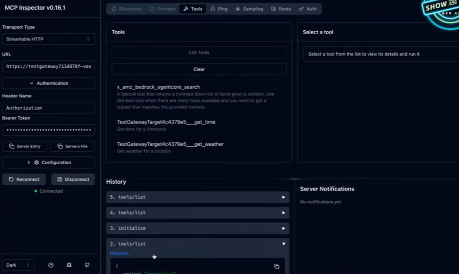
*Connected. The History panel shows the real protocol: `initialize` → `tools/list`.*

Click **List Tools** and the Lambda-backed tools appear — including the built-in semantic-search tool:

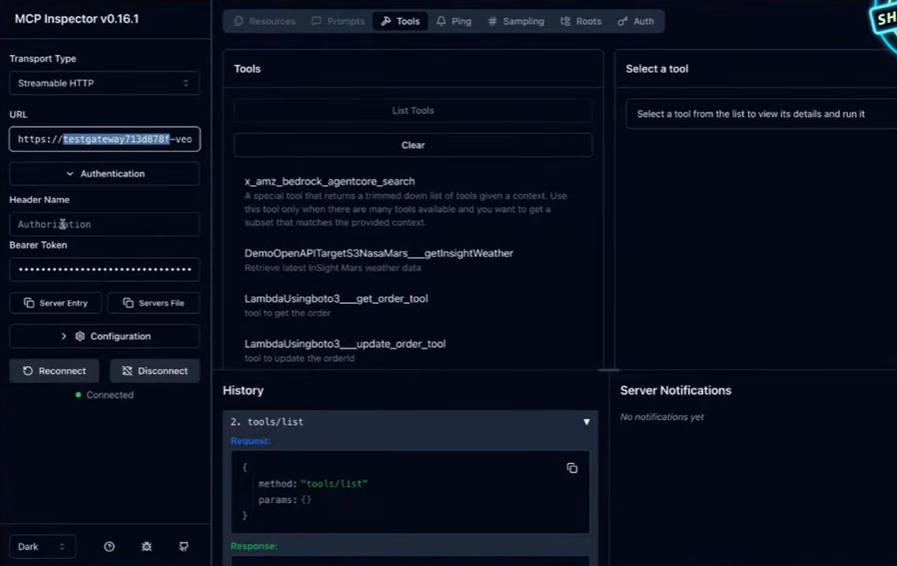
*Three tools: the Gateway's own semantic search plus the two Lambda tools — `get_time` and `get_weather`.*

And after the OpenAPI and boto3-Lambda targets were added, the same Gateway's catalog grew — all through the one `/mcp` endpoint:

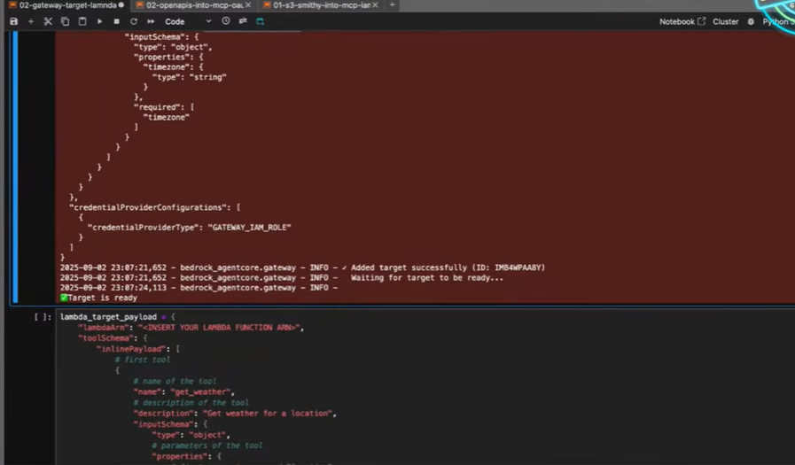
*One Gateway, three target types' tools: search + NASA Mars OpenAPI + order-management Lambda.*

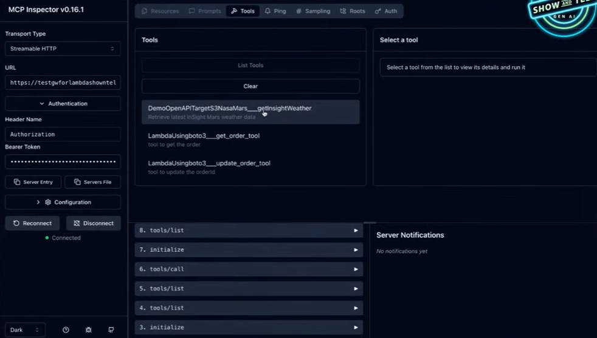
*A NASA REST API call, exposed and invocable as a first-class MCP tool.*

> **Note** (the chat's sharp question, answered): Inspector isn't calling "each MCP server" — it's pointing at the **Gateway URL, which itself is an MCP server**. The tools behind it run on Lambda, could run on Fargate or EKS — the client can't tell and doesn't care. *"Any MCP client can connect to the Gateway as long as it speaks the protocol — and has the authorization header."*

---

## 5.17 🧪 Gateway Demo — Complete Flow

The full end-to-end walkthrough, in order:

1. **Create the inbound authorizer** — `create_oauth_authorizer_with_cognito` → user pool, domain, client ID, IAM role
2. **Create the Gateway** — `create_mcp_gateway` → MCP protocol, CUSTOM_JWT auth, `searchType: SEMANTIC`, unique `/mcp` URL
3. **Add a Lambda target** — `create_mcp_gateway_target(target_type="lambda")` → default `get_weather`/`get_time` tools appear
4. **Verify in MCP Inspector** — URL + Bearer token → `tools/list` → the tools are there
5. **Get an access token** — `client.get_access_token_for_cognito(client_info)` → JWT
6. **Connect a real agent** — Strands `MCPClient` over streamable HTTP with the Bearer header:

<GitHubExplorer repo="awslabs/agentcore-samples" ref="main" expanded="true" title="Data plane — a Strands agent calling the Gateway" files={[
  { "path": "gateway_mcp_client.py", "src": "/bedrock-deepti/code/gateway_mcp_client.py", "label": "MCP Client + Agent", "highlights": [[11, 15], [18, 29], [40, 48], [52, 55]], "note": "Extracted from the workshop notebook. streamablehttp_client + Bearer token → MCPClient → tools/list → a normal Strands Agent. No AWS SDK on the data plane — just MCP + OAuth." }
]} />

*The agent-side code — the Gateway's tools arrive through a completely standard MCP client.*

7. **Run it** — the interactive agent lists the Gateway's tools and calls them:

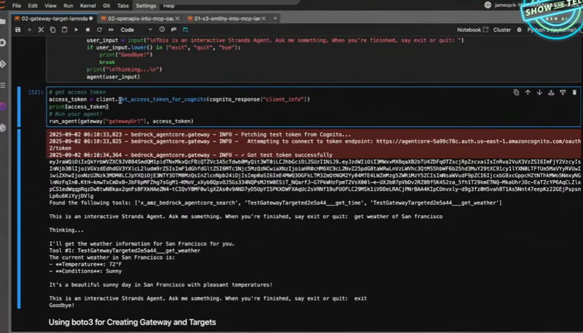
*`Found the following tools: ['x_amz_bedrock_agentcore_search', 'TestGatewayTarget4c4379e5___get_time', '…___get_weather']` — then a natural-language question routes to the right tool.*

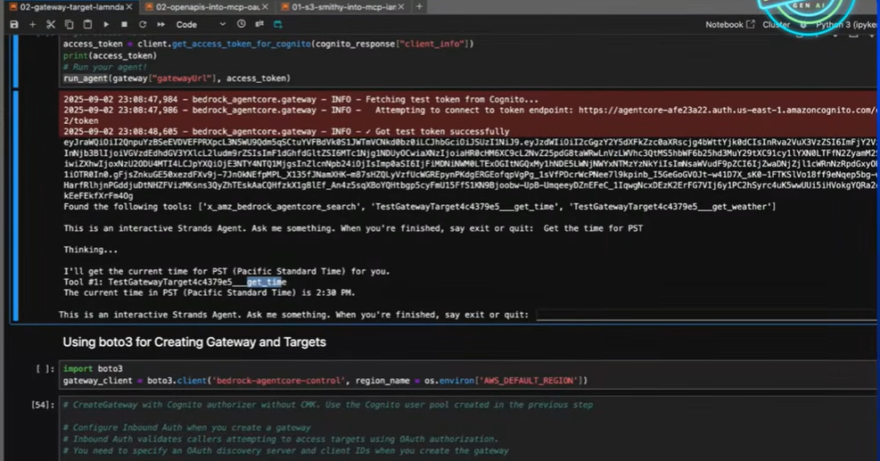
*Later in the demo: the same flow against a second Gateway exposing `get_order_tool`/`update_order_tool` — and the raw boto3 control-plane client underneath.*

8. **Add the OpenAPI target** — credential provider + S3 spec → `create_gateway_target` → `getInsightWeather` appears in Inspector
9. **Invoke** — `tools/call` → the Mars weather API responds *as an MCP tool*

> **Note**: Live-demo honesty — two hiccups made the cut: a duplicate credential-provider name threw `ValidationException` (renamed, succeeded), and a `gateway_name` collision needed a rename too. Real errors, real fixes — the happy path is a rename away.

---

## 5.18 🧠 Knowledge Check

Q1: What problem does AgentCore Gateway primarily solve?
- A) It hosts agent code like Runtime does
- B) It gives agents a single secure managed MCP endpoint in front of all their tools/APIs (Correct)
- C) It trains models to call tools more accurately
- D) It replaces the need for LLMs in agentic applications

**Explanation**: Gateway is the tool-access layer — it MCP-ifies your APIs, Lambdas and Smithy services and fronts them with one governed, authenticated endpoint. Agents still run wherever they run (Runtime, your laptop, anywhere).

Q2: What does MCP standardize in the M×N agent-tool problem?
- A) The way agents are trained
- B) The interface for tool discovery and invocation, so any agent can call any tool in a standard format (Correct)
- C) The pricing model for tools
- D) The programming language tools are written in

**Explanation**: MCP is a protocol for `tools/list` and `tools/call` with typed schemas. Without it, every agent needs bespoke integrations with every tool — the M×N explosion.

Q3: What is a Gateway Target?
- A) A user allowed to call the Gateway
- B) A logical grouping of APIs/tools (Lambda, OpenAPI or Smithy) exposed through the Gateway (Correct)
- C) A type of Bedrock model
- D) The agent that initiates tool calls

**Explanation**: Targets are what you attach: a Lambda ARN + tool schema, an OpenAPI spec (S3 or inline), or a Smithy model. Each becomes MCP tools; each carries its own outbound credentials.

Q4: What's the difference between the control plane and the data plane?
- A) Control plane is for admins, data plane is for customers
- B) Control plane configures the Gateway (create, add target, auth) via AWS APIs; data plane is tools/list + tools/call over MCP (Correct)
- C) They're the same API surface
- D) Data plane only works with boto3

**Explanation**: You build with `bedrock-agentcore-control` (CLI, boto3, toolkit, console); you interact through plain MCP — any compliant client, including non-AWS tooling like MCP Inspector.

Q5: In inbound authorization, what does the Gateway validate?
- A) The target's API key
- B) The caller's access token against your IdP — e.g., Cognito — via the OIDC discovery URL and allowedClients (Correct)
- C) The MCP protocol version
- D) The Lambda execution role

**Explanation**: Inbound auth = "is this caller allowed in?" The demo used a CUSTOM_JWT authorizer backed by a Cognito user pool; any OAuth 2.0/OIDC IdP works.

Q6: What do outbound credential providers configure?
- A) Which users may log into the console
- B) The credential the Gateway attaches when calling the target's API — API key, OAuth token, or IAM role (Correct)
- C) The model the agent uses
- D) The tool's input schema

**Explanation**: Your APIs have their own auth — NASA's api_key param, Slack's token, Lambda's IAM. A per-target credential provider (stored in the Identity vault / Secrets Manager) supplies it on the way out.

Q7: Why does semantic tool search matter at scale?
- A) It makes tools execute faster
- B) With hundreds of tools, listing them all bloats context and degrades the agent — search returns only the relevant subset (Correct)
- C) It's required by the MCP spec
- D) It replaces authorization

**Explanation**: Context bloat → hallucination risk + degraded performance. The Gateway's `x_amz_bedrock_agentcore_search` tool (enabled by `searchType: SEMANTIC`) lets the agent retrieve just the 10–20 relevant tools.

Q8: What does a Lambda target require you to supply?
- A) An MCP server wrapping the Lambda
- B) The Lambda ARN plus a toolSchema describing its tools — Gateway does the MCP↔Lambda conversion (Correct)
- C) A FastMCP deployment on Fargate
- D) Nothing — Lambdas are auto-discovered

**Explanation**: No MCP server, no protocol code — it's direct plumbing to Lambda. The function learns which tool was invoked via `context.client_context.bedrockAgentCoreToolName`.

Q9: How does an OpenAPI target become MCP tools?
- A) You rewrite each endpoint as an MCP tool by hand
- B) You provide the spec (S3 URI or inline) — Gateway converts each operation and handles the MCP→OpenAPI schema translation (Correct)
- C) OpenAPI can't be exposed over MCP
- D) Only Smithy specs work

**Explanation**: The demo MCP-ified NASA's Mars weather API with zero conversion code — spec on S3, API-key credential provider, `create_gateway_target`, and `getInsightWeather` appeared in Inspector.

Q10: Why would an organization run multiple Gateways?
- A) To get more IP addresses
- B) To carve tool sets by audience — allowedClients gates the whole Gateway, and serverless pricing means extra Gateways cost nothing idle (Correct)
- C) Gateways can only hold one target each
- D) To avoid using OAuth

**Explanation**: Per-tool fine-grained auth isn't there yet, so the pattern is one Gateway per audience — and since you pay per request (not per Gateway), "a million gateways" is a legitimate tenancy design.

---

## 5.19 🏁 Chapter Summary

The complete journey this chapter walked:

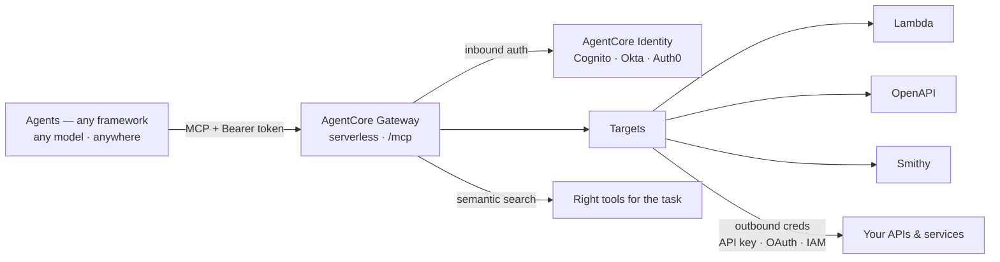
```mermaid
flowchart LR
    A["Agents — any framework<br/>any model · anywhere"] -->|"MCP + Bearer token"| GW["AgentCore Gateway<br/>serverless · /mcp"]
    GW -->|"inbound auth"| ID["AgentCore Identity<br/>Cognito · Okta · Auth0"]
    GW --> T["Targets"]
    T --> L["Lambda"]
    T --> O["OpenAPI"]
    T --> S["Smithy"]
    T -->|"outbound creds<br/>API key · OAuth · IAM"| API["Your APIs & services"]
    GW -->|"semantic search"| TS["Right tools for the task"]
```

- **The problem** — M agents × N tools needs a protocol (MCP), and production MCP servers need a village: hosting, OAuth, observability, audit, spec maintenance
- **The service** — AgentCore Gateway: fully managed, serverless, a single secure MCP access point; pay per request, not per gateway
- **The model** — targets (Lambda / OpenAPI / Smithy) are logical API groupings; zero conversion code; schemas translated for you
- **The security** — inbound auth validates callers against any OAuth IdP; outbound credential providers attach API keys/tokens/IAM per target; `allowedClients` gates each Gateway
- **The surfaces** — control plane (CLI, boto3, REST, toolkit, console) builds it; data plane is pure MCP — Inspector, Strands, IDEs all work
- **The scale story** — semantic tool search (`x_amz_bedrock_agentcore_search`) keeps agents fast when the catalog is hundreds of tools

**Chapter 4** hosted the agents on Runtime; **this chapter** gave them a governed, enterprise-scale tool catalog to call. Next up in the series: Memory, Identity and Observability deep dives.

### 📦 Chapter 05 — Source & Code

The demo followed the official workshop material:

- 🧰 **Starter Toolkit** — [github.com/aws/bedrock-agentcore-starter-toolkit](https://github.com/aws/bedrock-agentcore-starter-toolkit) — `GatewayClient`, the Cognito authorizer helper, `create_mcp_gateway` / `create_mcp_gateway_target`
- 🛠️ **Gateway workshop** — [awslabs/agentcore-samples → 06-workshops/02-AgentCore-gateway](https://github.com/awslabs/agentcore-samples/tree/main/06-workshops/02-AgentCore-gateway) — the Lambda/OpenAPI/Smithy notebooks, `lambda_function_code.zip`, and the OpenAPI specs (NASA Mars, Zendesk, Google Calendar)
- 📦 **Repository root** — [github.com/awslabs/agentcore-samples](https://github.com/awslabs/agentcore-samples) — Runtime, Memory, Identity and use-case samples too
- 🔎 **MCP Inspector** — the open-source MCP test client used for every `tools/list` / `tools/call` in the demo

### Watch the Original Tutorial

<VideoSection youtubeId="atWXM5lziY8" title="Amazon Bedrock AgentCore Deep dive series: Gateway | AWS Show and Tell" />
