# AWS Bedrock Course — Chapter 6

*Learn how Amazon Bedrock AgentCore Identity answers the three questions every security team asks of an agent — who is calling it, who the agent itself is, and what it may access on whose behalf — based on the AWS Show & Tell episode "Secure your agent workflows" featuring Fay Yuan (lead engineer, AgentCore Identity), Satvir (Bedrock GTM) and Antonio (Principal SA).*

# 🔐 AgentCore Identity — Secure Agent Workflows

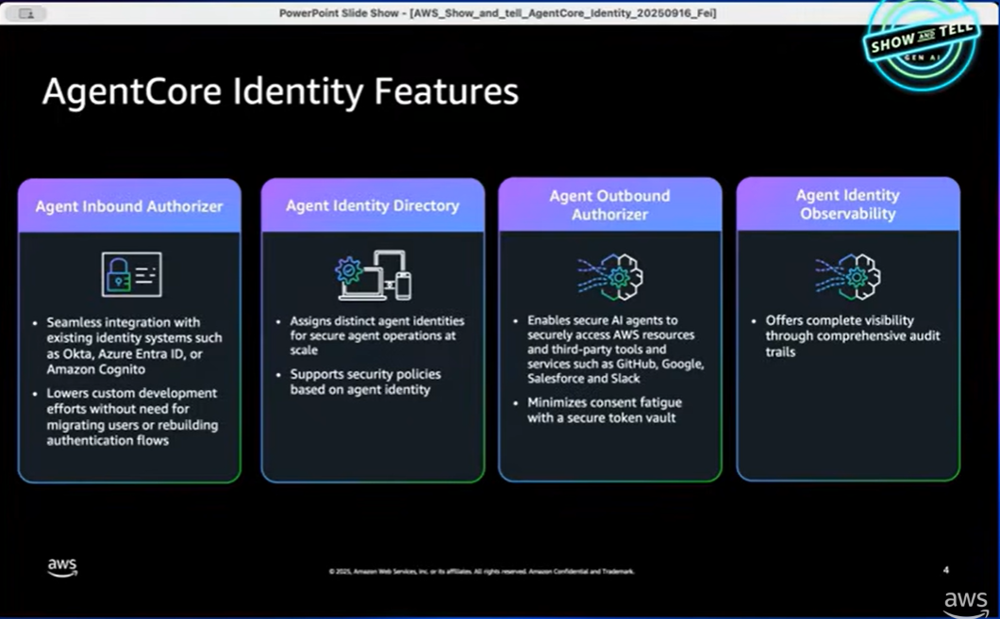

Chapters 02–05 built the agent and gave it tools. This chapter is about what blocks production next: **inbound authentication/authorization**, a **verifiable agent identity**, **outbound OAuth/API-key brokering** through a token vault, and **CloudTrail observability** — then three live demos (GitHub inspector on Runtime, standalone Identity, Gateway + Identity).

## 🎯 Learning Objectives

By the end of this chapter, the learner will be able to:

- Explain the **inbound vs outbound** identity problem for agents — and why an agent needs its own verifiable identity
- Name the four AgentCore Identity building blocks and what each does
- Wire `@requires_access_token` for a 3LO (user-federated) outbound OAuth flow
- Create a **workload identity** so Identity works with agents running *outside* Runtime
- Configure Gateway inbound (`CUSTOM_JWT`) and outbound (`GATEWAY_IAM_ROLE`, OAuth, API key) auth
- Understand the **token vault** — where third-party tokens live and who can retrieve them

---

## 6.1 The Production Gap — Identity Edition

Fay opens by framing why AgentCore exists at all: Bedrock already ran models and let you write agents — but taking agents to production surfaced a stack of unanswered questions: too many frameworks (LangGraph, LangChain, CrewAI, Strands), MCP proliferating for tools, nowhere managed to *run* agents, and then the big two — **security/identity** and **observability**.

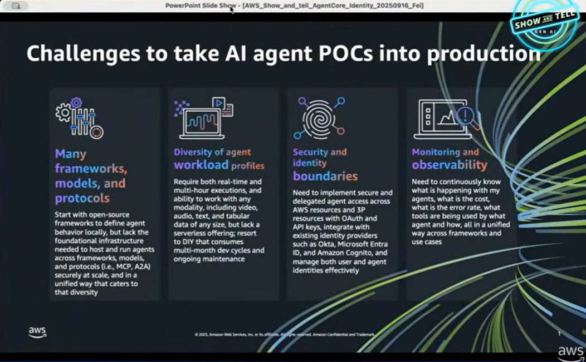
**What to notice** — the challenge list: framework/model/protocol diversity, workload-profile diversity (seconds-long vs hours-long sessions), **security & identity boundaries**, and monitoring/observability. CISOs and governance teams are the ones blocking production until "what is the agent doing, and whose data can it reach?" has an answer.

> [!NOTE]
> Identity was the make-or-break: *"Customers want to adopt agents but are afraid to adopt agents — before they can answer 'what is the agent doing,' they can't move forward."*

---

## 6.2 The Identity Triangle — Inbound, Agent, Outbound

The mental model for the whole chapter. Four parties: **User → Application → Agent → Resources**. That structure produces three distinct questions:

- **Inbound authN/authZ** — who is the user/application calling the agent? Are they allowed? How is the user represented when the call lands? (Both authentication *and* authorization.)
- **"Who is this agent?"** — an agent is close to a workload, but unlike a microservice it's *unpredictable* (a model decides what it calls). You can't just hand it a trusted permanent connection — it needs a **stable, verifiable identity**.
- **Outbound access** — the resource owner's questions: *which* agent is calling me, and **on whose behalf**? And that proof can't just be the agent code saying so — it must be verifiable.

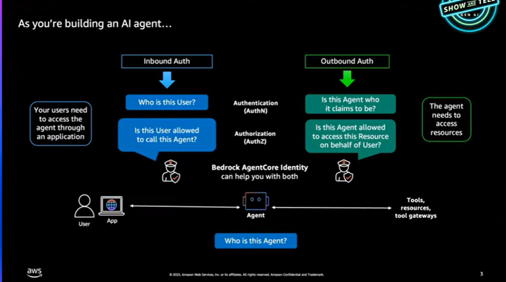
**What to notice** — left side = **Inbound Auth** (Authentication + Authorization — who is this user, are they allowed to call this agent). Bottom = **"Who is this Agent?"** — the agent's own identity. Right side = **Outbound Auth** — is this agent who it claims, and is it allowed to access the resource on the user's behalf? *"Bedrock AgentCore Identity can help you with both."*

> [!IMPORTANT]
> The resource owner's distrust is the key insight: **you don't trust the agent**. The agent claims to act for a user — the resource needs cryptographic proof that isn't manufactured by agent code. That's what Identity provides.

<Conversation title="How Fay frames it — the host ⇄ lead-engineer exchange" speakers={[
  { id: "trevor", name: "Trevor", role: "host", avatar: "🎙️", side: "left", color: "#38bdf8" },
  { id: "fay",    name: "Fay Yuan", role: "lead engineer, Identity", avatar: "🔒", side: "right", color: "#fb923c" },
]} messages={[
  { who: "trevor", text: "I already authenticate users — my app has Cognito. What's new about agents?" },
  { who: "fay",    text: "Two things. First, an agent isn't a fixed pipeline — a model decides at runtime which tools and APIs it calls. So 'who is allowed to invoke it' is only half the story.", note: "inbound authN + authZ ≠ the whole problem" },
  { who: "fay",    text: "Second — the resource on the other side never met your user. When the agent calls GitHub, GitHub's question is: which agent is this, and on whose behalf? And it shouldn't just take the agent's word for it." },
  { who: "trevor", text: "So the agent has to prove itself AND the user behind it?" },
  { who: "fay",    text: "Exactly. Think of it like zero trust for agents — we don't trust hop to hop. Every hop you need to show proof. That's why the identity directory gives the agent its own verifiable identity, and the token vault only releases third-party credentials when both proofs check out.", note: "the triangle: user → agent → resource, proof at every hop" },
]} />

---

## 6.3 The Four Building Blocks

Everything Identity launched with at the New York Summit:


**What to notice** —
1. **Agent Inbound Authorizer** — plugs your IdP in *as-is*: Cognito, Entra ID, Okta, Keycloak, Auth0. No forced federation, no mandated Cognito — bring your provider, point the discovery URL, control which token claims grant access.
2. **Agent Identity Directory** — a distinct, stable identity per agent/workload. Fay explains why they didn't just use IAM roles: customers share roles across apps as permission boundaries — a role ≠ a unique agent identity. The **workload identity** is a first-class resource usable in policies.
3. **Agent Outbound Authorizer** — secure access to AWS and non-AWS resources (GitHub, Google, Salesforce) via **credential providers** + a **token vault**. Minimizes consent fatigue; your agent code never stores third-party tokens.
4. **Agent Identity Observability** — CloudTrail audit on every token operation: who invoked what, which agent, which provider.

> [!TIP]
> The IdP answer deserves a highlight: *"We could have forced you onto our identity provider — we didn't. Meet customers where they are."* OAuth is a standard on paper; the Identity team actually **tested the popular providers end to end** because every IdP interprets the spec slightly differently.

---

## 6.4 The End-to-End Flow — and Where It Sits in the Stack

Identity is a standalone service **and** woven into Runtime and Gateway — the same "AgentCore for production-ready agents" architecture from the slide, interactive (drag to pan, scroll to zoom, click any component):

<FlowDiagram title="AgentCore for production-ready agents — any model, any framework" theme="dark" viewBox={{ w: 920, h: 560 }} nodes={[
  { id: "app",    label: "App",        sub: "your client",       icon: "🖥️", type: "client",   x: 30,  y: 150, w: 150, h: 58,
    detail: { description: "The application the user talks to — a web app, CLI or chat UI that invokes the agent on Runtime.", bullets: ["Invokes Runtime over HTTPS", "Carries the user's inbound JWT"] } },
  { id: "model",  label: "Any model",  sub: "Bedrock / any FM",  icon: "✨", type: "trigger",  x: 30,  y: 290, w: 150, h: 58,
    detail: { description: "Any foundation model — Claude, Nova, or a non-Bedrock model. AgentCore is model-agnostic." } },
  { id: "rt",     label: "AgentCore Runtime", icon: "🧠", type: "group", group: true, x: 240, y: 40, w: 330, h: 350 },
  { id: "fw",     label: "Any framework",    sub: "Strands · LangGraph · CrewAI", icon: "🧰", type: "compute", x: 260, y: 95,  w: 290, h: 50,
    detail: { description: "No migration required — your agent keeps its framework and its own tools." } },
  { id: "instr",  label: "Agent instructions", icon: "📄", type: "compute", x: 260, y: 165, w: 290, h: 50 },
  { id: "tools",  label: "Agent local tools",  icon: "🔧", type: "compute", x: 260, y: 235, w: 290, h: 50 },
  { id: "ctx",    label: "Agent context",      icon: "🗄️", type: "storage", x: 260, y: 305, w: 290, h: 50 },
  { id: "svc",    label: "AgentCore services", icon: "🧩", type: "group", group: true, x: 640, y: 40, w: 270, h: 235 },
  { id: "gw",     label: "AgentCore Gateway",            icon: "🌐", type: "network", x: 660, y: 82,  w: 230, h: 48,
    detail: { description: "Turns Lambda, OpenAPI and Smithy APIs into governed MCP tools — inbound JWT auth, per-target outbound credentials.", bullets: ["Chapter 5 covered this in depth"] } },
  { id: "browser",label: "AgentCore Browser",            icon: "🌐", type: "network", x: 660, y: 140, w: 230, h: 48 },
  { id: "ci",     label: "AgentCore Code Interpreter",   icon: "⚙️", type: "compute", x: 660, y: 198, w: 230, h: 48 },
  { id: "ident",  label: "AgentCore Identity", sub: "this chapter", icon: "🔒", type: "security", x: 640, y: 300, w: 270, h: 56,
    detail: { description: "Inbound authorizer + agent identity directory + outbound token vault + observability.", bullets: ["Inbound: any IdP — Cognito, Entra, Okta", "Outbound: OAuth2 + API-key credential providers", "The focus of this chapter"] } },
  { id: "mem",    label: "AgentCore Memory", icon: "🧠", type: "storage", x: 60, y: 460, w: 260, h: 56,
    detail: { description: "Short + long-term memory — session context and per-actor preferences across sessions." } },
  { id: "obs",    label: "AgentCore Observability", icon: "📊", type: "monitoring", x: 460, y: 460, w: 450, h: 56,
    detail: { description: "OTel traces, CloudWatch GenAI dashboards, CloudTrail audit — every hop visible." } },
]} edges={[
  { from: "app",   to: "rt",    label: "invoke" },
  { from: "rt",    to: "app",   animated: true },
  { from: "model", to: "rt" },
  { from: "rt",    to: "svc",   label: "tools" },
  { from: "svc",   to: "rt",    animated: true },
  { from: "rt",    to: "ident", label: "auth" },
  { from: "ident", to: "rt",    animated: true },
  { from: "rt",    to: "mem" },
  { from: "rt",    to: "obs" },
  { from: "mem",   to: "obs",   dashed: true },
  { from: "obs",   to: "svc",   dashed: true },
  { from: "obs",   to: "ident", dashed: true },
]} />

**What to notice** — where Identity sits: Runtime hosts the agent, Gateway fronts the tools, **Identity handles the auth on both sides**, Memory holds context, Observability watches it all (the dashed edges). Use Identity inside Runtime/Gateway (automatic) **or** call it directly for agents running anywhere else. Click any component for the detail panel — compare with the original slide:

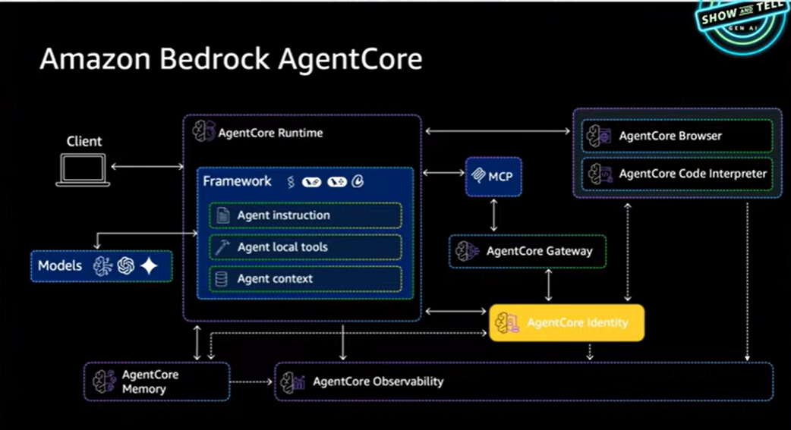

The full interaction sequence Fay walks through:

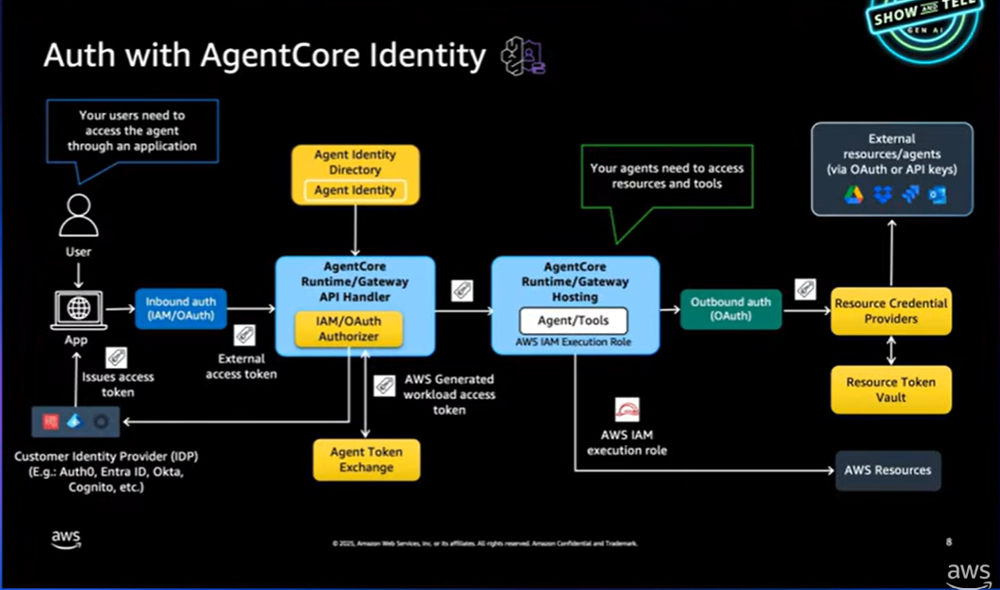
**What to notice** — trace it step by step:

1. **User → App**: user authenticates with your IdP (Cognito, Entra, Okta — or even a custom JWT scheme; Identity isn't opinionated about the token shape).
2. **Inbound**: the IdP-issued token hits the Runtime/Gateway **authorizer**, which also pulls *who the agent is* from the **Identity Directory** — Runtime knows its own agent's identity because it deployed it.
3. **Token exchange**: authorizer + directory combine user-who + agent-who into an **internal access token** — opaque to you, verifiable, carrying both claims.
4. **Outbound**: the agent asks the **token vault** for a resource credential (OAuth token or API key). First call → the vault returns a **consent URL**; the user opens it, grants scopes at the resource (GitHub/Google), and the returned token is stored in the vault — retrievable *only* with proof of agent + user.
5. **AWS resources**: going to AWS targets (S3, DynamoDB, Lambda) uses the **IAM role** of the Runtime/Gateway instead — no OAuth needed.

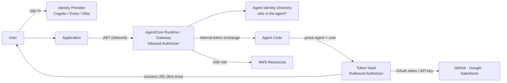
```mermaid
flowchart LR
    U["User"] -->|sign in| IDP["Identity Provider<br/>Cognito / Entra / Okta"]
    U --> APP["Application"]
    APP -->|"JWT (inbound)"| RT["AgentCore Runtime / Gateway<br/>Inbound Authorizer"]
    RT --> DIR["Agent Identity Directory<br/>who is the agent?"]
    RT -->|"internal token exchange"| AG["Agent Code"]
    AG -->|"prove agent + user"| VAULT["Token Vault<br/>Outbound Authorizer"]
    VAULT -->|"consent URL (first time)"| U
    VAULT -->|"OAuth token / API key"| EXT["GitHub · Google · Salesforce"]
    RT -->|"IAM role"| AWS["AWS Resources"]
```

> [!IMPORTANT]
> **The zero-trust framing**: asked whether this is "zero trust for agents," Fay's answer — *"that's how we think about it: we don't trust hop to hop. Every hop you need to show proof."* The vault won't hand a token to code that merely claims an identity.
>
> Also: why bother with a vault at all? Hundreds of thousands of users' third-party tokens can't be safely managed inside agent code — Identity stores them keyed by agent + user proof.

---

## 6.5 The GitHub Inspector on Runtime (Satvir)

First demo, straight from the samples repo: a Strands agent hosted on Runtime that lists **your private GitHub repositories** — the full inbound + outbound story.

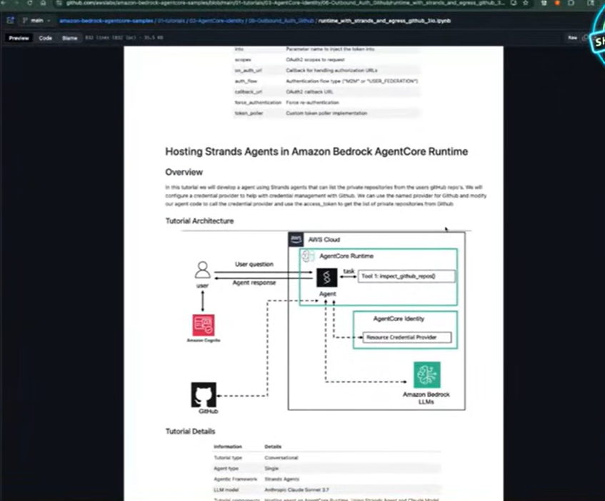
**What to notice** — the tutorial card: *Inbound Auth + Outbound Auth (3LO)*, Strands framework, Claude Haiku 4.5, components = AgentCore Runtime + Identity. Difficulty: intermediate.

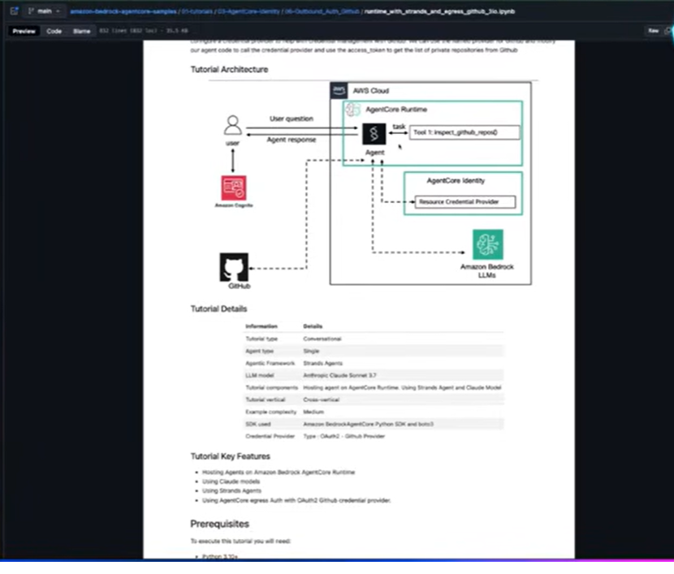
**What to notice** — the architecture: user → Cognito (inbound) → Runtime agent → GitHub via an Identity credential provider (outbound 3LO) → Bedrock for inference.

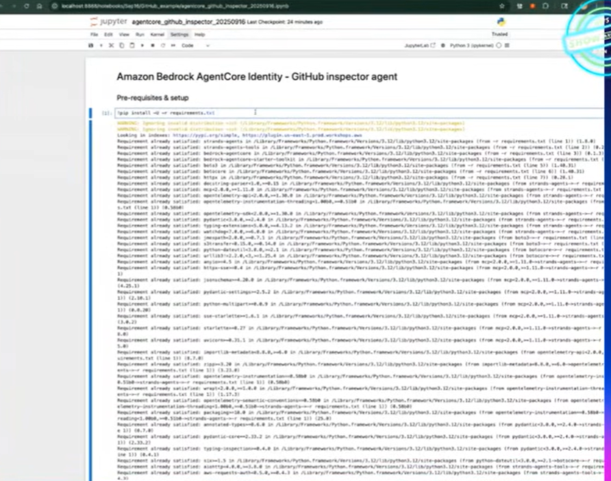
**What to notice** — Satvir works in a Jupyter notebook (`agentcore_github_inspector_20250916.ipynb`): `pip install bedrock-agentcore bedrock-agentcore-starter-toolkit strands-agents`, then walks each cell top to bottom.

### Credential providers in the console

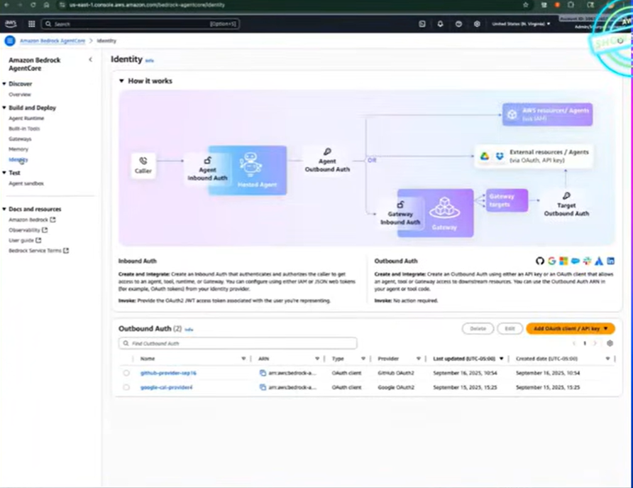
**What to notice** — the Identity console page: the "How it works" diagram (inbound → runtime/gateway, outbound → credential providers) and an already-created provider — `github-provider-september-16th`.

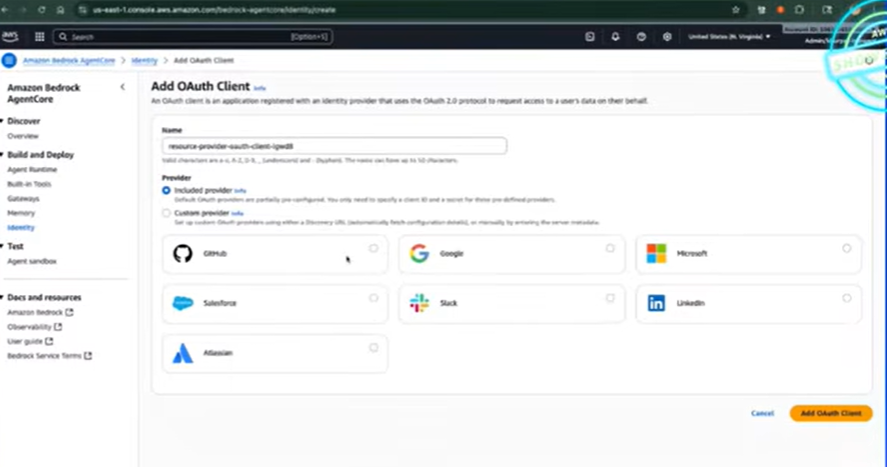
**What to notice** — the provider picker: named vendors out of the box (GitHub, Google, Microsoft, Salesforce, Slack, …) plus **custom**. Select GitHub, drop in client ID + secret — or do it via API as the demo does.

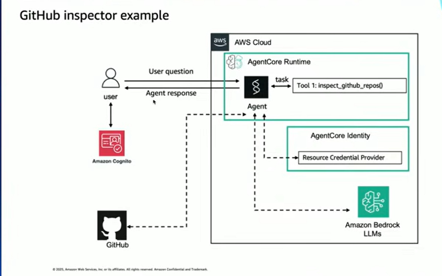
**What to notice** — the docs diagram for this exact demo: user → Cognito (inbound JWT) → Runtime agent → `inspect_github_repos` tool → **AgentCore Identity** → Resource Credential Provider → GitHub, with Bedrock LLMs underneath. Every hop is authenticated.

### Step 1 — Inbound: Cognito + a bearer token

The notebook provisions the inbound side: a Cognito user pool, resource server (with `github-inspector/read`/`write` scopes), an app client, and a helper that mints the test bearer token:

<GitHubExplorer repo="awslabs/agentcore-samples" ref="main" expanded="true" title="utils.py — setup_cognito_user_pool() + reauthenticate_user()" files={[
  { "path": "utils.py", "src": "/bedrock-deepti/code/ch6/utils.py", "label": "utils.py", "highlights": [[10, 42], [44, 46]], "note": "The notebook imports setup_cognito_user_pool and reauthenticate_user from utils.py — pool + resource server + client → discovery URL → bearer token. Recreated from the notebook." }
]} />

```terminal
$ python utils_setup.py
User pool: us-east-1_XXXXXXXX
Discovery URL: https://cognito-idp.us-east-1.amazonaws.com/us-east-1_XXXXXXXX/.well-known/openid-configuration
Bearer token acquired: eyJraWQiOiJ…
```

### Step 2 — Outbound: the GitHub credential provider

GitHub's OAuth client ID/secret come from **Secrets Manager** (following security best practices — "you might not want to see my client secret in this video"), then a named-vendor credential provider:

<GitHubExplorer repo="awslabs/agentcore-samples" ref="main" expanded="true" title="Creating the GitHub OAuth2 credential provider — github-provider-sep16" files={[
  { "path": "github_credential_provider.py", "src": "/bedrock-deepti/code/ch6/github_credential_provider.py", "label": "github_credential_provider.py", "highlights": [[17, 28]], "note": "credentialProviderVendor='GitHubOauth2' — a named provider. The OAuth client id/secret are read from Secrets Manager, never pasted in the notebook." }
]} />

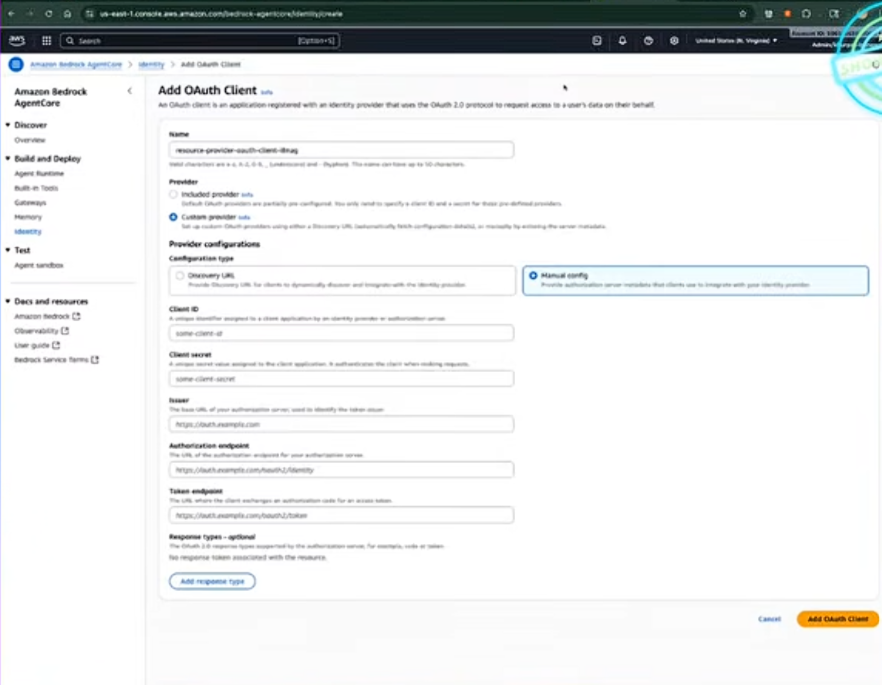
**What to notice** — the console's **Custom provider → Manual config** form: issuer, authorization endpoint, token endpoint, response types, client ID/secret. This is how any OAuth-protected resource outside the named vendors gets a credential provider — same result as the API call.

> [!TIP]
> Don't see your provider in the named list? There's a **custom provider** — supply the OAuth endpoints manually and *any* OAuth-protected resource works (ServiceNow, internal tools, anything).

### Step 3 — The agent: `@requires_access_token` does the 3LO dance

The agent itself: a `@app.entrypoint` entry point, a `need_token_3LO` helper decorated with `@requires_access_token`, and the `inspect_github_repos` tool that calls the GitHub REST API with the injected token:

<GitHubExplorer repo="awslabs/agentcore-samples" ref="main" expanded="true" title="github_agent.py — the GitHub inspector file written to disk (%%writefile)" files={[
  { "path": "github_agent.py", "src": "/bedrock-deepti/code/ch6/github_agent.py", "label": "github_agent.py", "highlights": [[59, 70], [21, 22], [74, 81]], "note": "provider_name 'github-provider-sep16' matches the credential provider created earlier; auth_flow='USER_FEDERATION' = OAuth 3LO; scopes=['repo'] = read private repos only." }
]} />

**The decorator parameters to memorize:**

| Parameter | Value here | Means |
|---|---|---|
| `provider_name` | `github-provider-september-16th` | Which credential provider in Identity |
| `scopes` | `["repo"]` | Exactly what the token may do — least privilege |
| `auth_flow` | `USER_FEDERATION` | OAuth auth-code (3LO) — user consents. `M2M` = client credentials, no user |
| `on_auth_url` | callback | Where the consent URL surfaces — return it to the caller/UI |
| `force_authentication` | `True` | Don't reuse a cached token silently |

### Step 4 — Launch + IAM least privilege

Deploy with the starter toolkit (same `agentcore launch` as earlier chapters), then attach Identity permissions to the **auto-created** execution role — it starts minimal on purpose:

<GitHubExplorer repo="awslabs/agentcore-samples" ref="main" expanded="true" title="runtime_configure.py + runtime_permissions.py — configure, launch, then grant Identity access" files={[
  { "path": "runtime_configure.py", "src": "/bedrock-deepti/code/ch6/runtime_configure.py", "label": "runtime_configure.py", "highlights": [[7, 17]], "note": "agentcore_runtime.configure wires the Cognito customJWTAuthorizer straight onto the runtime — discoveryUrl + allowedClients." },
  { "path": "runtime_permissions.py", "src": "/bedrock-deepti/code/ch6/runtime_permissions.py", "label": "runtime_permissions.py", "highlights": [[8, 24], [27, 31]], "note": "put_role_policy adds GetResourceApiKey + GetResourceOauth2Token + secretsmanager:GetSecretValue — only what the outbound flow needs." }
]} />

```terminal
$ agentcore launch
Deploying… packaging container → pushing to ECR → creating runtime
✅ Runtime deployed. Waiting for status…
Runtime status: READY
```

### Step 5 — Invoke: watch the consent flow fire

Call the runtime with the Cognito bearer token (inbound) — the *first* call doesn't return repos; it returns the GitHub **consent URL** (outbound 3LO kicking in):

<GitHubExplorer repo="awslabs/agentcore-samples" ref="main" expanded="true" title="invoke_agent.py — bearer token in, consent URL out (invoke cell)" files={[
  { "path": "invoke_agent.py", "src": "/bedrock-deepti/code/ch6/invoke_agent.py", "label": "invoke_agent.py", "highlights": [[1, 4]], "note": "agentcore_runtime.invoke with a fresh Cognito bearer token — the streamed response carries the GitHub consent URL on first call." }
]} />

```terminal
$ python invoke_agent.py
Invoking github_inspector — prompt: "What are my private repositories?"

Authorization required for GitHub access. Starting authorization flow…
Authorization URL: https://github.com/login/oauth/authorize?client_id=…&scope=repo
→ open this URL in a browser and approve
```

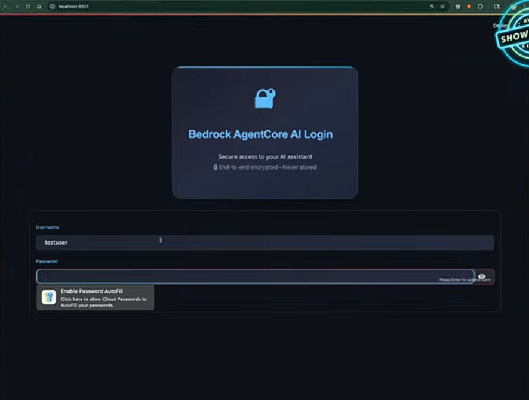
**What to notice** — the inbound side in action: Cognito-hosted sign-in for the demo client app before a token is even minted. Inbound (you → agent) and outbound (agent → GitHub) are two separate OAuth exchanges.

```terminal
$ python invoke_agent.py          # after consent granted
Invoking github_inspector — prompt: "What are my private repositories?"

Here are your private repositories:
- aws-agentcore-demos
- internal-poc-infra
- customer-support-agent
- personal-ml-experiments
…
```

Consent granted → the credential provider completes the flow with GitHub, **stores the token in the vault**, and the second invoke lists the real private repos. Same concept works for *any* OAuth-protected resource — Graph APIs, internal OAuth servers, Okta-fronted APIs.

---

## 6.6 Identity Standalone (no Runtime required)

The follow-up everyone asks: *"My agent runs on EKS / ECS / my laptop / another cloud — can I still use Identity?"* **Yes.** Every primitive works on its own — that was a design goal.

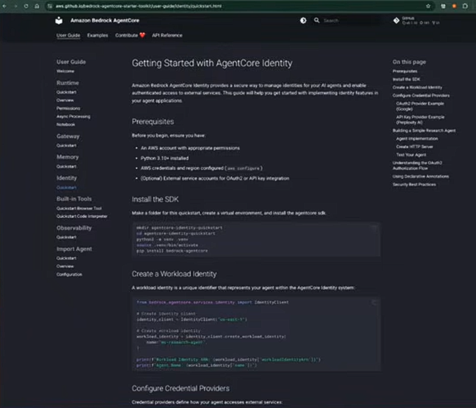
**What to notice** — the public quickstart: prerequisites → install the SDK → create workload identity → configure credential providers → build the research agent. Everything in the repo, screenshot-documented.

The standalone demo: a **research agent** that searches via **Perplexity** (API key — stored in the vault) and saves results to **Google Drive** (3LO OAuth token) — proving the vault brokers *both* secret types:

<GitHubExplorer repo="awslabs/agentcore-samples" ref="main" expanded="true" title="Identity without Runtime — workload identity + both credential types" files={[
  { "path": "quickstart_identity.py", "src": "/bedrock-deepti/code/ch6/quickstart_identity.py", "label": "quickstart_identity.py", "highlights": [[8, 12], [17, 26], [29, 32]], "note": "create_workload_identity gives an off-Runtime agent a verifiable identity; the vault stores OAuth tokens AND API keys." },
  { "path": "research_agent.py", "src": "/bedrock-deepti/code/ch6/research_agent.py", "label": "research_agent.py", "highlights": [[14, 15], [21, 30], [36, 43]], "note": "Perplexity via API-key provider (M2M — no user), Drive via OAuth provider (USER_FEDERATION — user consent). Same decorator, different flow." }
]} />

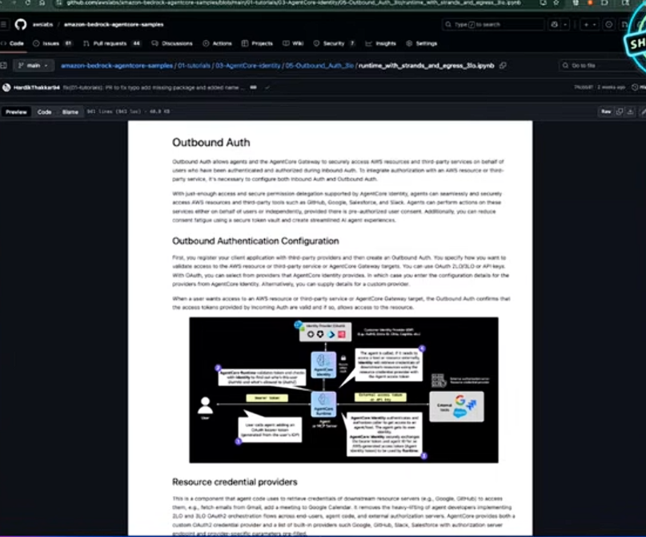
**What to notice** — the docs diagram of what the outbound authorizer brokers: **API keys**, **OAuth2 tokens (IAM/machine)**, and **OAuth tokens to third parties** — the vault holds all three types, retrieved only with agent + user proof.

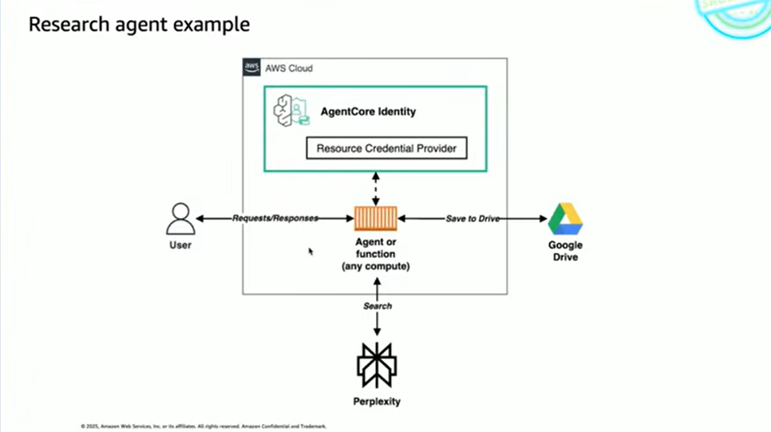
**What to notice** — the diagram: the agent runs in *any* compute → calls Identity directly → resource credential providers → Perplexity (API key) and Google Drive (OAuth). No Runtime, no Gateway — just Identity.

> [!IMPORTANT]
> **The rule of thumb**: agent on Runtime or behind Gateway → workload access token handling is implicit. Agent anywhere else → create a **workload identity** explicitly and call the Identity APIs yourself. Everything else (credential providers, vault, consent flow) is identical.

---

## 6.7 Identity Through AgentCore Gateway (Antonio)

Bonus demo: the same identity story, now for **tools behind Gateway**. Inbound JWT controls who calls the gateway; outbound config controls how the gateway authenticates to each target.

<Conversation title="Why bother with Gateway auth? — the host ⇄ Antonio exchange" speakers={[
  { id: "trevor",  name: "Trevor",  role: "host",         avatar: "🎙️", side: "left",  color: "#38bdf8" },
  { id: "antonio", name: "Antonio", role: "principal SA", avatar: "🌐", side: "right", color: "#34d399" },
]} messages={[
  { who: "trevor",  text: "Chapter 5 gave my tools a gateway. They're locked down now, right?" },
  { who: "antonio", text: "Halfway. The gateway fronts your tools, but nothing yet stops any caller who knows the URL. First job: attach a JWT authorizer — Cognito in this demo — so only tokens your IdP issued get through the door." },
  { who: "trevor",  text: "And the other half?" },
  { who: "antonio", text: "Outbound. Each target authenticates its own way — the Lambda target goes over an IAM role, a REST API might want an API key, Google or Salesforce want OAuth. You declare it per target and the gateway handles the handshake. Same two-sided story as Runtime, just at the tool boundary.", note: "inbound: who calls the gateway · outbound: how the gateway reaches each target" },
]} />

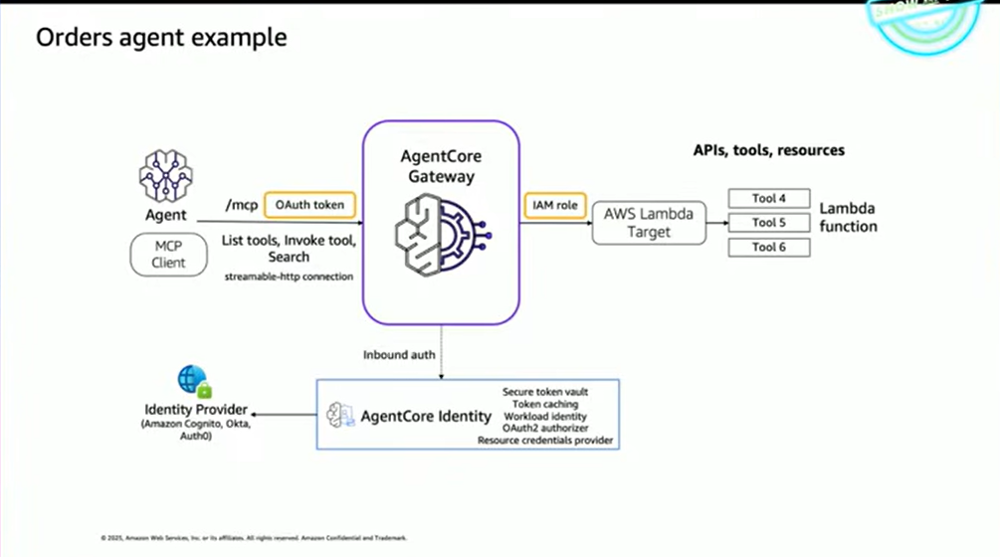
**What to notice** — the concrete setup: Cognito (inbound OAuth token) → Gateway → **IAM role** outbound → a Lambda target exposing the orders tools.

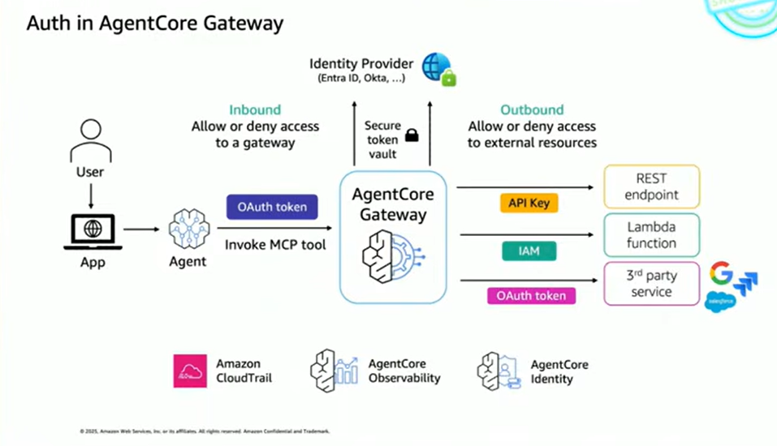
**What to notice** — the general pattern: inbound OAuth token from the user/app, then per-target outbound auth — **IAM role** (Lambda/AWS), **API key** (REST endpoints), or **OAuth token** (third-party services like Google/Salesforce). One choke point, three outbound flavors.

### Step 1 — Gateway IAM role + Cognito inbound

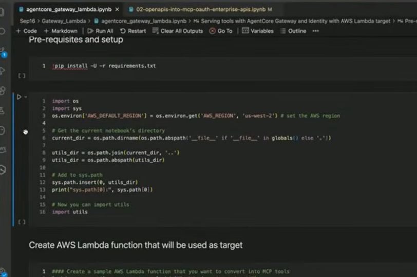

The notebook (`agentcore_gateway_lambda.ipynb`) provisions the execution role the gateway assumes, then a Cognito pool with a resource server and `gateway.read`/`gateway.write` scopes:

<GitHubExplorer repo="awslabs/agentcore-samples" ref="main" expanded="true" title="Gateway setup — execution role, Cognito pool, create_gateway with CUSTOM_JWT" files={[
  { "path": "gateway_setup.py", "src": "/bedrock-deepti/code/ch6/gateway_setup.py", "label": "gateway_setup.py", "highlights": [[8, 26], [30, 48], [53, 63]], "note": "Cell from agentcore_gateway_lambda.ipynb — auth_config customJWTAuthorizer{allowedClients, discoveryUrl} — the same inbound shape as Runtime." }
]} />

```terminal
$ python -m notebook … (run the gateway cells)
Creating Cognito pool and resources…
Creating or retrieving app client…
Auth Pool ID: us-west-2_XXXXXXXX  Client ID: 2l…  Discovery URL: https://cognito-idp.us-west-2.amazonaws.com/us-west-2_…/.well-known/openid-configuration
Creating gateway…
Gateway: https://testgwforlambdasep16.gateway.bedrock-agentcore.us-west-2.amazonaws.com/mcp
```

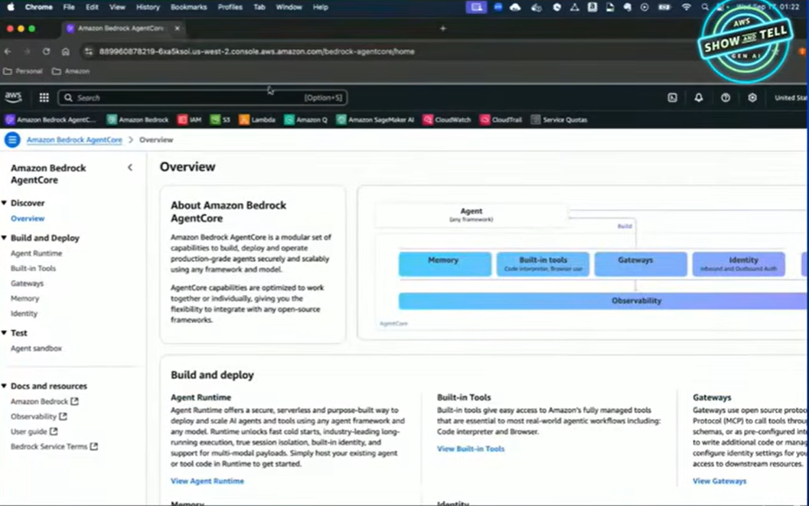
**What to notice** — the AgentCore console landing: Memory, Runtime, Identity, Gateway tiles — the collection the whole series walks through.

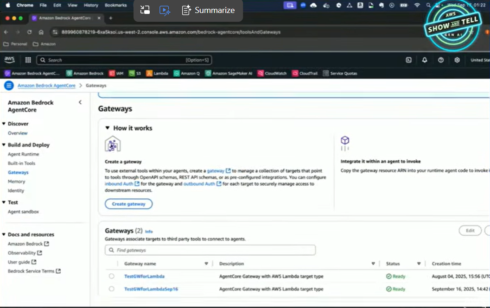
**What to notice** — `TestGWforLambdaSep16`, status READY, inbound identity = Cognito — the gateway advertises *which* authorizer guards it.

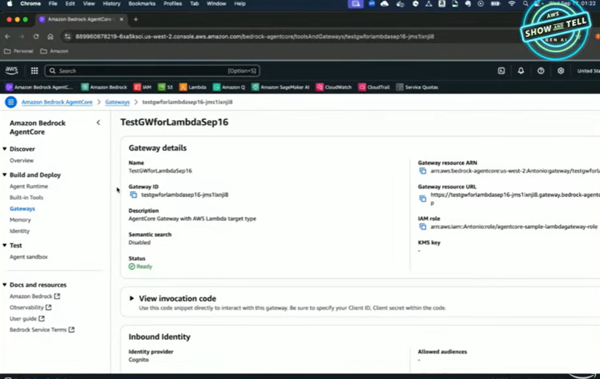
**What to notice** — gateway URL + ARN, the Lambda target already attached, and the **Inbound Identity** panel naming Cognito as the provider.

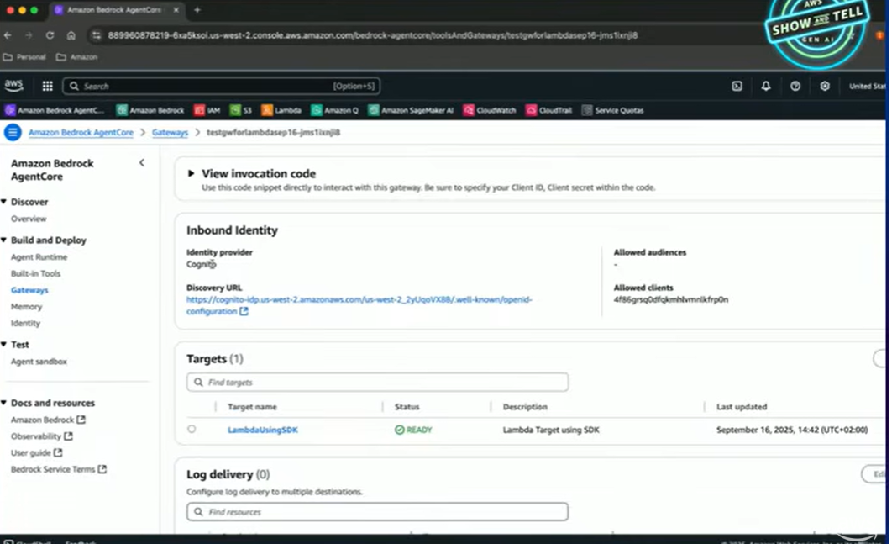
**What to notice** — *View invocation code* gives you the client snippet; the Targets table lists the Lambda tool. Everything provisioned by the notebook is inspectable here.

### Step 2 — The Lambda target becomes an MCP tool

`lambda_target_config` carries the **toolSchema** (what the model sees: name, description, inputSchema) and `credentialProviderType: GATEWAY_IAM_ROLE` (how the gateway authenticates to the target):

<GitHubExplorer repo="awslabs/agentcore-samples" ref="main" expanded="true" title="Lambda target → MCP tool + outbound credential config" files={[
  { "path": "lambda_target.py", "src": "/bedrock-deepti/code/ch6/lambda_target.py", "label": "lambda_target.py", "highlights": [[6, 38], [43, 44], [46, 52]], "note": "Cell from agentcore_gateway_lambda.ipynb — toolSchema inlinePayload = the MCP contract the agent reads; GATEWAY_IAM_ROLE = outbound auth for AWS targets." },
  { "path": "zendesk_provider.py", "src": "/bedrock-deepti/code/ch6/zendesk_provider.py", "label": "zendesk_provider.py", "highlights": [[8, 22], [24, 27]], "note": "Same target, different outbound: CustomOauth2 provider for Zendesk/ServiceNow/Jira — config endpoints manually." }
]} />

### Step 3 — Call it: token in, MCP tools out

A local Strands agent (Nova Pro) mints a Cognito client-credentials token, opens an `MCPClient` to the gateway URL with `Bearer` auth, `list_tools_sync()` discovers `get_order_tool`/`update_order_tool`, and one prompt drives the whole chain:

<GitHubExplorer repo="awslabs/agentcore-samples" ref="main" expanded="true" title="gateway_agent.py — local agent → gateway → Lambda, authenticated both ways" files={[
  { "path": "gateway_agent.py", "src": "/bedrock-deepti/code/ch6/gateway_agent.py", "label": "gateway_agent.py", "highlights": [[14, 19], [23, 27], [34, 43]], "note": "Cell from agentcore_gateway_lambda.ipynb — Bearer token = inbound auth; list_tools_sync() = discovery; the gateway handles outbound IAM to Lambda." }
]} />

```terminal
Requesting the access token from Amazon Cognito authorizer…
Token: eyJraWQiOiJ…
Tools loaded: ['get_order_tool', 'update_order_tool']

Agent thinking: "I need to list the tools available… get_order_tool matches."
Tool #1: get_order_tool → invoked via gateway → Lambda

Response: Order 123 is in "shipped" status. ✅
```

Inbound OAuth ✓ (Cognito token at the gateway) — outbound auth ✓ (gateway's IAM role invoking Lambda) — a fully secured MCP tool chain.

### Step 4 — Putting it all together

The closing stretch: one agent on **Runtime** calling **Identity** for GitHub (3LO) *and* the **Gateway** for order tools — every hop authenticated:

<GitHubExplorer repo="awslabs/agentcore-samples" ref="main" expanded="true" title="e2e_agent.py — Runtime + Identity + Gateway in one agent" files={[
  { "path": "e2e_agent.py", "src": "/bedrock-deepti/code/ch6/e2e_agent.py", "label": "e2e_agent.py", "highlights": [[15, 22], [36, 40], [55, 62]], "note": "GitHub creds from Secrets Manager, consent URL surfaced via needs_authentication, gateway MCP tools merged into the same Agent. Recreated from the notebook." }
]} />

---

## 6.8 Recap + Where to Go Next

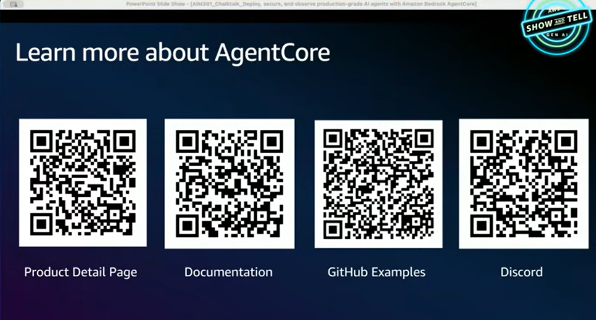
**What to notice** — the closing slide: Product Detail Page, Documentation, GitHub Examples, Discord. The samples repo is continuously updated — new IdP examples (Entra ID ✓, Okta ✓, Auth0/Ping/Duo coming) and more target connectors.

### � Chapter 06 — Source & Code

The demos followed the official Identity samples — the same four links from the closing slide:

- 🆔 **AgentCore Identity guide** — [docs.aws.amazon.com/bedrock-agentcore/latest/devguide/identity.html](https://docs.aws.amazon.com/bedrock-agentcore/latest/devguide/identity.html) — inbound/outbound model, workload identities, token vault
- 🚀 **Identity — Getting Started** — [docs.aws.amazon.com/bedrock-agentcore/latest/devguide/identity-getting-started.html](https://docs.aws.amazon.com/bedrock-agentcore/latest/devguide/identity-getting-started.html) — the setup path this chapter followed
- 🐍 **AgentCore SDK for Python** — [github.com/aws/bedrock-agentcore-sdk-python](https://github.com/aws/bedrock-agentcore-sdk-python) — `BedrockAgentCoreApp`, `@requires_access_token`, the identity client
- 📓 **Identity samples** — [awslabs/agentcore-samples → 01-tutorials/03-AgentCore-identity](https://github.com/awslabs/agentcore-samples/tree/main/01-tutorials/03-AgentCore-identity) — the GitHub inspector, standalone and gateway notebooks from this chapter
- ▶️ **Watch the episode** — [Secure your agent workflows | AWS Show & Tell](https://www.youtube.com/watch?v=wv2doVDF7KQ&list=PLhr1KZpdzukfZdp5SGgm2yBPglHNHn-Ig&index=5) — the source video for this chapter

---

## 🧠 Knowledge Check

<Quiz question="What are the three identity questions AgentCore Identity answers?" options={["Model, memory and monitoring","Who is calling the agent (inbound auth), who is the agent itself (identity directory), and what the agent can access on whose behalf (outbound auth)","Username, password and MFA","Ingress, egress and encryption"]} answerIndex={1} explanation="The triangle from Fay's slide: user→agent is inbound authN/authZ, the agent itself needs a verifiable workload identity, and agent→resources is outbound auth — all three must be proven, not claimed." />

<Quiz question="When does the GitHub 3LO flow return a consent URL instead of repo data?" options={["On every call — consent is required each time","Only when tokens are invalid","On the first call, until the user grants consent and the token is stored in the vault","Whenever the model decides it needs help"]} answerIndex={2} explanation="The first invoke returns the GitHub authorize URL via on_auth_url; after the user consents, Identity stores the token in the vault and subsequent calls inject it automatically." />

<Quiz question="An agent runs on EKS, not AgentCore Runtime. How does it use AgentCore Identity?" options={["It can't — Identity requires Runtime","Create a workload identity explicitly, then call the Identity APIs directly","Deploy a Runtime sidecar container","Rewrite it as a Lambda first"]} answerIndex={1} explanation="Identity is a standalone service — Runtime does the workload-access-token plumbing implicitly, but off-Runtime agents just create a workload identity and call the same credential-provider/vault APIs themselves." />

<Quiz question="In the Gateway demo, what does credentialProviderType GATEWAY_IAM_ROLE do?" options={["Gives the end user AWS credentials","Lets the gateway authenticate to the Lambda target using the gateway's own IAM role — the outbound side for AWS targets","Creates an IAM user for the gateway","Disables authorization on the target"]} answerIndex={1} explanation="Outbound auth is per-target: AWS targets use the gateway's IAM role; third-party targets would use an OAuth2 or API-key credential provider instead." />

<Quiz question="Why did Identity introduce a workload identity instead of just using the agent's IAM role?" options={["IAM roles are too slow","Roles are permission boundaries shared across apps — a workload identity is a distinct, stable, per-agent identity you can reference in policies","IAM doesn't work with agents","Roles can't call AWS services"]} answerIndex={1} explanation="Fay's point: customers reuse roles as permission boundaries across many apps, so a role doesn't uniquely name an agent. The workload identity is a first-class, verifiable per-agent identity." />

---

## 🏁 Chapter 6 Summary

- **Identity = inbound + agent identity + outbound + observability**: authorizer (any IdP), workload identity directory, token vault + credential providers, CloudTrail audit
- **The agent must prove itself AND its user** — the vault only releases third-party tokens on both proofs; "every hop shows proof" (zero-trust by design)
- **3LO = consent URL once, then cached**: `USER_FEDERATION` brokers user consent; `M2M` for machine-to-machine/API keys
- **Credential providers**: named vendors (GitHub, Google, Salesforce, Slack…) or custom endpoints — secrets never live in agent code
- **Standalone works**: `create_workload_identity` + Identity APIs give off-Runtime agents the same capabilities
- **Gateway carries both directions**: CUSTOM_JWT inbound + per-target outbound (`GATEWAY_IAM_ROLE` for AWS, OAuth/API key for third parties)
- **Least privilege everywhere**: auto-created execution roles start minimal; grant only the token operations the outbound flow needs

**Chapter 5** gave agents a governed tool catalog; **this chapter** proved every hop — user → agent → tool — with real identities. Next in the series: Memory and Observability deep dives.

### Watch the Original Tutorial

<VideoSection youtubeId="wv2doVDF7KQ" title="Secure your agent workflows | AWS Show and Tell" />
