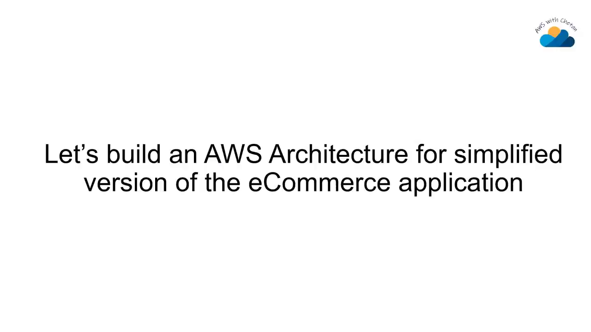
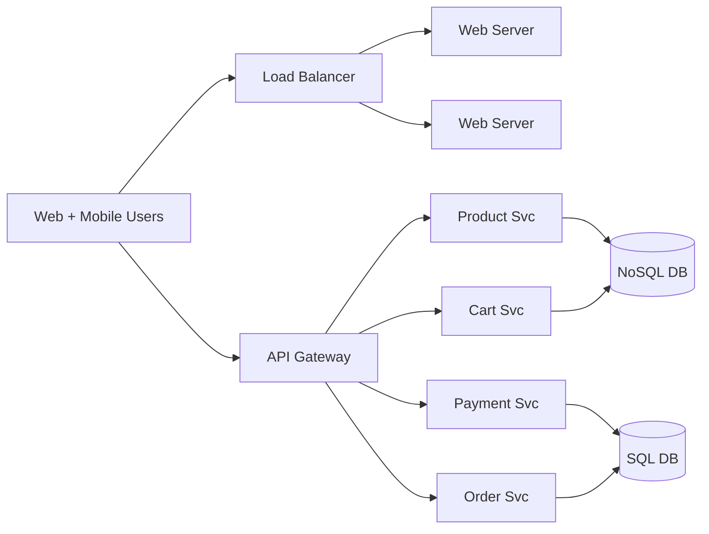
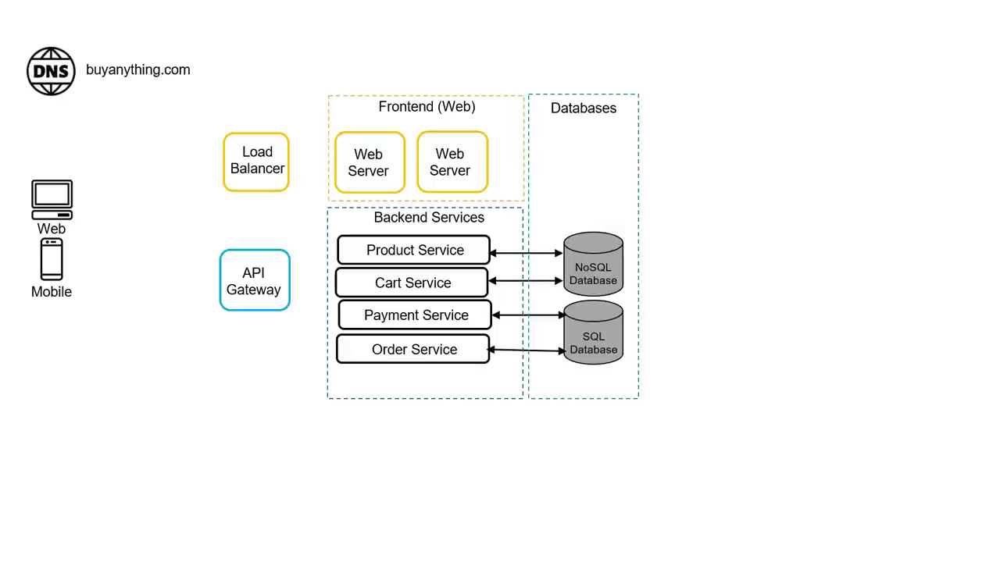
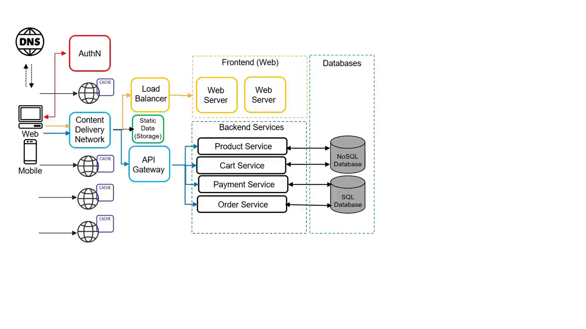

# eCommerce Architecture on AWS — Chapter 1

# 🛒 Designing an eCommerce Architecture — From Users to Production-Ready

<VideoSection youtubeId="f-rl_4Pd8dw" title="AWS Interview Prep: Designing an eCommerce Architecture from Scratch | AWS with Chetan" />

## Chapter Goal

In system-design and Solutions Architect interviews, "design an e-commerce platform" is one of the most common prompts. This chapter builds the architecture **cloud-agnostically first** — understanding *why* each component exists before naming any AWS service. By the end you'll have a production-shaped design: users, microservices, purpose-built databases, DNS, load balancing, authentication, CDN and caching.

## 1.1 🎬 Why This Scenario Shows Up in Interviews

<ConceptCard title="The interviewer's favorite">
E-commerce hits every architectural muscle: high read traffic (product browsing), transactional writes (payments/orders), global users (CDN/DNS), background workflows (order fulfillment), ML (recommendations) and analytics (BI). If you can design this, you can defend most system-design questions.
</ConceptCard>

Here's the end state the video builds toward — don't worry about the density yet, we get there layer by layer:

## 1.2 🧱 The Minimal Application — Three Components

Every app starts the same way: **frontend** (what users see), **backend** (business logic), **database** (state). Our store — call it `buyanything.com` — serves both **web and mobile users**.

| Component | Responsibility | Why it matters |
|-----------|---------------|----------------|
| Frontend / web servers | Render the UI | Multiple instances → high availability + scale |
| Backend services | Business logic | Product catalog, cart, payment, orders |
| Databases | Persist state | Different data shapes → different engines |

## 1.3 🧩 Microservices — Split by Business Capability

The backend isn't one monolith — it's **services that scale independently**: Product (renders the catalog), Cart, Payment, Order. Black Friday hits Product browsing 100× harder than Checkout — microservices let you scale the hot path without paying for the cold one.

## 1.4 🗄️ Purpose-Built Databases — NoSQL vs SQL

This is a classic interview trap — the answer isn't "pick one database":

| Data | Shape | Right engine |
|------|-------|--------------|
| Products / cart | Laptop vs screwdriver vs pen — every item has *different* attributes | **NoSQL** (document/key-value — no strict schema) |
| Payments / orders | Transactions, ACID guarantees, strict relationships | **Relational SQL** |

<InfoCard title="Say it in the interview">
"A laptop and a screwdriver have nothing in common as records — so the catalog wants a schema-less store. But money needs ACID — payments and orders stay relational." That single sentence demonstrates judgment, not just service names.
</InfoCard>

## 1.5 🌐 Exposure — Load Balancer, API Gateway, DNS

- **Load balancer** spreads web traffic across web-server instances.
- **API Gateway** routes API calls to the right microservice by path.
- **DNS** is the *first* service touched — resolves `buyanything.com` to the LB/API-GW IPs before anything else happens.

## 1.6 🚀 Productionizing — Auth, CDN, Cache, External Storage

The skeleton works, but production adds four concerns:

1. **Authentication (AuthN)** — an identity provider issues tokens; users sign in once and call APIs with them.
2. **CDN** — product images/videos/static pages rarely change daily; cache them at edge locations near users (the Netflix analogy — serve from the nearest edge, not the origin).
3. **External object storage** — static assets move *off* the web servers entirely; the CDN fetches straight from storage.
4. **In-memory cache** — user sessions cached beside web servers so login state survives across instances.

<WarningCard title="Interviewer follow-up">
"Why move static data off web servers?" — because compute serving files wastes capacity; object storage is cheaper, infinitely durable, and CDN fetches from it directly. Know the *why*, not just the arrow.
</WarningCard>

## 🧠 Knowledge Check

<Quiz question="Why does the product catalog belong in NoSQL while payments belong in SQL?" options='["NoSQL is faster", "Product attributes vary per item so no fixed schema fits; payments need ACID transactions and strict relationships", "SQL is deprecated", "NoSQL is cheaper"]' answer={1} explanation="Purpose-built databases: the catalog is heterogeneous (a pen vs a laptop share almost no fields) → document/key-value. Payments/orders need transactional integrity → relational." />

<Quiz question="What is the FIRST service a request touches when a user opens buyanything.com?" options='["The load balancer", "The API Gateway", "DNS", "The web server"]' answer={2} explanation="The domain name must resolve to an IP before any connection happens — DNS is always the first hop." />

<Quiz question="Why add a CDN in front of the product catalog?" options='["For security", "Product images/videos change rarely and are read by millions — edge caching removes repeated origin fetches", "CDNs are required by AWS", "To reduce database size"]' answer={1} explanation="Read-heavy, rarely-changing static content is the textbook CDN case — nearest edge location serves it, origin stays cold." />

## 🏁 Chapter 1 Summary

- Start cloud-agnostic: users → frontend → microservices → purpose-built databases.
- NoSQL for the catalog (heterogeneous attributes), SQL for payments/orders (ACID).
- DNS first, then Load Balancer (web) + API Gateway (REST routing).
- Production-ready = auth tokens + CDN edge caching + external static storage + session cache.
- Next chapter adds the services real stores actually need: search, order workflows, recommendations, analytics.
