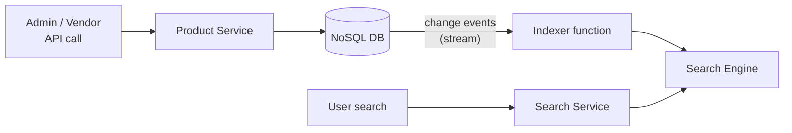
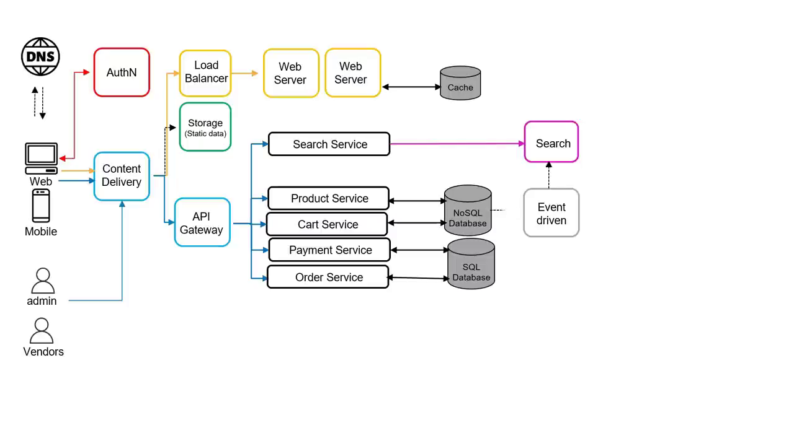
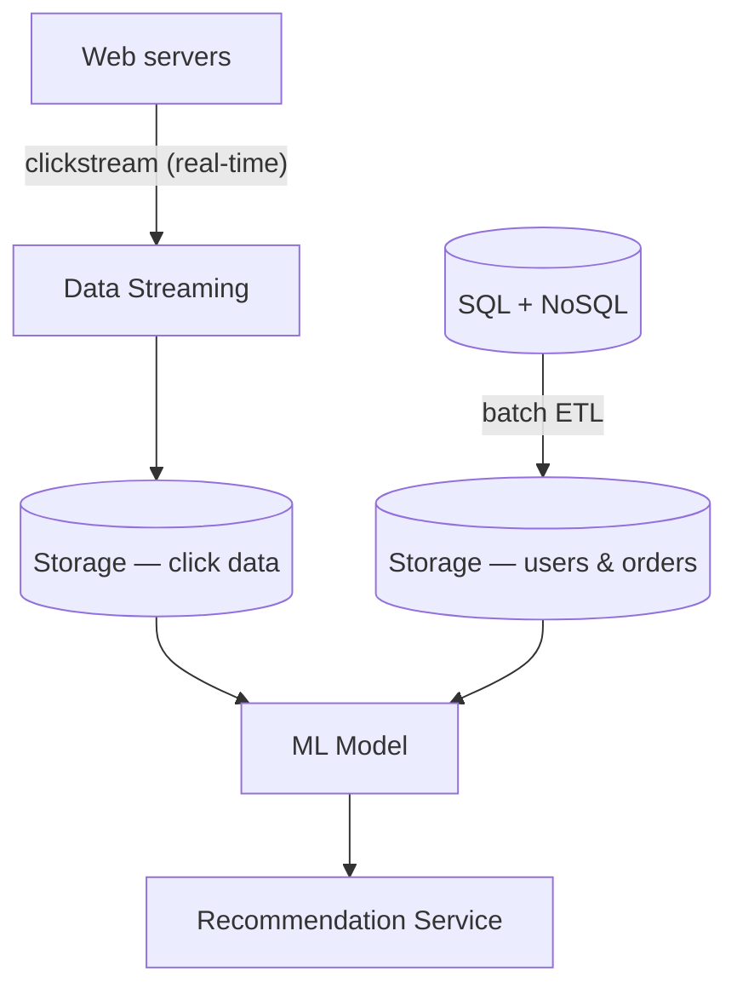
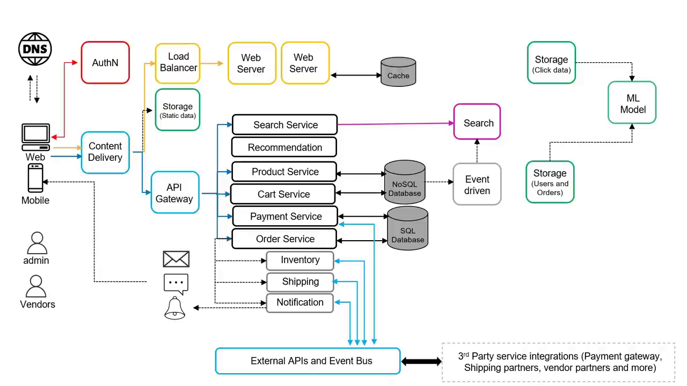
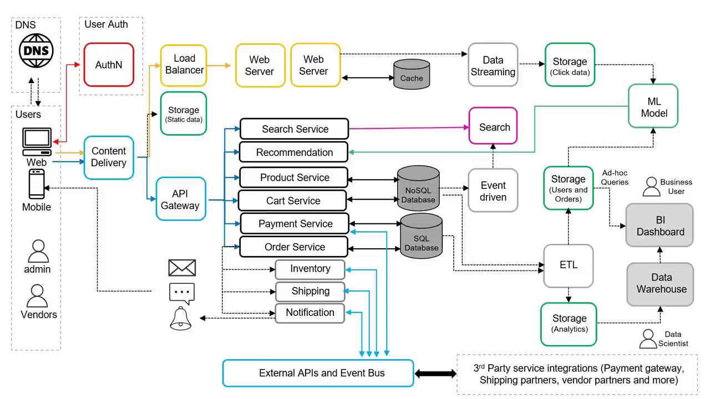

# eCommerce Architecture on AWS — Chapter 2

# 🔎 Search, Orders, Recommendations &amp; Analytics — The Services Real Stores Need

## Chapter Goal

Chapter 1 built the skeleton. Real e-commerce platforms need four more systems: **search** (with automatic index updates), **order orchestration** (multi-step fulfillment workflows), **recommendations** (clickstream + ML), and **analytics** (warehouse + BI + ad-hoc queries). Each one introduces an architectural *pattern* you'll reuse everywhere — event-driven updates, workflow engines, streaming ingestion, and the data lake.

## 2.1 🔍 Search Service — and the Event-Driven Index

A store without search is useless — users search before they browse. Add a **Search Service** backed by a dedicated **search engine**. But the engine can't work alone: it must know every product that exists.

<ConceptCard title="The event-driven trick">
When an admin/vendor adds a product via API → Product Service writes to the NoSQL DB → you want the search index updated *automatically*. Solution: capture database changes as a **stream of events**; a small compute function reads each change and updates the search index. No polling, no manual sync.
</ConceptCard>

## 2.2 📦 Order Service — Orchestrating a Workflow

Placing an order kicks off a *saga*: update inventory → ship → notify — and every step can fail or need compensation (order cancelled → different workflow entirely). This is a **workflow orchestration** problem, not a bunch of if-statements inside the service.

| Pattern | What it handles |
|---------|-----------------|
| Workflow engine | Multi-step order fulfillment with branching/retries/compensation |
| Internal services | Inventory, Shipping, Notification coordinated by Order Service |
| Third-party integrations | Shipping carriers, payment gateways — external partners via APIs |
| Notifications | Email / SMS / mobile push to the customer |

## 2.3 🤖 Recommendation Service — Data In, Model Out

Recommendations look like one box but hide a whole data pipeline. The ML model needs:

| Data source | How it's collected |
|-------------|--------------------|
| **Clickstream** (what users browse right now) | Continuous **streaming** ingestion from web servers |
| **Users + orders history** | Batch **ETL** — extract from SQL/NoSQL, transform, load to storage |
| Reviews, search history | (video notes these as optional extra sources) |

<InfoCard title="Real-time vs batch — know the difference">
Clickstream must be *live* (a user browses now → recommended now) → streaming. Purchase history doesn't change by the second → cheap batch ETL. Choosing the right ingestion mode per data source is the architecture skill being tested.
</InfoCard>

## 2.4 📊 Analytics — Warehouse, BI and Ad-Hoc Queries

End-of-month questions — top-selling products, profitable markets, target regions — need **analytics on huge volumes**:

- **Storage** collecting all dispersed data (the data lake).
- **Data warehouse** for heavy analytical queries.
- **BI / visualization dashboards** for business users.
- **Ad-hoc query capability** directly on the lake for questions the warehouse schema doesn't cover.

## 2.5 🗺️ The Layered View — Why the Diagram Is Drawn This Way

The video deliberately arranges components left→right so the architecture reads as **layers**:

| Layer | Contains |
|-------|----------|
| Users | Web, mobile, admin, vendors |
| DNS | Name resolution — first touch |
| User auth & access | Identity provider, tokens |
| Content delivery | CDN + static storage |
| Notification | Email/SMS/push |
| Frontend | Load balancer + web servers + session cache |
| Backend | REST microservices via API Gateway |
| Databases | NoSQL + SQL |
| Data lake | Streamed + ETL'd data at rest |
| AI/ML + Analytics | Model, warehouse, BI, ad-hoc queries |

## 🧠 Knowledge Check

<Quiz question="A vendor adds a product. What keeps the search index current without polling?" options='["A nightly cron job", "Database change events streamed to an indexer that updates the search engine", "Users re-index manually", "The API Gateway"]' answer={1} explanation="Event-driven indexing: DB changes emit events; a function consumes them and updates the index — near-real-time, no polling." />

<Quiz question="Why does clickstream use streaming ingestion while order history uses batch ETL?" options='["Streaming is always better", "Clickstream is needed in real time for recommendations; order history doesn't change per-second so batch is cheaper", "ETL can't read databases", "No reason — either works"]' answer={1} explanation="Match ingestion mode to freshness need: live personalization → stream; historical data → scheduled ETL." />

<Quiz question="Which is the right tool for 'business users want a chart of top-selling products by region'?" options='["Ad-hoc SQL on the lake", "BI dashboard over the data warehouse", "The search engine", "The session cache"]' answer={1} explanation="Recurring analytical questions → warehouse + BI dashboards. Ad-hoc querying is for the questions the warehouse doesn't model." />

## 🏁 Chapter 2 Summary

- Search needs an **event-driven index** — DB changes stream to an indexer.
- Orders are a **workflow** (inventory/shipping/notify + third parties), not a single call.
- Recommendations = **streaming clickstream + batch ETL → ML model → service**.
- Analytics = **lake → warehouse → BI dashboards + ad-hoc queries**.
- The diagram's layers are deliberate — users → DNS → auth → CDN → frontend → backend → data → ML/analytics. Next chapter names the AWS service for every box.
