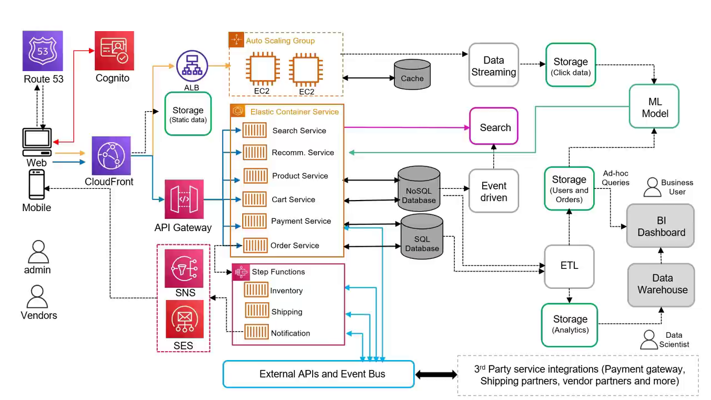
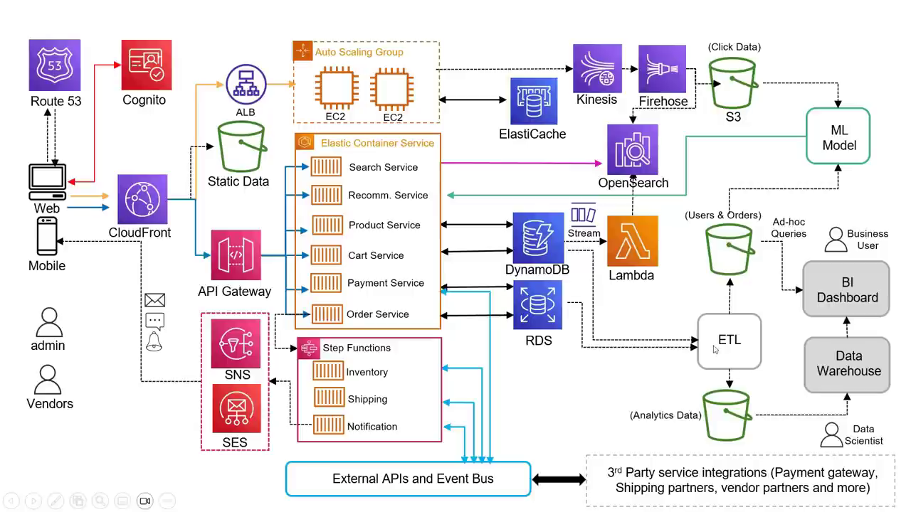

# eCommerce Architecture on AWS — Chapter 3

# ☁️ Mapping Every Component to an AWS Service

## Chapter Goal

Now we take the generic architecture and name the AWS service for every box — plus the one nuance that trips up interview answers: **not every service lives inside a region**. By the end you'll have the complete AWS reference architecture and know where alternatives fit (EKS vs ECS, Lambda vs containers).

## 3.1 🌍 The Region Question — Global vs Regional Services

First design decision: pick a **region**. But watch out — the video removes the region box from the diagram deliberately:

<WarningCard title="Regional vs global — don't draw it wrong">
Most AWS services are **regional** (EC2, ECS, RDS, DynamoDB…). But **Route 53 (DNS)** and **CloudFront (CDN)** are **global** — they have no region boundary. Drawing them inside a region box is an architecture-diagram error interviewers notice.
</WarningCard>

## 3.2 🖥️ Compute &amp; Access — EC2, ECS, ALB, API Gateway

| Generic box | AWS service | Why |
|-------------|------------|-----|
| Web servers on VMs | **EC2** in an **Auto Scaling Group** | Scale instance count with load |
| Web load balancer | **Application Load Balancer (ALB)** | L7 routing across EC2s |
| Microservices | **ECS tasks** (containers) | Microservices run best as containers — ECS orchestrates them |
| REST API routing | **Amazon API Gateway** | Route each API call to the right service |
| Order workflow | **AWS Step Functions** | Order placed → conditional saga: inventory → shipping → notify, with retries/compensation |

## 3.3 🌐 Edge &amp; Identity — CloudFront, Cognito, Route 53, SNS/SES

| Generic box | AWS service | Note |
|-------------|------------|------|
| Content delivery | **CloudFront** | Caches static content at edge locations *and* routes traffic over the AWS backbone — faster than public internet |
| User authentication | **Amazon Cognito** | Sign-up/sign-in, tokens, authorization — managed IdP |
| DNS | **Amazon Route 53** | Global, resolves `buyanything.com` → ALB/API GW |
| Notifications | **SNS + SES** | SNS → push/SMS/pub-sub; SES → email |

## 3.4 🗄️ Databases &amp; Search — DynamoDB, RDS, ElastiCache, OpenSearch, Lambda

| Generic box | AWS service |
|-------------|------------|
| NoSQL (products, cart) | **DynamoDB** |
| SQL (payments, orders) | **RDS** — pick engine: MySQL, PostgreSQL, Oracle, SQL Server |
| In-memory session cache | **ElastiCache** (Redis/Memcached) |
| Search engine | **Amazon OpenSearch** (managed — AWS runs the cluster) |
| Event-driven indexer | **DynamoDB Streams → Lambda → OpenSearch** |

<ConceptCard title="The DynamoDB → OpenSearch bridge">
DynamoDB **Streams** emits every write as an event. A **Lambda** consumes the stream and updates the **OpenSearch** index — the "event-driven" box from Ch2 becomes three managed services wired together, zero servers.
</ConceptCard>

## 3.5 🌊 Data Pipeline — S3, Kinesis, Firehose, Glue/EMR

- **S3** is *the* storage answer — static assets, clickstream landing zone, user/order extracts, analytics data. Key detail: **CloudFront fetches directly from S3** — no web server needed to serve files.
- **Kinesis Data Streams** ingests live clickstream; **Kinesis Firehose** delivers it to S3 *and* OpenSearch (recently-viewed items need it there too).
- **Glue or EMR** run the batch ETL — pulling users/orders from DynamoDB + RDS into S3.

## 3.6 🤖📊 ML, Analytics &amp; Integration — SageMaker, Redshift, QuickSight, Athena, EventBridge

| Generic box | AWS service | Why |
|-------------|------------|-----|
| ML model for recommendations | **SageMaker AI** | Curate data, train, *host for inference* — Recommendation Service calls it |
| Data warehouse | **Amazon Redshift** | Heavy analytical queries over the lake |
| BI dashboards | **Amazon QuickSight** | Charts for business users |
| Ad-hoc queries on S3 | **Amazon Athena** | SQL straight on the lake — cheaper than loading to Redshift for one-off questions |
| External/partner event bus | **Amazon EventBridge** | Integrates internal services *and* third parties (payment gateway, shipping partners) |

## 3.7 🏁 The Complete AWS Architecture

<NoteCard title="Honesty from the video itself">
"I'm nowhere claiming this is how it *should* be." This is **one** valid answer — containers could run on **EKS** instead of ECS; some services could be **Lambda** functions instead of containers. In an interview, the alternative choices *with reasons* score higher than the diagram itself.
</NoteCard>

## 3.8 🎤 Interview Cheat Table — Full Mapping

| Layer | Generic | AWS |
|-------|---------|-----|
| DNS | DNS service | **Route 53** (global) |
| Auth | Identity provider | **Cognito** |
| CDN | Content delivery | **CloudFront** (global) |
| Access | Load balancer / API routing | **ALB** / **API Gateway** |
| Frontend | Web servers | **EC2 + Auto Scaling Group** |
| Backend | Microservices | **ECS tasks** (or EKS/Lambda) |
| Workflow | Order orchestration | **Step Functions** |
| Notification | Email/SMS/push | **SNS + SES** |
| Databases | NoSQL / SQL / cache | **DynamoDB / RDS / ElastiCache** |
| Search | Search engine + indexer | **OpenSearch + DynamoDB Streams + Lambda** |
| Storage | Static + lake | **S3** |
| Streaming | Clickstream ingest | **Kinesis Data Streams + Firehose** |
| ETL | Batch processing | **Glue** (or EMR) |
| ML | Recommendation model | **SageMaker AI** |
| Analytics | Warehouse / BI / ad-hoc | **Redshift / QuickSight / Athena** |
| Integration | Event bus to partners | **EventBridge** |

## 🧠 Knowledge Check

<Quiz question="Why did the video remove the region box from the final diagram?" options='["Regions don't matter on AWS", "Route 53 and CloudFront are global services — putting them inside a region boundary is incorrect", "The diagram ran out of space", "EC2 is global"]' answer={1} explanation="Most services are regional, but DNS (Route 53) and CDN (CloudFront) are global — the diagram stays honest by not boxing them into a region." />

<Quiz question="How do product updates reach the OpenSearch index automatically?" options='["A nightly Glue job", "DynamoDB Streams emit changes → Lambda consumes them → OpenSearch index updated", "API Gateway syncs it", "OpenSearch polls DynamoDB"]' answer={1} explanation="The event-driven pattern maps to Streams → Lambda → OpenSearch — near-real-time indexing with zero servers." />

<Quiz question="A business analyst needs one-off SQL over raw S3 data — cheapest option?" options='["Load it into Redshift first", "Athena — SQL directly on S3, pay per query", "RDS read replica", "ElastiCache"]' answer={1} explanation="Athena queries the lake in place — no ETL into a warehouse for ad-hoc questions; Redshift earns its cost for recurring heavy analytics." />

<Quiz question="Which service coordinates the multi-step order saga (inventory → shipping → notify) with branching on failure?" options='["SQS", "EventBridge", "Step Functions", "Lambda alone"]' answer={2} explanation="Step Functions is the workflow engine — conditional branching, retries, compensation across service calls." />

## 🏁 Chapter 3 Summary

- Name the layer, then the service: **Route 53 → Cognito → CloudFront → ALB/EC2+ASG → API Gateway → ECS → Step Functions → SNS/SES**.
- Data tier: **DynamoDB / RDS / ElastiCache / OpenSearch (+ Streams→Lambda indexing)**.
- Data lake tier: **S3 + Kinesis/Firehose + Glue/EMR → SageMaker → Redshift/QuickSight/Athena**.
- Integration: **EventBridge** for partner systems.
- Interview gold: say *why* each choice fits and where alternatives (EKS, Lambda, EMR) swap in.

### Watch the Original Tutorial

<VideoSection youtubeId="f-rl_4Pd8dw" title="AWS Interview Prep: Designing an eCommerce Architecture from Scratch | AWS with Chetan" />
