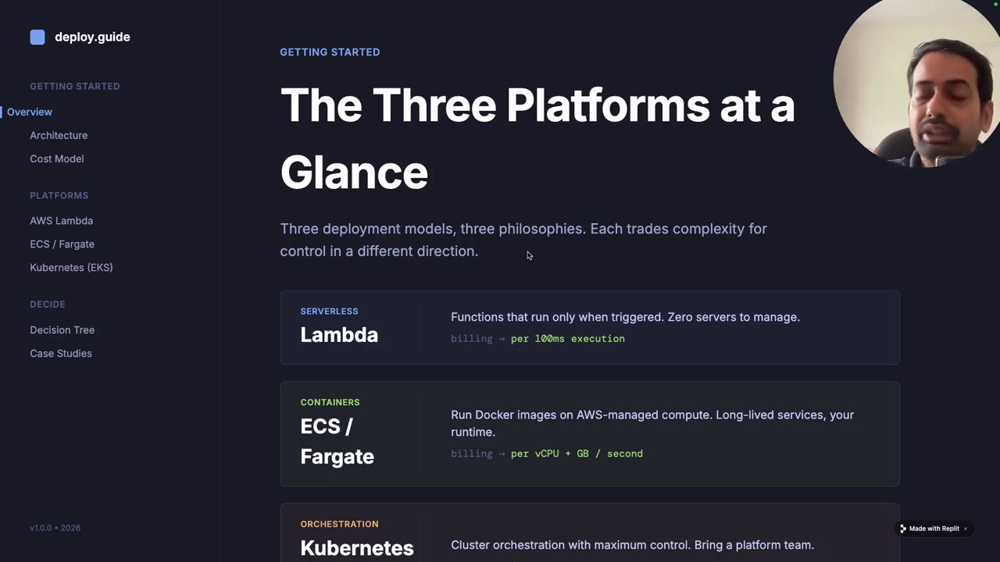
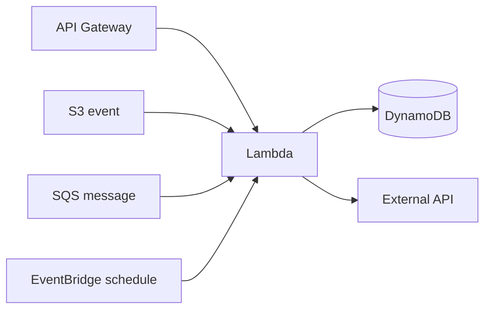
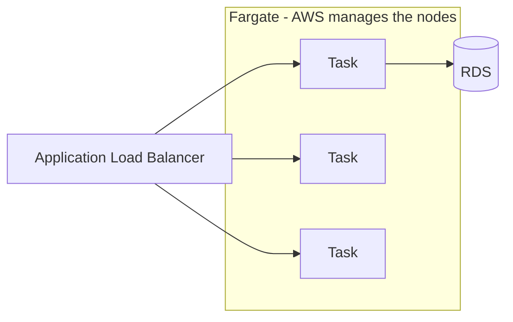
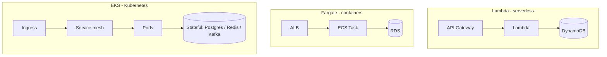
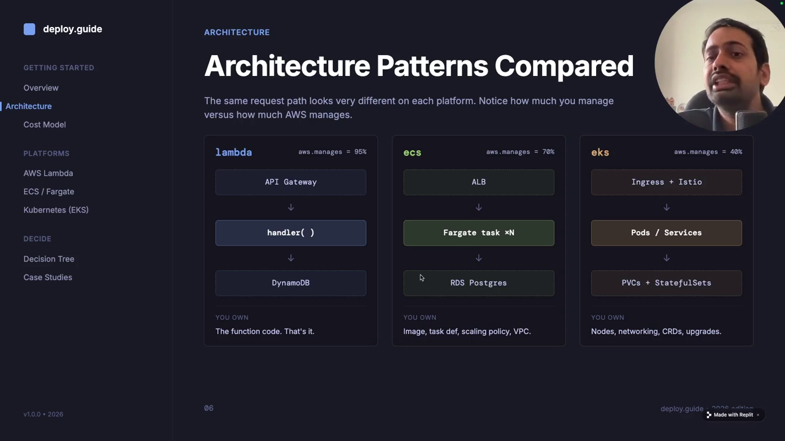

# Lambda vs ECS Fargate vs EKS — The Three Platforms

<VideoSection youtubeId="Vg2kgW1_rHs" title="Lambda vs ECS vs Kubernetes - Where to Deploy Microservices (deploy.guide)" />

## Chapter Goal

Decide where to run your microservices on AWS — **Lambda**, **ECS Fargate**, or **EKS (Kubernetes)** — by understanding what each platform actually is, what workload it fits, and how much of the stack AWS manages for you. Every number and claim in this course comes straight from the source video.

## The Question Everyone Gets Wrong

You have a new service to ship. Someone on the team says "just put it on Lambda," someone else says "containers or it doesn't count," and the senior engineer says "we need Kubernetes for portability." All three are right — *for different services*. The right question isn't *"which is best"* but *"which fits this workload."*

> **Core idea** — These aren't competing products on a spectrum of good→better. They're three different points on the **control ↔ convenience** trade-off. More control means more operational burden; more convenience means less flexibility.

*AWS Lambda (event-driven compute), ECS Fargate (serverless containers), and EKS (managed Kubernetes) — the decision axis is workload type, not maturity level.*

## What Each Platform Actually Is

### AWS Lambda — Event-Driven Functions

- You upload **code**, not infrastructure. Lambda runs it in response to events.
- Pricing is **per-request + per-millisecond** — pay literally zero when idle.
- **15-minute maximum execution time** — a hard ceiling, not a guideline.
- Scales from 0 to thousands of concurrent executions automatically.

**The Lambda mental model**: something happened → a function woke up → did a small unit of work → went away. If your service doesn't fit "small unit of work per event," don't force it.

### Amazon ECS on Fargate — Serverless Containers

- You bring a **Docker image**; AWS runs it. No EC2 nodes to patch or size.
- Containers are **always-on and long-running** — request handling, not event bursts.
- Priced per **vCPU/GB-hour** while the task runs.
- Integrates natively with **ALB**, CloudWatch, IAM, Secrets Manager.

**The Fargate mental model**: a normal app (Express, Spring, FastAPI…) packaged in a container, running 24/7, without you ever SSHing into a server.

### Amazon EKS — Managed Kubernetes

- AWS runs the **Kubernetes control plane**; you run everything on top: pods, services, ingress, autoscaling, secrets, CRDs.
- Maximum **control and portability** — same manifests run on any K8s anywhere.
- You (or a platform team) own the ecosystem: Helm charts, operators, service mesh, security policies, upgrades.

<Note>
A commonly cited anecdote about why EKS exists at all: companies like Netflix run huge workloads on **EC2 + in-house orchestration**, Uber/Airbnb chose **Kubernetes**, and Netflix *also* uses Lambda for lightweight event work. Giants mix platforms — you will too.
</Note>

## The Architecture Patterns Side by Side

| | AWS Lambda | ECS Fargate | EKS |
|---|---|---|---|
| **Unit of work** | Function | Container (task) | Pod |
| **Execution model** | On-demand, event-driven | Long-running, request handling | Orchestrated, stateful-capable |
| **AWS manages ~** | ~95% — almost everything | ~70% — infra, you manage tasks | ~40% — control plane only |
| **Max execution** | 15 min | Unlimited | Unlimited |
| **Best for** | APIs, webhooks, ETL, events | Web apps, workers, schedulers | Platforms, stateful, multi-cloud |
| **Learning curve** | Low | Medium | Steep |

*The three reference architectures — note how much grey surface area ("you manage") grows from Lambda to EKS.*

## What Workloads Fit Where

### Lambda territory
- **APIs** — especially CRUD endpoints with spiky or modest traffic.
- **Webhooks** — Stripe callbacks, GitHub events, Slack commands.
- **Event processing** — S3 upload → thumbnail, DynamoDB stream → projection.
- **Light ETL** — transform a file, kick off a Step Functions workflow.
- **Cron** — scheduled jobs that run in seconds or minutes.

### Fargate territory
- **Web applications** — standard request/response services that stay up.
- **Background workers** — queue consumers that run continuously.
- **Scheduled jobs too heavy for Lambda** — >15 min, >10 GB RAM, custom binaries.
- **Anything already containerized** — your Dockerfile just works.

### EKS territory
- **Microservice platforms** — dozens of services that need to discover, route, and secure traffic between each other.
- **Stateful workloads** — databases, message brokers, ML pipelines that need persistent volumes and operators.
- **Multi-cloud / portability requirements** — identical workloads on-prem + AWS + GCP.
- **When you genuinely need** Istio, Helm, Karpenter, custom schedulers, GPU sharing.

<Warning>
The trap: choosing Kubernetes because "we might need it later" or "it's what big companies use." Netflix-scale problems need Netflix-scale teams. If you can't name which Kubernetes feature you need *today*, you probably don't need Kubernetes today.
</Warning>

## Knowledge Check

<Quiz question="Your workload is: a webhook endpoint that receives a Stripe payment event, writes to DynamoDB, and finishes in under 200 ms. Best platform?" options={["EKS with Istio for service-to-service security","AWS Lambda — a small event-driven function is exactly its unit of work","ECS Fargate — you need long-running containers for webhooks","EC2 with an Auto Scaling Group"]} answerIndex={1} explanation="Short-lived, event-triggered, sub-second work is Lambda's home turf. A webhook is literally 'something happened → run a function.' EKS/Fargate would work but you'd pay for always-on infrastructure and add operational burden for zero benefit." />

<Quiz question="What is the single biggest AWS-managed-surface difference across the three platforms?" options={["Lambda is cheaper than the other two","Fargate removes patching but not networking; EKS removes nothing","AWS manages roughly 95% on Lambda, ~70% on Fargate, ~40% on EKS","EKS is the only platform that supports containers"]} answerIndex={2} explanation="The platforms differ mainly in how much of the stack is your problem. Lambda: AWS runs almost everything. Fargate: AWS manages nodes and infrastructure, you manage tasks/services. EKS: AWS manages the control plane — everything on top is yours." />

<Quiz question="A customer-facing API runs a request handler that occasionally needs 45 minutes to finish a complex report job. Which option fits?" options={["Lambda — just raise the timeout","ECS Fargate — long-running tasks have no 15-minute ceiling","Lambda — reports are event-driven","EKS — only Kubernetes can run long jobs"]} answerIndex={1} explanation="Lambda's 15-minute hard limit rules it out for a 45-minute job. Fargate tasks run as long as needed, making it the right default for long-running work without adopting a full Kubernetes platform." />

## Summary

- **Lambda** = functions for events. Zero idle cost, 15-min ceiling, ~95% managed.
- **Fargate** = containers without servers. Always-on services, ~70% managed.
- **EKS** = full Kubernetes. Maximum control and portability, ~40% managed — the rest is your team's weekend.
- The question is never "which platform" — it's "which workload." Next chapter: the actual decision framework and the cost math.
