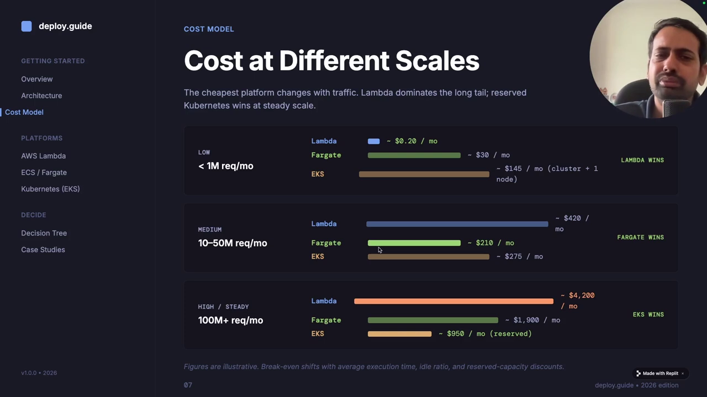
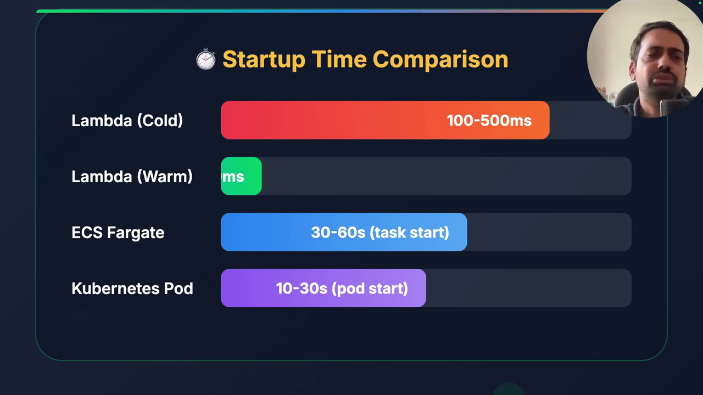
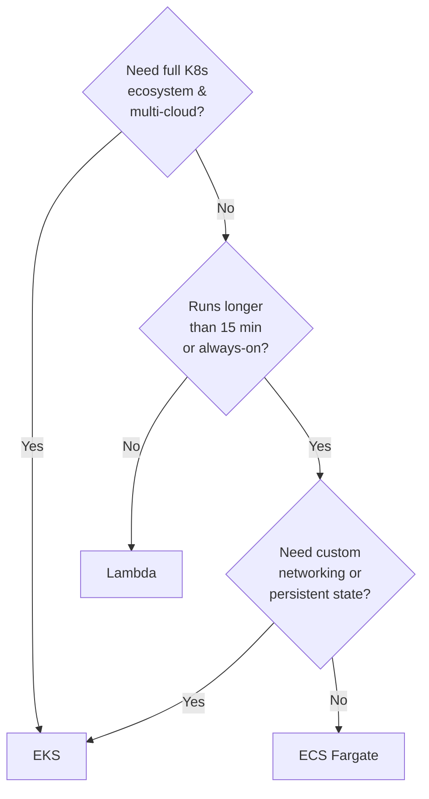
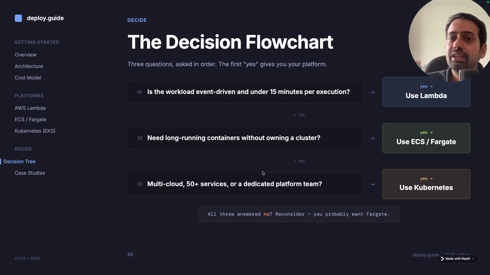
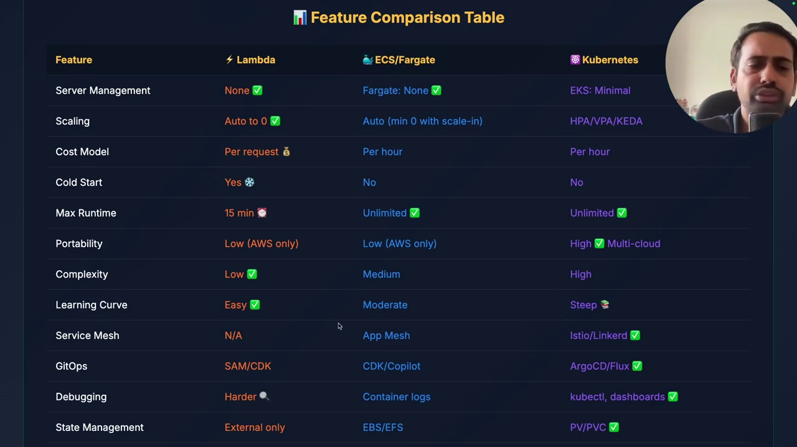
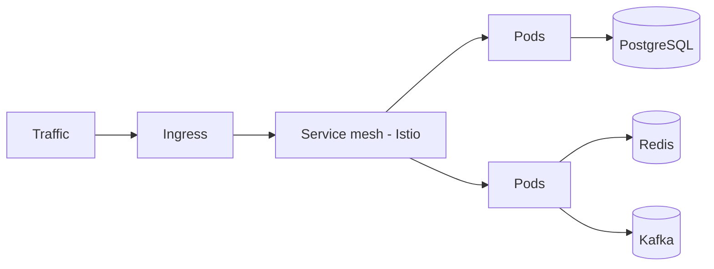
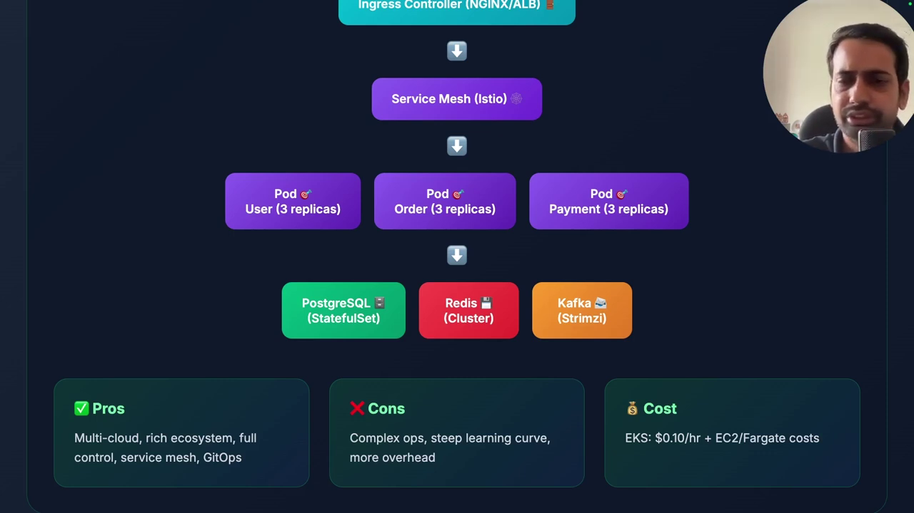

# Lambda vs ECS Fargate vs EKS — Decision Framework

## Chapter Goal

Turn the platform comparison into a repeatable decision: the cost math at three traffic scales, cold-start behavior, a 3-question flowchart, and the full feature matrix from the video.

## The Cost Reality at Three Scales

The video's cleanest slide: what the *same hypothetical service* costs per month on each platform as traffic grows.

| Monthly requests | Lambda | ECS Fargate | EKS |
|---|---|---|---|
| **< 1M** | ~$0.20 | ~$30 | ~$145 |
| **10–50M** | ~$420 | ~$210 | ~$275 |
| **100M+** | ~$4,200 | ~$1,900 | ~$950 |

*Pricing flips completely as you scale: Lambda is cheapest at low volume (it literally costs cents) and most expensive at 100M+ requests. EKS is cheapest at massive scale because you amortize the cluster over dense workloads.*

<Note>
**Why the crossover happens.** Lambda charges per request — cost grows linearly with traffic forever. Fargate charges for the capacity you keep running — your curve is flatter. EKS charges for nodes you pack densely — best economics at scale, but only if utilization is high enough to beat the constant baseline cost of the control plane and nodes.
</Note>

### The hidden cost nobody puts on the slide

The dollar rows above are infrastructure only. The real price of EKS includes **engineer-hours**: upgrades, patching, security policies, monitoring, on-call. The video's rule: if you don't already run a platform team, treat the EKS line as "$145 + one engineer's salary" when comparing.

## Startup Time — The Cold-Start Tax

Every platform pays a different "wake-up" cost, and it matters for latency-sensitive APIs.

| Platform | Cold start | Warm |
|---|---|---|
| **Lambda** | ~100–500 ms to provision a fresh execution environment | ~1–10 ms — near-instant |
| **Fargate** | **30–60 s** task launch — always-on model, so you plan capacity | Already running |
| **EKS** | ~10–30 s pod schedule + image pull | Already running |

*Lambda's cold start is measured in milliseconds; Fargate and EKS launch whole container environments — tens of seconds. This is why Lambda needs warm pools for latency-critical paths, and why Fargate/EKS keep replicas running.*

## The Three-Question Flowchart

The video's decision flow reduces to three yes/no questions:

1. **Do you need Kubernetes specifically?** — service mesh, Helm, operators, multi-cloud portability? If yes → EKS, no further questions.
2. **Does the work run >15 minutes or need to stay up?** — if no → Lambda.
3. **Custom networking / persistent state?** — if yes → EKS; if no → Fargate.

*The flowchart is deliberately short — three questions cover the vast majority of real workloads.*

## The Full Comparison Matrix

| Feature | AWS Lambda | ECS Fargate | Amazon EKS |
|---|---|---|---|
| Server management | None | None | Control plane managed; data plane yours |
| Scaling | Automatic, instant | Auto Scaling policies | HPA/VPA + cluster autoscaler/Karpenter |
| Cold start | ~100–500 ms | 30–60 s task launch | 10–30 s pod startup |
| Max execution | 15 min | Unlimited | Unlimited |
| Pricing model | Per request + ms | vCPU/GB-hour running | EC2/Fargate nodes + $0.10/hr cluster |
| Cost at low volume | Cheapest by far | Moderate | Most expensive |
| Cost at 100M+/mo | Most expensive | Middle | Cheapest if dense |
| Stateful workloads | Not suited | Persistent volumes via EFS | Native — the strongest |
| Multi-cloud portability | None | Low (Docker helps) | Full — same manifests anywhere |
| Learning curve | Low | Medium | Steep |
| Best fit | APIs, webhooks, ETL, events | Web apps, workers, schedulers | Platforms, stateful, multi-cloud |

*All 12 rows side by side — screenshot this table for architecture interviews.*

## Kubernetes Architecture — Why the Extra Complexity Buys Something

The EKS pattern isn't "a container platform" — it's an entire ecosystem. Typical production shape: **Ingress → Istio service mesh → pods → Postgres / Redis / Kafka**, plus Helm for packaging, operators for stateful apps, and autoscaling at two levels.

*Ingress → service mesh → pods → stateful backends. Each layer is a real thing you provision, configure, and eventually debug — that's the ~40%-managed figure made visible.*

<Tip>
**The honest framing from the video**: Kubernetes is the answer when the *question* is "we're a platform team building an internal cloud for dozens of service teams." It is almost never the answer to "where do I run my three APIs."
</Tip>

## Knowledge Check

<Quiz question="Your API serves 800K requests/month. Ignoring engineering time, the cheapest home per the video's cost table is?" options={["EKS","ECS Fargate","AWS Lambda","They all cost the same at this scale"]} answerIndex={2} explanation="Under ~1M requests/month Lambda is ~$0.20 vs ~$30 Fargate vs ~$145 EKS. Pay-per-request dominates when idle time is most of the month." />

<Quiz question="At 100M+ requests/month the cost ordering reverses because…?" options={["Lambda's per-request pricing scales linearly forever, while EKS amortizes fixed cluster cost over dense workloads","Fargate gets a bulk discount","EKS stops charging for nodes at scale","Lambda adds a surcharge after 50M requests"]} answerIndex={0} explanation="Lambda cost = requests × price-per-request — linear without bound. Fargate charges for running capacity. EKS pays a mostly-fixed node+control-plane bill that stays flat whether you run 1M or 100M requests — cheapest only when utilization is high." />

<Quiz question="A latency-critical API needs <50ms p99 response including wake-up. Which platform's cold-start profile fits best, and what compensates?" options={["Fargate — 30–60s launch is acceptable for APIs","EKS — pods start in 10–30s","Lambda — ~1–10ms warm invocations; provisioned concurrency absorbs the 100–500ms cold start","Any of them — cold starts don't matter"]} answerIndex={2} explanation="Warm Lambda invocations are near-instant; the 100–500ms cold start is handled with provisioned concurrency (pre-warmed environments). Fargate/EKS avoid the issue entirely by keeping replicas running — at the cost of paying for idle capacity." />

<Quiz question="True or false: 'We should adopt EKS now in case we need multi-cloud later.'" options={["True — starting early avoids migration pain","False — that's paying platform-team operational cost now for a hypothetical future need","True — EKS is required for portability","False — Lambda is more portable than EKS"]} answerIndex={1} explanation="The video's direct warning: don't buy Kubernetes complexity before you have Kubernetes problems. If you can't name the K8s feature you need today, the 'maybe later' justification costs an engineer's worth of operations for zero current benefit." />

## Summary

- **Cost curve**: Lambda wins below ~1M req/mo, Fargate wins the middle (10–50M), EKS wins at 100M+ *if* utilization is dense.
- **Cold starts**: Lambda ~100–500 ms cold / ~1–10 ms warm; Fargate 30–60 s task launch; EKS 10–30 s pod start.
- **Three questions** cover most workloads: need K8s? → runs >15 min / always-on? → custom networking or persistent state?
- **The invisible line item**: EKS's true cost includes the people who run it. Compare "$145 + engineer hours," not just the node bill.

<VideoSection youtubeId="Vg2kgW1_rHs" title="Lambda vs ECS vs Kubernetes - Where to Deploy Microservices (deploy.guide)" />
