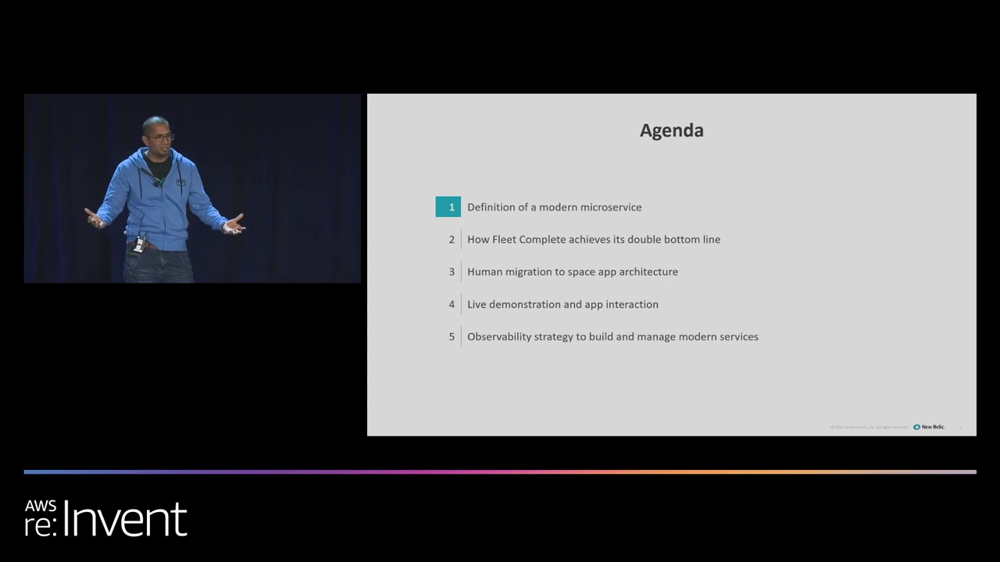
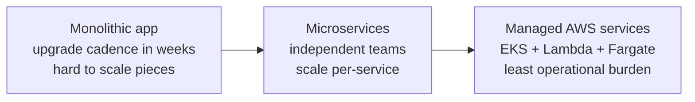
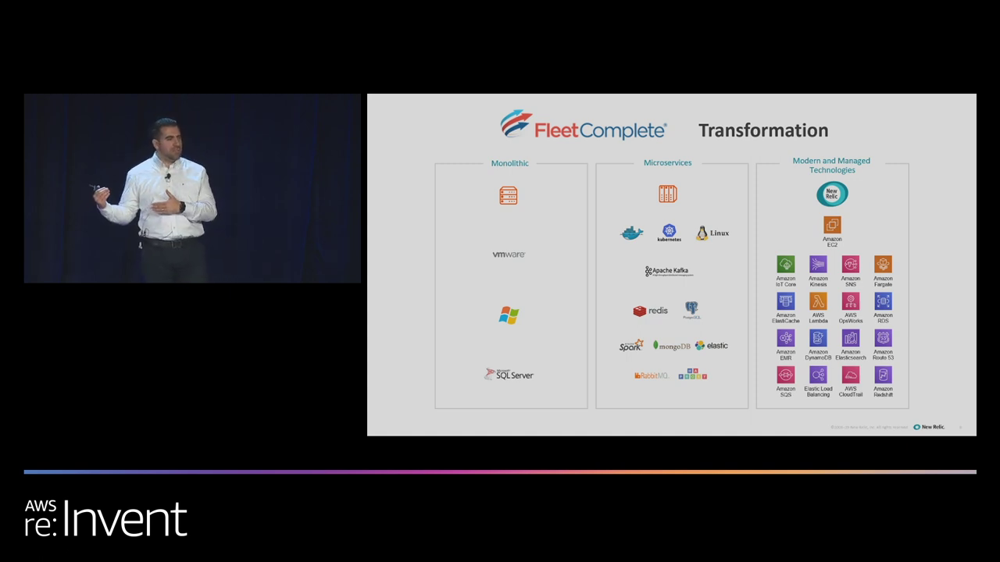
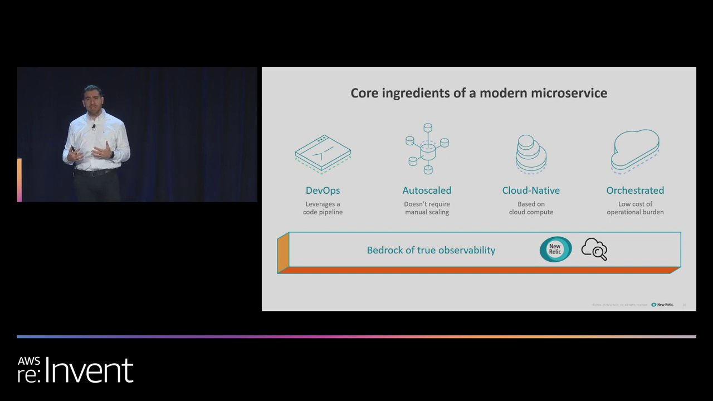

# Building a Modern Microservice on AWS — What "Modern" Means

<VideoSection youtubeId="msxD0bTFu2A" title="AWS re:Invent 2019 — How to Build a Modern Microservice with AWS & Observability" />

## Chapter Goal

Define what actually makes a microservice "modern" — not the buzzword, but the four concrete ingredients — and see a real company's monolith-to-microservices journey as the proof that the transition is worth it.

## Walk, Run, Fly — The Shape of This Course

The re:Invent session is staged in three phases, and this course follows it exactly:

| Phase | Question it answers | Where in the video |
|---|---|---|
| **Walk** | How do you *build and provision* a modern microservice? | ~3–24 min |
| **Run** | How do you *operate and manage* it once users break it? | ~24–40 min |
| **Fly** | How do you *measure reliability* and optimize cost? | ~40–46 min |

*Walk → Run → Fly. Most teams ship the Walk phase and discover Run and Fly the hard way — this session covers all three.*

## Start With Why — A Real Transformation

Before the architecture, a proof point. **Fleet Complete** runs one of the world's largest IoT/telematics platforms — vehicles streaming sensor data continuously, customers depending on that data for emergency response (the presenter tells a story of a dispatcher spotting a driver stopped on a highway → 911 called → heart attack caught in time).

Their journey:

*The Fleet Complete arc: monolith → microservices → managed services. Each step trades your operational load for AWS's.*

What moved them to managed services specifically:

- **Operational burden** — hundreds of containers across hosts needs headcount just for patching, upgrades, and uptime. Managed services return those engineers to product work.
- **Scale** — billions of IoT data points/day can't be babysat by hand.
- **Observability as a foundation** — one pane watching AWS-native services so issues resolve fast.
- **Cost** — the demo service ran **~$5 over 15 days**; utility pricing, pay for what you use.

<Note>
**Why managed, in their words** — it's not laziness, it's prioritization. Every hour spent patching a node is an hour not spent on the product that differentiates the business. This is the same trade-off the Lambda/Fargate/EKS video quantifies — connect it to the comparison course when you review.
</Note>

## The Four Core Ingredients

The session's thesis — a modern microservice has four ingredients, and skipping any one makes it not-quite-modern:

| Ingredient | Meaning | What AWS gives you |
|---|---|---|
| **DevOps** | Leverages a code pipeline — build, test, deploy are automated | CodePipeline / CodeBuild / repo webhooks |
| **Autoscaled** | No manual scaling — capacity follows load | Lambda scaling, EKS autoscalers, Fargate service scaling |
| **Cloud-Native** | Built on cloud compute primitives, not lifted VMs | EKS, Lambda, Fargate |
| **Orchestrated** | Low operational burden — the platform coordinates itself | Managed control planes |

…sitting on a **fifth thing**: a **bedrock of true observability** — not an ingredient, the foundation under all four.

*DevOps, Autoscaled, Cloud-Native, Orchestrated — on a "bedrock of true observability." Note observability is drawn as the foundation, not a fifth pillar: without it you can't prove any of the other four are working.*

<Warning>
**Security is deliberately out of scope** in this talk — the presenter says so up front and leaves it for another session. Don't conclude it's unimportant; conclude the session is about *operating* microservices.
</Warning>

## Why EKS + Lambda + Fargate Together?

The answer connects this course to the platform-comparison course: it's not a platform war, it's picking the **least operational burden** for each job.

| Job in the app | Service chosen | Why |
|---|---|---|
| Long-running web frontend | **EKS pod** | Container that stays up, serves UI |
| Parse/transform incoming requests | **Lambda** | Event-driven, stateless, milliseconds of work |
| Durable work queue | **SQS** | Decouples frontend from workers — survives crashes |
| Persistent message workers | **EKS pod** | Long-running consumer |
| Durable store | **DynamoDB** | Serverless, no capacity management |

<InfoCard title="The pattern to steal">
Route compute to the platform whose execution model matches the work: events → Lambda, long-running → EKS pods, decoupling → SQS. That's the entire philosophy of "choose the platform per workload" applied inside one app.
</InfoCard>

## Knowledge Check

<Quiz question="Which of the four 'core ingredients' is about pipelines?" options={["Autoscaled","Orchestrated","DevOps","Cloud-Native"]} answerIndex={2} explanation="DevOps = 'leverages a code pipeline' — automated build/test/deploy. Autoscaled removes manual capacity work, Cloud-Native means built on cloud primitives, Orchestrated means low operational burden." />

<Quiz question="Why did Fleet Complete move to managed AWS services rather than self-managed microservices?" options={["Managed services are faster","To reduce operational burden — patching/upgrade headcount was eating engineering capacity","AWS required it for IoT workloads","It was cheaper in every dimension"]} answerIndex={1} explanation="The driver was headcount and focus: hundreds of containers across hosts demands dedicated staff for upgrades and uptime. Managed services returned those people to product work — cost savings followed but wasn't the stated primary driver." />

<Quiz question="In the session's architecture, why is the parser a Lambda and the worker an EKS pod?" options={["Random assignment","Lambda for event-driven short work; EKS for long-running continuous consumers","EKS can't run parsers","Lambda is always cheaper"]} answerIndex={1} explanation="Platform per workload: a parser does milliseconds of work per event (Lambda's exact model), while a queue consumer runs continuously (a long-running pod's exact model). Same app, two execution models, two platforms." />

## Summary

- **Modern** = DevOps + Autoscaled + Cloud-Native + Orchestrated, on a **bedrock of observability**.
- **Walk → Run → Fly** — building is the easy third; operating and measuring are where services live or die.
- **Fleet Complete's lesson**: managed services buy back engineering time; scale made it necessary, not optional.
- **Platform-per-workload**: even within one app, Lambda (events), EKS (long-running), and SQS (decoupling) each take their natural job.
