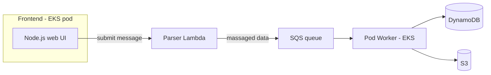
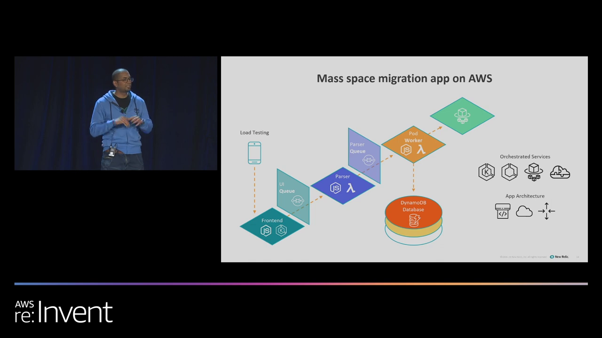
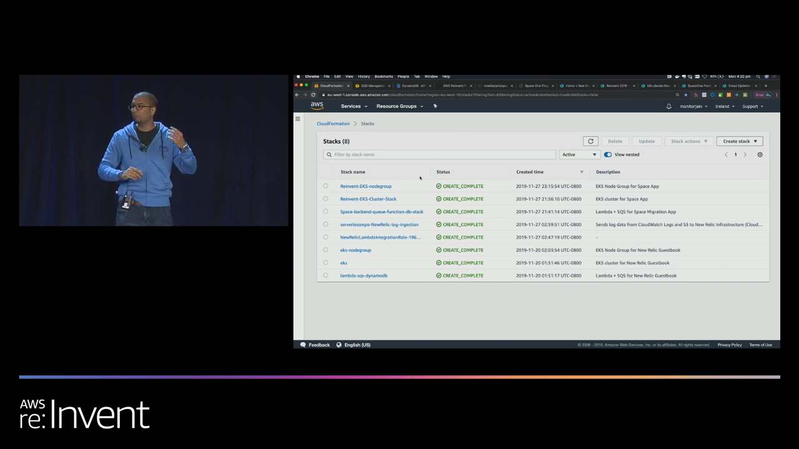
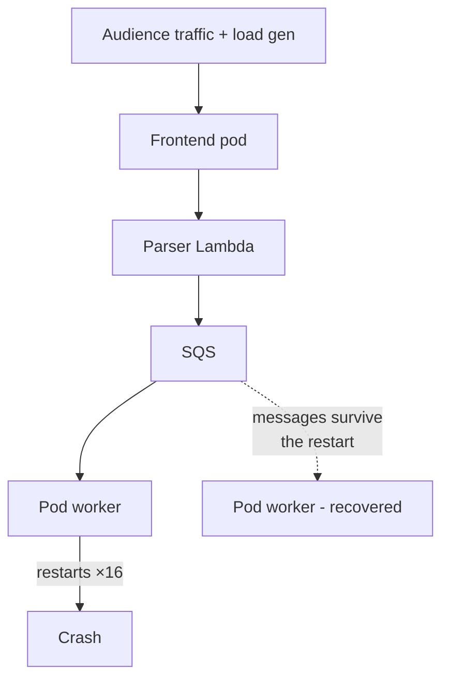
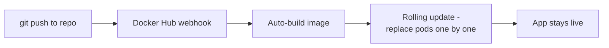

# Building a Modern Microservice on AWS — The Space Migration App

## Chapter Goal

Walk through the actual microservice built on stage: its architecture, the three CloudFormation stacks that provision it, and the CI/CD loop that redeploys it — all the "Walk" phase, in one place.

## The Fictional Scenario

It's 2045. Earth is no longer livable, and 65,000 chosen people are migrating to Mars or Jupiter. Before they leave, each sends a **"last wish"** — a short message — to the people left behind. The app crowdsources that traffic live from the conference audience.

<Tip>
The scenario is theatrical but the architecture is real: submit a message → parse it → queue it → persist it. Swap "last wishes" for "orders," "telemetry packets," or "clicks" and it's the same service.
</Tip>

## The Architecture

*Five moving parts: an EKS-hosted Node.js frontend → a parser Lambda → an SQS queue → a pod worker → DynamoDB + S3. The queue is the pivot — it decouples the live frontend from the workers, which is what lets the app survive traffic spikes and restarts.*

### Why this exact shape

| Component | Chosen service | The reason |
|---|---|---|
| Web frontend | EKS pod | Long-running HTTP service, needs steady compute |
| Message parser | Lambda | Event-driven, milliseconds of work, scales with spikes |
| Buffer | SQS | Absorbs bursts; workers consume at their own pace |
| Work processor | EKS pod | Continuous consumer — classic worker pattern |
| Persistence | DynamoDB + S3 | Serverless store, zero capacity management |

<ConceptCard title="SQS is the architectural star">
The queue is why the demo survived being deliberately crashed. Requests land in SQS durably — if the worker is down, messages wait; if the worker restarts 16 times (as it did), nothing is lost. Async decoupling = blast-radius control.
</ConceptCard>

## Provisioning — Three CloudFormation Stacks

Nothing in this app was clicked together in the console. Everything came from **three CloudFormation stacks**:

| Stack | What it creates |
|---|---|
| **Backend ecosystem** | DynamoDB, SQS, the parser Lambda, VPCs, security groups, IAM roles & permissions |
| **EKS cluster** | The managed control plane |
| **Node groups** | The worker-node fleet reporting into that control plane |

*Eight CREATE_COMPLETE stacks — including the three for this app plus the observability integrations. The point: the entire environment is reproducible from templates, which is what "Infrastructure as Code" actually buys you.*

<Note>
The session paused to poll the room on who uses CloudFormation — because IaC templates are what make "manage the service" tractable. Provisioning becomes seamless *and* updatable: push a template change, the stack converges.
</Note>

## The Live Traffic Test

The presenters invited the whole room to submit messages and *deliberately break the app* — plus ran load generation in the background. Two instructive moments:

1. **Someone submitted an iframe** — input-sanitization caught it. (Real audiences submit real garbage.)
2. **The app did break** — pod restarts spiked — which set up the Run phase: *"if you could rewind time, how would you redefine a modern service?"* → observability.

## The Delivery Loop — No Manual Deploys

The CI/CD pipeline shown:

- Push code → Docker Hub auto-builds a new image
- The deployment **rolls pods one at a time** — the service never goes down
- Plus: a public **GitHub repo** with a Kanban board and the whole dev pipeline — the presenters made the entire project forkable

<InfoCard title="Why this is the 'DevOps' ingredient">
The four-ingredient slide's first pillar — "leverages a code pipeline" — is exactly this loop. No SSH, no manual image push, no downtime deployments. The pipeline *is* the release process.
</InfoCard>

## Knowledge Check

<Quiz question="Why is SQS placed between the parser Lambda and the pod worker rather than calling the worker directly?" options={["SQS is cheaper than a direct call","To decouple — requests survive worker crashes and traffic bursts","Lambda can't call EKS pods","SQS provides the persistence layer"]} answerIndex={1} explanation="The queue is the buffer that makes the system resilient. When the worker crashed and restarted 16 times, in-flight requests sat safely in SQS and got processed once the worker recovered. Direct coupling would have lost them." />

<Quiz question="The whole app is provisioned by three CloudFormation stacks. What does each handle?" options={["Frontend / backend / database","Backend ecosystem + IAM, EKS control plane, and node groups","Dev, staging, prod","VPC, compute, storage"]} answerIndex={1} explanation="Stack 1: the backend ecosystem (DynamoDB, SQS, Lambda, VPCs, security groups, roles). Stack 2: the EKS cluster itself. Stack 3: the node groups reporting to that control plane." />

<Quiz question="What made the rolling update non-disruptive?" options={["It used blue-green DNS","Pods are replaced one at a time while others keep serving","The app was stateless so deploys don't matter","Lambda handled traffic during the deploy"]} answerIndex={1} explanation="Kubernetes rolling updates swap pods gradually — new pods come up before old ones drain, so capacity never drops to zero. Combined with SQS absorbing the queue of pending work, users see no outage." />

<Quiz question="The room deliberately broke the app by flooding it with traffic. What did that moment exist to teach?" options={["That EKS is fragile under load","That you can't prevent failure — you can only see it, diagnose it, and recover fast (the Run phase)","That SQS queues overflow","That CloudFormation needs more stacks"]} answerIndex={1} explanation="The crash was staged deliberately: the app broke, observability showed exactly where (pod restarts, traces, logs). The lesson isn't 'make unbreakable systems' — it's 'build systems where failures are visible and recovery is fast.'" />

## Summary

- The app is five pieces: **EKS frontend → Lambda parser → SQS → EKS worker → DynamoDB/S3** — each chosen for its execution model.
- **Three CloudFormation stacks** provision it all — IaC makes the environment reproducible and updatable.
- **SQS is the resilience pivot** — it held requests through 16 pod restarts.
- The delivery loop is **git push → Docker Hub auto-build → rolling pod update** — the DevOps ingredient made literal.
