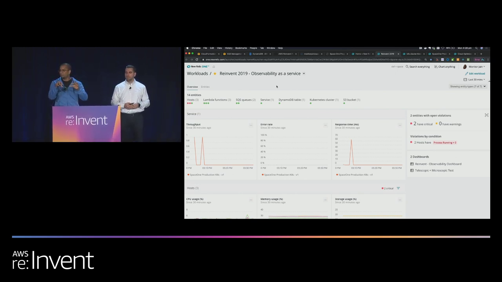
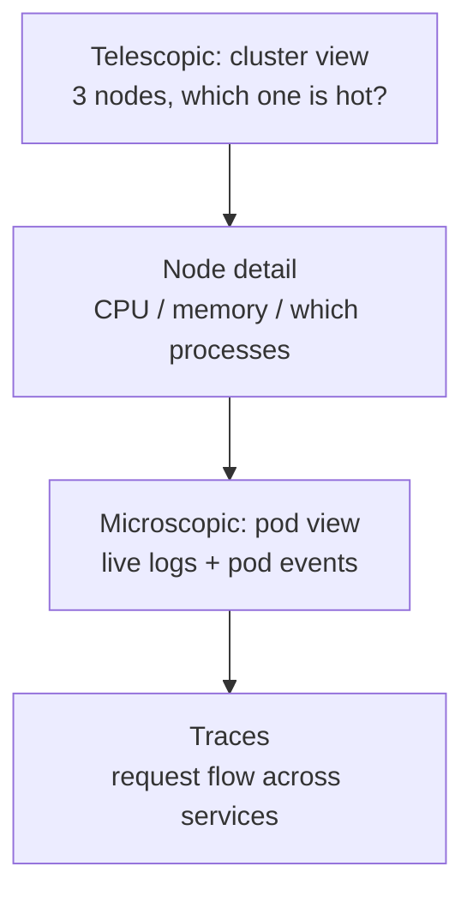
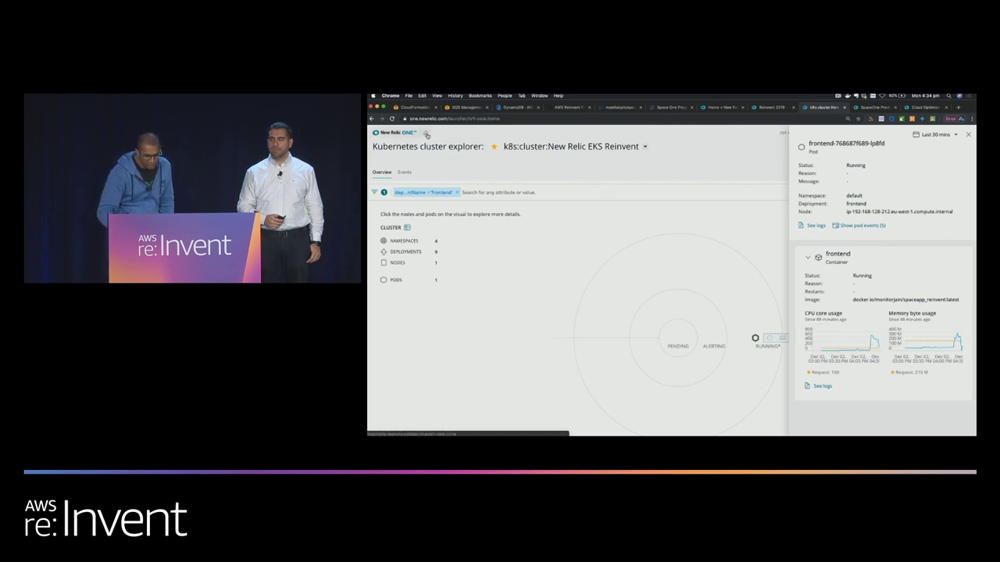
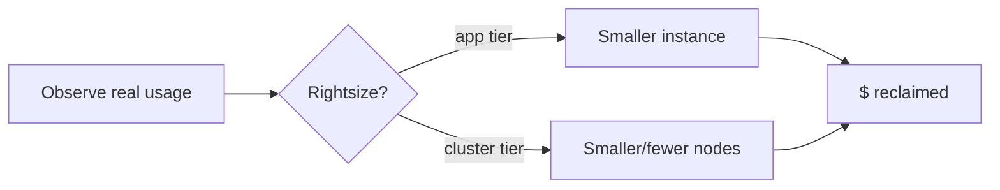
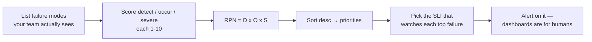
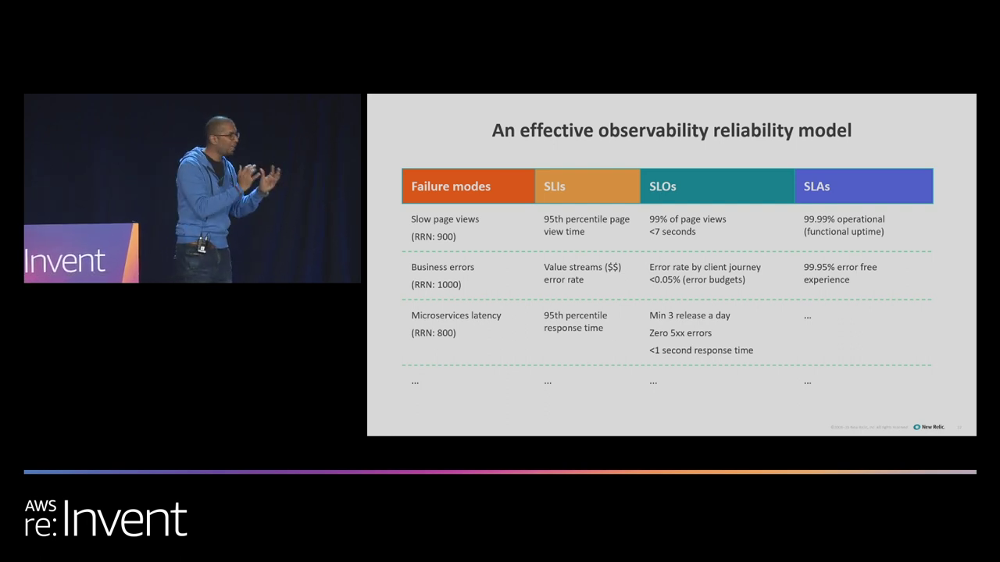
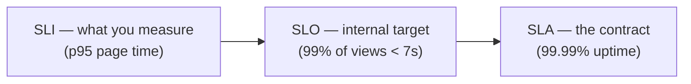

# Building a Modern Microservice on AWS — Operating It at Scale

## Chapter Goal

The Run and Fly phases: how you actually *see inside* a distributed microservice once users start breaking it, how to prioritize which failures matter, and how SLIs/SLOs/SLAs turn "is it healthy?" into a number.

## The Problem With Microservices and Monitoring

A monolith has one place to look. A microservice app has dozens — hosts, pods, queues, functions, tables — each emitting its own signals. The session's answer: a **single workload view** that pulls every constituent into one dashboard and, critically, answers two questions side by side:

- **What's on fire right now?** (left pane — which entity is alerting)
- **Why is it on fire?** (right pane — the violation detail, without switching screens)

*Hosts, Lambdas, SQS queues, DynamoDB, the K8s cluster, the S3 bucket — 14 entities in one view, with violations shown inline. The dashboards are per-team: a team sees its own services *plus* the dependencies it relies on, so it can instantly tell "our problem" from "someone else's."*

<ConceptCard title="Why per-team workloads matter">
In a microservice world your service's health depends on services you don't own. A workload view scoped to *your team's slice* — your services + your dependencies — turns a cross-team incident into a one-glance answer instead of a Slack archaeology dig.
</ConceptCard>

## Telescope and Microscope — The Drill-Down Pattern

Borrowed from NASA's Sentry program (asteroid watch): you need **telescopic patterns** (wide scan for big problems) *and* **microscopic patterns** (fine sensors for what telescopes miss). In an EKS app that maps to a 4-level drill-down:

*Cluster → node → pod → container, each level with its own SLIs. The pod view showed live logs, pod events ("image pulled → container created → restarted 16 times" — the audience's traffic damage made visible), and a jump straight into distributed traces filtered to the space app.*

The trace view answered a classic microservice question a dashboard alone can't: *"this request was slow — which hop ate the time?"* One filter later: all Android-device traffic, one browser the app didn't support, and the exact stack traces between the pod and the user.

## Instrumentation — The Bedrock You Can't Retrofit

"Redo the definition of a modern service" → the answer was observability as the foundation, deployed as agents at every level:

| Level | Instrumentation |
|---|---|
| EKS pods | Monitoring agents + open metrics / Prometheus-style scraping |
| AWS-managed services (SQS, DynamoDB) | CloudWatch — watches what you can't touch |
| Lambda functions | Function-level agents |
| Fargate | Same agent model |

<Note>
"Nobody is made to stare at dashboards" — the session's line. Instrumentation exists so *alerts* come to you; dashboards are for the drill-down after the alert fires.
</Note>

## Reclaiming Wasted Compute

Two optimization angles shown:

- **In-app rightsizing** — "your service is super-sized; drop from a t3.small to a t3.micro and it still scales."
- **Node-level optimization** — an open-source **compute optimizer** scanned the EKS worker nodes and reported **$449/month reclaimable** based on actual peak-traffic trends.

<Tip>
"Keep the compute lean, keep the planet green" — the session's closer. The mechanism isn't austerity; it's *observe → measure peaks → rightsize*. Without the observability bedrock you can't safely shrink anything.
</Tip>

## FMEA — Deciding Which Failures Deserve Alerts

Borrowed from engineering (via a GE talk): **Failure Mode Effects Analysis**. For every failure mode your ops team actually fights, score three attributes 1–10 and multiply:

| Attribute | Question | Scale |
|---|---|---|
| **Detection** | How easy is it to detect? | 1–10 |
| **Occurrence** | How often does it happen? | 1–10 |
| **Severity** | How bad when it does? | 1–10 |

**RPN (Risk Priority Number) = D × O × S**, max 1000. Sort descending — the top scores are the failures that will cause your Mayday. *Then*, and only then, choose the SLI that watches each one.

<Warning>
The trap this avoids: instrumenting everything and alerting on nothing (or everything). FMEA forces you to name which failures are worth a 3am page before you build the dashboard.
</Warning>

## Failure Modes → SLIs → SLOs → SLAs

The session's reliability model — each failure mode gets measured, then targeted, then promised:

| Failure mode | SLI (the measure) | SLO (the internal target) | SLA (the promise) |
|---|---|---|---|
| Slow page views (RPN 900) | 95th-percentile page-view time | 99% of views < 7 s | 99.99% operational uptime |
| Business errors (RPN 1000) | Error rate on value streams ($$) | <0.05% error rate (error budget) | 99.95% error-free experience |
| Microservice latency (RPN 800) | 95th-percentile response time | Zero 5xx; <1 s response | … |

*Failure mode → SLI → SLO → SLA. The honest pitch to the business: "you expect five nines; we're at two; I can give you three in a few months" — a conversation you can only have with numbers.*

<InfoCard title="Error budgets in one line">
An SLO of 99.95% error-free *defines the size of your error budget* — how much failure you can ship while improving. Hit zero errors and you're probably moving too slowly; blow the budget and stability work takes priority over features.
</InfoCard>

## Codify the Monitoring, Monitor the Pipeline

Two practice-level takeaways:

- **Codify your monitoring** — dashboards, alerts, and SLIs defined as config, versioned alongside the app. Monitoring-as-code is part of the same DevOps pipeline discipline as app code.
- **Monitor your code pipeline too** — the GitHub→Docker Hub→rolling-deploy loop itself is observable, so a broken build shows up in the same view as a broken pod.

And the last: **performance testing inside CI/CD**. The staged app's failure under load *would have been caught* before the room broke it — perf tests give you real thresholds for your SLOs instead of guesses.

## Knowledge Check

<Quiz question="What's the difference between an SLI and an SLO?" options={["SLI is internal, SLO is the contract","SLI is the measurement; SLO is the target for that measurement","They're the same thing","SLI is for logs, SLO is for metrics"]} answerIndex={1} explanation="SLI = the indicator you measure (95th-percentile page-view time). SLO = the objective you set on it (99% of views under 7s). SLA = the external promise derived from meeting SLOs (99.99% uptime). Measure → target → promise." />

<Quiz question="A failure mode is hard to detect (9), rare (2), and devastating (10). Its RPN and its implication?" options={["21 — ignore it","180 — mid priority","180 — low occurrence, but severity+detectability may still warrant an SLI","1800 — highest priority"]} answerIndex={2} explanation="RPN = 9×2×10 = 180 (max is 1000). Rare failures score lower on occurrence but if detection is hard AND severity is high, it still earns monitoring — that's exactly why FMEA multiplies three axes instead of gut-feeling priority." />

<Quiz question="The telescopic→microscopic pattern means…?" options={["Use both CloudWatch and New Relic","Wide cluster-level scanning for big problems, then node→pod→trace drill-down for what the wide view can't explain","Zoom out to save money","Microscopes for dev, telescopes for prod"]} answerIndex={1} explanation="NASA's framing: telescopes catch the big stuff (cluster/node hotspots); microscopic sensors catch what slips through (pod logs, pod events, per-request traces). Both layers are required — a cluster-wide CPU chart will never tell you which container logged the error." />

<Quiz question="Why codify monitoring rather than building dashboards by hand?" options={["It's faster to write YAML","So monitoring lives in the same versioned pipeline as the app — reviewable, reproducible, never silently lost","AWS requires it","Manual dashboards don't support alerts"]} answerIndex={1} explanation="Monitoring-as-code means your alerts and SLIs are versioned, reviewed, and redeployed with the app. A hand-built dashboard dies when the person who built it leaves; a codified one is rebuilt by the same pipeline that builds the service." />

<Quiz question="The session argued performance tests belong in CI/CD because…?" options={["They replace unit tests","They surface real thresholds for your SLOs before users find them — the live-crash failure would have been caught","They reduce compute cost","Only enterprise apps need them"]} answerIndex={1} explanation="The app broke on stage under audience load — a perf test in the pipeline would have exposed that limit pre-launch and grounded the SLO thresholds in measurement rather than hope." />

## Summary

- **One workload view** per team: your services + your dependencies, "what's on fire" next to "why."
- **Telescopic + microscopic**: cluster-wide scan → node → pod logs/events → per-request traces. Both layers, always.
- **FMEA / RPN = Detection × Occurrence × Severity** (max 1000) — pick which failures deserve SLIs before building dashboards.
- **SLI → SLO → SLA** — the measure, the internal target, the promise; SLOs size your error budget.
- **Rightsize from observed peaks** — $449/month reclaimed on stage alone.
- **Codify monitoring + monitor your pipeline + perf-test in CI/CD** — Run-and-Fly discipline, not a Walk-phase afterthought.

<VideoSection youtubeId="msxD0bTFu2A" title="AWS re:Invent 2019 — How to Build a Modern Microservice with AWS & Observability" />
