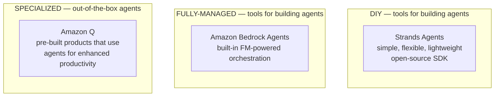
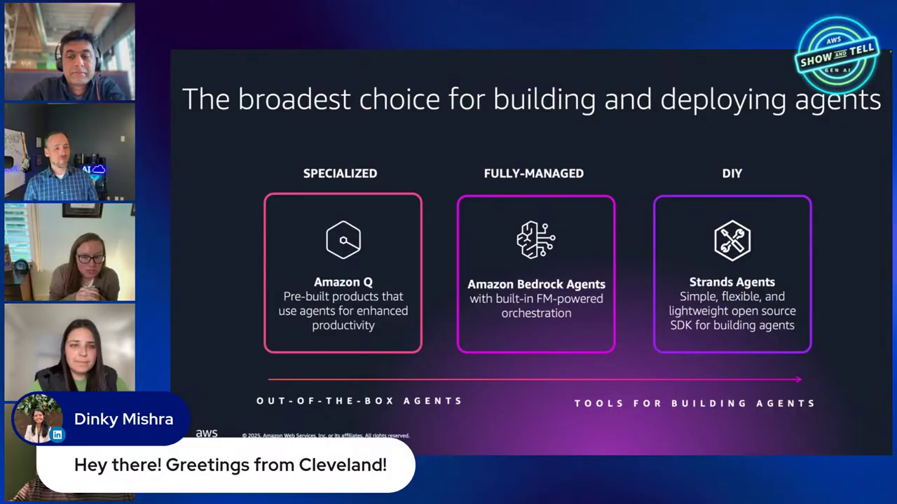
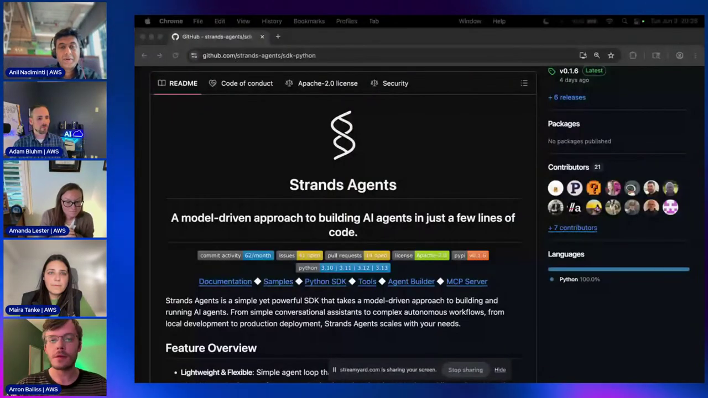
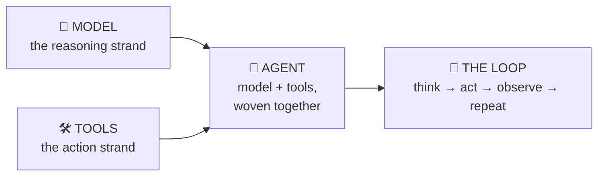
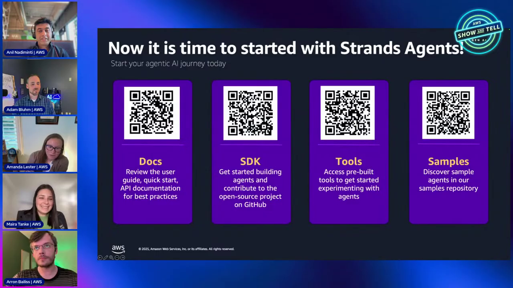

# Strands Agents Course — Chapter 1

# 🧬 Why Strands Agents? — AWS's Open-Source Agent SDK

## 🎬 About This Course — The Source Video

This course is built as **interactive, chapter-by-chapter notes** for the AWS Show & Tell episode **"Build your first Agentic AI app step-by-step with Strands Agents & MCP"** (AWS Events on YouTube) — where the Strands team themselves (including Arron Bailiss, one of the SDK's engineers) build a real multi-agent app live.

<VideoSection youtubeId="aijS9fWB854" title="Build your first Agentic AI app step-by-step with Strands Agents & MCP | AWS Show & Tell" />

---

## Chapter Goal

By the end of this chapter, the learner will be able to:

- Place **Strands Agents** on the AWS "build agents" spectrum — next to Amazon Q and Amazon Bedrock Agents.
- Explain *where Strands came from* — an SDK battle-tested inside Amazon before open-sourcing.
- Explain the **DNA metaphor** — model + tools = the agent.
- Choose between **Bedrock Agents (managed)** and **Strands (SDK)** for a given project.
- Find every official Strands resource — docs, SDK, tools package, samples.

---

## 1.1 🧭 The AWS Agent Spectrum — Three Ways to Build

AWS doesn't offer *one* way to build agents — it offers a **spectrum**, and choosing wrong is the most common way agent projects stall.

*The spectrum: as you move right you give up built-in conveniences and gain control. Strands sits at the DIY end — for developers who want deeper customization of agentic behavior, models and tools.*

The three options, in the hosts' own framing:

| | Amazon Q | Bedrock Agents | Strands Agents |
|---|---|---|---|
| **What it is** | Pre-built products | Fully-managed agent service | Open-source Python SDK |
| **You write** | Nothing | Prompts + config | Real code |
| **Orchestration** | Amazon's | Managed for you | **Yours** (model-driven) |
| **Customization** | Low | Medium | **Total** |

<ConceptCard title="Pick by persona, not by fashion">
Need an agent inside an AWS product experience? **Amazon Q**. Want AWS to host the agent runtime and orchestration? **Bedrock Agents**. Want to own the loop, the tools, the models and the deployment? **Strands Agents**.
</ConceptCard>

## 1.2 🏭 Where Strands Came From — Battle-Tested Inside Amazon

Strands isn't a research toy. Per the team in the video:

- It started as an **internal AWS SDK** — built to solve the needs of Amazon's own teams embedding agents into products.
- The **Amazon Q Developer team** was among the first adopters — they'd found it was taking **months** to get agentic workloads into production with earlier approaches.
- Other internal teams followed; once it proved itself at Amazon's scale, AWS **open-sourced it** (Apache-2.0) — *"battle-tested internally, then shared with the community."*

The tagline on the repo says it all:

> **"A model-driven approach to building AI agents in just a few lines of code."**

*The `sdk-python` repo — Apache-2.0, active commit activity, Python 3.10–3.13. Links in the README lead to Docs, Samples, Tools, Agent Builder and the MCP Server.*

## 1.3 🧬 Why "Strands"? — The Twin Strands of DNA

One of the best parts of the episode is the naming story:

> *"It's like the twin strands of DNA — the model and your tools kind of make the agent."*

A Strands agent is literally the braid of two things:

1. **The model** — any LLM (Bedrock, Anthropic, OpenAI, Llama, your own provider) that reasons and decides.
2. **The tools** — built-in tools, MCP servers, or your own Python functions that let the agent *act*.

Everything else — the loop, orchestration, observability — is the SDK wrapping those two strands.

## 1.4 ⚖️ Bedrock Agents vs Strands — the Q&A Answer

A viewer asked the obvious question mid-stream: *what's the difference between agents from Bedrock Agents and agents from Strands?* The answer is worth its own card:

| | **Bedrock Agents** | **Strands Agents** |
|---|---|---|
| Experience | Fully-managed — drop an agent, set up instructions, done | Code-first SDK — you own the loop |
| Deploy | On AWS, managed | **Anywhere** — Lambda, ECS/Fargate, EC2, your laptop |
| Models | Bedrock model catalog | Any model/provider + LLM gateways |
| Best for | Fast managed agents, AWS-native teams | Developers wanting deeper customization |
| Persona | "Make it work for me" | "Let me build it my way" |

<ConceptCard title="Same mission, different altitude">
They're not competitors — they're **different personas on the same spectrum**. Bedrock Agents abstracts the plumbing; Strands hands you the plumbing *and* the wrenches.
</ConceptCard>

## 1.5 📚 The Resources — Docs, SDK, Tools, Samples, Workshop

When the chat asked *"which training is recommended?"*, the team put up the resources slide — four QR codes, four destinations:

*Docs, Python SDK, Tools package, Samples — the four repos/sites you'll actually use. A hands-on Strands workshop also launched the same morning as this episode.*

Your map:

- **Documentation** — `strandsagents.com` — concepts, guides, API reference
- **Python SDK** — `github.com/strands-agents/sdk-python` — the `strands` package itself
- **Tools package** — `github.com/strands-agents/tools` — `strands-tools`: 20+ built-in tools (`python_repl`, `editor`, `shell`, `journal`, `swarm`, …)
- **Samples** — `github.com/strands-agents/samples` — every demo, including the `05-personal-assistant` we build in this course
- **Workshop** — the official step-by-step Strands workshop (linked in the video description)

> **Tip**: star the repos — the team calls out their discussion boards as "pretty vibrant," and releases move fast (the video showed `v0.1.6`; it's much further along now).

## 1.6 🧠 Knowledge Check

<Quiz question="Where does Strands Agents sit on the AWS 'build agents' spectrum?" options={["A specialized pre-built product like Amazon Q", "A fully-managed service like Bedrock Agents", "An open-source DIY SDK for deeper customization", "A hosted MCP server registry"]} answerIndex={2} explanation="Strands is the DIY end — a simple, lightweight open-source Python SDK for developers who want control over agentic behavior, models and tools." />

<Quiz question="What do the 'twin strands' in the name refer to?" options={["Two co-founders", "The model and the tools that together make the agent", "Python and TypeScript SDKs", "Sync and async APIs"]} answerIndex={1} explanation="Like DNA's twin strands: the model (reasoning) + the tools (action) woven together make the agent." />

<Quiz question="A team wants AWS to host and orchestrate their agent with minimal code. Which do they pick?" options={["Strands Agents", "Amazon Bedrock Agents", "strands-tools", "AgentCore Gateway"]} answerIndex={1} explanation="Fully-managed orchestration = Bedrock Agents. Strands is for when you want to own and customize the loop yourself." />

---

## 🏁 Chapter 1 Summary

1. **AWS offers a spectrum** — Amazon Q (specialized), Bedrock Agents (fully-managed), Strands (DIY SDK). Pick by how much control you need.
2. **Strands is open-source and battle-tested** — built inside Amazon, used by the Amazon Q team, then released to the community.
3. **The DNA metaphor** — model + tools = agent. Everything in Strands serves that braid.
4. **Resources**: docs, `sdk-python`, `tools`, `samples`, and the official workshop.

Next chapter: we open the SDK, walk its five pillars, and set up the project we build in the demo — the Personal Assistant.
