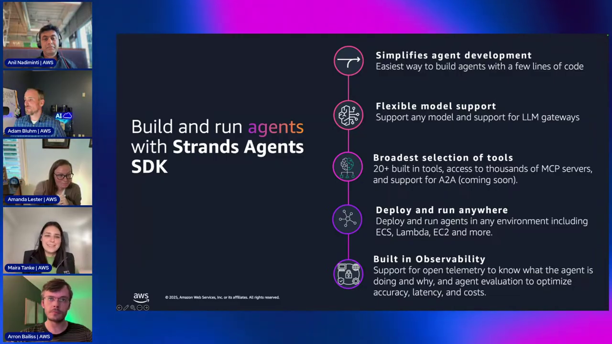
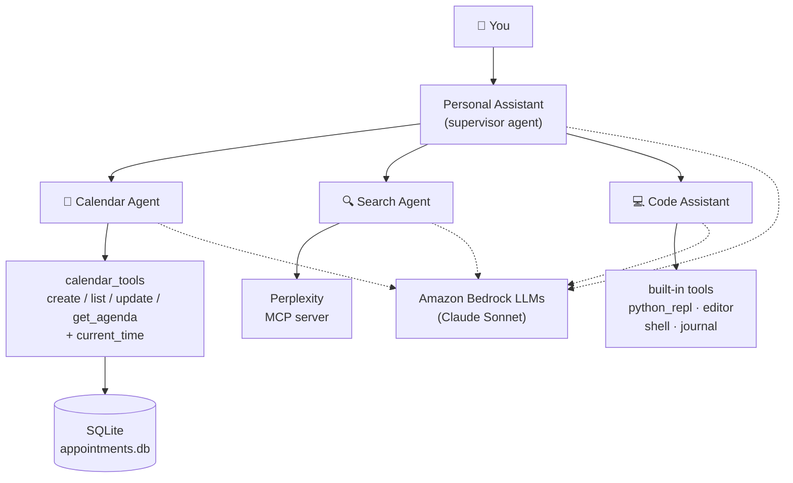
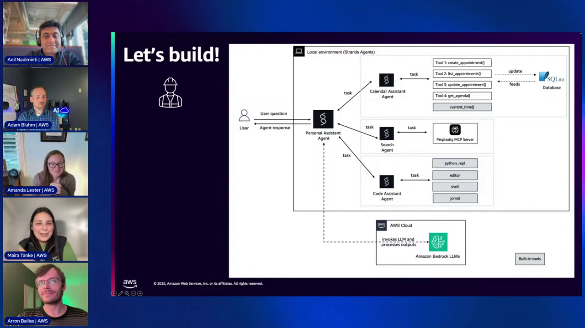
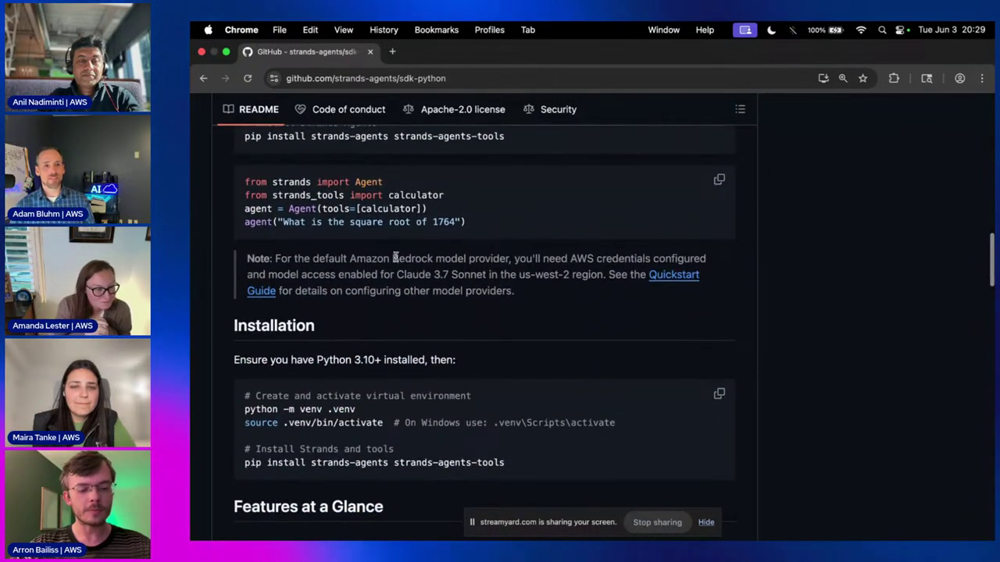

# Strands Agents Course — Chapter 2

# 🛠️ The Strands SDK — Pillars, Blueprint & Setup

## Chapter Goal

By the end of this chapter, the learner will be able to:

- Name the **five pillars** of the Strands Agents SDK and what each unlocks.
- Read the **Personal Assistant blueprint** — one supervisor, three specialist agents.
- Navigate the `strands-agents` GitHub org — SDK, tools, samples, docs.
- Set up the project locally: clone, virtualenv, dependencies, AWS credentials, MCP key.
- Answer the two most-asked questions from the stream: *Python only?* and *why not Bedrock Agents?*

---

## 2.1 🏛️ The Five Pillars of the SDK

The team summarized Strands in one slide — five promises:



| Pillar | What it means |
|---|---|
| **Simplifies agent development** | The easiest way to build agents — a few lines of code get you a working loop |
| **Flexible model support** | Any model — Bedrock, Anthropic, OpenAI, Llama — plus LLM-gateway support |
| **Broadest selection of tools** | **20+ built-in tools**, thousands of MCP servers, and A2A *(marked "coming soon" at recording — it has since shipped)* |
| **Deploy and run anywhere** | Lambda, ECS/Fargate, EC2 — anywhere Python runs |
| **Built-in observability** | OpenTelemetry traces — see what the agent is doing and *why*; evaluation hooks for accuracy, latency, cost |

<ConceptCard title="The pillar that matters most here">
**Broadest selection of tools** is the whole game in this demo — custom `@tool` functions, the built-in `strands-tools` package, and MCP servers all land in the same `tools=[...]` list. Chapter 3 is that pillar in action.
</ConceptCard>

## 2.2 🗺️ The App Blueprint — One Supervisor, Three Specialists

Here's what the demo builds — a **Personal Assistant** that orchestrates three specialist agents:




*The blueprint. Notice what's in each agent's tool list — that's the whole lesson of Chapter 3.*

Read it bottom-up:

- **Calendar Agent** — custom `@tool` functions over a local **SQLite** DB (`appointments.db`)
- **Search Agent** — tools come **live from a Perplexity MCP server** (via `list_tools_sync`)
- **Code Assistant** — **zero custom code**; four built-in `strands_tools` do everything
- **Personal Assistant** — exposes the three agents *as its own tools* and lets the model route

## 2.3 🐙 The `strands-agents` GitHub Org

Arron walks the org live — this is your home base:

| Repo | What's inside |
|---|---|
| `sdk-python` | The `strands` package — `Agent`, `tool`, `BedrockModel`, `MCPClient` |
| `tools` | `strands-tools` — the 20+ built-in tools |
| `samples` | All demo code — ours lives at `python/04-industry-use-cases/productivity/personal-assistant/` |
| `docs` | Documentation source |
| `mcp-server` | The Strands docs MCP server |


*The samples repo in the video showed `02-samples/05-personal-assistant`. The repo has since been reorganized — today it lives at `python/04-industry-use-cases/productivity/personal-assistant/`. Our explorer links follow the code, so they always point at the real current path.*

<GitHubExplorer repo="strands-agents/samples" ref="main" expanded="true" title="The samples repo — follow along with the real code" files={[
  { "path": "python/04-industry-use-cases/productivity/personal-assistant/README.md", "label": "README", "note": "The sample's own README — architecture diagram, setup steps, and how the four files fit together." },
  { "path": "python/04-industry-use-cases/productivity/personal-assistant/requirements.txt", "label": "requirements.txt", "note": "What the demo actually installs — strands-agents, strands-agents-tools, mcp, python-dotenv." }
]} />

## 2.4 ⚙️ Setup — From Clone to Running Agent

The live setup sequence (condensed from ~32:56–34:41):

```bash
git clone https://github.com/strands-agents/samples.git
cd samples/python/04-industry-use-cases/productivity/personal-assistant
python -m venv .venv && source .venv/bin/activate
pip install -r requirements.txt
```
```text
Collecting strands-agents
Collecting strands-agents-tools
Collecting mcp
Collecting python-dotenv
Successfully installed strands-agents strands-agents-tools mcp ...
```

Credentials — the calendar and code agents call Bedrock, the search agent needs a Perplexity key for its MCP server:

```bash
aws configure
cp .env.example .env   # then set PERPLEXITY_API_KEY inside
```
```text
AWS Access Key ID [None]: AKIA…
AWS Secret Access Key [None]: ********
Default region name [None]: us-east-1
```

<ConceptCard title="Why the env var?">
`search_assistant.py` launches the Perplexity MCP server in Docker and injects `PERPLEXITY_API_KEY` into the container — the key never touches code or the repo.
</ConceptCard>

## 2.5 ❓ Quick Q&A — The Two Questions Everyone Asks

**"Is Strands available for NodeJS?"** — At recording time the SDK was **Python only** (a TypeScript SDK has since joined the org — `sdk-typescript`). The tools package and samples follow the same split.

**"Bedrock Agents or Strands?"** — Fully-managed vs code-first — §1.4 covered the trade-off. Rule of thumb from the stream: if you want deeper customization of the agent's behavior, models and tools — and to run anywhere Python runs — that's Strands.

## 2.6 🧠 Knowledge Check

<Quiz question="Which pillar lets a Strands agent call a Perplexity MCP server the same way it calls a local Python function?" options={["Flexible model support", "Broadest selection of tools", "Deploy and run anywhere", "Built-in observability"]} answerIndex={1} explanation="Tools unify under one interface — built-ins, MCP servers, and @tool functions all land in the same tools=[...] list." />

<Quiz question="In the Personal Assistant blueprint, where does the Search agent's tool list come from?" options={["Hardcoded @tool functions", "strands-tools built-ins", "An MCP server's list_tools response", "A YAML config file"]} answerIndex={2} explanation="search_assistant.py calls perplexity_mcp_server.list_tools_sync() — the MCP server advertises its tools and the agent consumes them directly." />

<Quiz question="What did the Code Assistant's author NOT have to write?" options={["The system prompt", "Any tool code", "The model choice", "The CLI loop"]} answerIndex={1} explanation="python_repl, editor, shell and journal are all built-in strands_tools — zero custom tool code was written for it." />

---

## 🏁 Chapter 2 Summary

1. **Five pillars**: simple dev UX, any model, broadest tools (built-ins + MCP + A2A), deploy anywhere, OTel observability.
2. **The blueprint**: one supervisor agent over calendar (SQLite + custom tools), search (MCP) and code (built-ins) specialists.
3. **Everything is on GitHub** — `strands-agents` org: sdk-python, tools, samples, docs.
4. **Setup** = clone samples → venv → requirements.txt → `aws configure` → `PERPLEXITY_API_KEY`.

Next chapter: we run and dissect all three specialist agents — the tools chapter.
