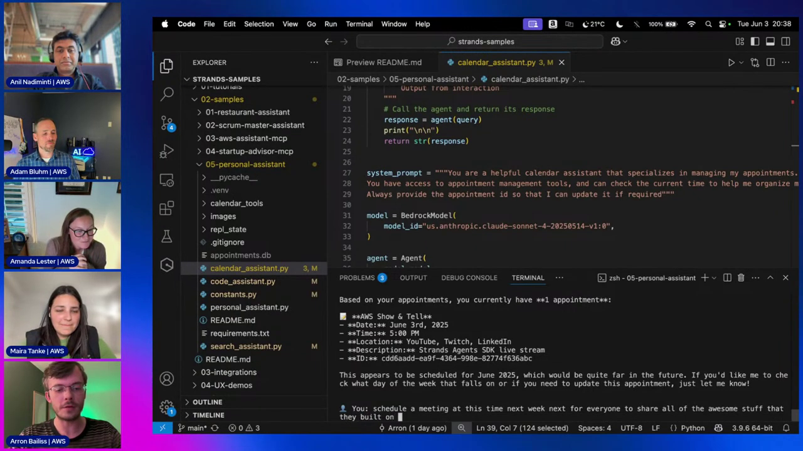
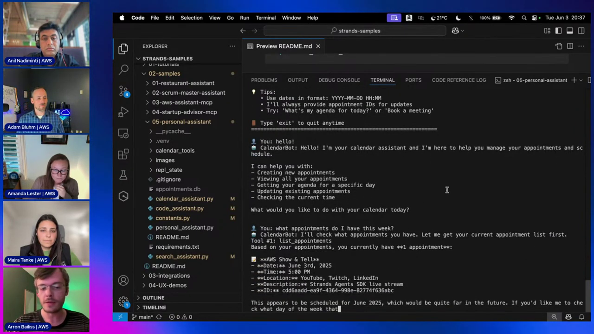
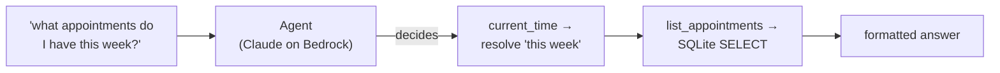
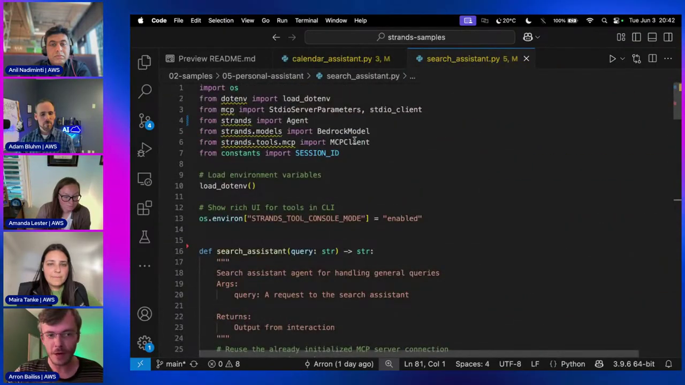
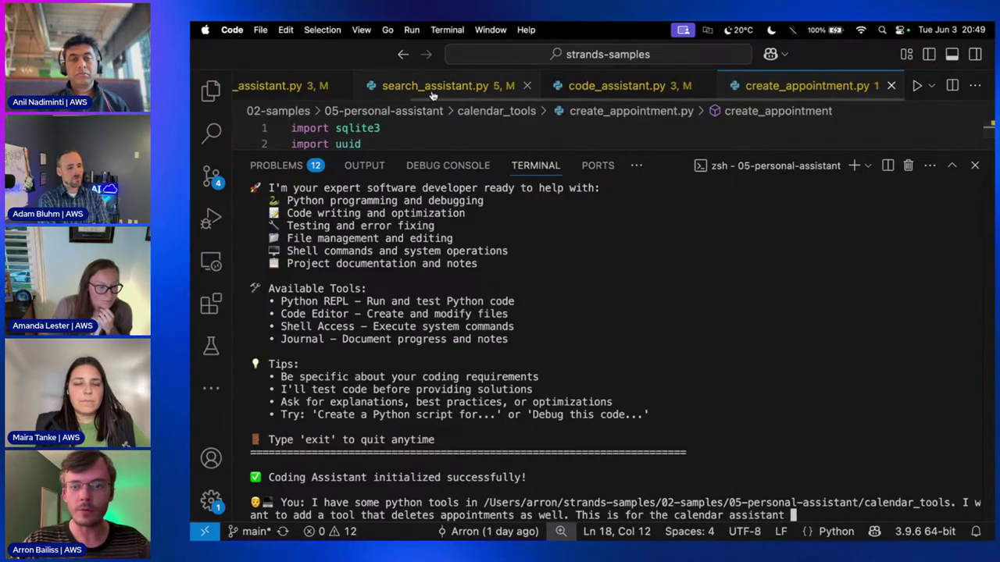
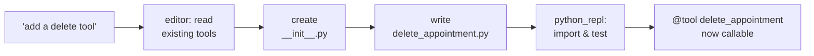

# Strands Agents Course — Chapter 3

# 🔧 Agents & Tools, Hands-On — Calendar, Search & Code

## Chapter Goal

By the end of this chapter, the learner will be able to:

- Read the sample's file layout — four agents, one `calendar_tools/` package, one SQLite DB.
- Explain how **custom `@tool` functions** turn plain Python into agent-callable tools.
- Explain how an agent consumes an **MCP server's** tools via `list_tools_sync()`.
- Use **built-in tools** (`python_repl`, `editor`, `shell`, `journal`) to build an agent with zero custom tool code.
- Enable the rich CLI tool UI with `STRANDS_TOOL_CONSOLE_MODE`.
- Explain the demo's "meta moment" — the Code Assistant *writing its own new tool*.

---

## 3.1 📂 Anatomy of the Sample

The repo layout on screen — everything the blueprint promised, as files:

```text
05-personal-assistant/
├── personal_assistant.py     ← the supervisor (Chapter 4)
├── calendar_assistant.py     ← custom @tool functions + SQLite
├── search_assistant.py       ← Perplexity via MCP
├── code_assistant.py         ← built-in tools only
├── calendar_tools/           ← create / list / update / get_agenda
├── constants.py              ← SESSION_ID for tracing
├── appointments.db           ← SQLite — created on first write
├── requirements.txt
└── .env                      ← PERPLEXITY_API_KEY (never committed)
```


*One folder, four agents. Each `*_assistant.py` is both a runnable CLI app and an importable tool — that dual nature is the whole trick, as Chapter 4 shows.*

## 3.2 📅 The Calendar Agent — Custom Tools over SQLite

First demo run — say hello, then ask a real question:


*The agent's own decision-making on display: asked "what appointments do I have this week?", the model chose `list_appointments`, read the SQLite results, and answered — "AWS Show & Tell, June 3rd, 5:00 PM." Nobody scripted that choice.*

The file — every line does something:

<GitHubExplorer repo="strands-agents/samples" ref="main" expanded="true" title="Calendar agent — tools, model, and the @tool wrapper" files={[
  { "path": "python/04-industry-use-cases/productivity/personal-assistant/calendar_assistant.py", "label": "calendar_assistant.py", "highlights": [[3, 5], [12, 15], [18, 31], [34, 36], [38, 53]], "note": "Imports the calendar_tools package, defines a @tool for current_time, wraps the agent itself in a @tool (so the supervisor can call it later), then builds the Agent with five tools." },
  { "path": "python/04-industry-use-cases/productivity/personal-assistant/calendar_tools/create_appointment.py", "label": "create_appointment.py", "highlights": [[6, 22], [30, 54]], "note": "@tool + typed signature + docstring = a tool with a full schema. The body is plain Python — uuid, sqlite3, formatted confirmation." },
  { "path": "python/04-industry-use-cases/productivity/personal-assistant/calendar_tools/list_appointments.py", "label": "list_appointments.py", "note": "Reads appointments.db — the tool the model picked for 'what do I have this week?'" },
  { "path": "python/04-industry-use-cases/productivity/personal-assistant/calendar_tools/update_appointment.py", "label": "update_appointment.py", "note": "Updates by appointment ID — which is why the system prompt insists the agent always surfaces IDs." },
  { "path": "python/04-industry-use-cases/productivity/personal-assistant/calendar_tools/get_agenda.py", "label": "get_agenda.py", "note": "Date-scoped agenda lookup — 'my agenda for today' lands here." }
]} />

*Five tools, one agent — all plain Python. The model picks per request.*

The sequence the model runs when you ask about your week:



## 3.3 🧰 `@tool` — Any Python Function Becomes a Tool

This is the mechanism worth memorizing:

```python
from strands import tool

@tool
def create_appointment(date: str, location: str, title: str, description: str) -> str:
    """Create a new personal appointment in the database."""
```

Three things happen automatically — *"that simple,"* as Arron put it:

1. **Signature → input schema** — typed params become the tool's JSON schema (`date: str`, `location: str`…)
2. **Docstring → description** — the LLM reads `"""Create a new personal appointment…"""` to decide *when* to call it
3. **Function → callable** — same invocation path as built-ins and MCP tools

<ConceptCard title="Write the docstring like a prompt">
The docstring *is* the model's contract — it decides tool selection. Vague docstring → the model calls the wrong tool or calls it with bad args. Treat it as prompt engineering for your tools.
</ConceptCard>

## 3.4 🔍 The Search Agent — MCP Tools, Zero Glue

The search assistant doesn't define a single tool — it **asks a Perplexity MCP server what it can do**:


*The MCP client boots the server in Docker (`mcp/perplexity-ask`), hands it the API key through env, then asks it for its tool list.*

<GitHubExplorer repo="strands-agents/samples" ref="main" expanded="true" title="Search agent — the MCP client, list_tools_sync, and the agent" files={[
  { "path": "python/04-industry-use-cases/productivity/personal-assistant/search_assistant.py", "label": "search_assistant.py", "highlights": [[3, 6], [32, 34], [38, 53], [82, 90], [92, 97]], "note": "MCPClient + stdio_client launch 'docker run mcp/perplexity-ask' with the API key injected. __enter__() opens the connection once; list_tools_sync() pulls the server's advertised tools straight into the Agent's tools list." }
]} />

The three lines that matter:

```python
perplexity_mcp_server = MCPClient(lambda: stdio_client(StdioServerParameters(
    command="docker", args=["run","-i","--rm","-e","PERPLEXITY_API_KEY","mcp/perplexity-ask"], ...)))
perplexity_mcp_server.__enter__()          # open the connection once, reuse
tools = perplexity_mcp_server.list_tools_sync()   # "what tools do you have?"
agent = Agent(model=..., tools=tools)      # MCP tools become agent tools
```

- **Transport-agnostic** — this demo uses stdio+Docker; Strands also speaks streamable-HTTP and SSE natively (so remote MCP servers work too)
- **`list_tools_sync`** — part of the MCP spec's `tools/list` — the server *advertises* its tools; the agent consumes them
- **No wrappers** — `perplexity_ask` lands in `tools=[...]` exactly like `@tool` functions did

## 3.5 💻 The Coding Assistant — Zero Custom Tools

The most instructive file is the one with the *least* code:

```python
from strands_tools import python_repl, editor, shell, journal

os.environ["STRANDS_TOOL_CONSOLE_MODE"] = "enabled"   # rich CLI tool UI

agent = Agent(
    model=model,
    system_prompt="You are a software expert and coder. Write, debug, test, and iterate on software",
    tools=[python_repl, editor, shell, journal],
    trace_attributes={"session.id": SESSION_ID},
)
```

![code_assistant.py in VS Code — tools=[python_repl, editor, shell, journal] imported from strands_tools](screenshots/s11_code_assistant.png)
*Four imports, zero custom tool code. "We didn't write the code for any tool on the code assistant."*

What each built-in gives the agent:

| Tool | The agent can… |
|---|---|
| `python_repl` | **Run Python code itself** — write, execute, see output, iterate |
| `editor` | Read/write files — it browsed `calendar_tools/` and edited `__init__.py` |
| `shell` | Run commands — linters, formatters, unit tests |
| `journal` | Structured task notes — plan work, record progress, resume later |

And that env var — `STRANDS_TOOL_CONSOLE_MODE=enabled` — renders tool calls as formatted panels in the terminal. That's the "nice rich UI" you see during the demo:


*The welcome banner, tool inventory, and the start of the famous request: "I have some Python tools in calendar_tools — I want a tool that deletes appointments as well."*

## 3.6 🤯 The Meta Moment — The Agent Writes Its Own Tool

The demo's best trick (~49:00–52:00): the Code Assistant is asked to add a `delete_appointment` tool to `calendar_tools/` — a tool that *didn't exist yet*.

Watch what it does on its own:

1. **`editor`** → lists `calendar_tools/`, reads `create_appointment.py` and `update_appointment.py` to learn the pattern
2. **`shell`/`editor`** → notices there's no `__init__.py`, creates one so the tools import cleanly
3. **`python_repl`** → writes `delete_appointment.py`, *imports and tests it*
4. The new tool is immediately usable — and the Calendar Agent gains a capability **written by another agent**



That's agents building software **for other agents** — the "code is at the center of the GenAI revolution" line made literal.

## 3.7 🧠 Knowledge Check

<Quiz question="What does @tool actually do to a Python function?" options={["Wraps it in a Flask route", "Derives a tool schema from the signature + docstring so the model can call it", "Registers it in a global MCP registry", "Compiles it to WASM"]} answerIndex={1} explanation="Type hints → input schema, docstring → description, function → callable. Same interface as built-ins and MCP tools." />

<Quiz question="How does search_assistant.py learn what the Perplexity MCP server can do?" options={["Reads a YAML manifest", "Hardcodes perplexity_ask", "Calls list_tools_sync() — the MCP tools/list spec", "Greps the Docker image"]} answerIndex={2} explanation="list_tools_sync() calls the server's tools/list — the advertised tools drop straight into the agent's tools list." />

<Quiz question="Which built-in tool lets the Code Assistant execute code it just wrote?" options={["editor", "shell", "python_repl", "journal"]} answerIndex={2} explanation="python_repl runs Python in a REPL — write, execute, see output, iterate. That's how it tested delete_appointment." />

<Quiz question="In the demo, the 'delete_appointment' tool came from…" options={["The samples repo", "A human copy-paste", "The Code Assistant writing it after reading sibling tools", "An MCP server"]} answerIndex={2} explanation="The agent studied the existing calendar_tools, created __init__.py, wrote delete_appointment.py and tested it — an agent building a tool for another agent." />

---

## 🏁 Chapter 3 Summary

1. **Three tool origins, one interface** — `@tool` functions, built-in `strands_tools`, MCP-server tools all land in `tools=[...]`.
2. **`@tool` = signature + docstring → schema.** Write docstrings like prompts.
3. **MCP is native** — `MCPClient` + `list_tools_sync()` turns any MCP server (stdio, HTTP, SSE) into agent tools.
4. **Built-ins carry real weight** — `python_repl`, `editor`, `shell`, `journal` built a full coding agent with no custom tool code.
5. **Agents can extend themselves** — the Code Assistant authored a new tool for the Calendar Agent.

Next chapter: the part you've been waiting for — how one `Agent` supervises the other three, and the whole spectrum from agents-as-tools to swarms, graphs and A2A networks.
