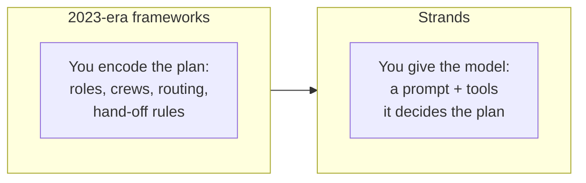
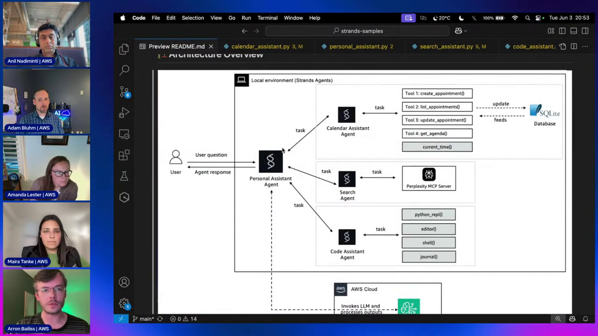
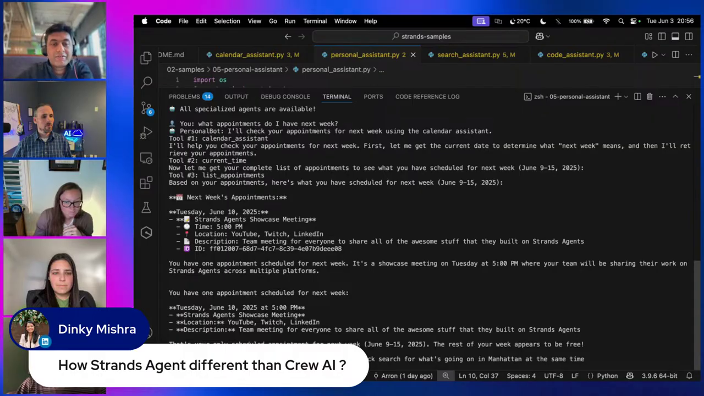
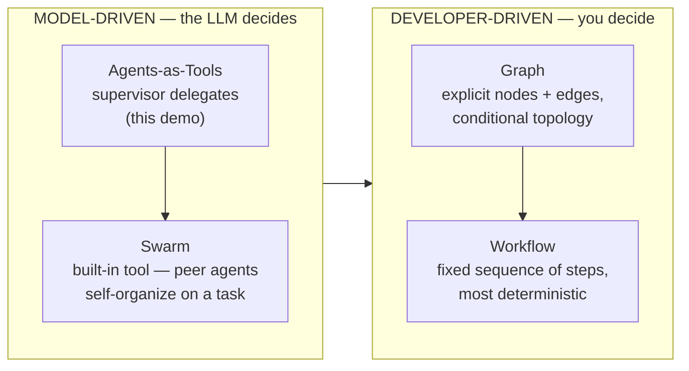
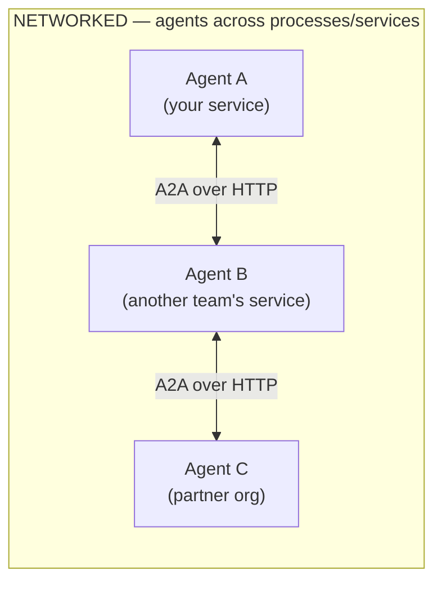
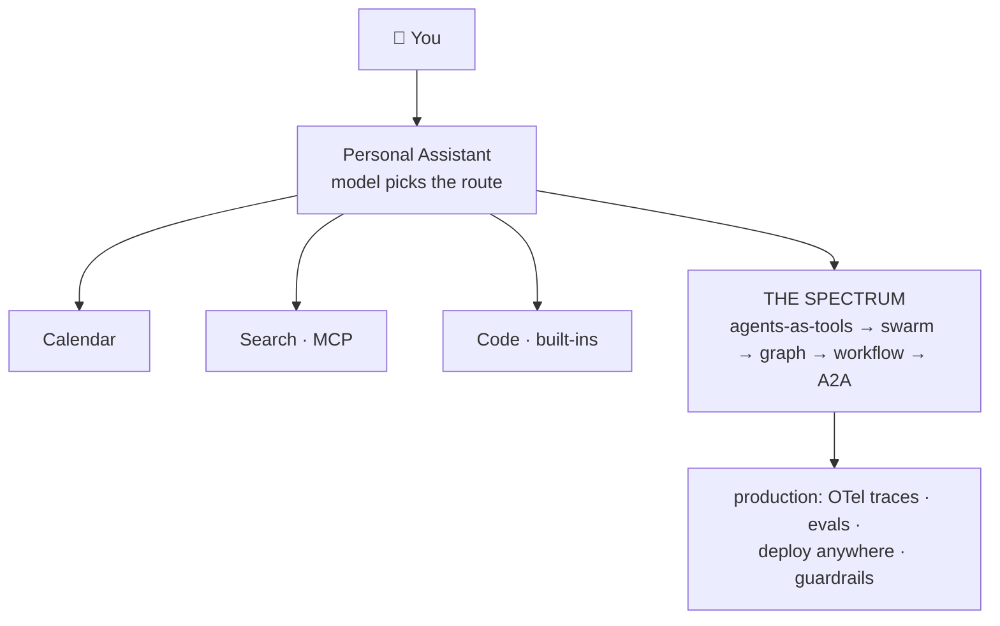

# Strands Agents Course — Chapter 4

# 🕸️ Multi-Agent Orchestration — From Supervisor to Swarm

## Chapter Goal

By the end of this chapter, the learner will be able to:

- Explain **model-driven orchestration** — Strands' core bet, and how it differs from 2023-era frameworks.
- Implement the **agents-as-tools** supervisor pattern used by `personal_assistant.py`.
- Place every Strands multi-agent pattern on one spectrum: **agents-as-tools → swarm → graph → workflow → A2A**.
- Know when to reach for each pattern — and when the model should decide vs. when you should.
- Connect the dots to production — observability, guardrails, deploy-anywhere.

---

## 4.1 🧠 Model-Driven Orchestration — The Strands Bet

The most quoted line of the episode (~53:49):

> *"This really speaks to Strands' model-driven first paradigm — model-driven as opposed to maybe some of the other frameworks out there."*

And the reasoning (~56:36): *"A lot of these frameworks were built in 2023, when models were not as capable of orchestrating things… newer LLMs are already fine-tuned for agentic workloads."*

The bet, plainly:



In a model-driven system the **LLM is the control plane**. You don't write routing — you write a system prompt and a good tool list, and the model decides which agent/tool to call, in what order, and when it's done.

<ConceptCard title="The honest trade-off">
Model-driven wins on flexibility and code simplicity; developer-driven wins on predictability. Strands' answer isn't "always model-driven" — it's *make model-driven the default, and give you tools (graph, workflow) for when you need determinism.*
</ConceptCard>

## 4.2 🎯 Agents-as-Tools — The Supervisor Pattern

The demo's climax is one line of code. Three specialist agents — each an `Agent` wrapped in a `@tool` function — become the supervisor's tool list:

<GitHubExplorer repo="strands-agents/samples" ref="main" expanded="true" title="The supervisor — agents-as-tools in five lines" files={[
  { "path": "python/04-industry-use-cases/productivity/personal-assistant/personal_assistant.py", "label": "personal_assistant.py", "highlights": [[4, 6], [12, 21], [68, 69]], "note": "Imports the three agent functions and passes them as tools=[code_assistant, calendar_assistant, search_assistant]. The supervisor's model reads their docstrings and routes — no routing code anywhere." },
  { "path": "python/04-industry-use-cases/productivity/personal-assistant/calendar_assistant.py", "label": "calendar_assistant (as a tool)", "highlights": [[18, 31]], "note": "Each specialist is exposed through a @tool function — the docstring becomes the supervisor's routing signal." }
]} />

The architecture the README draws — our blueprint, now wired:


*Local environment (Strands Agents): the Personal Assistant holds three agents as tools; every agent talks to the Bedrock model layer underneath.*

And the live run — two levels of model decisions in one trace:


*"What appointments do I have next week?" → supervisor picks `calendar_assistant` (Tool #1) → that agent picks `current_time` (Tool #2) then `list_appointments` (Tool #3) → formatted agenda. Two models-deep decisions, zero routing code.*

```bash
python personal_assistant.py
```
```text
🤖 All specialized agents are available!
👤 You: what appointments do I have next week?
🤖 PersonalBot: I'll check your appointments for next week using the calendar assistant.
Tool #1: calendar_assistant
Tool #2: current_time
Tool #3: list_appointments
📅 Next Week's Appointments:
  Tuesday, June 10, 2025 — Strands Agents Showcase Meeting (YouTube/Twitch/LinkedIn)
```

Notice what's *not* in `personal_assistant.py`: no `if 'calendar' in query`, no router, no dispatch table. The supervisor's system prompt says *"use the agents and tools at your disposal"* — the model does the rest.

## 4.3 🌈 The Orchestration Spectrum — Four Patterns

During the blueprint discussion (~21:50–23:08) the team name-drops the rest of the toolkit: *"we can create a swarm of agents, graphs if you want a bit more control, workflows as well…"*

All four on one axis — **who decides the flow?**



| Pattern | Mechanism in Strands | You reach for it when… |
|---|---|---|
| **Agents-as-tools** | Wrap `Agent` in `@tool` → `tools=[…]` | Specialists with clear lanes; model picks per request |
| **Swarm** | `from strands_tools import swarm` — a built-in tool | Open-ended tasks benefiting from agents debating/collaborating autonomously |
| **Graph** | `Graph` builder — nodes, edges, conditions | You need controlled topology — branches, joins, optional paths |
| **Workflow** | `Workflow` builder — steps, loops | Compliance-grade determinism — same steps every time |

<ConceptCard title="Swarm is a tool, not a framework">
In `strands-tools`, `swarm` is just another built-in tool — `agent = Agent(tools=[swarm])` and the agent can spin up a collaborating team when the task warrants it. That's the Strands philosophy: even orchestration is exposed *as tools the model can choose*.
</ConceptCard>

## 4.4 🌐 A2A — Networks of Agents

The pillars slide listed *"support for A2A (coming soon)"* — it has since shipped, and it extends the spectrum one step further:



- **Agents-as-tools / swarm / graph / workflow** — all *in-process*: agents calling agents in one runtime
- **A2A** — agents as **networked services**: each on its own host, discovered and invoked over HTTP — a true network of agents across teams and org boundaries

It's the same progression Bedrock AgentCore Gateway formalizes at enterprise scale (different course, same instinct: standardize the agent↔agent/tool boundary).

## 4.5 ⚔️ Strands vs CrewAI / LangChain — The Q&A Distilled

Asked directly (~55:54): *"How is Strands different from CrewAI?"* The team's answer:

- **CrewAI / older frameworks** were built when models needed heavy orchestration scaffolding — roles, crews, rigid hand-offs.
- **Strands** leans into modern models — *"the loop is based on what the model wants. It's less opinionated."* Tool usage and control flow emerge from the model, not the framework.
- **Escape hatches exist** — want control? Prompt it (system prompt steers behavior) or drop to graph/workflow.

> **Honest caveat**: less opinionated means *you* own prompt quality and eval. Strands' built-in observability (OTel traces — "what the agent is doing and why") is how you watch that bet play out in production.

## 4.6 🚀 Toward Production

Threads the episode plants for what's next:

- **Observability** — `trace_attributes={"session.id": SESSION_ID}` on every agent here feeds OpenTelemetry; hook to Langfuse, Arize, Datadog in a few lines
- **Deploy anywhere** — the same files run on Lambda, Fargate, EC2; the video stresses "anywhere Python runs"
- **Guardrails** — integrate Amazon Bedrock Guardrails into your app layer; the SDK doesn't force it, you add it
- **Evals** — `strands-agents/evals` — agent evaluation for accuracy/latency/cost, the other half of the observability pillar

## 4.7 🧠 Knowledge Check

<Quiz question="In agents-as-tools, how does the supervisor know which specialist to call?" options={["A routing table in constants.py", "The model reads each tool's docstring/description and decides", "Round-robin", "A separate classifier model"]} answerIndex={1} explanation="That's the whole point — model-driven. The docstring of each @tool-wrapped agent IS the routing signal." />

<Quiz question="Which multi-agent pattern in Strands is itself a built-in tool?" options={["Graph", "Workflow", "Swarm", "A2A"]} answerIndex={2} explanation="from strands_tools import swarm — even multi-agent collaboration is a tool the model can invoke." />

<Quiz question="You need the exact same 7-step compliance workflow every run. Which pattern?" options={["Agents-as-tools", "Swarm", "Graph", "Workflow"]} answerIndex={3} explanation="Determinism → developer-driven end of the spectrum → Workflow (or Graph if you need conditional topology)." />

<Quiz question="What does A2A add that the other four patterns don't?" options={["More tools", "Agents as networked services talking over HTTP across process/org boundaries", "Faster models", "Free hosting"]} answerIndex={1} explanation="Everything else is in-process. A2A makes agents discoverable, callable services — networks of agents." />

---

## 🏁 Chapter 4 Summary



1. **Model-driven is the bet** — modern LLMs orchestrate; you supply prompt + tools instead of a router.
2. **Agents-as-tools** — wrap agents in `@tool`, hand them to a supervisor — the demo's entire multi-agent pattern.
3. **The spectrum** — agents-as-tools & swarm (model decides) → graph & workflow (you decide) → A2A (agents across the network).
4. **Strands ≠ CrewAI-era frameworks** — deliberately less opinionated; observability is how you verify the bet.

## Watch the Original Tutorial

<VideoSection youtubeId="aijS9fWB854" title="Build your first Agentic AI app step-by-step with Strands Agents & MCP | AWS Show & Tell" />
